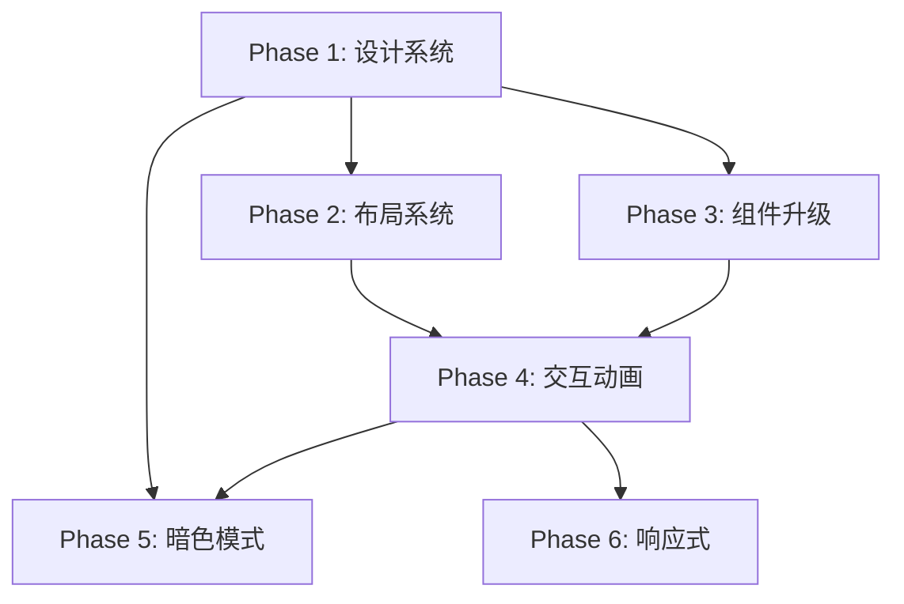

# ClearVision UI 视觉升级开发计划

> **文档版本**: 1.0  
> **创建日期**: 2026-02-03  
> **预估工时**: 62 小时

---

## 目录

1. [当前 UI 分析](#1-当前-ui-分析)
2. [视觉升级计划](#2-视觉升级计划)
3. [前后端通信保护](#3-前后端通信保护-critical)
4. [文件修改清单](#4-文件修改清单)
5. [执行顺序与依赖](#5-执行顺序与依赖)

---

## 1. 当前 UI 分析

### 1.1 设计系统 (variables.css)

**当前主题: Elegant Tech (Orange/Green/White)**

| 类别 | CSS 变量 | 当前值 | 用途 |
|------|----------|--------|------|
| **主色** | `--primary-color` | `#f97316` (Orange-500) | 主要操作按钮 |
| | `--primary-hover` | `#ea580c` (Orange-600) | 悬停状态 |
| | `--primary-active` | `#c2410c` (Orange-700) | 激活状态 |
| | `--primary-light` | `#ffedd5` (Orange-100) | 背景/高亮 |
| **语义色** | `--success-color` | `#10b981` (Emerald-500) | OK 状态 |
| | `--error-color` | `#ef4444` (Red-500) | NG/错误状态 |
| | `--warning-color` | `#f59e0b` (Amber-500) | 警告状态 |
| **背景** | `--bg-primary` | `#f8fafc` (Slate-50) | 应用背景 |
| | `--bg-secondary` | `#ffffff` | 面板背景 |
| | `--bg-tertiary` | `#f1f5f9` (Slate-100) | 区块背景 |
| **文字** | `--text-primary` | `#0f172a` (Slate-900) | 标题 |
| | `--text-secondary` | `#475569` (Slate-600) | 正文 |
| | `--text-tertiary` | `#94a3b8` (Slate-400) | 占位符 |
| **阴影** | `--shadow-sm/md/lg` | 多层阴影 | 层次感 |
| **圆角** | `--radius-sm/md/lg` | 6px/8px/12px | 组件圆角 |

### 1.2 布局结构 (main.css)

```
┌─────────────────────────────────────────────────────────────────┐
│  .toolbar (64px)                                                │
│  ┌─────────────┬─────────────────────────────┬────────────────┐ │
│  │ .logo       │ .main-nav                   │ .toolbar-right │ │
│  └─────────────┴─────────────────────────────┴────────────────┘ │
├─────────────────────────────────────────────────────────────────┤
│  .main-content                                                  │
│  ┌────────────┬─────────────────────────────┬────────────────┐  │
│  │ .sidebar   │ .workspace                  │ .sidebar.right │  │
│  │ (300px)    │ (flex: 1)                   │ (300px)        │  │
│  │            │                             │                │  │
│  │ #operator- │ #flow-editor                │ #property-     │  │
│  │ library    │ #image-viewer               │ panel          │  │
│  │            │ #project-view               │ #results-panel │  │
│  │            │ #results-view               │                │  │
│  └────────────┴─────────────────────────────┴────────────────┘  │
├─────────────────────────────────────────────────────────────────┤
│  .status-bar (32px)                                             │
└─────────────────────────────────────────────────────────────────┘
```

### 1.3 组件库 (ui-components.css)

| 组件 | CSS 前缀 | 状态 |
|------|----------|------|
| 按钮 | `.cv-btn-*` | 完整 (primary/secondary/danger/icon) |
| 输入框 | `.cv-input*` | 完整 (focus/disabled) |
| 选择器 | `.cv-select` | 完整 |
| 复选框 | `.cv-checkbox*` | 完整 |
| Toast | `.cv-toast*` | 完整 (success/error/warning/info) |
| 加载 | `.cv-loading*` | 完整 |
| 树视图 | `.cv-treeview*` | 完整 |
| 分隔面板 | `.cv-split-panel*` | 完整 |
| 模态框 | `.cv-modal*` | 完整 |

---

## 2. 视觉升级计划

### Phase 1: 设计系统增强 (8h)

**目标**: 扩展 CSS 变量，支持渐变、玻璃态、暗色模式预备

#### 1.1 扩展颜色变量 (2h)
```css
/* 渐变 */
--gradient-primary: linear-gradient(135deg, var(--primary-color), var(--primary-hover));
--gradient-success: linear-gradient(135deg, #10b981, #059669);
--gradient-surface: linear-gradient(180deg, var(--bg-secondary), var(--bg-tertiary));

/* 玻璃态 */
--glass-bg: rgba(255, 255, 255, 0.7);
--glass-blur: blur(12px);
--glass-border: rgba(255, 255, 255, 0.3);

/* 暗色模式预备 */
[data-theme="dark"] {
    --bg-primary: #0f172a;
    --bg-secondary: #1e293b;
    --text-primary: #f8fafc;
    /* ... */
}
```

#### 1.2 扩展动画变量 (2h)
```css
--spring: cubic-bezier(0.34, 1.56, 0.64, 1);
--bounce: cubic-bezier(0.68, -0.55, 0.265, 1.55);
--smooth: cubic-bezier(0.25, 0.1, 0.25, 1);

--duration-instant: 100ms;
--duration-fast: 200ms;
--duration-normal: 300ms;
--duration-slow: 500ms;
```

#### 1.3 扩展阴影变量 (2h)
```css
--shadow-glow-primary: 0 0 20px rgba(249, 115, 22, 0.3);
--shadow-glow-success: 0 0 20px rgba(16, 185, 129, 0.3);
--shadow-elevation-1: 0 2px 8px rgba(0,0,0,0.08);
--shadow-elevation-2: 0 8px 24px rgba(0,0,0,0.12);
--shadow-inset: inset 0 2px 4px rgba(0,0,0,0.06);
```

#### 1.4 添加层级变量 (2h)
```css
--z-dropdown: 100;
--z-sticky: 200;
--z-modal: 1000;
--z-toast: 2000;
--z-tooltip: 3000;
```

---

### Phase 2: 布局系统重构 (12h)

#### 2.1 工具栏升级 (4h)

**当前**: 扁平白色背景  
**目标**: 玻璃态效果 + 渐变底边

```css
.toolbar {
    background: var(--glass-bg);
    backdrop-filter: var(--glass-blur);
    border-bottom: 1px solid var(--glass-border);
    box-shadow: var(--shadow-elevation-1);
}

.toolbar::after {
    content: '';
    position: absolute;
    bottom: 0;
    left: 0;
    right: 0;
    height: 2px;
    background: var(--gradient-primary);
    opacity: 0.6;
}
```

#### 2.2 侧边栏可折叠 (4h)

**新增功能**: 侧边栏折叠/展开动画

```css
.sidebar {
    transition: width var(--duration-normal) var(--smooth);
}

.sidebar.collapsed {
    width: 48px;
}

.sidebar-toggle {
    /* 折叠按钮样式 */
}
```

> **注意**: 需同步修改 `app.js` 添加折叠逻辑

#### 2.3 面板标题升级 (2h)
```css
.panel-title {
    background: var(--gradient-surface);
    font-weight: 600;
    letter-spacing: 0.5px;
    text-transform: uppercase;
    font-size: 11px;
}
```

#### 2.4 工作区背景 (2h)
```css
.workspace {
    background: 
        radial-gradient(circle at 50% 0%, rgba(249, 115, 22, 0.03), transparent 50%),
        var(--bg-primary);
}
```

---

### Phase 3: 组件视觉升级 (16h)

#### 3.1 按钮升级 (4h)

**目标**: 3D 质感 + 涟漪效果

```css
.cv-btn-primary {
    background: var(--gradient-primary);
    box-shadow: 
        var(--shadow-highlight),
        0 4px 12px rgba(249, 115, 22, 0.25);
    position: relative;
    overflow: hidden;
}

.cv-btn-primary::before {
    /* 涟漪容器 */
}

.cv-btn-primary:active {
    transform: translateY(1px);
    box-shadow: 0 2px 6px rgba(249, 115, 22, 0.2);
}
```

#### 3.2 输入框升级 (3h)

**目标**: 浮动标签 + 聚焦动画

```css
.cv-input-group {
    position: relative;
}

.cv-input-label {
    position: absolute;
    transition: all var(--duration-fast);
}

.cv-input:focus + .cv-input-label,
.cv-input:not(:placeholder-shown) + .cv-input-label {
    top: -8px;
    font-size: 10px;
    color: var(--primary-color);
}

.cv-input:focus {
    border-color: var(--primary-color);
    box-shadow: 0 0 0 3px var(--primary-light);
}
```

#### 3.3 卡片升级 (3h)

**目标**: 悬停抬起 + 边框渐变

```css
.project-card {
    transition: all var(--duration-normal) var(--spring);
}

.project-card:hover {
    transform: translateY(-4px);
    box-shadow: var(--shadow-elevation-2);
}

.project-card::before {
    content: '';
    position: absolute;
    inset: 0;
    border-radius: inherit;
    padding: 1px;
    background: var(--gradient-primary);
    -webkit-mask: 
        linear-gradient(#fff 0 0) content-box, 
        linear-gradient(#fff 0 0);
    -webkit-mask-composite: xor;
    opacity: 0;
    transition: opacity var(--duration-fast);
}

.project-card:hover::before {
    opacity: 1;
}
```

#### 3.4 模态框升级 (3h)

**目标**: 毛玻璃背景 + 弹性动画

```css
.cv-modal-overlay {
    background: rgba(15, 23, 42, 0.6);
    backdrop-filter: blur(4px);
}

.cv-modal {
    animation: modalIn var(--duration-normal) var(--spring);
}

@keyframes modalIn {
    from {
        opacity: 0;
        transform: scale(0.9) translateY(-20px);
    }
}
```

#### 3.5 Toast 升级 (3h)

**目标**: 进度条 + 图标动画

```css
.cv-toast {
    overflow: hidden;
}

.cv-toast::after {
    content: '';
    position: absolute;
    bottom: 0;
    left: 0;
    height: 3px;
    background: currentColor;
    animation: toastProgress 3s linear;
}

@keyframes toastProgress {
    from { width: 100%; }
    to { width: 0%; }
}

.cv-toast-icon {
    animation: iconPop 0.4s var(--spring);
}
```

---

### Phase 4: 交互与动画 (10h)

#### 4.1 微交互 (4h)

| 元素 | 触发 | 效果 |
|------|------|------|
| 导航按钮 | hover | 图标微抬 |
| 算子项 | drag | 缩放+阴影 |
| 流程节点 | select | 脉冲边框 |
| 结果项 | click | 涟漪扩散 |

#### 4.2 页面过渡 (3h)
```css
.view-enter {
    animation: fadeSlideIn var(--duration-normal) var(--smooth);
}

.view-leave {
    animation: fadeSlideOut var(--duration-fast) var(--smooth);
}

@keyframes fadeSlideIn {
    from {
        opacity: 0;
        transform: translateX(10px);
    }
}
```

#### 4.3 骨架屏 (3h)
```css
.skeleton {
    background: linear-gradient(
        90deg,
        var(--bg-tertiary) 25%,
        var(--bg-hover) 50%,
        var(--bg-tertiary) 75%
    );
    background-size: 200% 100%;
    animation: shimmer 1.5s infinite;
}

@keyframes shimmer {
    from { background-position: 200% 0; }
    to { background-position: -200% 0; }
}
```

---

### Phase 5: 暗色模式 (10h)

#### 5.1 颜色映射 (4h)

```css
[data-theme="dark"] {
    /* 背景 */
    --bg-primary: #0f172a;
    --bg-secondary: #1e293b;
    --bg-tertiary: #334155;
    --bg-hover: #475569;
    
    /* 文字 */
    --text-primary: #f8fafc;
    --text-secondary: #cbd5e1;
    --text-tertiary: #64748b;
    
    /* 边框 */
    --border-color: #334155;
    --border-light: #1e293b;
    
    /* 玻璃态 */
    --glass-bg: rgba(30, 41, 59, 0.8);
    --glass-border: rgba(255, 255, 255, 0.1);
}
```

#### 5.2 主题切换逻辑 (3h)

```javascript
// 需添加到 app.js
function toggleTheme() {
    const current = document.documentElement.dataset.theme;
    const next = current === 'dark' ? 'light' : 'dark';
    document.documentElement.dataset.theme = next;
    localStorage.setItem('cv_theme', next);
}

// 初始化时读取
const savedTheme = localStorage.getItem('cv_theme') || 'light';
document.documentElement.dataset.theme = savedTheme;
```

#### 5.3 图像查看器适配 (3h)

图像查看器背景需保持深色以突出图像对比度，暗色模式下调整边框和控件颜色。

---

### Phase 6: 响应式与无障碍 (6h)

#### 6.1 断点适配 (3h)

```css
/* 中屏 (1024px - 1440px) */
@media (max-width: 1440px) {
    --sidebar-width: 260px;
}

/* 小屏 (< 1024px) */
@media (max-width: 1024px) {
    .sidebar { display: none; }
    .sidebar.mobile-open { display: flex; }
}
```

#### 6.2 无障碍增强 (3h)

```css
/* 焦点可见 */
:focus-visible {
    outline: 2px solid var(--primary-color);
    outline-offset: 2px;
}

/* 减少动效 */
@media (prefers-reduced-motion: reduce) {
    *, *::before, *::after {
        animation-duration: 0.01ms !important;
        transition-duration: 0.01ms !important;
    }
}

/* 高对比度 */
@media (prefers-contrast: high) {
    --border-color: var(--text-primary);
}
```

---

## 3. 前后端通信保护 (CRITICAL)

### 3.1 禁止修改的 DOM ID

以下 ID 被 JavaScript 直接引用，**绝对不能重命名或删除**：

| ID | 用途 | 引用位置 |
|----|------|----------|
| `#app` | 应用根容器 | index.html |
| `#flow-editor` | 流程编辑器容器 | app.js:161, 167 |
| `#flow-canvas` | 流程画布 | app.js:581, flowCanvas.js |
| `#image-viewer` | 图像查看器容器 | app.js:162, 231 |
| `#project-view` | 工程视图容器 | app.js:164, 340 |
| `#results-view` | 结果视图容器 | app.js:163 |
| `#results-view-content` | 结果内容容器 | app.js:384 |
| `#operator-library` | 算子库容器 | app.js:205, 519 |
| `#property-panel` | 属性面板容器 | app.js:302 |
| `#results-panel` | 侧边结果面板 | app.js:466 |
| `#btn-new-project` | 新建工程按钮 | app.js:849 |
| `#btn-import-image` | 导入图片按钮 | app.js:855 |
| `#btn-save` | 保存按钮 | app.js:861 |
| `#btn-run` | 运行按钮 | app.js:881 |
| `#btn-settings` | 设置按钮 | app.js:934 |
| `#btn-clear-results` | 清空结果按钮 | app.js:412 |
| `#btn-export-results` | 导出结果按钮 | app.js:404 |
| `#btn-search-project` | 搜索工程按钮 | projectView.js |
| `#project-search-input` | 工程搜索框 | projectView.js |
| `#project-list` | 工程列表容器 | projectView.js |
| `#status-text` | 状态栏文字 | app.js |
| `#project-name` | 当前工程名 | app.js:354, 952, 988 |
| `#version` | 版本号显示 | index.html |
| `#image-canvas` | 图像画布 | imageCanvas.js |
| `#debug-errors` | 调试错误容器 | app.js:24 |

### 3.2 禁止修改的 CSS 类名

以下类名被 JavaScript 动态操作，**不能重命名**：

| 类名 | 用途 | 操作方式 |
|------|------|----------|
| `.hidden` | 隐藏元素 | `classList.add/remove('hidden')` |
| `.active` | 激活状态 | `classList.add/remove('active')` |
| `.nav-btn` | 导航按钮 | `querySelectorAll('.nav-btn')` |
| `.tab-btn` | 标签按钮 | `querySelectorAll('.tab-btn')` |
| `.drag-over` | 拖拽悬停 | `classList.add/remove('drag-over')` |
| `.project-card` | 工程卡片 | 动态创建 |
| `.operator-item` | 算子项 | 拖拽事件绑定 |
| `.result-item` | 结果项 | 动态创建 |
| `.result-ok` | OK 结果 | 动态添加 |
| `.result-ng` | NG 结果 | 动态添加 |
| `.selected` | 选中状态 | 流程节点选中 |
| `.dragging` | 拖拽中 | 分隔条拖拽 |
| `.collapsed` | 折叠状态 | 分隔面板 |
| `.show` | 显示模态框 | 模态框动画 |
| `.cv-toast-hiding` | Toast 隐藏 | Toast 动画 |

### 3.3 HTTP API 端点

前端依赖以下 API，确保后端兼容性：

| 方法 | 端点 | 用途 |
|------|------|------|
| `GET` | `/health` | 健康检查 (端口发现) |
| `GET` | `/api/operators/library` | 获取算子库 |
| `GET` | `/api/projects/{id}` | 获取工程详情 |
| `POST` | `/api/projects` | 创建工程 |
| `PUT` | `/api/projects/{id}` | 更新工程 |
| `DELETE` | `/api/projects/{id}` | 删除工程 |
| `GET` | `/api/inspection/history/{projectId}` | 检测历史 |

### 3.4 WebMessage 消息类型

WebView2 通信使用以下消息类型：

| 类型 | 方向 | 用途 |
|------|------|------|
| `operatorExecuted` | .NET → JS | 算子执行完成 |
| `inspectionCompleted` | .NET → JS | 检测完成 |
| `image.stream.shared` | .NET → JS | 共享缓冲区图像 |
| `response` | JS ↔ .NET | 请求响应 |

### 3.5 data-* 属性

以下 `data-*` 属性用于逻辑判断，**不能删除**：

| 属性 | 元素 | 用途 |
|------|------|------|
| `data-view` | `.nav-btn` | 视图切换标识 |
| `data-tab` | `.tab-btn` | 标签页标识 |
| `data-type` | `.operator-item` | 算子类型标识 |
| `data-theme` | `<html>` | 主题标识 (新增) |

---

## 4. 文件修改清单

### 4.1 CSS 文件

| 文件 | 修改内容 | 风险等级 |
|------|----------|----------|
| `variables.css` | 添加新变量 (渐变/动画/暗色) | 低 |
| `main.css` | 布局增强、组件升级 | 中 |
| `ui-components.css` | 组件动画、交互增强 | 中 |
| `dark-theme.css` (新建) | 暗色模式样式 | 低 |

### 4.2 JavaScript 文件

| 文件 | 修改内容 | 风险等级 |
|------|----------|----------|
| `app.js` | 主题切换、侧边栏折叠 | 中 |
| `uiComponents.js` | 涟漪效果、骨架屏 | 低 |

### 4.3 HTML 文件

| 文件 | 修改内容 | 风险等级 |
|------|----------|----------|
| `index.html` | 添加主题切换按钮、data-theme | 低 |

---

## 5. 执行顺序与依赖



### 执行建议

1. **Phase 1 必须先完成** - 所有后续阶段依赖新增的 CSS 变量
2. **Phase 2/3 可并行** - 布局和组件独立
3. **Phase 5 最后实施** - 依赖所有样式变量定义
4. **每阶段完成后测试**:
   - 检查 `#btn-run` 点击是否正常
   - 检查 `.hidden` 类切换是否生效
   - 检查 WebMessage 通信是否正常

### 回归测试清单

每次修改后验证：

- [ ] 新建工程功能正常
- [ ] 保存/加载工程正常
- [ ] 运行检测流程正常
- [ ] Toast 提示正常显示
- [ ] 模态框打开/关闭正常
- [ ] 视图切换 (工程/流程/检测/结果) 正常
- [ ] 算子拖拽到画布正常
- [ ] 属性面板显示选中算子
- [ ] 状态栏更新正常
- [ ] 控制台无 JavaScript 错误

---

## 附录: 样式命名规范

### BEM 命名法

```
.block__element--modifier

示例:
.cv-btn                    /* Block */
.cv-btn__icon              /* Element */
.cv-btn--primary           /* Modifier */
.cv-btn--disabled          /* Modifier */
```

### 前缀约定

| 前缀 | 用途 |
|------|------|
| `cv-` | ClearVision 组件 |
| `is-` | 状态类 (`is-active`, `is-loading`) |
| `has-` | 特征类 (`has-icon`, `has-error`) |
| `js-` | JavaScript 钩子 (仅用于 JS，不设样式) |

---

*文档结束*
