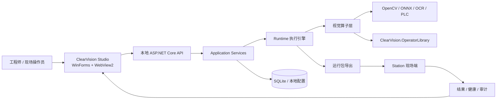

# ClearVision

[](https://github.com/HerverJun/ClearVision/actions/workflows/ci.yml)
[](https://github.com/HerverJun/ClearVision/actions/workflows/codeql.yml)


ClearVision 是一个面向工业视觉检测的 .NET 平台工程，覆盖桌面端流程编排、视觉算子执行、本地运行时 API、现场 Station 同步、质量证据治理和可独立打包的算子库。

它不是单一的 OpenCV demo，而是一套把图像采集、预处理、检测、测量、标定、AI 推理、PLC/通信、结果回放与工程化验证串在一起的视觉软件骨架。

## 最近更新

- 2026-08-04：Studio UI Next F09 工程修复已完成，配置默认入口为 `NEXT_DEFAULT`，`LEGACY_FALLBACK` 仅保留为回退入口；真实 WebView2、发布、Remote CI 与现场验收仍为 acceptance debt。详见 [完成报告](./docs/进行中/StudioUINext/F09_完成报告.md)、[最终证据清单](./docs/进行中/StudioUINext/F09_FinalEvidenceManifest.md)、[问题台账](./docs/进行中/StudioUINext/F09_OPEN_ISSUES.md) 与 [Cutover/回退手册](./docs/进行中/StudioUINext/F09_Cutover与Rollback操作手册.md)。

> 本段只列仓库内已记录的最近事实；真实相机、真实 PLC、真实 Station 现场运行和产线签收仍以现场验收记录为准。

- 2026-07-01：Vision Agent 恢复治理阶段已归档并冻结 G00 基线；AgentRun 事件流、ProjectSave 恢复和 GlobalVariables 状态治理作为 Studio 2.0 既有基线保留，人工重启验收仍未声明通过。见 [G00 基线冻结报告](./docs/进行中/Studio2/baseline/G00-基线冻结报告-2026-07-01.md)。
- 2026-06-01：核心同步服务、部署服务、PLC 通信、UI 混合架构和检测工作流已形成系统化潜在风险排查报告，后续修复按审计清单滚动跟踪。见 [潜在风险点与 Bug 系统化排查报告](./docs/潜在风险点与Bug排查报告-2026-06-01.md)。
- 2026-05-31：文档治理入口已收敛，算子资料口径对齐到 156 个正式算子，活跃计划、归档和审计入口见 [文档审计报告](./docs/文档审计报告-2026-05-31.md)。

## 项目亮点

- Windows 桌面 Studio：WinForms + WebView2 前端，提供项目管理、流程编辑、算子配置、图像预览、检测执行和结果看板。
- 本地运行时服务：桌面端内嵌 ASP.NET Core endpoints，承载项目、模板、算子预览、实时检测、Station 管理和配置接口。
- 工业视觉算子库：覆盖图像处理、测量、标定、通信、流程控制、AI 等模块，当前公开算子目录以 156 个算子类型为核心边界。
- 可打包 OperatorLibrary：`ClearVision.OperatorLibrary` 可独立构建为 NuGet 包，当前包版本基线为 `1.0.2`。
- Station 现场链路：支持运行包导出、Station 同步、健康状态、结果摘要、命令下发与审计记录。
- 质量证据体系：使用 contract、golden、dataset、field replay、benchmark 和 CI gate 区分功能成熟度与证据成熟度。

## 技术栈

| 层级 | 技术 |
| --- | --- |
| 运行平台 | .NET 8, C# 12, Windows |
| 桌面容器 | WinForms, WebView2 |
| 本地 API | ASP.NET Core minimal APIs, SSE |
| 视觉与 AI | OpenCvSharp, ONNX Runtime, PaddleOCRSharp, ZXing.Net |
| 数据与配置 | SQLite, EF Core, 本地配置文件 |
| 工业通信 | Modbus, Siemens S7, Mitsubishi MC, Omron FINS, TCP/Serial, MQTT |
| 测试与质量 | xUnit, Playwright, BenchmarkDotNet, GitHub Actions, CodeQL |

## 架构概览



## 仓库结构

| 路径 | 说明 |
| --- | --- |
| `ClearVision.Product/` | ClearVision 主应用解决方案，包含桌面端、运行时、Station、核心领域与基础设施代码 |
| `ClearVision.Product/src/ClearVision.Product.Desktop/` | Windows 桌面入口、WebView2 宿主、本地 API 和前端静态资源 |
| `ClearVision.Product/src/ClearVision.Product.Runtime/` | 流程执行、运行包导出与运行时服务 |
| `ClearVision.Product/src/ClearVision.Product.Station/` | 现场 Station 端同步与运行界面 |
| `ClearVision.Product/src/ClearVision.Product.Infrastructure/Operators/` | 主要视觉算子实现 |
| `ClearVision.OperatorLibrary/` | 可独立打包的工业视觉算子 NuGet 项目 |
| `quality/` | 数据集、回放、质量矩阵、benchmark 和质量 gate 资产 |
| `models/` | 模型目录与模型发布说明 |
| `docs/` | 架构、运行时、质量、发布、工程治理文档 |
| `scripts/` | 测试、打包、虚拟 PLC、文档生成与质量验证脚本 |
| `线序检测/` | 端子线序检测场景包、模板、样例与版本资料 |

## 快速开始

前置条件：

- Windows 10/11
- .NET SDK `9.0.300`，仓库根目录 `global.json` 精确固定 SDK 版本，不做 roll-forward
- .NET 8 Desktop Runtime（调试/运行 WinForms + WebView2 桌面端需要）
- Microsoft Edge WebView2 Runtime
- PowerShell
- Node.js 20，仅 UI/Playwright 测试需要

```powershell
git clone https://github.com/HerverJun/ClearVision.git
cd ClearVision

& ".\scripts\dotnet.ps1" -InstallIfMissing --version
& ".\scripts\dotnet.ps1" restore .\ClearVision.Product\ClearVision.Product.sln --locked-mode
& ".\scripts\dotnet.ps1" build .\ClearVision.Product\ClearVision.Product.sln --configuration Debug --no-restore

& ".\ClearVision.Product\src\ClearVision.Product.Desktop\bin\Debug\net8.0-windows\win-x64\ClearVision.Product.Desktop.exe"
```

如果本机同时存在 `C:\Program Files\dotnet` 和 `%LOCALAPPDATA%\Microsoft\dotnet`，不要直接依赖 PATH 中的裸 `dotnet`。仓库脚本会读取 `global.json`，优先选择包含 SDK `9.0.300` 的 dotnet host；`-InstallIfMissing` 会补齐 SDK `9.0.300` 和 .NET 8 Core / ASP.NET / WindowsDesktop runtime，避免两台机器因为 PATH 顺序不同而使用不同 SDK 或运行时。

AI 流程生成相关密钥默认不写入仓库。需要联调时，请在本地配置文件或运行环境中配置自己的 provider、base URL 和 API key，避免提交任何密钥。

## 常用验证命令

仓库提供串行测试脚本，避免同一 `.csproj` 的多个 `dotnet test` 进程互相抢占。

```powershell
& "./scripts/run-dotnet-test-serial.ps1" `
  -Project "ClearVision.Product/tests/ClearVision.Product.Tests/ClearVision.Product.Tests.csproj" `
  -Configuration Debug `
  -NoRestore `
  -Verbosity minimal

& "./scripts/run-tests-desktop-endpoints.ps1" -NoBuild -NoRestore
& "./scripts/run-tests-plc-regression.ps1" -NoBuild -NoRestore
```

OperatorLibrary 打包与 smoke 验证：

```powershell
& ".\scripts\dotnet.ps1" build .\ClearVision.OperatorLibrary\ClearVision.OperatorLibrary.csproj --configuration Release
& ".\ClearVision.OperatorLibrary\pack.ps1" -Configuration Release -RunSmokeTest
```

质量套件入口：

```powershell
python .\quality\tools\run_quality_suite.py --suite quick_contract_suite --list
python .\quality\tools\run_quality_suite.py --suite quick_contract_suite --validate-only
```

## OperatorLibrary

`ClearVision.OperatorLibrary` 将 ClearVision 的算子层以 NuGet 包形式交付，方便在宿主外复用图像处理、测量、标定、通信、流程控制和 AI 算子。

包项目采用 MSBuild linked compile items 复用主工程源码，同时保留独立的 package metadata、SBOM、third-party notices、smoke tests 和版本注入能力。

```powershell
& ".\ClearVision.OperatorLibrary\pack.ps1" `
  -PackageVersion "1.0.2-ci.local" `
  -RepositoryBranch "main" `
  -RepositoryCommit "local" `
  -RunSmokeTest
```

更多说明见 [ClearVision.OperatorLibrary README](./ClearVision.OperatorLibrary/README.md)。

## 质量与发布边界

ClearVision 把“功能存在”和“可发布证据充分”分开管理：

- 功能成熟度：算子是否存在、是否进入正式目录、是否通过基础契约或 smoke 路径。
- 证据成熟度：是否具备 contract、golden、dataset、field replay、性能基线和现场签核记录。

公开数据集、半合成样本、field-substitute replay 或 dry-run smoke 不能等同于真实产线签核。真实产线签核应包含现场样本、硬件 profile、数据版本、报告 ID 和审批记录。

CI 当前覆盖构建、编码扫描、密钥扫描、单元测试、桌面端测试、检测回归/性能 gate、OperatorLibrary 打包 smoke、UI 测试、CodeQL 与手动工业 gate。

## 文档导航

- [Studio UI Next F09 G0 审计与问题台账](./docs/进行中/StudioUINext/F09_G0_进入审计与问题台账.md)
- [Studio UI Next F09 G1 Legacy/Next 终局能力矩阵](./docs/进行中/StudioUINext/F09_G1_LegacyNext终局能力矩阵.md)
- [Studio UI Next F09 完成报告](./docs/进行中/StudioUINext/F09_完成报告.md)
- [Studio UI Next F09 最终证据清单](./docs/进行中/StudioUINext/F09_FinalEvidenceManifest.md)
- [Studio UI Next F09 Cutover 与 Rollback 手册](./docs/进行中/StudioUINext/F09_Cutover与Rollback操作手册.md)
- [Studio UI Next F09 Legacy Fallback 保留与退役条件](./docs/进行中/StudioUINext/F09_LegacyFallback保留与退役条件.md)

- [项目总览](./docs/项目总览.md)
- [文档索引](./docs/README.md)
- [文档导航](./docs/导航.md)
- [G00 基线冻结报告（2026-07-01）](./docs/进行中/Studio2/baseline/G00-基线冻结报告-2026-07-01.md)
- [潜在风险点与 Bug 系统化排查报告（2026-06-01）](./docs/潜在风险点与Bug排查报告-2026-06-01.md)
- [文档审计报告（2026-05-31）](./docs/文档审计报告-2026-05-31.md)
- [文档治理标准](./docs/参考资料/规范/文档治理标准.md)
- [文档治理台账（2026-05-31）](./docs/文档治理台账-2026-05-31.md)
- [Runtime 设计](./docs/runtime/ClearVision-Runtime-Design.md)
- [Station-Studio 同步](./docs/runtime/station-studio-sync.md)
- [CI 与质量门禁](./docs/engineering/ci-quality-gates.md)
- [证据与临时产物规范](./docs/engineering/evidence-artifacts.md)
- [OperatorLibrary 发布工业化说明](./docs/operator-library/release-package-industrialization.md)
- [算子质量矩阵](./quality/evals/reports/operator_quality_matrix.md)
- [算子目录](./算子资料/算子目录.md)
- [端子线序检测场景包](./线序检测/scenario-package-wire-sequence/README.md)

## 许可证

`ClearVision.OperatorLibrary` 的 NuGet metadata 当前声明为 MIT license expression。若整个仓库需要对外正式发布，请以根目录许可证文件为准，并在发布前补齐对应的 `LICENSE` 文件。
