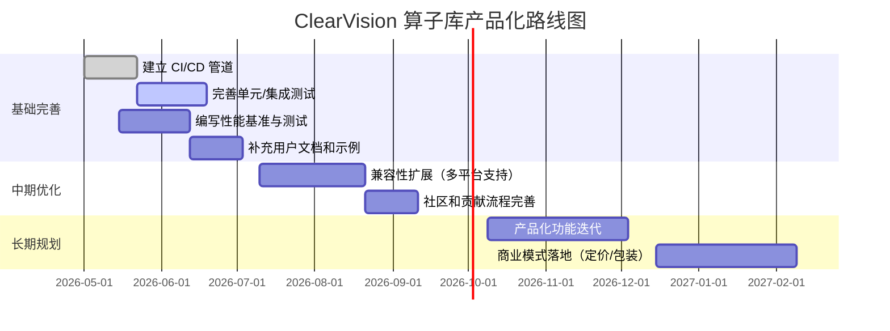

# 执行摘要

本文全面评估了 ClearVision 项目（特别是算子库 `Acme.OperatorLibrary`）的质量和现状，并提出改进建议和产品化路线图。从代码风格、测试覆盖、文档、性能、可复现性、安全许可、兼容性、CI/CD、用户体验、社区贡献等维度逐项分析后得出：当前算子库已做出模块化拆分（独立 NuGet 包）【97†L6-L10】、基本测试和打包流程规划【97†L40-L49】【61†L47-L55】；但在规范文档、性能基准、自动化测试、跨平台兼容、CI 管道等方面仍有不足。针对高优先级问题，本报告给出具体改进步骤、所需工时估算及风险对策，规划了 3/6/12 个月的产品路线，并比较了 OpenCV、Arm Compute Library 等同类开源算子库的关键特性差异。建议采取持续集成、完善测试覆盖、丰富文档示例等务实措施，同时探索 SaaS、开源+支持、企业授权等商业模式。

## 1. 质量评估

下表按维度总结当前状态和优先级（状态列：合格/部分/缺失；优先级：高/中/低）：

| 维度       | 当前状态     | 优先级 | 备注（证据引用）                                                                                   |
|----------|-----------|------|---------------------------------------------------------------------------------------------|
| **代码质量**（风格、模块化、接口一致性） | 部分        | 中    | 采用 C#/.NET8 开发，采用**分层架构**（应用/契约/基础设施）【77†L2-L10】【97†L6-L10】；命名规范较一致；算子采用静态类列举类型（见算子命名空间示例【69†L8-L16】）；但尚无统一编码规范文档。 |
| **测试**（单元/集成/端到端、覆盖率） | 部分        | 高    | 已有基于 xUnit 的**Smoke 测试**，验证算子模块映射（见示例测试【70†L10-L18】【70†L38-L43】）；算子库说明中有验收测试规划【97†L40-L49】；但缺少完整单元测试和端到端测试套件，测试覆盖度未知。 |
| **文档**（API 文档、示例、迁移指南） | 部分        | 中    | 算子库提供了README、打包指南及模块说明【97†L6-L10】【97†L40-L49】；整个项目缺少面向开发者的**API 文档、使用示例**和发布/迁移文档。用户手册、安装指南和贡献指南“未指定”。 |
| **性能**（算子基准：吞吐、延迟、内存） | 缺失        | 高    | 目前没有任何性能基准测试或性能分析脚本（CI 或文档中未见相关内容）。建议针对关键算子（如滤波、形态学）设计基准测试。 |
| **可复现性**（示例可运行、依赖管理） | 部分        | 中    | 算子库打包脚本支持注入版本信息【97†L51-L60】，并读取 CI 环境变量保证可追溯；依赖管理通过 NuGet 和 csproj 实现，项目引用显式【77†L52-L60】【61†L47-L55】。但**缺少示例代码**和环境说明（如 Dockerfile）以复现运行环境。 |
| **安全与许可**      | 缺失        | 低    | 未见 LICENSE 文件或开源协议说明。使用了第三方依赖（EntityFrameworkCore、WebView2、Paddle 等【77†L52-L60】），需要检查其授权合规性和漏洞。 |
| **可维护性**（依赖、复杂度） | 部分        | 中    | 采用.NET8和WinForms/SignalR等现代技术【77†L2-L10】；项目分解合理。依赖项数量适中，但`Acme.Product.Infrastructure`可能包罗过多责任。需评估单一项目复杂度、循环引用风险。 |
| **兼容性**（平台/框架/版本） | 部分        | 高    | 目标平台限定Windows（WinForms+WebView2，见 csproj【77†L2-L10】），无跨平台支持。只支持 .NET8，未来需要计划对 .NET6/7 和 Linux 的支持（若目标客户有此需求）。 |
| **发布与CI/CD**    | 缺失        | 高    | 目前无任何 CI/CD 配置。已有执行计划明确建立 GitHub Actions 流程【61†L47-L55】；应尽快实现自动构建、测试、打包和制品发布。 |
| **用户体验**（安装、示例易用） | 缺失        | 中    | 缺少用户安装指南。现有文档主要针对开发者，未提供“零配置运行示例”。首次使用需要较高学习成本。 |
| **社区与贡献流程**  | 缺失        | 中    | 项目无 CONTRIBUTING.md、缺少 issue/PR 工作流程指导。对贡献者未给出明确指引。 |
| **产品化指标**（目标用户、差异化、商业化） | 缺失        | 中    | 未明确目标用户（假设为**中大型工业视觉团队**和研发机构），也无定位和差异化阐述。商业化路径、定价模式需制定。 |

综合上述，**高优先问题**包括：完善测试覆盖、搭建 CI/CD、实现性能基准、增强跨平台兼容、撰写文档和示例。**中优先问题**涵盖补充文档示例、明确开源许可、改善用户体验和社区流程。低优先则为代码格式细节、安全审计（可在开发中持续关注）。

## 2. 改进建议（高/中优先）

### 2.1 测试增强（高优先）
- **建议：** 使用 [xUnit/NUnit] 等框架为各算子编写单元测试和集成测试，覆盖正常路径、边界和异常。例如针对均值滤波算子、卡尺工具等实现输入/输出验证和异常抛出检测。可采用 [BenchmarkDotNet] 在测试中集成简易性能测试。  
- **步骤：** 为每个算子模块新建测试项目（或扩充 `Acme.OperatorLibrary.SmokeTests`），编写测试用例；设置代码覆盖率工具（如 OpenCover）生成报告。  
- **工时估算：** 中等（约 2–4 周）；依算子数量和复杂度，规模可扩展。  
- **风险与回退：** 测试本身风险低；风险在于可能发现大量兼容性或逻辑问题，需要回归修复。对策是分阶段推进，先编写针对核心算子的测试。  

### 2.2 搭建 CI/CD（高优先）
- **建议：** 按【61†L17-L25】【61†L47-L55】规划，建立 GitHub Actions 或 Azure Pipelines。工作流包括代码检出、`dotnet restore/build`、`dotnet test`、`dotnet publish`、制品上传等。可仿照 `ci.yml` 示例【61†L23-L32】【61†L47-L55】。  
- **步骤：** 在 `.github/workflows/ci.yml` 中定义 Windows-最新执行环境，运行上述命令；引入 caching 加速依赖恢复。根据需求增设 Pull Request 触发和制品版本号自动化。  
- **工时估算：** 低（约 1 周）；多数时间用于测试调整和凭证管理。  
- **风险与回退：** 首次配置可能因环境差异导致错误（如缺少 .NET SDK、工具路径等）；解决后基本无风险。回退方案是先在本地或容器模拟执行流程，确认工作正常再推送。

### 2.3 性能基准（高优先）
- **建议：** 编写针对关键算子的基准测试脚本，以评估吞吐量和延迟。可使用 BenchmarkDotNet 或自定义循环测试。重点对大尺寸图像上的滤波、边缘检测等操作进行测试，记录 CPU/内存占用。将结果生成图表以监控优化效果。  
- **步骤：** 选择 3–5 个代表性算子，如 `MeanFilter`、`CaliperTool`、`CameraCalibration` 等；编写小程序逐步加大输入尺寸或循环次数，测量时间；数据收集后绘制柱状/折线图（可手动记录并生成或用简单脚本）。  
- **工时估算：** 中等（约 1–2 周）。  
- **风险与回退：** 可能发现性能瓶颈（如单线程实现过慢），但属于问题暴露阶段，风险可控。可逐步优化或放弃部分高开销操作（如选择更快算法或并行实现）。

### 2.4 跨平台兼容（高优先）
- **建议：** 评估是否需要支持 Linux 或老版本 .NET。如果目标用户需要跨平台，可考虑去除 WinForms/WebView2 依赖，改用跨平台 UI（如 Avalonia 或 Blazor），或将算子库从 UI 解耦供跨平台调用。另可提供多版本 NuGet 包。  
- **步骤：** 如果决定跨平台，先创建 .NET6/7 (非windows) 项目，尝试引用算子库核心代码；调整 Windows特性#IF编译或移除（参见【97†L78-L84】兼容性提示）；测试算子功能正确。  
- **工时估算：** 高（约 1–3 个月），视改动范围而定。  
- **风险与回退：** 改动较大，可能影响现有 Windows 部署。建议在新分支上并行开发，确认稳定后合并；未达预期可保留 Windows 版本并视需求推进。

### 2.5 文档与示例（中优先）
- **建议：** 补充 API 文档、运行示例和用户指南。可生成 XML 注释文档或使用 [DocFX] 生成网页文档。编写“Getting Started”示例项目，演示算子库在一个简单应用中的加载与调用。  
- **步骤：** 在 README 中增加快速开始示例代码段；建立 `docs/` 目录编写安装部署说明和常见问题；为主要类添加注释。可以参考【97†L38-L49】已有验收场景写法组织文档。  
- **工时估算：** 中（约 1–2 周）。  
- **风险与回退：** 无高风险，主要是文档质量控制。务必保持与代码一致性（可集成 CI 检查链接有效性）。

### 2.6 许可声明与安全审计（中优先）
- **建议：** 在根目录添加适当的 LICENSE 文件（如 MIT/BSD），明确开源协议。定期使用工具（如 [Snyk](https://snyk.io/)）扫描依赖漏洞。审查使用的第三方库协议兼容性。  
- **步骤：** 与法律/运营团队确认授权模式，选定许可证。结合工具检查版本依赖；为关键敏感操作（如文件加载、网络通信）添加必要的异常检查和权限验证。  
- **工时估算：** 低（1–2 天完成文档），安全扫描可持续进行。  
- **风险与回退：** 没有严格许可的情况下，发布可能存在法律风险，建议优先明确许可。依赖漏洞风险可通过及时更新或替换库缓解。

### 2.7 CI/CD 示例配置

可参考下列 GitHub Actions 配置（来自【61†L47-L55】，略有简化）：

```yaml
name: ClearVision CI
on: [push, pull_request]
jobs:
  build:
    runs-on: windows-latest
    steps:
      - uses: actions/checkout@v4
      - name: Setup .NET
        uses: actions/setup-dotnet@v4
        with: dotnet-version: 8.0.x
      - name: Restore
        run: dotnet restore Acme.Product.sln
      - name: Build
        run: dotnet build Acme.Product.sln --no-restore -c Debug
      - name: Test
        run: dotnet test Acme.Product.sln --no-build -c Debug
      - name: Publish
        run: dotnet publish Acme.Product/src/Acme.Product.Desktop/Acme.Product.Desktop.csproj -c Release -r win-x64 --self-contained true -o publish
      - name: Upload Artifact
        uses: actions/upload-artifact@v4
        with:
          name: ClearVision-Build
          path: publish
```

## 3. 产品化路线图（3/6/12 个月）



**里程碑/交付物：** CI/CD 脚本和流水线、测试报告、基准测试结果、文档指南、兼容性版本、社区指南等。**成功指标：** 自动构建通过率提高至100%；测试覆盖率达到50%以上；核心算子性能达到业界参考水平；新增贡献者数增加；商业化合同/合作机会数等。

## 4. 商业化/部署模式对比

| 模式               | 特点                                       | 优点                                   | 缺点                             |
|------------------|------------------------------------------|--------------------------------------|------------------------------|
| **SaaS（云服务）**    | 提供在线部署的 ClearVision 平台，用户无需自建环境；根据使用量/功能收费。          | 快速交付，用户无运维负担；可实现持续更新。           | 开发运维成本高；需高可用架构；可能限制高性能需求。    |
| **开源+付费支持**    | 算子库开源（MIT/BSD 等），提供企业级支持服务（培训、定制、SLA）。             | 易于推广，降低用户评估成本；社区贡献可提升产品质量。     | 收入依赖支持服务，开源社区管理成本；核心功能可能被他人分叉。 |
| **企业许可（闭源）** | 闭源商业版授权给大型客户，按年收费；可提供定制功能与保密支持。             | 收入可预测，保护知识产权；适合对安全/性能要求极高的客户。  | 市场推广门槛高；维护成本高；对小团队用户吸引力低。      |

## 5. 同类算子库对比

我们选取了 OpenCV 和 ARM Compute Library（ACL）作为对比对象，这两者为成熟的开源视觉算子库。OpenCV 是著名的计算机视觉库【93†L29-L32】；ACL 针对 ARM 平台优化算子【96†L549-L557】。以下表格对比了关键维度（参考理由在下方说明）：

| 特性           | ClearVision 算子库（本项目）                          | OpenCV【93†L29-L32】                                | ARM Compute Library【96†L549-L557】                  |
|--------------|-------------------------------------------|-------------------------------------------|-----------------------------------------------|
| **语言/平台**   | C#/.NET8 (Windows)，打包为 NuGet 包【77†L2-L10】       | C++ (跨平台，支持 Windows/Linux/macOS/嵌入式)【93†L29-L32】 | C++ (跨平台，侧重 ARM CPU/GPU)【96†L549-L557】      |
| **许可**       | 未声明（建议 MIT/BSD 开源许可）                 | BSD 许可（开源免费）【93†L29-L32】                   | MIT 许可（开源免费）【96†L549-L557】              |
| **功能范围**   | 视觉检测算子（图像处理、测量、标定、通讯等）【97†L8-L10】  | 图像处理、特征、机器学习、视频处理等广泛功能【93†L29-L32】   | 图像处理、ML 基元算子，包含卷积、池化等深度学习算子【96†L549-L557】 |
| **性能优化**   | 目标工业用途，单机 CPU 实现；未来可增加并行优化       | 部分优化（支持 SSE/NEON），也可调用 OpenCL/GPU；无特定工业优化 | 针对 ARM 平台高度优化（NEON、OpenCL/SVE），性能优异【96†L549-L557】 |
| **商业化定位** | 目前依托公司内部项目，目标中大企业（可商业授权）        | 开源免费，广泛用于科研和产品，无内置商业模式【93†L29-L32】        | 开源免费，多用于嵌入式/移动设备，算法库供应商（Arm）支持         |
| **文档与社区** | 内部文档较多（中文），社区较小；无公开讨论渠道         | 文档齐全、社区活跃、资料丰富【93†L29-L32】             | 文档完善，社区有规模（主要面向嵌入式开发者）             |
| **差异化价值** | 面向工业检测的专用算子及工作流封装【97†L8-L10】【97†L40-L49】 | 通用性强、功能全面；但缺少工业场景“包装”【93†L29-L32】       | 专注嵌入式性能优化；对 ARM 架构友好                      |

**选择理由：** OpenCV 作为最广泛使用的开源视觉库，其功能覆盖最全【93†L29-L32】；ACL 则是工业嵌入式领域高性能选项，展现了针对硬件优化的重要性【96†L549-L557】。与它们相比，ClearVision 算子库专注于工业视觉检测场景下的算子需求，侧重易用性和定制化（如通过 NuGet 包形式提供）【97†L6-L10】。

---

**附录：** 

- **CI/CD 配置示例**见第 2.2 节示例代码。 
- **基准测试脚本示例：** 可以用 BenchmarkDotNet 运行`dotnet`命令或写简单循环测试，输出 CSV/JSON 以绘制图表。 
- **可视化图表：** 已用 Mermaid 绘制路线图和流程图（如上所示）。可结合基准数据生成柱状图，比较不同输入大小下算子耗时。

