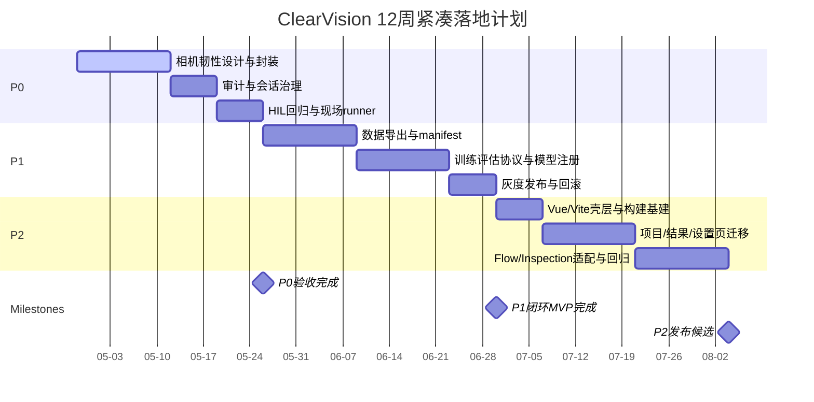

# ClearVision P0-P2 落地 TODO 研究报告

## 执行摘要

基于对 ClearVision 指定仓库的核查，这个项目**不是从零起步**：它已经具备 Windows 桌面宿主（.NET 8 + WinForms + WebView2）、本地 ASP.NET Core Minimal API、155 个正式算子、较完整的 GitHub Actions 流水线、相机绑定/预览 API、基础认证、检测结果持久化、模型目录与质量门禁。真正需要优先推进的，不再是“有没有这些能力”，而是把现有能力做成**可恢复、可审计、可持续优化、可增量演进**的产品级体系：P0 应聚焦相机/预览链路的韧性层、审计与硬件在环回归；P1 应把检测结果落盘、分析 JSON、模型目录、质量脚本串成最小闭环；P2 应避免整站推翻重写，而是在保留 `httpClient.js`、`webMessageBridge.js` 与 `flowCanvas.js` 的前提下，增量迁移壳层和高变视图。

## 研究范围与关键判断

本次研究仅使用 `github` 连接器，代码与文档主证据来源仅为 GitHub 上的 `HerverJun/ClearVision` 仓库；外部来源未使用。默认前提采用你给出的假设：目标部署环境为 Windows 桌面，技术栈以 .NET 8 + WinForms + WebView2 为主；CI/CD 与硬件形态若仓库未明确，则按 **unspecified** 处理，不做虚构补全。

为了形成可执行计划，本次重点确认了五类信息：当前宿主/后端/前端结构，现有相机与 PLC 接入面，认证/会话/日志现状，检测结果与模型目录的闭环基础设施，以及 CI/UI 测试覆盖面。仓库证据显示：主程序会启动本地 Web 服务并注册认证、设置、PLC、AI、实时检测事件等端点；依赖注入里已注册相机管理、事件总线、检测 worker、算子工厂、模型相关服务；前端仍是原生 ES Modules，但模块已按 `core` / `features` / `shared` 分层；CI 已包含 .NET 构建测试、检测回归/性能门禁、Playwright UI 测试和发布打包。

## P0 落地计划

仓库已经有相机抽象、绑定配置、软触发抓图、连续预览、连接状态投影、认证锁定与基础日志，因此 P0 不应继续做“重复造轮子”；应聚焦三个真实缺口：**相机链路韧性**、**审计与会话治理**、**硬件在环回归**。`ICamera` / `IIndustrialCamera` / `ICameraProvider` 当前接口偏“最小可用”，暴露了连接、抓图、触发和原生 provider 操作，但没有健康探针、故障分类、退避重连、占用仲裁等契约；`SettingsEndpoints` 已直接把抓图/预览 API 暴露给前端，说明韧性层必须插在 endpoint 与 provider/manager 之间；现有单元测试覆盖了预览等待新帧与绑定状态投影，但尚未覆盖 SDK 卡死、重连抖动、断网恢复或长时 soak；认证层已有初始管理员、密码修改、失败锁定与 session timeout，但 session 与失败计数仍是进程内内存字典，用户实体也没有强制改密/密码年龄字段，因此 P0 安全侧重点应调整为“持久化审计 + 强制轮换 + 可吊销会话”。

### P0 详细 TODO 清单

| 任务 | 目标 | 子任务 | 需要修改/参考的仓库文件 | 估算工时 | 所需角色 | 依赖关系 | 验收标准 | 风险缓解 |
|---|---|---|---|---|---|---|---|---|
| **P0-A 相机韧性包装层** | 把现有海康/华睿相机接入升级为“可重连、可分类、可观测”的稳定链路 | 新增 `ResilientIndustrialCamera` 装饰器；新增故障分类 `CameraFaultKind`；在 `CameraManager` 中统一包裹 `IIndustrialCamera`；为 `AcquireSingleFrameAsync`、`StartContinuousAcquisitionAsync`、`ExecuteSoftwareTriggerAsync` 增加重试/退避/断路器；把 stale frame、超时、SDK native error、设备离线分开上报 | `Acme.Product/src/Acme.Product.Core/Cameras/ICamera.cs`；`.../IIndustrialCamera.cs`；`.../Infrastructure/Cameras/CameraManager.cs`；`.../Infrastructure/Cameras/HikvisionCamera.cs`；`.../Infrastructure/Cameras/CameraFrameStreamCoordinator.cs` | 4–6 天 | 开发、QA、硬件工程师 | 需要至少 1 台真实相机；SDK DLL 可用 | 断开网线/掉电/占用冲突后，预览与软触发可在 30 秒内恢复；5 次连续失败后熔断并给出明确错误码；日志可区分 `timeout` / `offline` / `sdk_error` | 装饰器先不改动前端 API，避免影响 `SettingsEndpoints` 与现有 UI 测试 |
| **P0-B 预览/抓图会话状态机** | 把当前 preview session 从“能跑”升级为“有状态机和健康窗口”的会话服务 | 为 continuous preview 增加 `Starting/Live/Degraded/Reconnecting/Stopped` 状态；增加 last frame age、drop count、reconnect attempts 指标；在 SSE 或单独 health API 暴露预览健康；补充 session TTL 与资源释放策略 | `.../Endpoints/SettingsEndpoints.cs`；`.../Endpoints/InspectionEventEndpoints.cs`；`.../Infrastructure/Cameras/CameraFrameStreamCoordinator.cs`；`.../tests/Acme.Product.Desktop.Tests/CameraFrameStreamCoordinatorTests.cs` | 3–4 天 | 开发、QA、硬件工程师 | 依赖 P0-A 的故障分类与重试策略 | 预览 session 停止后 3 秒内释放；连续 2 秒无新帧时状态转 `Degraded`；恢复后自动回到 `Live` | 状态机先做服务端，不先改 UI，可通过 header/JSON 回传反向兼容 |
| **P0-C 审计与会话治理** | 补齐产品级安全追踪，而不是重复已有登录功能 | 新增 `AuditLog` 实体与仓储；记录登录、登出、初始管理员创建、密码变更、相机绑定修改、PLC 配置保存、模型切换；为 `User` 增加 `MustChangePassword`、`PasswordChangedAtUtc`；把 session 改为可吊销、可追踪的持久化 token 或服务端 ticket | `Acme.Product/src/Acme.Product.Application/Services/AuthService.cs`；`.../Desktop/Endpoints/AuthEndpoints.cs`；`.../Core/Entities/User.cs`；`.../Desktop/Middleware/AuthMiddleware.cs`；`.../Infrastructure/Logging/SerilogConfiguration.cs`；`.../Infrastructure/Data/VisionDbContext`（若存在） | 4–5 天 | 开发、QA、产品 | 需要确认合规要求与审计保留周期 | 关键操作均有审计记录；首次管理员创建后可配置强制改密；session 可被后台吊销；审计日志可按用户/时间/动作筛选 | 审计先落 SQLite，避免一开始引入外部日志平台 |
| **P0-D 硬件在环回归包** | 把现有单元/UI 回归补到真实硬件路径 | 新增 HIL 测试标签与独立脚本；覆盖软触发抓图、连续预览、重连、触发模式切换、PLC 通信基本检查；在 CI 中保留 mock 路径，在现场 Windows runner 执行 HIL | `Acme.Product/tests/Acme.Product.Desktop.Tests/CameraBindingsEndpointTests.cs`；`.../CameraFrameStreamCoordinatorTests.cs`；`Acme.Product/tests/Acme.Product.UI.Tests/tests/e2e/high-frequency-regression.spec.ts`；`.github/workflows/ci.yml`；`scripts/run-tests-detection-regression.ps1` | 3–5 天 | QA、开发、硬件工程师、DevOps | 需要真实相机、PLC 或模拟器、现场 runner | 至少 8 个硬件场景自动通过；现场 runner 产出 HIL 报告；不影响 GitHub 云端现有 CI | HIL 用独立 workflow_dispatch，不阻塞主 PR 流 |
| **P0-E 配置规范化** | 统一保存策略、重连策略、触发策略、日志策略的 schema | 为相机配置增加 `reconnectPolicy`、`frameTimeoutMs`、`previewBufferPolicy`；为安全配置增加 `forcePasswordRotationDays`；为日志增加 `auditEnabled` 与敏感字段脱敏配置 | `Acme.Product/src/Acme.Product.Core/Entities/AppConfig.cs`；`.../Desktop/Endpoints/SettingsEndpoints.cs`；前端设置页相关文件 | 2–3 天 | 开发、产品、QA | 依赖 P0-A/P0-C 的最终字段定义 | 配置可序列化/反序列化；旧配置可兼容升级；设置页保存和读取通过 | 采用“向后兼容默认值”，不破坏已有配置文件 |

P0 任务的设计完全是沿着现有接口和测试形态展开的：服务器已在启动时加载配置并初始化相机绑定；前端已有软触发预览、连续运行与设置页回归测试；日志已接入 Serilog；因此最佳策略是**在现有抽象之上加装饰器、状态机和审计层**，而不是改 API 形态或直接重写相机模块。

### P0 代码级实施建议

建议不要立即扩展 `SettingsEndpoints` 的 URL 形态，而是在服务端加一层**韧性接口**，保持前端调用不变。可以新增一个服务侧包装接口，而不是直接破坏现有 `ICamera` / `IIndustrialCamera`。支持层建议如下：

```csharp
public interface IResilientCameraSession
{
    string CameraBindingId { get; }
    Task EnsureConnectedAsync(CancellationToken ct);
    Task<CameraFrameEnvelope> AcquirePreviewFrameAsync(CancellationToken ct);
    Task<byte[]> AcquireSingleFrameWithRetryAsync(CancellationToken ct);
    Task<CameraSessionHealth> GetHealthAsync(CancellationToken ct);
    Task ForceReconnectAsync(string reason, CancellationToken ct);
}

public sealed record CameraSessionHealth(
    string State,              // Starting / Live / Degraded / Reconnecting / Stopped
    int ConsecutiveFailures,
    int ReconnectAttempts,
    long LastFrameAgeMs,
    string? LastErrorCode,
    string? LastErrorMessage);
```

这样设计的原因是：现有 `ICamera`/`IIndustrialCamera` 已经被前端 API、`CameraManager`、`CameraFrameStreamCoordinator` 和测试共同使用，直接修改原接口会连带影响更大；而仓库当前接口又确实缺少健康/诊断/恢复语义。

建议退避策略分三类，而不要“一刀切”：

| 操作 | 建议策略 | 说明 |
|---|---|---|
| `AcquireSingleFrameAsync` | 立即重试 1 次 + 指数退避 200/500/1000ms，最多 4 次 | 适合瞬态触发失败 |
| `StartContinuousAcquisitionAsync` | 失败后切到 `Reconnecting`，指数退避 + jitter，最多 30 秒窗口 | 适合掉线或设备重启 |
| `SetTriggerModeAsync` / `ExecuteSoftwareTriggerAsync` | 不做长重试，只做 1 次幂等恢复 | 防止重复触发导致机械联动异常 |
| provider `Open/Close` | 使用断路器，连续失败后 15–30 秒半开恢复 | 防止 UI 连续点击把 SDK 打崩 |

建议日志与审计分离：**技术日志**继续留在 Serilog，**审计日志**单独做结构化动作表。可挂钩的位置很明确：`AuthService`、`AuthEndpoints`、`SettingsEndpoints`、`InspectionService`、以及未来的 `ResilientIndustrialCamera`。现有日志配置已经在基础设施层统一完成，但还没有专门的审计通道。

建议的审计事件字段：

```json
{
  "timestampUtc": "2026-04-28T10:00:00Z",
  "actorUserId": "user-guid",
  "actorUsername": "admin",
  "action": "camera.binding.updated",
  "targetType": "cameraBinding",
  "targetId": "cam-main-01",
  "result": "success",
  "correlationId": "req-20260428-0001",
  "clientIp": "127.0.0.1",
  "details": {
    "oldTriggerMode": "Software",
    "newTriggerMode": "External",
    "oldExposureTimeUs": 12000,
    "newExposureTimeUs": 8000
  }
}
```

P0 的测试建议分成三层。单元层：补 `ResilientIndustrialCameraTests`、`CameraFaultClassifierTests`、`AuditLogServiceTests`。集成层：扩充 `CameraBindingsEndpointTests` 与 `CameraFrameStreamCoordinatorTests`，覆盖重连、超时、stale frame。端到端层：沿用现有 Playwright 套件，再新增“相机预览降级提示”“权限不足不能改相机绑定”“修改密码后旧 token 失效”三类场景。当前仓库已经有高频 UI 回归与基础相机 endpoint 测试，所以这是低风险扩展。

建议补充到配置中的最小 schema 如下，字段保持默认值兼容：

```json
{
  "security": {
    "sessionTimeoutMinutes": 30,
    "passwordMinLength": 10,
    "loginFailureLockoutCount": 5,
    "forcePasswordRotationDays": 90,
    "persistSessions": true,
    "auditEnabled": true
  },
  "cameraRuntime": {
    "frameTimeoutMs": 1500,
    "staleFrameThresholdMs": 2000,
    "maxReconnectAttempts": 8,
    "baseBackoffMs": 200,
    "maxBackoffMs": 5000,
    "previewBufferPolicy": "LatestOnly",
    "enableCircuitBreaker": true
  }
}
```

## P1 AI 闭环最小可行工作流

仓库已经具备闭环的几个关键“半成品”：检测结果实体里有 `OutputDataJson`、`AnalysisDataJson`、`FlowVersionHash`、`CalibrationBundleId` 与可缓存的 `ImageId`；`InspectionService` 会按存储策略把结果图像落盘到 `VisionData/Images` 或配置路径；分析数据由 `AnalysisDataBuilder` 按卡片方式生成；`models/model_catalog.json` 已经存在最小模型注册表；CI 里已经有检测准确率/稳定性/性能 gate。也就是说，P1 不必先造一个庞大的 MLOps 平台，完全可以先做**repo 内最小闭环**：采集 → manifest → 标注 → 训练 → 评估 → 注册 → 发布。

### P1 详细 TODO 清单

| 任务 | 目标 | 子任务 | 需要修改/参考的仓库文件 | 估算工时 | 所需角色 | 依赖关系 | 验收标准 | 风险缓解 |
|---|---|---|---|---|---|---|---|---|
| **P1-A 数据采集与 manifest 导出** | 把现有检测结果与图像落盘转换成可训练数据集快照 | 新增 `scripts/export-inspection-dataset.ps1`；扫描 `InspectionResults` + 已落盘图片；输出 `manifest.jsonl`；按 `projectId/sessionId/status` 分桶；补 `flowVersionHash` 与 `analysisData` | `Acme.Product/src/Acme.Product.Application/Services/InspectionService.cs`；`.../Core/Entities/InspectionResult.cs`；`scripts/` 新增导出脚本 | 2–4 天 | 开发、QA、产品 | 依赖现有图片落盘策略 | 任意项目可导出 dataset snapshot；manifest 记录图片路径、标签来源、流程版本、时间戳；支持增量导出 | 先只导出 NG/人工抽样 OK，避免数据量失控 |
| **P1-B 标注队列与版本管理** | 建立最小标注闭环，不先做复杂标注平台 | 新增 `quality/datasets/<dataset>/<version>/` 目录约定；为每个样本生成 `sample.json`；约定 `labelStatus`=`auto/pending/reviewed`; 标注入口先用文件式 JSON；新增 dataset README 与版本号规则 | `quality/datasets/` 新增目录与模板；可参考 `quality/evals/` 报告命名风格 | 3–5 天 | 产品、QA、开发 | 依赖 P1-A 的 manifest | 数据集版本可回溯；每次训练输入可唯一复现；人工复核状态可见 | 不先做 DB 标注平台，先使用文件式标签和审批清单 |
| **P1-C 训练与评估流水线** | 在 repo 内提供最小训练/评估入口 | 新增 `scripts/train-model.ps1`、`scripts/eval-model.ps1`、`quality/training/`；训练细节若现仓库未包含则明确为 unspecified，但统一输入输出协议：输入 dataset version，输出 ONNX/metrics/report | `models/model_catalog.json`；`quality/evals/reports/`；`.github/workflows/` 新增模型闭环 workflow | 4–7 天 | 开发、QA、DevOps、产品 | 依赖 P1-B | 能从给定 dataset version 产出 ONNX + `metrics.json` + `report.md`；失败时不覆盖当前生产模型 | 训练器封装为“黑盒协议”，避免先绑死某个训练框架 |
| **P1-D 模型注册、灰度与回滚** | 把训练产物接入现有模型目录与运行时 | 约定 `models/<task>/<modelId>/<version>/`；自动更新 `model_catalog.json`；为模型注册补校验脚本；在发布时保留 `previousStable` 回滚点；把评估报告与模型版本关联 | `models/model_catalog.json`；`.../Infrastructure/AI/Runtime/ModelCatalog.cs`；`.../Infrastructure/Operators/DeepLearningOperator.cs` | 3–4 天 | 开发、QA、DevOps | 依赖 P1-C | 新模型能被目录解析；发布后可由 `modelId/version` 切换；回滚 <30 分钟 | 采用双版本并存，不做原地覆盖 |
| **P1-E 闭环指标进入 CI** | 让模型更新遵守与功能代码一致的质量门 | 新增 `model-loop.yml` 或扩展 `ci.yml`：校验 dataset manifest、模型目录 schema、评估指标阈值、回归样本集 | `.github/workflows/ci.yml`；`scripts/run-tests-detection-regression.ps1`；`scripts/run-tests-detection-performance.ps1` | 2–3 天 | DevOps、QA、开发 | 依赖 P1-C/P1-D | PR 中可自动阻止低于阈值的模型更新；指标有 artifact 可追溯 | 训练本身采用手动触发，PR 只跑校验和评估 |

### P1 最小可行工作流

建议的最小目录布局：

```text
VisionData/
  Images/
    20260428/
      NG/
      OK/

quality/
  datasets/
    surface-defect/
      v2026.05.01/
        manifest.jsonl
        dataset_meta.json
        samples/
          000001.sample.json
          000002.sample.json
      v2026.05.15/
        ...
  labels/
    surface-defect/
      review_queue/
  evals/
    reports/
      models/
        surface-defect-yolo/
          1.2.0/
            metrics.json
            report.md
            confusion_matrix.json

models/
  surface-defect-yolo/
    1.2.0/
      model.onnx
      metadata.json
      thresholds.json
  model_catalog.json
```

推荐的样本 manifest 结构：

```json
{
  "sampleId": "20260428-projectA-sessionB-000123",
  "projectId": "project-guid",
  "sessionId": "session-guid-or-null",
  "timestampUtc": "2026-04-28T10:12:33Z",
  "status": "NG",
  "imagePath": "VisionData/Images/20260428/NG/xxx.png",
  "flowVersionHash": "sha256:...",
  "calibrationBundleId": "bundle-001",
  "analysisData": {},
  "outputData": {},
  "labelStatus": "pending",
  "autoLabelSource": "inspection_result"
}
```

这个设计直接复用仓库已存在的结果持久化与分析结构：`InspectionResult` 已能承载流程版本、标定包、分析 JSON；`InspectionService` 已有按状态落盘图像的逻辑；`AnalysisDataBuilder` 已能生成可读的分析卡片，因此闭环第一版完全可以围绕这些现有点扩展，而不需要先重写检测链路。

### P1 建议 CI 步骤

| 步骤 | 触发方式 | 输入 | 输出 |
|---|---|---|---|
| 导出增量数据集 | 手动 / 夜间 | `projectId`、时间窗口 | `manifest.jsonl`、`dataset_meta.json` |
| 标注状态校验 | PR / 手动 | dataset version | 完整性报告 |
| 训练 | `workflow_dispatch` | dataset version、task type | ONNX、metadata、train log |
| 评估 | 自动 | model artifact + validation set | metrics、report、gate result |
| 注册发布 | 手动审批 | model id/version | 更新 `model_catalog.json`、发布说明 |
| 回滚 | 手动 | previous stable version | 恢复目录指针/配置 |

在模型运行时层面，`ModelCatalog` 与 `DeepLearningOperator` 已经提供了“按目录解析模型”的基础，这也是为什么建议你优先做**目录化版本管理**，而不是把模型路径硬编码到节点参数里。

## P2 前端重构与迁移计划

当前前端不是“杂乱无章的一坨脚本”，而是一个**已模块化但仍偏命令式**的原生 ES Modules 应用：`wwwroot/src/app.js` 是超级编排入口，动态加载 `projectView`、`resultPanel`、`inspectionPanel`、`aiPanel`；`flowCanvas.js` 是高耦合但功能完整的 Canvas 引擎；`httpClient.js` 和 `webMessageBridge.js` 是明确标记为**不要乱动**的通信层；文档还列出了大量固定 DOM ID/class 与视图切换约束。因此 P2 的正确方向不是“立刻全面 SPA 化”，而是用一个**渐进壳层**把高变页面迁到新框架，同时保留通信层与 Canvas 引擎。

### 框架选择

我建议 **Vue 3 + Vite + TypeScript**，而不是一次性上 React 全家桶。原因很务实：

1. Vue 更适合嵌入到现有静态 `wwwroot` 结构里，支持局部挂载和分阶段接管。
2. 现有项目已经依赖大量 DOM ID、imperative Canvas 与 `window` 全局对象，Vue 的渐进式改造成本更低。
3. WebView2 宿主本质上是本地静态资源 + API，Vite 很容易输出到 `wwwroot/dist`，与 `WebView2Host` 的本地资源加载方式兼容。

### P2 详细 TODO 清单

| 任务 | 目标 | 子任务 | 需要修改/参考的仓库文件 | 估算工时 | 所需角色 | 依赖关系 | 验收标准 | 风险缓解 |
|---|---|---|---|---|---|---|---|---|
| **P2-A 新前端壳层与构建基建** | 建立 Vue/Vite 壳层，但不破坏现通信协议 | 新增 `frontend/` 或 `wwwroot-next/`；保留 `httpClient.js`、`webMessageBridge.js` 作为 anti-corruption layer；Vite build 输出到 `wwwroot/dist`；`index.html` 先只接管 AppShell | `Acme.Product/src/Acme.Product.Desktop/wwwroot/`；`.../WebView2Host.cs`；`docs/reference/手册/前端修改手册.md` | 4–6 天 | 前端、开发、QA | 无 | 新壳层可在 WebView2 正常启动；现 API 基地址注入不变；登录/首页/导航通过 | 先做旁路构建，不直接删旧 JS |
| **P2-B 低风险视图优先迁移** | 先迁移项目、结果、设置等“数据视图”，不碰 Canvas 核心 | 拆分 `ProjectHub`、`ResultDashboard`、`SettingsCenter`；用新组件替换 `projectView.js`、`resultPanel.js`、设置页局部 DOM；保留现接口 | `wwwroot/src/app.js`；`.../features/project/projectView.js`；`.../features/results/resultPanel.js`；设置相关文件 | 5–8 天 | 前端、QA、产品 | 依赖 P2-A | 项目列表、结果筛选、设置保存与当前回归一致；Playwright 用例通过 | 先迁数据页，避免一次动到 flow editor |
| **P2-C Canvas 引擎适配层** | 保留 `flowCanvas.js` 行为，但由新框架接管壳层状态 | 为 `flowCanvas.js` 建 `CanvasEngineAdapter`；将节点选中、属性侧栏、预览 overlay 变成组合式 store；继续保留原序列化/反序列化 | `wwwroot/src/core/canvas/flowCanvas.js`；`.../features/flow-editor/*`；`.../src/app.js` | 6–10 天 | 前端、开发、QA | 依赖 P2-A | 流程图增删改、序列化保存、预览、属性编辑与现状一致 | adapter 包装，不直接重写 Canvas 算法 |
| **P2-D Inspection/AI 工作台迁移** | 统一检测页、AI 页和结果消息流 | 把 inspection panel 与 AI panel 迁移成 Vue 组件；SSE / HTTP / WebMessage 消息统一进 store；把 `window._lastInspectionResult` 改为受控状态 | `wwwroot/src/features/inspection/*`；`.../features/ai/*`；`.../src/app.js` | 5–7 天 | 前端、开发、QA、产品 | 依赖 P2-B/P2-C | 连续运行、保护规则提示、AI 页健康状态、结果刷新不回退 | 先通过 store 包一层，旧逻辑并存直到回归通过 |
| **P2-E UX 验收体系** | 把 P2 变更纳入可回归的用户体验验收 | 在 Playwright 中扩充壳层切换、主题切换、结果分页、设置保存、相机预览、AI 健康、登录重定向用例；加视觉 smoke 截图比对 | `Acme.Product/tests/Acme.Product.UI.Tests/tests/e2e/high-frequency-regression.spec.ts` | 2–4 天 | QA、前端、开发 | 与上游迁移并行 | 关键导航与 8 个主流程通过；无明显布局回退；主题和设置持久化可验证 | 视觉比对只做主页面，不对 Canvas 做像素级强约束 |

### 当前文件到新组件映射

| 当前文件 | 新组件/模块建议 | 迁移方式 |
|---|---|---|
| `wwwroot/src/app.js` | `AppShell.vue` + `useAppBootstrap.ts` | 拆入口编排、全局状态、导航切换 |
| `core/messaging/httpClient.js` | `apiClient.ts` 适配层 | **保留协议不改签名** |
| `core/messaging/webMessageBridge.js` | `bridgeClient.ts` | **保留协议不改 messageType** |
| `core/canvas/flowCanvas.js` | `CanvasEngineAdapter.ts` + `FlowEditorView.vue` | 引擎保留，外层状态收口 |
| `features/project/projectView.js` | `ProjectHub.vue` | 优先迁移 |
| `features/results/resultPanel.js` | `ResultDashboard.vue` | 优先迁移 |
| `features/inspection/inspectionPanel.js` | `InspectionWorkbench.vue` | 第二批迁移 |
| `features/ai/aiPanel.js` | `AiWorkbench.vue` | 第二批迁移 |
| `features/operator-library/operatorLibrary.js` | `OperatorLibraryPane.vue` | 与 flow editor 一起迁移 |
| `features/flow-editor/propertyPanel.js` | `PropertyInspector.vue` | 与节点选中状态一起迁移 |
| `features/auth/auth.js` | `AuthStore` + `LoginPage.vue` | 独立切换 |
| 设置页相关模块 | `SettingsCenter.vue` | 与结果/项目页同批 |

### UX 验收测试建议

1. 未认证进入 `/index.html` 自动跳到 `login.html`。
2. 已登录后，项目列表 → 打开工程 → 回到流程页，状态栏与当前工程名正确。
3. 设置页保存 PLC 参数时，草稿能跨协议切换保留。
4. 相机预览只有选中绑定后才可用，抓图结果带宽高元信息。
5. 连续运行前后，保护规则提示始终可见，停止按钮状态正确。
6. 结果筛选改为 `NG` 后，历史与统计都按服务端筛选刷新。
7. 主题切换后刷新页面仍保持主题。
8. AI 页健康检查仍然只走统一 `/api/health` 合约。现有高频回归脚本已经覆盖其中多条，所以 P2 的 UX 验收应直接在现用例基础上扩展，而不是另起一套测试体系。

## 12 周紧凑时间表

下面的节奏不是“平均摊时间”，而是按 Vibecoding 的高反馈节奏设计：**先封装与防回退，再闭环，再迁移 UI 壳层**。因为仓库当前已经有较强的测试和质量基线，最怕的是一次性改太多造成回归，而不是“功能来不及写”。

### 12 周表格

| 周次 | 主题 | 负责人 | 关键交付 | 里程碑 |
|---|---|---|---|---|
| 第 1 周 | P0 架构封装 | 后端开发、硬件 | `ResilientIndustrialCamera` 设计稿，配置 schema 初版，故障分类枚举 | M1：P0 设计冻结 |
| 第 2 周 | P0 相机韧性实现 | 后端开发、QA | 单帧抓图重试/退避、预览 session health、基础日志字段 | M1：软触发恢复链打通 |
| 第 3 周 | P0 审计与会话治理 | 后端开发、产品、QA | AuditLog、强制改密字段、token 吊销方案 | M2：审计链打通 |
| 第 4 周 | P0 硬件在环回归 | QA、硬件、DevOps | HIL 脚本、现场 runner、8 个场景回归报告 | M2：P0 可验收 |
| 第 5 周 | P1 数据导出 | 后端开发、QA | dataset export 脚本、manifest、目录规范 | M3：数据可导出 |
| 第 6 周 | P1 标注与版本 | 产品、QA、开发 | 文件式标注模板、dataset version 规范、review 队列 | M3：数据可复现 |
| 第 7 周 | P1 训练协议 | 开发、DevOps | 训练/评估脚本协议、metrics/report 输出 | M4：训练黑盒接入 |
| 第 8 周 | P1 模型注册与回滚 | 开发、QA、DevOps | model version directory、catalog 校验、灰度/回滚策略 | M4：闭环 MVP 打通 |
| 第 9 周 | P2 基建启动 | 前端、QA | Vue3+Vite+TS 壳层、构建输出到 `wwwroot/dist` | M5：新壳层可启动 |
| 第 10 周 | P2 低风险页面迁移 | 前端、产品、QA | Project/Results/Settings 三页迁移 | M5：数据页替换完成 |
| 第 11 周 | P2 Flow/Inspection 适配 | 前端、开发、QA | Canvas adapter、inspection/AI store | M6：核心交互不回退 |
| 第 12 周 | 稳定化与 RC | 全员 | 全量回归、发布候选、切换说明与回滚方案 | M6：RC 发布 |

### Mermaid 甘特图



## 快速收益、阻塞项与工作量-影响矩阵

### 快速胜利项

这些项都可以在 **2 天内**看到实质进展，而且几乎都建立在现有结构上：

| Quick Win | 时间 | 负责人 | 说明 |
|---|---:|---|---|
| 给相机链路增加 `correlationId` 与错误码 | 0.5–1 天 | 后端开发 | 先提升可排障性 |
| 为 `SettingsEndpoints` 的抓图/预览响应增加健康字段 | 1 天 | 后端开发 | 便于 UI 提示 degraded/reconnecting |
| 新增 `AuditLog` skeleton 与 4 个关键动作埋点 | 1–2 天 | 后端开发 | 先覆盖 login/logout/password/camera binding |
| 新增 `scripts/export-inspection-dataset.ps1` 原型 | 1–2 天 | 后端开发 | 立刻让 P1 有实物产出 |
| 对 `model_catalog.json` 增加 schema 校验脚本 | 0.5–1 天 | DevOps、开发 | 防止模型目录被手改坏 |
| 在 Playwright 中补“主题持久化”和“预览降级提示”用例 | 1–2 天 | QA、前端 | 快速兜住 P2 回归 |

这些 quick wins 的共同点是：都能直接挂在现有代码入口上，比如 `SettingsEndpoints`、`AuthService`、`InspectionService`、`ci.yml` 和现有 Playwright 套件，不需要等待大型重构。

### 需要外部硬件或采购的阻塞项

| 阻塞项 | 原因 | 影响任务 |
|---|---|---|
| 真实 海康威视 相机与对应 SDK DLL | 无法验证重连、触发、长时稳定性 | P0-A / P0-B / P0-D |
| PLC 实机或稳定模拟器（S7 / MC / FINS） | 无法做现场链路回归 | P0-D |
| 工业 PC / 现场网络环境 | 无法验证 WebView2 + 本地后端 + 相机 SDK 的长时共存 | P0-D / P2 |
| 可回灌的真实缺陷样本与标注资源 | 无法让 P1 闭环产生真实业务价值 | P1-A / P1-B / P1-C |
| 若目标是 GPU 推理：GPU 机器与驱动环境 | 现仓库仅能证明模型目录与运行时路径，不足以给出 GPU 生产基线 | P1-D |

### 工作量与影响排序

| 排名 | 任务 | 优先级 | 工作量 | 影响 | 建议顺序 |
|---|---|---|---|---|---|
| 1 | 相机韧性包装层 | P0 | 中 | 极高 | 立即开始 |
| 2 | 审计与会话治理 | P0 | 中 | 极高 | 与 1 并行 |
| 3 | HIL 回归包 | P0 | 中 | 极高 | 设计完成后马上做 |
| 4 | 数据导出与 manifest | P1 | 低-中 | 高 | P0 结束即做 |
| 5 | 模型注册/灰度/回滚 | P1 | 中 | 高 | 数据导出后 |
| 6 | 训练评估协议 | P1 | 中 | 高 | 与 5 并行 |
| 7 | Vue/Vite 壳层基建 | P2 | 中 | 中-高 | P1 MVP 后启动 |
| 8 | 低风险页面迁移 | P2 | 中 | 中-高 | 基建后执行 |
| 9 | Canvas adapter + Inspection/AI 迁移 | P2 | 高 | 中-高 | 最后做 |
| 10 | 全量 UX 验收增强 | P2 | 低-中 | 中 | 贯穿式进行 |

## 证据链接与局限

### 主要证据链接

以下是本报告直接引用的主要文件入口。由于连接器返回的是 chunk 级 `filecite`，文中引用用于证明内容来源；下面补充的是可点击文件链接，便于继续沿仓库阅读。

| 证据主题 | 文件链接 |
|---|---|
| 项目总览 | [docs/项目总览.md](https://github.com/HerverJun/ClearVision/blob/main/docs/%E9%A1%B9%E7%9B%AE%E6%80%BB%E8%A7%88.md) |
| 仓库总 README | [README.md](https://github.com/HerverJun/ClearVision/blob/main/README.md) |
| 启动与端点注册 | [Acme.Product/src/Acme.Product.Desktop/Program.cs](https://github.com/HerverJun/ClearVision/blob/main/Acme.Product/src/Acme.Product.Desktop/Program.cs) |
| 依赖注入与服务注册 | [Acme.Product/src/Acme.Product.Desktop/DependencyInjection.cs](https://github.com/HerverJun/ClearVision/blob/main/Acme.Product/src/Acme.Product.Desktop/DependencyInjection.cs) |
| 相机 API 与设置端点 | [Acme.Product/src/Acme.Product.Desktop/Endpoints/SettingsEndpoints.cs](https://github.com/HerverJun/ClearVision/blob/main/Acme.Product/src/Acme.Product.Desktop/Endpoints/SettingsEndpoints.cs) |
| 检测实时 SSE | [Acme.Product/src/Acme.Product.Desktop/Endpoints/InspectionEventEndpoints.cs](https://github.com/HerverJun/ClearVision/blob/main/Acme.Product/src/Acme.Product.Desktop/Endpoints/InspectionEventEndpoints.cs) |
| 相机抽象接口 | [Acme.Product/src/Acme.Product.Core/Cameras/ICamera.cs](https://github.com/HerverJun/ClearVision/blob/main/Acme.Product/src/Acme.Product.Core/Cameras/ICamera.cs) |
| 工业相机与 provider 接口 | [Acme.Product/src/Acme.Product.Core/Cameras/IIndustrialCamera.cs](https://github.com/HerverJun/ClearVision/blob/main/Acme.Product/src/Acme.Product.Core/Cameras/IIndustrialCamera.cs) |
| 认证服务 | [Acme.Product/src/Acme.Product.Application/Services/AuthService.cs](https://github.com/HerverJun/ClearVision/blob/main/Acme.Product/src/Acme.Product.Application/Services/AuthService.cs) |
| 认证端点 | [Acme.Product/src/Acme.Product.Desktop/Endpoints/AuthEndpoints.cs](https://github.com/HerverJun/ClearVision/blob/main/Acme.Product/src/Acme.Product.Desktop/Endpoints/AuthEndpoints.cs) |
| 用户实体 | [Acme.Product/src/Acme.Product.Core/Entities/User.cs](https://github.com/HerverJun/ClearVision/blob/main/Acme.Product/src/Acme.Product.Core/Entities/User.cs) |
| 检测结果实体 | [Acme.Product/src/Acme.Product.Core/Entities/InspectionResult.cs](https://github.com/HerverJun/ClearVision/blob/main/Acme.Product/src/Acme.Product.Core/Entities/InspectionResult.cs) |
| 检测服务与图片落盘 | [Acme.Product/src/Acme.Product.Application/Services/InspectionService.cs](https://github.com/HerverJun/ClearVision/blob/main/Acme.Product/src/Acme.Product.Application/Services/InspectionService.cs) |
| 分析卡片构建 | [Acme.Product/src/Acme.Product.Application/Analysis/AnalysisDataBuilder.cs](https://github.com/HerverJun/ClearVision/blob/main/Acme.Product/src/Acme.Product.Application/Analysis/AnalysisDataBuilder.cs) |
| 模型目录 | [models/model_catalog.json](https://github.com/HerverJun/ClearVision/blob/main/models/model_catalog.json) |
| AI 运行时模型目录解析 | [Acme.Product/src/Acme.Product.Infrastructure/AI/Runtime/ModelCatalog.cs](https://github.com/HerverJun/ClearVision/blob/main/Acme.Product/src/Acme.Product.Infrastructure/AI/Runtime/ModelCatalog.cs) |
| 深度学习算子 | [Acme.Product/src/Acme.Product.Infrastructure/Operators/DeepLearningOperator.cs](https://github.com/HerverJun/ClearVision/blob/main/Acme.Product/src/Acme.Product.Infrastructure/Operators/DeepLearningOperator.cs) |
| 前端修改手册 | [docs/reference/手册/前端修改手册.md](https://github.com/HerverJun/ClearVision/blob/main/docs/reference/%E6%89%8B%E5%86%8C/%E5%89%8D%E7%AB%AF%E4%BF%AE%E6%94%B9%E6%89%8B%E5%86%8C.md) |
| 前端升级审计报告 | [docs/reference/报告/前端升级审计报告.md](https://github.com/HerverJun/ClearVision/blob/main/docs/reference/%E6%8A%A5%E5%91%8A/%E5%89%8D%E7%AB%AF%E5%8D%87%E7%BA%A7%E5%AE%A1%E8%AE%A1%E6%8A%A5%E5%91%8A.md) |
| 前端主入口 | [Acme.Product/src/Acme.Product.Desktop/wwwroot/src/app.js](https://github.com/HerverJun/ClearVision/blob/main/Acme.Product/src/Acme.Product.Desktop/wwwroot/src/app.js) |
| Canvas 引擎 | [Acme.Product/src/Acme.Product.Desktop/wwwroot/src/core/canvas/flowCanvas.js](https://github.com/HerverJun/ClearVision/blob/main/Acme.Product/src/Acme.Product.Desktop/wwwroot/src/core/canvas/flowCanvas.js) |
| WebView2 宿主 | [Acme.Product/src/Acme.Product.Desktop/WebView2Host.cs](https://github.com/HerverJun/ClearVision/blob/main/Acme.Product/src/Acme.Product.Desktop/WebView2Host.cs) |
| CI 流水线 | [.github/workflows/ci.yml](https://github.com/HerverJun/ClearVision/blob/main/.github/workflows/ci.yml) |
| 检测 regression 脚本 | [scripts/run-tests-detection-regression.ps1](https://github.com/HerverJun/ClearVision/blob/main/scripts/run-tests-detection-regression.ps1) |
| 检测 performance 脚本 | [scripts/run-tests-detection-performance.ps1](https://github.com/HerverJun/ClearVision/blob/main/scripts/run-tests-detection-performance.ps1) |
| UI 高频回归 | [Acme.Product/tests/Acme.Product.UI.Tests/tests/e2e/high-frequency-regression.spec.ts](https://github.com/HerverJun/ClearVision/blob/main/Acme.Product/tests/Acme.Product.UI.Tests/tests/e2e/high-frequency-regression.spec.ts) |

### 外部来源

无。主证据仅使用指定 GitHub 仓库。

### Open questions / limitations

当前报告有四个明确边界。第一，仓库能证明相机链路、认证、质量门禁和前端结构，但**不能替代真实硬件和现场网络环境**；因此 P0 的最终验收必须依赖外部设备。第二，仓库能证明结果落盘、分析 JSON、模型目录与质量脚本存在，但**不能证明训练框架已经内建**；因此 P1 中训练器实现细节只能按 “unspecified black-box trainer contract” 设计。第三，前端迁移建议是架构推荐，不是仓库既成事实；仓库事实是当前前端仍以原生模块为主。第四，CI/CD 发布通道的企业内审批、制品分发与签名策略在仓库中未明确，因此发布治理部分只能给出 repo 内可落地方案。