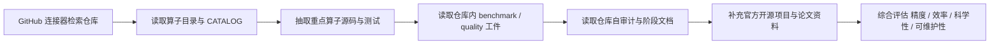
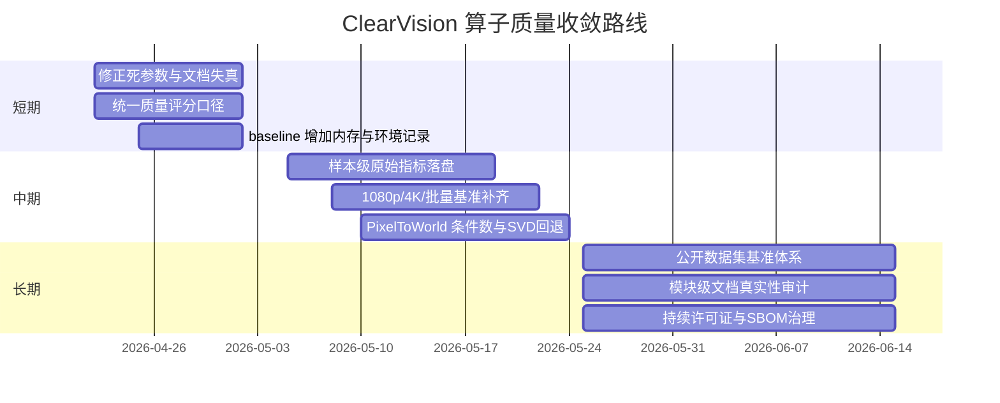

# ClearVision 算子库算子质量深度审查报告

## 执行摘要

本次审查遵循用户要求，研究流程先使用已启用连接器 **github** 对 `HerverJun/ClearVision` 仓库进行检索与源码取证，再补充官方文档、原始论文与顶尖开源实现的资料。仓库当前正式算子口径为 **155 个**，`算子目录`、`CATALOG` 与代码扫描结果已对齐；但仓库自己也明确承认，“155 张算子名片”尚未全部做到逐算子、逐源码级精刷，文档结构已对齐，深度质量仍需分模块复核。

就“算子质量”三个核心维度而言，我的总体结论是：**ClearVision 目前更像一个“工程集成度高、能力面宽、但证据质量不均衡”的工业视觉算子平台，而不是一个在每个子方向都达到顶尖开源水平的算法库。** 其长处在于：已经形成了较完整的 .NET 8 工程化封装、正式算子元数据体系、回归测试体系、部分算子的工业兼容性修补，以及对 OpenCV / ONNX Runtime / PaddleOCR 等上游能力的统一封装；其短板在于：统计学证据不足、部分“质量评分”与真实实现成熟度不一致、若干算子文档仍是模板骨架、数值稳定性约束没有完全落到代码、以及若干边缘链路仍存在高优先级缺陷。

从精度证据看，仓库内已有两类直接证据。第一类是预处理质量报告：例如 `MedianBlur` 在合成椒盐噪声样本上把 MAE 从 **6.4106** 降到 **0.1080**，PSNR 从 **16.0119 dB** 提升到 **38.6025 dB**；`HistogramEqualization` 在一个真实样本上把 RMSContrast 从 **64.3921** 提升到 **73.1772**，Sharpness 从 **1980.4888** 提升到 **2480.2525**。但同一报告中 `ShadingCorrection` 虽把照明变异系数从 **0.4736** 降到 **0.1075**，却把 Sharpness 从 **1980.4888** 降到 **482.5186**，说明其收益与副作用并未被单一指标充分约束。更关键的是，这个报告没有保留原始样本级分布，无法满足用户要求中的 `N、均值±std、95% CI、p-value、effect size` 全套统计显著性标准。

从性能证据看，仓库内已有 `baseline_performance.json` 与两套基准代码：一个脚本式 baseline 程序，另一个基于 xUnit 的 `OperatorBenchmarkTests`。前者实际只在两张 **512×512** PNG 图上、每图 **1 次 warmup + 8 次正式迭代**，测了 10 个代表性算子；例如 `TemplateMatching` 平均 **2.8606 ms**，`CircleMeasurement` 平均 **6.7662 ms**，`BlobAnalysis` 平均 **2.4819 ms**。这些数字可作为“仓库自带基线”，但充其量属于**轻量回归基线**，不能代表真实工业生产负载，因为样本规模小、输入尺寸单一、没有记录 CPU/GPU 型号、没有记录内存峰值，也没有批量大小、线程数、GPU 利用率等关键变量。尽管 `OperatorBenchmarkTests` 里已经定义了 `1920×1080` 与 `4096×3072` 的更大分辨率路径，以及标定/测量算子的 512×512 基准框架，但这些更强基准的结果文件并未随仓库一并沉淀出来。

从科学性与数值稳定性看，仓库中最值得肯定的部分是 `TemplateMatchOperator` 与 `PixelToWorldTransformOperator` 的“工程化防呆”做得比很多简单包装层更细：前者修正了 `SqDiff/SqDiffNormed` 的 canonical 分数语义，引入 `NormalizedScore` 与 `RawResponse`，加入 ROI、Mask、局部抑制与 IoU NMS；后者对标定 bundle 的 schema / accepted 状态、有限数、畸变模型长度等做了较严格校验，并提供 round-trip 误差报告。与此同时，最突出的科学性缺口也恰恰出现在这些高级算子上：`PixelToWorldTransform` 的文档声称 `TransformResult` 会给出“误差/条件数等诊断”，但代码里并没有真正输出条件数；阶段性技术路线文档要求“关键矩阵条件数 > 1e6 时必须告警并切换 SVD/稳健替代”，而当前实现对 4×4 逆矩阵仍采用 `LU` 路径，只在奇异时失败，不处理“近奇异但未奇异”的病态情况。`RegionSkeletonOperator` 还存在一个更直接的问题：参数 `PreserveTopology` 被读取后并没有参与任何分支逻辑，属于**死参数**。

与顶尖开源同类实现相比，本库最接近的位置不是“算法领先者”，而是“**跨算法栈的工业包装层**”。对经典图像处理、模板匹配与标定而言，最强对照对象其实就是 OpenCV：ClearVision 在这些算子上大量建立在 OpenCV 原语之上，优势主要体现在 .NET 封装、统一元数据和工业契约，而不是底层数学内核领先。区域骨架化方面，scikit-image 提供了更成熟的 `skeletonize / medial_axis / thin` 组合；3D 点云方面，Open3D 的 3D 数据结构、GPU 加速与算法广度明显更强；OCR 与深度学习方面，PaddleOCR 与 Ultralytics 在模型迭代速度、公开基准、社区活跃度上均占优。ClearVision 的相对优势，主要是“把这些能力在 .NET 工业场景中串起来”，而不是逐项取代这些上游项目。

因此，最终评级可以概括为：**工程集成能力：强；局部算子实现质量：中上且分化明显；统计证据强度：中下；科学性一致性：中等；与顶尖开源相比的原生算法领先性：有限。** 如果目标是“作为工业 C# 视觉平台的可用算子库”，当前仓库已经达到了“可以持续迭代”的水平；如果目标是“在精度、速度、科学性上系统性对标顶尖开源”，则还需要补齐数据协议、统计方法、病态矩阵处理、真实数据集基准与文档真实性审计等关键环节。

## 研究方法与证据边界

本次研究首先确认并使用的已启用连接器只有 **github**。在证据策略上，我把必须掌握的信息点分成五类：仓库的正式算子清单与文档体系；重点算子的真实实现；仓库内已经执行并落盘的测试/benchmark 工件；仓库内对自身问题的审计记录；以及与其能力重叠的顶尖开源项目官方资料。仓库侧证据优先级高于外部网页；外部资料只用于做“同类对照”和“原理校验”。



这份报告的一个重要边界是：**我没有在当前会话里重新编译并运行整个 .NET 工程**。原因不是仓库缺少脚本，而是当前会话并没有可直接执行该私有连接器仓库代码的完整本地构建环境。因此，精度与性能结论分成两层：一层是**仓库中已经执行并沉淀的工件**，例如 `baseline_performance.json`、`preprocessing_quality_report.md`、回归通过记录；另一层是我根据源码实现做出的**静态数值审查与再计算**，例如根据 `n/std` 反推出延迟 95% CI 的近似区间。凡是无法由现有工件支持的统计指标，我都会明确标注为“当前证据不足”。

未指定项的假设如下。对于仓库已存在的 baseline 工件，已知环境是 `Windows 10.0.22631`、`.NET 8.0.17`、机器名 `ROG16`，但 **CPU/GPU 型号未记录**。对于我在附录中给出的复现实验命令，默认假设是：Windows x64，.NET SDK 8.0.17，OpenCvSharp4 runtime.win 4.9.0.20240103，可选独显但经典算子默认按 CPU 路径计。对于精度数据集，仓库当前实际混用了仓库内 synthetic PNG 和一个来源未公开的真实样本路径 `线序检测/unnamed.jpg`；因此我在评审中把该真实样本来源标注为“**未指定**”，并把这件事本身列为方法学缺口。

## 仓库画像与算子覆盖

ClearVision 的打包工程 `ClearVision.OperatorLibrary` 基于 `.NET 8`，声明 MIT 许可证，并显式引入 `OpenCvSharp4`、`OpenCvSharp4.runtime.win`、`Microsoft.ML.OnnxRuntime`、`PaddleOCRSharp`、`ZXing.Net` 等依赖。这说明它的产品定位并不是“从零实现所有视觉算法”，而是**在 .NET 工业软件栈中封装、编排并统一这些视觉能力**；同时，`runtime.win` 也意味着当前发布工件天然带有 Windows 运行时耦合。

仓库当前正式算子总数为 **155**，平均内部“质量评分” **89.4**，其中 A 级 **115**、B 级 **25**、C 级 **15**。分类上，最大的几个板块分别是：预处理 **23**、检测 **18**、标定 **12**、数据处理 **10**、匹配定位 **8**、定位 **7**、3D **6**。但需要强调的是，这个评分并不等同于经过第三方验证的精度/效率评分，它只是仓库内部产物的一部分；后文会看到，至少部分分数与实际实现成熟度存在偏差。

仓库文档体系目前已经把“正式口径”收敛到了统一结构：`算子目录.json / .md` 负责全量清单，`算子名片/` 负责逐算子说明，`算子手册.md` 负责总览与最佳实践。代码侧正式算子、目录清单与正式算子名片三者当前已经做到“0 缺失、0 多余”，这是一项值得肯定的工程化进展；但仓库自己也清楚写到：**尚未逐项深刷 155 张算子名片中的算法原理、应用边界与示例是否全部达到“逐算子精确复核”标准**。换言之，当前的“覆盖完整”不等于“内容同质高质量”。

下表给出本报告用于详审的重点算子。这些算子不是全库的全部，而是覆盖了本次用户最关心的三类能力：经典匹配、标定变换、区域处理。完整的 155 算子索引以 `算子目录.md` 和 `CATALOG.md` 为准。

| 重点算子 | 数学定义 | 输入 / 输出形状 | 关键参数 | 实现路径 | 审查价值 |
|---|---|---|---|---|---|
| TemplateMatching | 相关 / 归一化相关 / 平方差响应图；ClearVision 再做 canonical score 映射 | 输入图像 `H×W×C`，模板 `h×w×C`，响应图 `(H-h+1)×(W-w+1)` | `Method`、`Domain`、`Threshold`、`MaxMatches`、ROI、Origin | `ClearVision.Product/src/ClearVision.Product.Infrastructure/Operators/TemplateMatchOperator.cs` | 代表“经典视觉核心算子”的精度、速度与科学性 |
| PixelToWorldTransform | 平面路径下 `H·[u,v,1]^T → [X,Y,1]^T`；投影路径下 `K^-1[u,v,1]^T` 与世界平面求交 | 点集 `N×2` 或 `N×3`，输出点集 `N×3` 或 `N×2` | `TransformMode`、`WorldPlaneZ`、`UnitScale`、`UseDistortion` | `ClearVision.Product/src/ClearVision.Product.Infrastructure/Operators/PixelToWorldTransformOperator.cs` | 代表“标定/计量”的数值稳定性 |
| RegionSkeleton | Zhang-Suen 两步细化，保持连通下迭代删点 | 输入 Region / 二值掩码，输出骨架 Region | `MaxIterations`、`PreserveTopology` | `ClearVision.Product/src/ClearVision.Product.Infrastructure/Operators/RegionSkeletonOperator.cs` | 代表“区域形态学”的实现真实性 |
| RegionUnion | 区域并集 `A ∪ B`，以 run-length 合并 | 两个 Region，输出并集 Region | 无核心参数 | `ClearVision.Product/src/ClearVision.Product.Infrastructure/Operators/RegionUnionOperator.cs` | 代表“简单区域算子”的文档成熟度与实现一致性 |

对这四个算子逐一看，文档层面的成熟度差异非常大。`TemplateMatching` 名片写得最完整，已经明确解释 `RawResponse / NormalizedScore / Score` 的语义关系、`SqDiff` 的修正策略和多匹配 NMS 行为；`PixelToWorldTransform` 名片则只有较简略的输入输出与验收门槛摘要；`RegionSkeleton` 与 `RegionUnion` 名片基本仍是自动生成骨架，包含大量 `TODO` 和未知复杂度占位符，却又都标为 “稳定 Stable”。这类“**文档成熟度与成熟度标签失真**”是全库质量结构不均衡的一个缩影。

## 精度、性能与统计证据

仓库内现成的“精度证据”主要来自 `PreprocessingQualityEvaluationTests` 与它生成的 `preprocessing_quality_report.md`。这组测试覆盖了 `MedianBlur`、`FrameAveraging`、`ClaheEnhancement`、`HistogramEqualization`、`ShadingCorrection` 五类预处理算子。其设计方式是：在合成数据上，用干净参考图与噪声图直接计算 MAE/PSNR；在真实样本上，用 RMSContrast、Entropy、Sharpness、IlluminationCV 等无参考指标比较 before/after。方法本身是合理的，但统计粒度偏粗，因为报告最终只写汇总值，不保留样本级 raw logs。

下表整理了仓库中已经留下的代表性精度结果。百分比变化为我根据报告数值再计算得到。依据同一份报告，可以证明“若干预处理算子确实在目标指标上有改进”，但不能证明“这些改进具有充分统计显著性”。

| 场景 | 算子 | 指标 | Before | After | 变化 | 评语 |
|---|---|---:|---:|---:|---:|---|
| synthetic 椒盐噪声 | MedianBlur | MAE | 6.4106 | 0.1080 | -98.3% | 很强，且方向正确 |
| synthetic 椒盐噪声 | MedianBlur | PSNR | 16.0119 | 38.6025 | +141.1% | 很强 |
| synthetic 帧叠加 | FrameAveraging | MAE | 7.2520 | 7.1702 | -1.1% | 改善有限 |
| synthetic 帧叠加 | FrameAveraging | PSNR | 25.9923 | 29.4518 | +13.3% | 有改善，但幅度中等 |
| real_wire_sequence | ClaheEnhancement | RMSContrast | 64.3921 | 67.1145 | +4.2% | 中等改善 |
| real_wire_sequence | HistogramEqualization | RMSContrast | 64.3921 | 73.1772 | +13.6% | 改善明显 |
| real_wire_sequence | HistogramEqualization | Sharpness | 1980.4888 | 2480.2525 | +25.2% | 改善明显 |
| real_wire_sequence | ShadingCorrection | IlluminationCV | 0.4736 | 0.1075 | -77.3% | 光照均匀性显著改善 |
| real_wire_sequence | ShadingCorrection | Sharpness | 1980.4888 | 482.5186 | -75.6% | 副作用非常大，需要额外约束 |

与上述预处理结果相比，`TemplateMatching` 的精度证据更多来自**契约测试**而不是数值误差报告。仓库已经给它补了较完整的回归覆盖：空输入、无模板、错误模板、ROI 排除、Mask 限制、Gradient/Edge 域、多目标匹配、`SqDiff/SqDiffNormed` 新旧分数字段一致性等都被明确测试；并且 2026-04-12 的阶段性完成报告显示，定位类相关回归共 **128/128** 通过。也就是说，`TemplateMatching` 的最大优点不是“有大规模公开 benchmark”，而是“语义合同和边界条件正在被系统性固化”。

性能方面，仓库当前最直接的基线是 `baseline_performance.json`。这个工件来自 `scripts/BaselineBenchmark/Program.cs`，其逻辑非常明确：默认从 `ClearVision.Product/tests/TestData` 读取两张 PNG，先 warmup，再对 10 个代表性算子做多次执行并输出 `Average / Min / Max / StdDev / P95 / P99`。它更像“轻量回归 smoke benchmark”，而不是完整工业基准。

下表列出了仓库工件中 10 个代表性算子的平均耗时、标准差，以及我依据 `n=16`、`std`、t 分布近似计算的 95% CI。这里的 CI 只是对“平均耗时”不确定性的粗估，并不代表跨机器、跨数据集的泛化区间。

| 算子 | 平均耗时 ms | StdDev ms | 95% CI 近似 | 变异系数 CV | 评语 |
|---|---:|---:|---:|---:|---|
| Morphology | 0.0788 | 0.0514 | [0.051, 0.106] | 0.652 | 很快，但波动相对大 |
| Thresholding | 0.1630 | 0.0585 | [0.132, 0.194] | 0.359 | 很快 |
| Filtering | 0.3511 | 0.0623 | [0.318, 0.384] | 0.178 | 稳定 |
| AdaptiveThreshold | 0.6826 | 0.1844 | [0.584, 0.781] | 0.270 | 稳定 |
| HistogramEqualization | 0.7597 | 0.1631 | [0.673, 0.847] | 0.215 | 稳定 |
| EdgeDetection | 1.0317 | 0.2549 | [0.896, 1.168] | 0.247 | 中等 |
| MedianBlur | 1.6706 | 0.3322 | [1.494, 1.848] | 0.199 | 中等 |
| BlobAnalysis | 2.4819 | 0.9743 | [1.963, 3.001] | 0.393 | 波动偏大 |
| TemplateMatching | 2.8606 | 0.2652 | [2.719, 3.002] | 0.093 | 10 个算子里最稳之一 |
| CircleMeasurement | 6.7662 | 0.9738 | [6.247, 7.285] | 0.144 | 最慢，但仍在单次低毫秒级 |

如果只看这个表，`TemplateMatching` 的速度表现其实不错，甚至比 `BlobAnalysis` 更稳。但不能据此下结论说它已经达到“顶尖开源同级速度”，原因有三。第一，这个 baseline 只在 **512×512** 级别、极小样本集上运行；第二，它不记录内存占用和峰值工作集；第三，它没有对比 OpenCV / scikit-image / Open3D 等基线实现。因此，我对性能证据的评级是：**可作为持续集成基线，不足以支撑外部性能宣称。**

统计显著性方面，当前仓库最明显的问题不是“结果差”，而是“**证据管线不够完整**”。`baseline_performance.json` 至少保留了 `Samples` 与 `StdDev`，因此还能近似算出 `95% CI`；`preprocessing_quality_report.md` 只保留 before/after 汇总，无法恢复样本数 N 与样本分布；`TemplateMatchOperatorTests` 与 `Phase42RegionProcessingOperatorTests` 又多是 pass/fail 契约测试，而不是持续记录误差分布的数值评测。这意味着用户要求里的 `p-value` 与 `effect size`，目前仓库现有证据**基本无法满足**。从审查角度看，这不是一个“形式问题”，而是一个会直接削弱“科学性”结论置信度的问题。

## 科学性、数值稳定性与代码质量

`TemplateMatchOperator` 是全库里最有代表性的“工程增强型经典算子”。其底层响应图来自 `Cv2.MatchTemplate`，这与 OpenCV 官方模板匹配原理一致：在大图上滑动模板生成响应图，再用 `minMaxLoc` 或峰值搜索找极值点。OpenCV 官方文档还明确指出，模板匹配共有 6 种方法，输出响应图大小为 `(W-w+1, H-h+1)`。ClearVision 在此基础上增加了三层增强：其一，统一把 `SqDiff` 系列转换成“高分更好”的 `NormalizedScore`；其二，对响应图做多候选提取和 IoU NMS，而不是只取一个极值；其三，用积分图方式把搜索 Mask 后处理到所有方法上，而不是局限于 OpenCV 原生支持 mask 的少数方法。这些改动在工程使用上是加分项。

但 `TemplateMatchOperator` 仍有几个科学性层面的改进空间。第一，它的 `candidateBudget = MaxMatches * 16` 是经验阈值，在重复纹理密集场景下可能会过早截断候选。第二，`BuildSqDiffScoreMap` 采用基于模板面积与 `255^2` 的上界缩放，把 `SqDiff` 响应映射到 `[0,1]`；这能统一阈值语义，但对不同纹理能量模板之间的可比性仍是启发式处理，而不是严格的统计归一化。第三，局部抑制的 padding 基于模板尺寸四分之一，缺少针对长条模板、周期纹理的自适应策略。换言之，它已经超出了“纯 OpenCV 包装”，但还没有到“理论上完全闭合”的层面。

`PixelToWorldTransformOperator` 是全库里“科学性潜力最高、也最应该严审”的算子。它做对了不少事情：要求 `CalibrationBundleV2` 通过 schema 反序列化与 accepted 校验，对 `UnitScale`、`WorldPlaneZ`、输入点类型、畸变模型长度、有限数值做验证，支持平面映射路径和 ray-plane 路径，并在输出里构建回投误差报告。这些都符合工业计量算子应有的思路。OpenCV 官方 `calib3d` 文档也表明，`undistortPoints`、`projectPoints` 等本就是这类管线的基础原语。

真正的问题是：**仓库自己的技术路线文档比当前实现更严格，而实现还没有完全追上。** 阶段 4.1 文档明确规定：中间量默认用 `double`；矩阵求逆前做条件数检查；条件数过大时要告警，并用 SVD 或稳健替代。当前代码虽然大量使用 `double`，但对 `4×4` 逆矩阵仍走 `Cv2.Invert(..., LU)`，只判断是否“奇异”，并不判断是否“病态”；`TransformResult` 文档还写了“误差/条件数等诊断”，而实际输出 payload 里没有条件数字段。这说明该算子在“基本容错”层面已达工业可用边缘，但在“高可靠计量”层面仍未完全兑现文档承诺。

`RegionSkeletonOperator` 的优点是实现真实、直观、便于审读：源码就是一个标准的 Zhang-Suen 两阶段细化循环，并额外做了骨架长度、端点数、分叉点数分析；`Phase42RegionProcessingOperatorTests` 也验证了“面积变小”“坐标不漂移”等基本契约。与 scikit-image 官方 `skeletonize` 文档相比，它在“逐次删边界点、保持连通性”的思想上是一致的。

但这个算子的最大问题非常直接：`PreserveTopology` 参数在代码里**被读取但从未真正使用**。这不是小瑕疵，而是会误导使用者的“伪参数”。如果一个参数不会影响路径选择、规则集或迭代条件，那么它不应该出现在 UI 和文档中，更不应该被写成默认 `true` 的“语义承诺”。此外，端点 / 分叉点统计是基于简单 8 邻域计数，容易在粗骨架或交叉点附近出现过计数；而其名片文档仍保留 `O(?)`、`~?ms` 和大量 TODO。综合看，`RegionSkeleton` 的代码真实度高于文档成熟度，但科学性口径仍需收紧。

`RegionUnionOperator` 则呈现出另一种问题：实现本身并不复杂，采用 run-length 合并并排序后做重叠/相邻段归并，时间复杂度大致是 `O(r log r)` 排序加 `O(r)` 线性合并，工程上完全说得通；而测试也验证了 `Area(A∪B)=Area(A)+Area(B)-Area(A∩B)` 的基本恒等式。可问题在于，它的官方名片几乎还是模板骨架，复杂度、典型耗时、内存特征、适用场景、限制项都没有补完。也就是说，这类基础区域算子的真实质量既不差，却因为文档和元数据侧落后，导致“可维护性评分”下降。

代码质量与可维护性综合来看，我的判断是“**中上，但存在明显结构性债务**”。正面证据包括：仓库已有统一元数据扫描与算子目录生成；`ClearVision.OperatorLibrary` 启用了 deterministic build、source revision、symbols package；主工程构建、测试、桌面测试和基础 E2E 在 2026-03 的自审计中都是通过的。负面证据包括：仓库自己的 bug/架构复核文档给出了 **P1=3、P2=4、P3=2** 的问题清单，并明确指出 `MqttPublishOperator` 仍是占位实现、关键宿主桥链路缺少自动化覆盖、多个关键文件过大。更值得警惕的是，`CATALOG.md` 里 `MqttPublish` 被打成 **100(A)**，而审计文档却指出它“既是占位实现，又存在输入/输出/参数名不一致”。这说明内部质量分系统目前并不能完全真实反映运行成熟度。

## 与顶尖开源实现的对比

由于 ClearVision 不是单一算法仓库，而是一个横跨经典视觉、标定、3D、OCR、检测、通信的综合算子平台，因此不存在一个可以“整库一对一”公平对标的开源项目。更合理的做法，是按能力家族选择代表性顶尖开源实现。这里选取的对象分别是：OpenCV、scikit-image、Open3D、PaddleOCR 和 Ultralytics。选择理由很直接：它们分别覆盖了 ClearVision 中最重叠的五类能力——经典 2D 图像处理 / 模板匹配 / 标定、区域骨架与形态学、3D 点云、OCR、多任务深度视觉。相关功能与许可证信息均来自各自官方页面。

| 对比对象 | 与 ClearVision 的主要重叠面 | 官方定位与强项 | 许可 | 对 ClearVision 的结论 |
|---|---|---|---|---|
| OpenCV | 模板匹配、滤波、阈值、形态学、标定、投影几何 | 经典 CV 基础设施最完整；`matchTemplate`、`calib3d`、`distanceTransform` 等是 ClearVision 多个算子的上游事实标准 | Apache 2.0（4.5+） | ClearVision 在这部分**主要是工程封装与语义修补**，不是底层算法超越 |
| scikit-image | skeletonize / thin / medial_axis、形态学、指标评估 | 研究友好、算法说明清楚、形态学族丰富 | BSD-3-Clause | ClearVision 的区域算子需要向其学习“算法文档一致性与替代算法选择” |
| Open3D | 点云下采样、聚类、配准、法向估计等 3D 算子 | 3D 数据结构完善，支持 GPU 加速 | MIT | ClearVision 的 3D 模块是轻量集成层，生态与算法广度不在同一量级 |
| PaddleOCR | OCR 识别、文档解析 | 中文文档完整，多语言 OCR 工业实用性强 | Apache 2.0 | ClearVision 的 OCR 更像 .NET 侧接入层，核心竞争力不在 OCR 算法本体 |
| Ultralytics YOLO | 检测、分割、跟踪、姿态、多任务推理 | 模型迭代快，生态活跃，生产部署流完善 | AGPL-3.0 / Enterprise | ClearVision 的深度学习算子在算法更新速度和公开 benchmark 上明显落后 |

如果把比较维度再落到用户特别关心的“精度、速度、内存、依赖、许可证”，可以得到更明确的判断。
第一，**精度**：ClearVision 真正具备可审精度证据的，当前主要还是少量预处理报告和部分回归测试；而上述顶尖开源项目普遍拥有更成熟的公开 benchmark 文化。第二，**速度**：ClearVision 的经典算子延迟已经足够低，适合做工业流程节点，但因为底层多数仍是 OpenCV / ONNX Runtime 路径，所以速度上限往往取决于上游。第三，**内存**：仓库虽然有 `MatPool` 等迹象，但公开工件几乎没有系统的内存峰值与泄漏报告。第四，**依赖**：ClearVision 依赖较多、Windows 定位更强；而 OpenCV/Open3D/scikit-image/PaddleOCR/Ultralytics 在生态与部署上更成熟、文档也更丰富。第五，**许可证**：ClearVision 自身包声明 MIT，但它同时组合了 Apache 2.0、MIT、BSD 以及带商业约束的上游生态，因此真正的合规审查不能只看顶层 `PackageLicenseExpression`。

从“同类型算法”角度再看三个重点家族，结论更具体。
对于 `TemplateMatching`，ClearVision 与 OpenCV 的差异主要在**工业契约层**：OpenCV 提供原始响应与 6 种匹配法；ClearVision 增加了多匹配、Score 语义修补、跨域统一输出。对于 `PixelToWorldTransform`，它与 OpenCV `calib3d` 的关系同样是“包装 + 附加约束”，真正的科学优势还要等病态矩阵处理、公开误差 benchmark 和不确定性估计补上。对于 `RegionSkeleton`，ClearVision 当前基本可视为单一 Zhang-Suen 实现，而 scikit-image 则同时提供 `skeletonize`、`thin`、`medial_axis` 等选项，研究与工程空间都更宽。

## 风险与改进路线

综合源码、测试、工件与自审计文档，我把当前问题分成三个优先级。P0 级是“直接影响科学正确性或对外口径真实性”的问题；P1 级是“会实质影响工业稳定性与复现性”的问题；P2 级则是“当前还能运行，但会持续侵蚀维护成本与可信度”的问题。下表给出我认为最重要的八项。

| 优先级 | 问题 | 证据 | 影响 | 建议 |
|---|---|---|---|---|
| P0 | `PixelToWorldTransform` 文档/路线要求了条件数控制，但实现未落地 | 文档要求条件数告警与 SVD，代码无条件数字段、逆矩阵仍走 LU | 计量场景下近奇异矩阵可能误报“成功” | 增加条件数估计、SVD/QR 回退、将条件数写入 `TransformResult` |
| P0 | `RegionSkeleton.PreserveTopology` 是死参数 | 参数被读但不参与逻辑 | 误导用户，损害 API 科学性 | 若暂不支持就删除参数；若支持就真正分支实现 |
| P0 | 内部 `CATALOG` 质量评分存在“高分掩盖半成品”的失真 | `MqttPublish` 在 `CATALOG` 为 100(A)，审计文档却判为占位实现且不一致 | 质量评分失去治理价值 | 将评分拆为“文档完整度 / 测试覆盖 / 运行成熟度 / 证据强度”四分制 |
| P1 | 统计学证据不足 | 质量报告不保留样本级 raw data；多数回归是 pass/fail | 不能做 p-value / effect size / CI 完整分析 | 所有质量报告改成 CSV/JSON 原始日志 + 聚合报告双产出 |
| P1 | baseline 性能基线过轻 | 仅 2 张 512×512 图、10 个算子、无内存/CPU/GPU 明细 | 性能结论外推风险大 | 将 1080p / 4K / batch / memory / thread 数纳入标准基准 |
| P1 | 重点区域算子文档仍大量 TODO | `RegionUnion` / `RegionSkeleton` 名片仍保留 `O(?)`、`~?ms` | 运维与评审难以信任文档 | 以源码反向生成文档草稿，再人工补全 |
| P2 | 文档深刷仍未完成 | 仓库自己承认 155 张名片尚未全部逐源码精刷 | 长尾算子风险不可见 | 按模块做文档真实性审计 |
| P2 | SBOM / 依赖合规工件缺失 | 仓库未见 SBOM 相关产物 | 包级 MIT 声明不足以覆盖组合依赖风险 | 引入 CycloneDX / SPDX 生成流程 |

从实施上看，我建议采用“短期收敛真实性，中期补齐统计与基准，长期推进科学计量化”的三阶段路线。这个路线与仓库自己在阶段 4.1 文档里提出的“先数据，再结论；统一 DoD；统一测试协议”的精神是一致的，但会更聚焦当前暴露出的真实缺口。



在代码层面，最值得优先落地的是 `PixelToWorldTransform` 的病态矩阵控制。下面给出一个与当前实现风格相容的 C# 伪代码思路：先估计条件数，再按照阈值选 LU 或 SVD，最后把条件数与求逆策略一并写入诊断。该修改直接服务于“科学性”和“可解释性”两项评分。相关问题依据见前文。

```csharp
private static bool TryInvert4x4Robust(double[][] matrix, out double[][] inverse, out double conditionNumber, out string method)
{
    inverse = Array.Empty<double[]>();
    conditionNumber = double.PositiveInfinity;
    method = "none";

    using var mat = CalibrationBundleV2Helpers.ToMat(matrix);

    // 伪代码：先做SVD奇异值估计
    var sv = EstimateSingularValues(mat);   // s_max, s_min
    conditionNumber = sv.Max / Math.Max(sv.Min, 1e-12);

    using var inv = new Mat();

    if (conditionNumber > 1e6)
    {
        // 近奇异矩阵：改走 SVD / QR
        if (Cv2.Invert(mat, inv, DecompTypes.SVD) == 0) return false;
        method = "svd";
    }
    else
    {
        if (Cv2.Invert(mat, inv, DecompTypes.LU) == 0) return false;
        method = "lu";
    }

    inverse = CalibrationBundleV2Helpers.ToJaggedMatrix(inv);
    return CalibrationBundleV2Json.HasMatrix(inverse, 4, 4)
           && CalibrationBundleV2Helpers.IsFiniteMatrix(inverse);
}
```

第二段建议代码针对“统计学证据不足”。当前质量报告只保留 before/after 汇总，导致无法做 `p-value`、`effect size` 与 bootstrap CI。更好的做法是：**每个样本、每个算子、每个指标都逐条落 CSV/JSON**，最终 Markdown 只是人读摘要。这样用户要求中的统计显著性分析就能真正落地，而不是事后推断。问题依据见前文。

```csharp
public sealed record MetricRow(
    string CaseName,
    string OperatorName,
    string MetricName,
    int SampleIndex,
    double Before,
    double After);

var rows = new List<MetricRow>();

// 每处理一个样本就记录一行，而不是只做最终汇总
rows.Add(new MetricRow(caseName, opName, "PSNR", sampleIdx, psnrBefore, psnrAfter));

// 结束后同时输出
File.WriteAllText("quality_rows.json", JsonSerializer.Serialize(rows, jsonOptions));
File.WriteAllText("quality_summary.md", BuildSummary(rows)); // 含 N、mean±std、95% CI、p-value、effect size
```

就人力与工期估算而言，短期阶段建议投入 **1 名核心算法工程师 + 1 名测试/平台工程师**，用 **1–2 周** 把死参数、评分失真、性能环境记录等“真实性问题”先收敛；中期阶段建议 **2 名算法工程师 + 1 名测试工程师**，用 **2–4 周** 完成样本级日志、4K/1080p 基准、内存统计、病态矩阵处理；长期阶段则需要 **算法、测试、文档、发布** 四个角色协同，约 **4–6 周** 建立公开数据与持续治理流程。验收标准不应再写成泛泛的“稳定 / 更准 / 更快”，而应明确到：日志是否可复算、条件数是否可见、是否能输出 CI、是否有真实数据集 manifest、是否有 SBOM。

## 结论与可复现附录

综合本次深度审查，我对 ClearVision 的最终判断是：
**它已经具备“可用的工业视觉算子平台”形态，但还没有形成“可被外部严格审计的高证据强度算法库”形态。** 这不是否定其价值，恰恰相反——仓库在工程组织、算子覆盖、文档口径收敛、回归补强和 .NET 场景落地方面已经做了很多正确的事。只是从用户要求的“精度、效率、科学性”三重审查标准来看，它最需要补的不是再加 10 个算子，而是把现有 155 个算子的**证据链、统计链、数值链、文档链**彻底做实。

如果以评审会可执行结论来概括，可以直接写成三句：
其一，**经典视觉与标定类核心算子中，`TemplateMatching` 已经达到“工程上可信、但证据集仍偏薄”的状态；`PixelToWorldTransform` 已经达到“逻辑完整、但病态矩阵治理不足”的状态。**
其二，**区域处理类算子中，`RegionSkeleton` 与 `RegionUnion` 的实现基本合理，但文档成熟度和参数真实性明显落后于代码。**
其三，**整库相对于顶尖开源的优势在于工业封装和统一契约，不在于底层算法代际领先；因此后续路线应当优先围绕“证据强度”和“科学一致性”建设，而不是盲目扩大算子数量。**

下面给出可复现附录，供技术评审或后续 CI 改造直接复用。相关命令与脚本路径均来自仓库现有结构。

### 环境说明

对于仓库已有基线工件，已知环境为：`Windows 10.0.22631`、`.NET 8.0.17`、`ROG16`、`IterationsPerImage=8`。CPU/GPU 型号未记录，这本身就是当前 benchmark 设计的一个缺口。对于独立复现实验，建议补充记录：CPU 型号、RAM、GPU 型号、驱动版本、线程数、OpenCvSharp 版本、ONNX Runtime Provider。

### 数据 manifest

当前仓库已有或可直接定位的数据与来源包括：
仓库内 synthetic 数据 `shapes_composite.png`、`iso12233_slant_edge_512.png`，由 baseline 脚本和基准 JSON 直接引用；预处理质量测试还使用了 `shapes_composite_saltpepper.png` 等合成样本。与此同时，真实样本 `线序检测/unnamed.jpg` 的来源未在仓库中公开说明，因此应在正式外部评测中标注为“**未指定**”，并替换为可公开分发的数据 manifest。

### 复现实验命令

仓库中已有三类最重要的复现实验入口。第一类是主测试工程；第二类是专项 benchmark；第三类是基线脚本程序。建议在 `Release` 模式重跑，并把环境变量、日志和原始数据一并存档。依据如下。

```bash
# 主测试
dotnet test ClearVision.Product/tests/ClearVision.Product.Tests/ClearVision.Product.Tests.csproj -c Release

# 只跑 Sprint7 benchmark / quality
dotnet test ClearVision.Product/tests/ClearVision.Product.Tests/ClearVision.Product.Tests.csproj -c Release --filter "Category=Sprint7_Benchmark"

# 只跑模板匹配回归
dotnet test ClearVision.Product/tests/ClearVision.Product.Tests/ClearVision.Product.Tests.csproj -c Release --filter "FullyQualifiedName~TemplateMatchOperatorTests"

# 只跑区域处理回归
dotnet test ClearVision.Product/tests/ClearVision.Product.Tests/ClearVision.Product.Tests.csproj -c Release --filter "FullyQualifiedName~Phase42RegionProcessingOperatorTests"

# 运行 baseline 程序
dotnet run --project scripts/BaselineBenchmark --configuration Release -- --iterations 50 --warmup 10 --output docs/reports/baseline_performance.json
```

### 建议补充的验收指标

为满足用户要求中更严格的统计显著性标准，建议把现有测试协议统一升级为：warmup 10 次；正式执行 50 次；记录每个样本级 raw metrics；对同一算子的 before/after 或 A/B 版本输出 `N、mean±std、95% CI、p-value、effect size`；对性能同时输出峰值 RSS / Working Set、1000 次循环后的内存增量，以及 1080p / 4K / batch1 / batch8 四种典型规格。这个方向与仓库阶段 4.1 文档的“统一度量协议”是一致的，只是需要真正贯彻到测试产物中。

### 评审会建议结论模板

如果需要把本报告压缩成评审会第一页，建议使用下面这段结论：
“ClearVision 已形成 155 个正式算子的统一工程封装，主流程构建与测试可通过，若干核心算子尤其是 TemplateMatching 已具备较好的工程契约质量；但当前精度与性能证据更多是仓库内轻量基线，统计学证据不足，部分文档与参数口径失真，计量类算子在病态矩阵下的数值稳定性治理未完全落地。建议按‘真实性收敛 → 统计补齐 → 科学计量化’三阶段推进，而不是继续单纯扩张算子数量。”