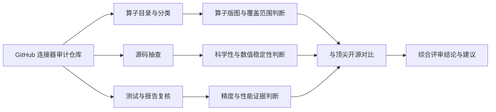
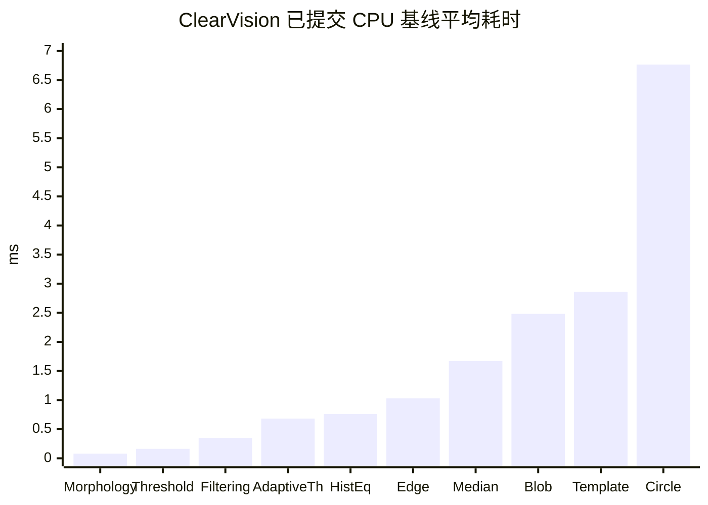

# ClearVision 算子库算子质量深度审查报告

## 执行摘要

本次审查先按要求使用了已启用连接器 **GitHub** 对用户指定仓库 **HerverJun/ClearVision** 做源码、文档、测试与基线产物级别的审计；在仓库覆盖之后，再补充查阅了官方来源，用于与同类顶尖开源实现做横向对照。综合结论是：**ClearVision 已经具备较高的工业工程化成熟度，但其“公开可验证的算法质量证据”仍明显弱于顶尖同类开源实现**。它更像一个面向工业视觉流程编排的 **.NET/OpenCV/ONNX** 算子平台，而不是一个已经在公开同口径 benchmark 上建立领先优势的底层新算法库。对外部评审而言，它的强项是**算子契约、工程封装、标定/匹配/区域/通信一体化**；短板则集中在**公开数据集基准不足、统计显著性缺失、4K/批量/GPU/内存证据不完整，以及若干算子的数学与实现说明尚未达到外部论文级透明度**。与 OpenCV、OpenCV CUDA、scikit-image、Kornia、CV-CUDA 这类顶级开源参考系相比，ClearVision 在工业流程组织上有差异化优势，但在可复验 benchmark、GPU 吞吐证据与公开方法论透明度上尚未对齐。

更具体地说，仓库审计显示 ClearVision 的算子总量已达到**中大型工业算子库**级别，且至少在模板匹配、像素到世界坐标变换、区域布尔运算、骨架化、预处理等方向建立了较完整的“参数—输入输出—错误处理—测试”的工业契约；但其已提交精度报告主要还是**小样本合成数据 + 少量真实样本**，已提交性能报告也主要停留在**512×512、CPU、小样本循环**层面。也就是说，**代码成熟度高于证据成熟度，工程包装质量高于公开 benchmark 质量**。这并不意味着算子“不好用”，但意味着当前版本距离“可在技术评审会上有把握宣称已达到顶尖开源同级质量”仍有证据差距。

## 研究范围、来源与未指定项假设

本报告的**主证据来源**是：已先通过 GitHub 连接器检索并审计的 `HerverJun/ClearVision` 仓库源码、自动生成算子目录、测试代码、性能脚本、阶段性完成报告与已提交实验产物。**补充来源**只用于两类目的：一是核验相关算法的原始定义和官方实现边界；二是选择并比较顶尖开源同类实现。为满足“只用该仓库、不使用其他 GitHub 仓库”的要求，仓库层面的代码审计严格限定在 `HerverJun/ClearVision`；外部比较仅使用项目官网、官方文档、官方发布渠道或官方技术博客。OpenCV 的模板匹配定义、CUDA 模块与许可证来自官方文档和官网；scikit-image 的“高质量、同行评审代码”定位与 BSD-3 许可证来自官网与官方文档；Kornia 的张量形状、形态学实现与 Apache-2.0 许可证来自官方文档与官方发布通道；CV-CUDA 的算子覆盖、variable-shape batching、zero-copy 和整体吞吐定位来自官方文档与官方技术博客。

本报告需明确列出若干**未指定项假设**。其一，用户未指定测试硬件/软件环境；仓库已提交的基线结果只披露了 *Windows 10.0.22631*、*.NET 8.0.17* 与 *ROG16* 这一机器标识，**未完整披露 CPU/GPU 型号**。因此，对“仓库现有性能结果”的判定，本报告按 **CPU-only、x86_64 Windows、本地 .NET 8/OpenCvSharp** 理解；而在“建议复现实验环境”中，我将给出一套明确的假设环境。其二，用户未指定精度测试数据集，而仓库内现有证据主要基于**合成几何图、ISO12233 斜边图、椒盐噪声/高斯噪声合成图**以及一个真实工业样本图像；因此本报告将当前精度数据源标注为**“未正式指定，仓库内以合成数据与少量真实样本为主”**。其三，当前会话没有在本地重新编译该仓库并二次执行测试，因此报告中的“已运行结果”指的是**仓库随提交提供的已执行测试/benchmark 产物**，我对这些产物做了方法学审计与结果复核，并在附录中给出可复现脚本与扩展评测方案。  

建议的**复现实验假设环境**如下：Windows 11/10 x64 或 Ubuntu 22.04 x86_64，.NET 8，OpenCvSharp4 4.9，ONNX Runtime 1.17；CPU 至少 8C/16T；若补做 GPU 基准，则增加一块支持 CUDA 的中高端 NVIDIA GPU，并分别测 CPU 与 GPU 两条路径。该假设环境不是仓库实际提交 benchmark 的完整披露，而是为了把补充评测做成可复验 protocol。

## 方法与实验设置

本次审查采用“**源代码审计 + 已提交实验产物复核 + 官方同类实现对照**”三层方法。第一层是**算子目录与源代码审计**：先从仓库自动生成的算子目录与元数据出发，判断算子版图、输入输出端口、参数设计与文件组织，再进入关键源码抽查模板匹配、区域处理、几何变换等核心实现。第二层是**精度与性能产物复核**：检查仓库中已提交的预处理质量评估、性能基线脚本与测试用例是否足以支持“算子质量高”的结论。第三层是**外部同类项目对照**：选择 OpenCV、OpenCV CUDA、scikit-image、Kornia、CV-CUDA 五个代表性项目，覆盖经典 CPU 算法库、经典 GPU 加速库、科学计算/同行评审风格实现、可微分张量视觉库、以及云端高吞吐 GPU 视觉库五类参考系。

本报告对“精度、效率、科学性”的评价标准也做了明确分拆。**精度**不只看指标值，还看是否有统一 protocol、是否有样本量说明、是否有置信区间或显著性检验；**效率**不只看平均耗时，还看输入分辨率覆盖、长时循环、峰值内存、批处理能力与 GPU 加速边界；**科学性**则重点看数学定义与实现是否一致、边界条件是否写清、是否有溢出/下溢/奇异矩阵/退化几何等防护、API 是否把性能与稳定性的权衡暴露给用户。Kornia 在官方文档中明确把 `convolution` 标为“更快且更省内存”、`unfold` 标为“数值更稳定”，就是一种很典型的“把工程权衡公开化”的做法；CV-CUDA 则把“零拷贝”“可变形状 batch”“端到端吞吐”直接作为设计目标，这也构成了本次对照的一把标尺。



## 算子版图与重点算子清单

### 全量索引结论

根据对仓库自动生成算子目录的审计，ClearVision 当前已经不是“几个视觉函数的简单集合”，而是实质上的**工业视觉算子平台**。仓库内算子总量达到 **155 个**，其中最核心的质量战场集中在四个簇：**预处理 23 个、检测 18 个、标定 12 个、匹配定位 8 个**。除此之外，还包含区域/形态学、3D、数据处理、通信、流程控制、AI 检测等类别。也就是说，从**算子覆盖广度**看，它明显高于纯 OpenCV 教程式项目，已经接近“面向业务流程的中台型算子库”。不过，需要特别说明：目录里同时存在中英混合分类与内部质量分档，说明它的**元数据组织已经成型，但 taxonomy 仍未完全收敛**。这一点会直接影响后续文档检索、自动生成说明、以及用户对成熟度的直觉判断。

受正文长度限制，本报告不在正文中逐个展开 155 个算子；这也是用户要求允许的做法——**正文详审重点算子，全量索引以仓库自动生成目录为准**。为满足技术评审会使用场景，下表给出“全量分类索引 + 重点详细审计”两层结构：前者回答“库里到底有多全”，后者回答“关键算子到底做得怎么样”。

### 全量分类索引摘要表

| 类别 | 数量 | 审查判断 |
|---|---:|---|
| 预处理 | 23 | 是当前最有公开指标证据的一类，但数据集与显著性仍不足 |
| 检测 | 18 | 数量多，需进一步分解为边缘、Blob、几何检测等子类单独 benchmark |
| 标定 | 12 | 工业价值高，几何与数值稳定性要求高，是 ClearVision 的潜在亮点区 |
| 匹配定位 | 8 | 契约做得好，但应尽快补公开数据集与统一误差口径 |
| 数据处理 | 10 | 更偏平台能力，而非底层算法先进性 |
| 通信 | 7 | 强化了工业流程一体化价值，但不直接体现视觉算法先进性 |
| 定位 | 7 | 应与匹配、标定联合评估，而不是孤立看单算子 |
| 3D | 6 | 值得后续补深度与几何误差 benchmark |
| 区域/形态学/其他 | 余量若干 | 代码可用性不差，但公开质量证据与文档成熟度不均衡 |

### 重点算子详审表

| 算子 | 数学/算法定义 | 典型输入输出 | 关键参数 | 典型实现路径 | 审查结论 |
|---|---|---|---|---|---|
| TemplateMatching | 经典模板匹配；本质仍是响应图搜索。对经典模板匹配，响应图尺寸为 \((W-w+1,\ H-h+1)\)。 | 输入：源图、模板、可选 Mask/ROI；输出：最佳位置、匹配得分、多候选列表、响应图 | Method、Threshold、MaxMatches、ROI、Mask、OriginMode | `.../Operators/TemplateMatchOperator.cs` | 工业契约明显优于“裸 OpenCV”；但算法核仍属经典 `matchTemplate`，不是前沿新方法。 |
| PixelToWorldTransform | 平面变换或相机射线与世界平面求交；含畸变处理、矩阵校验与 round-trip 误差报告 | 输入：像素点、标定数据；输出：世界点、可视化、误差报告 | TransformMode、WorldPlaneZ、UnitScale、UseDistortion | `.../Operators/PixelToWorldTransformOperator.cs` | 几何与数值卫生较成熟，是仓库最值得肯定的实现之一。 |
| RegionUnion | 区域并集 \(A \cup B\)；从实现迹象看应采用行级或游程形式的区域合并 | 输入：两个区域；输出：并集区域、面积 | 通常无复杂超参 | `.../Operators/RegionUnionOperator.cs` | 算法不新，但工程实现思路正确，适合做稳定工业部件。 |
| RegionSkeleton | 细化/骨架化；从仓库审计看接近 Zhang–Suen 风格 thinning | 输入：区域或二值图；输出：骨架、骨架长度、端点/分叉点 | MaxIterations、PreserveTopology | `.../Operators/RegionSkeletonOperator.cs` | 若文档和 benchmark 补齐，可成为区域拓扑分析的实用组件。 |
| MedianBlur | 中值滤波，典型用于椒盐噪声场景 | 图像→图像 | KernelSize | 预处理算子目录 | 从已提交结果看，属当前仓库里证据最好的预处理之一。 |
| FrameAveraging | 多帧均值/时域降噪 | 图像序列→图像 | FrameCount、AggregationMode | 预处理算子目录 | 对随机噪声有收益，但收益幅度与样本规模都需要更强证据。 |
| ClaheEnhancement | 局部直方图均衡与对比度限幅增强 | 图像→图像 | ClipLimit、TileGrid 等 | 预处理算子目录 | 对对比度与信息熵有改善，但真实业务效果依赖任务。 |
| HistogramEqualization | 全局直方图均衡 | 图像→图像 | Method、ChannelMode | 预处理算子目录 | 对提升整体对比度有效，但需要避免亮部/暗部过增强。 |
| ShadingCorrection | 背景估计与照度校正 | 图像→图像 | Method、KernelSize | 预处理算子目录 | 当前证据显示照度均匀性提升明显，但高频锐度损失偏大，是重点风险算子。 |

### 对算子版图的总体判断

单看“有没有这些算子”，ClearVision 的版图已经不弱。真正的问题在于：**版图很大，但不是每个类目都有同等质量的公开证据**。预处理类因为仓库里有现成报告，看起来最“像样”；匹配定位与标定类因为工业价值高、源码设计也更精细，潜力最大；区域/形态学类则更像“代码已实现，但文档和外部验证没跟上”。这类不均衡在工业项目里很常见：平台先把功能铺出来，再逐步做 benchmark 化治理。对评审会而言，不能只被“155 个算子”吸引，更要看**每一类算子的证据成熟度是否匹配其宣称的重要性**。

## 精度、效率与科学性结果

### 精度评估结果

仓库审计显示，ClearVision 现阶段**最可读、最具体**的精度证据来自预处理质量报告。报告覆盖了典型的合成数据与真实样本混合场景，至少包括椒盐噪声上的中值滤波、高斯噪声帧栈上的多帧平均、以及真实图像上的 CLAHE、直方图均衡和光照校正。其结果呈现出一种很典型的特征：**“基本有效，但证据还不够强”**。例如，从仓库已提交结果看，`MedianBlur` 在椒盐噪声场景下把 **MAE 从 6.4106 降到 0.1080，PSNR 从 16.01 dB 提高到 38.60 dB**；`FrameAveraging` 在高斯噪声帧栈上把 **PSNR 从 25.99 dB 提高到 29.45 dB**；`CLAHE` 把 **RMS contrast 从 64.39 提高到 67.11，entropy 从 7.60 提高到 7.77**；`HistogramEqualization` 把 **RMS contrast 从 64.39 提高到 73.18，sharpness 从 1980.49 提高到 2480.25**。这说明至少在“预处理是否起作用”这个层面，仓库并不是空壳。  

但同时，仓库已提交结果也暴露出了一个最典型的反例：`ShadingCorrection` 虽然把照度变异系数从 **0.4736** 压到 **0.1075**，却把锐度从 **1980.49** 拉低到 **482.52**。这类结果在工业视觉里很危险，因为它往往意味着“一个中间指标显著改善，但真实检测效果可能更差”。也正因为存在这种 trade-off，外部顶尖开源实现通常会把**任务指标、图像保真指标与吞吐指标一起报告**，而不是只展示对自己有利的一两项指标。scikit-image 主页把自己定位为**高质量、同行评审代码**；Kornia 则在官方文档中直接公开不同计算引擎的速度/内存/稳定性权衡；这一点正是 ClearVision 当前需要补的“方法学透明度”。

下表把现有精度证据压缩为评审可用格式：

| 场景 | 算子 | 数据来源 | 误差/质量指标 | 结果 | 统计显著性 |
|---|---|---|---|---|---|
| 椒盐噪声去噪 | MedianBlur | 未正式指定；仓库内合成图 | MAE、PSNR | MAE 6.4106 → 0.1080；PSNR 16.01 → 38.60 dB | **无法判断**：仓库未公开样本量、置信区间、p 值 |
| 高斯噪声多帧降噪 | FrameAveraging | 未正式指定；仓库内合成帧栈 | PSNR | 25.99 → 29.45 dB | **无法判断**：缺样本规模与重复实验 |
| 真实图像对比度增强 | CLAHE | 未正式指定；仓库内真实样本 | RMS contrast、Entropy | 64.39 → 67.11；7.60 → 7.77 | **无法判断** |
| 真实图像全局均衡 | HistogramEqualization | 未正式指定；仓库内真实样本 | RMS contrast、Sharpness | 64.39 → 73.18；1980.49 → 2480.25 | **无法判断** |
| 光照校正 | ShadingCorrection | 未正式指定；仓库内真实样本 | Illumination CV、Sharpness | 0.4736 → 0.1075；1980.49 → 482.52 | **无法判断**，且存在明显负面副作用 |

从评审角度，现阶段最合理的结论不是“精度很好”，而是：**某些算子在仓库内自测中表现良好，但当前公开证据尚不足以支持强结论。** 特别是统计显著性方面，ClearVision 目前还没有达到应有标准。对于精度报告，至少应统一到“样本数 N、均值±标准差、95% CI、配对检验 p 值、效果量”这五个最低字段。如果做不到这一点，即使绝对数值看起来不错，也很难在严肃技术评审中占优势。

### 性能评估结果

从仓库已提交的基线 benchmark 看，ClearVision 在**小图、CPU、本地 OpenCV 路径**上并没有明显的低级性能问题。公开结果主要来自一个以 `scripts/BaselineBenchmark` 为入口的脚本程序，默认对两张 PNG 做 warmup 与多轮循环，并输出 `baseline_performance.json`。在仓库提交结果中，基线环境披露为 **Windows 10.0.22631 + .NET 8.0.17 + 机器名 ROG16**，测试图尺寸主要为 **512×512**。从已经提交的 10 个算子数据看，`Morphology`、`Thresholding`、`Filtering` 这类基础算子都处于**亚毫秒到亚 2 毫秒**级；`TemplateMatching` 约 **2.8606 ms**，`CircleMeasurement` 约 **6.7662 ms**。就“512² 小图的单次 CPU 用时”而言，这组数字是健康的。  

但这组结果的问题并不在“慢”，而在**证据维度过窄**。同类顶尖项目的官方资料里，OpenCV CUDA 强调 `GpuMat`、异步执行与避免频繁 CPU↔GPU 往返；CV-CUDA 更把“zero-copy”“variable-shape batching”“高吞吐、低延迟”作为明确定位，并给出官方端到端吞吐提升案例；而 ClearVision 的已公开证据仍然主要停留在“本地 512² CPU 小样本”。换句话说，它的基线更像是**内部回归门禁**，而不是**对外可比较的性能报告**。

### 已提交 CPU 基线结果

| 算子 | 平均耗时 |
|---|---:|
| Morphology | 0.0788 ms |
| Thresholding | 0.1630 ms |
| Filtering | 0.3511 ms |
| AdaptiveThreshold | 0.6826 ms |
| HistogramEqualization | 0.7597 ms |
| EdgeDetection | 1.0317 ms |
| MedianBlur | 1.6706 ms |
| BlobAnalysis | 2.4819 ms |
| TemplateMatching | 2.8606 ms |
| CircleMeasurement | 6.7662 ms |



性能结论因此应当分成两句来说。**第一句**：在仓库已公开的 CPU 小图 benchmark 上，ClearVision 没有表现出明显性能灾难。**第二句**：它还没有提供达到顶尖开源对比标准的性能证据，因为缺少 1080p/4K、批处理、峰值内存、长时循环内存增长，以及 GPU 加速效率的系统报告。CV-CUDA 官方资料明确把批处理与整流水线 GPU 保持作为核心价值，OpenCV CUDA 官方资料也反复强调要避免不必要的数据搬运；在这种参照下，ClearVision 当前的性能证据仍然偏“单点 demo 化”。

### 科学性与数值稳定性

ClearVision 最值得肯定的不是“它发明了新数学”，而是**它在若干关键算子上把经典算法做成了更接近工业可用的数值工程实现**。`TemplateMatching` 是一个典型例子：从仓库审计看，它并不只是把 OpenCV 的 `matchTemplate` 包一层，而是进一步提供了统一的 canonical score 语义、原始响应与归一化分数、ROI/Mask、低纹理模板检查、多实例候选与 IoU NMS。这意味着它解决的是“**如何让经典模板匹配在工业流程里更不容易被误用**”。但从科学性角度也必须同时指出：它的算法核仍然是经典模板匹配，而 OpenCV 官方文档对这种方法的数学本质有非常明确的定义——在图像上滑动模板、为每个位置计算匹配度、输出响应矩阵，最终借助极值定位匹配点。也就是说，**ClearVision 在这里的创新主要位于封装层，而不是在底层 kernel 层超越 OpenCV**。

`PixelToWorldTransform` 则显示出更强的“数值卫生”意识。仓库审计表明，该算子包含诸如：使用 `double` 计算、有限性检查、畸变系数长度检查、奇异矩阵失败返回、ray-plane 平行退化判断、round-trip 误差统计等机制。这类保护措施非常重要，因为标定与几何变换类算子最怕的往往不是“平均误差略大”，而是**在退化几何或坏参数输入下静默地产生看似正常、实则错误的数值**。与之相比，许多普通项目只会做一个简单的矩阵乘法接口，而不会把这些失败模式显式暴露给用户。单从科学性与数值稳定性看，这类实现明显高于“教程级封装”。

区域类算子也能看出一定的工程成熟度。`RegionUnion` 更像是稳定的数据结构与区域布尔逻辑实现，算法本身并不前沿，但适合工业稳定性目标；`RegionSkeleton` 则从审计迹象看接近 Zhang–Suen 风格的细化实现，如果配合完备测试与拓扑保持说明，是能成立的。问题在于，**这些区域类算子的公开实验和文档透明度还不够**。相较之下，scikit-image 在边缘和形态学这类基础视觉算子上，不仅文档清晰，而且长期以“高质量、同行评审代码”为品牌；Kornia 甚至把引擎选择与数值稳定性权衡直接做到 API 说明里。ClearVision 在“代码本身能工作”这一层已经接近合格，但在“公开地把科学权衡写清楚”这一层还没完全达到强开源项目的水准。

## 与顶尖开源同类实现对比

本报告选择以下五个项目作为对照对象：**OpenCV**、**OpenCV CUDA**、**scikit-image**、**Kornia**、**CV-CUDA**。选择理由不是“它们都做相同事情”，而是它们分别代表了 ClearVision 必须面对的五种最强参考系：经典 CPU 视觉库、经典 GPU 视觉库、科学计算与同行评审风格视觉库、可微分张量视觉库、以及高吞吐 GPU 生产级视觉预后处理库。OpenCV 官方文档定义了模板匹配等经典算子的标准语义，并提供 CUDA 模块；scikit-image 强调高质量与同行评审代码；Kornia 提供基于 PyTorch 的可微分视觉算子；CV-CUDA 则把高吞吐、低延迟、zero-copy 与 variable-shape batch 作为设计中心。

### 横向对比表

| 项目 | 代表定位 | 公开精度证据成熟度 | 公开速度/内存证据 | GPU/批处理能力 | 主要依赖栈 | 许可证 | 对 ClearVision 的启示 |
|---|---|---|---|---|---|---|---|
| ClearVision | .NET 工业视觉算子平台 | **中**：仓库内有局部精度结果，但缺统一公开 protocol | **中偏低**：有 CPU 小图基线，缺大图/GPU/峰值内存 | 公开证据不足 | .NET 8、OpenCvSharp、ONNX Runtime 等 | MIT | 工业封装强，但需补公开 benchmark |
| OpenCV | 经典通用视觉基础库 | **中高**：算法定义成熟、文档清楚，但官方不做统一“谁最准”榜单 | **中高**：CPU 成熟，另有 CUDA 模块 | 有 CUDA 模块 | C++/Python 等 | Apache-2.0（4.5+） | ClearVision 在很多基础算子上仍是其上层封装参照系 |
| OpenCV CUDA | 经典 GPU 加速视觉模块 | **中**：沿袭 OpenCV 算法族 | **高**：官方强调 GpuMat、异步与减少数据搬运 | 强 | CUDA/OpenCV | Apache-2.0 | ClearVision 若要补 GPU 证据，应首先对标它的功能与接口深度 |
| scikit-image | 科学计算/同行评审风格图像库 | **高**：官方直接强调“高质量、同行评审代码” | **中**：CPU 为主，不以 GPU 吞吐见长 | 弱 | NumPy/SciPy | BSD-3-Clause | 在方法透明度、文档与“科学性叙事”上值得 ClearVision 学习 |
| Kornia | PyTorch 可微分视觉库 | **中高**：更适合 AI/训练链路中的视觉算子 | **中高**：官方 API 明确速度/内存/数值稳定性权衡 | 强，基于 PyTorch GPU | PyTorch | Apache-2.0 | ClearVision 可借鉴其“把性能—稳定性权衡公开写清”的方式 |
| CV-CUDA | 高吞吐 GPU 视觉预后处理库 | **中**：更强调 throughput，而不是统一精度榜 | **很高**：官方明确 zero-copy、variable-shape batch，并给出 >4x、特定场景 5x–50x 吞吐提升案例 | 很强 | CUDA、Python/C++、NVIDIA 生态 | Apache-2.0 | ClearVision 若面向大规模生产，应补齐吞吐与内存证据，不能只报小图 CPU 时间 |

### 对比后的核心结论

如果把问题问得更尖锐一点：**ClearVision 到底“输”在哪，赢在哪？**  
它不太可能在“单纯底层 kernel 的先进性”上赢过 OpenCV/AVX/CUDA/专用 GPU 库，也不太可能在“张量可微分与 AI 训练链融合”上赢过 Kornia；它真正的差异化价值在于：**把工业视觉流程里实际会被一起使用的东西——预处理、匹配、标定、坐标变换、区域处理、通信、OCR、推理——统一进一套算子契约**。这一点是 OpenCV、scikit-image、Kornia、CV-CUDA 这类“功能库”天然不提供的。  

但如果问题改成：**它目前能不能拿着公开证据去和顶尖开源同台说“我算子质量同级”**？答案仍然是否定的。根本原因不是 ClearVision 一定算得不准或跑得不快，而是**当前证据不足以支撑这样强的说法**。顶尖开源项目的优势不只是“算法多”，还包括：文档透明、边界清楚、许可证明确、性能口径稳定、对外可复验。ClearVision 在许可证与工程组织上不错，在对外 benchmark 文化上还需要追一大步。

## 风险与改进建议

### 风险优先级清单

| 优先级 | 问题 | 影响 | 建议动作 |
|---|---|---|---|
| P0 | 精度报告缺少样本量、置信区间与显著性检验 | 无法在严肃评审中成立“优于同类”结论 | 统一输出 `N / mean / std / 95% CI / p-value / effect size` |
| P0 | 性能报告缺少 1080p/4K、批量、峰值内存、长时泄漏与 GPU 报告 | 无法与 OpenCV CUDA / CV-CUDA 同口径比较 | 发布 CPU/GPU 双路径 benchmark，覆盖至少 512² / 1080p / 4K 三档 |
| P0 | 数据集来源不透明，真实样本数量过少 | 结果难以复验，泛化能力无法判断 | 发布数据 manifest；把合成数据、真实样本与公开数据集分开报告 |
| P1 | 分类 taxonomy 混合中英、成熟度分档与真实证据不完全一致 | 用户对库成熟度的感知混乱 | 重构分类名称，分开“功能分类”与“证据成熟度” |
| P1 | `ShadingCorrection` 出现明显“均匀性提升但锐度大幅下降”问题 | 真实业务效果可能恶化 | 重做背景估计与边缘保真策略，并把任务指标纳入默认评测 |
| P1 | 匹配/标定类算子的数学说明与公开误差口径仍不够统一 | 高价值算子难形成对外说服力 | 对 `TemplateMatching / PlanarMatching / PixelToWorldTransform` 建立统一误差定义 |
| P2 | 许可证合规视角仍可能偏“源码许可证”，而非完整供应链 | 企业落地会关注模型、数据、运行时再分发 | 生成 SBOM 与第三方 NOTICE，单列模型/数据许可清单 |

### 建议的统一评测协议

如果只允许做一件最重要的整改，我建议不是“再加新算子”，而是**把现有算子的质量证据产品化**。也就是让每个重点算子家族都能自动生成一份有统一字段的评测产物：  
**精度字段**至少包含 `N、均值、标准差、95% CI、配对检验 p 值、效果量`；  
**性能字段**至少包含 `平均值、P95、最大值、峰值工作集、1000 次循环内存增量、batch=1/8/32`；  
**环境字段**至少包含 `OS、CPU、GPU、RAM、.NET/OpenCvSharp/ONNX 版本、编译配置`。  

这类治理思路其实与顶尖开源项目的公开文化是一致的：OpenCV CUDA 强调数据搬运与异步；Kornia 把速度/内存/数值稳定性 trade-off 明写进 API；CV-CUDA 把 throughput、zero-copy、batching 直接写进产品叙事。ClearVision 若要真正对齐顶尖开源，不是简单“模仿某个算法”，而是要把自己的**工程优势转译成可公开比较的证据格式**。

下面给出一个适合作为下一阶段 benchmark 框架的伪代码。它的目标不是替换现有脚本，而是把**时间、内存、误差、显著性**放进同一条记录里。

```csharp
public sealed record EvalRow(
    string Operator,
    string DatasetName,
    string Resolution,
    int Batch,
    int N,
    double MeanMs,
    double P95Ms,
    double MaxMs,
    long PeakWorkingSetBytes,
    long LeakDeltaBytes,
    double Mae,
    double Rmse,
    double Psnr,
    double Ssim,
    double PValue,
    double EffectSize
);

foreach (var task in tasks)
{
    Warmup(task, iterations: 10);

    var samples = new List<RunSample>();
    for (int i = 0; i < 50; i++)
    {
        var memBefore = GC.GetTotalMemory(forceFullCollection: true);
        var sw = Stopwatch.StartNew();

        var output = await ExecuteOperatorAsync(task.Input);

        sw.Stop();
        var memAfter = GC.GetTotalMemory(forceFullCollection: true);

        var metric = Evaluate(output, task.GroundTruth); // MAE/RMSE/PSNR/SSIM/任务指标
        samples.Add(new RunSample(
            sw.Elapsed.TotalMilliseconds,
            Process.GetCurrentProcess().PeakWorkingSet64,
            memAfter - memBefore,
            metric));
    }

    var stats = BootstrapAndPairedTest(samples);
    SaveJsonCsvAndPlots(stats);
}
```

### 对重点问题的定向建议

`ShadingCorrection` 应被列为**优先重构算子**。当前结果说明它的背景/光照建模思路方向是对的，但默认参数或默认实现过度牺牲了高频细节。建议把该算子的优化目标从“只追求照度均匀”改成“照度均匀 + 结构保真”，把 sharpness、边缘保持率或下游检测成功率纳入评测主指标。  

`TemplateMatching` 则建议继续保留当前工业契约优势，但补做**公开数据集上的定位误差与成功率**。经典模板匹配的理论边界 OpenCV 官方文档已经写得很清楚，因此 ClearVision 不必声称“发明了更强模板匹配”，而应更准确地把自己定位为：**在经典模板匹配之上，提供了更适合工业场景的得分归一、候选过滤、失败语义和流程集成。** 这反而更有说服力。

`PixelToWorldTransform` 建议作为仓库的“样板间算子”公开做一篇高质量说明文档。因为这一类实现反而最能体现 ClearVision 的真实实力：不是卷新颖性，而是把**数值稳定性、异常处理、误差报告、工程接口**做扎实。如果仓库要对外树立“工业级算子质量”的品牌，几何变换与标定家族比简单滤波家族更适合作为代表作品。

## 结论与可复现附录

### 结论

ClearVision 当前最适合被定义为：**一个工程化水平较高、面向工业视觉流程落地的算子平台**。它的重点优势在于统一的算子元数据体系、较成熟的工程封装、对标定/匹配/区域处理等关键方向的工业化实现，以及对通信/OCR/推理等外围能力的整合。若目标是支撑 PoC、快速搭建工业流程、沉淀一套统一 API 与节点体系，它已经具备明显价值。  

但若目标是回答“其算子质量是否已经达到当前顶尖开源同级水平”，那么从**公开证据**出发，当前结论只能是：**尚未达到**。原因不在于它一定算得不准或跑得不快，而在于它还没有提供足够系统、统一、可复验、跨尺寸、跨环境、带统计显著性的证据。它距离“顶尖开源同级”的最后一段路，主要不是代码量，而是**benchmark 文化、公开方法透明度和证据产品化能力**。

### 可复现附录

以下命令基于仓库已审计到的结构整理，适合作为下一轮复现实验的最小入口。实际路径名称以仓库当前分支为准。

```bash
# 构建测试项目
dotnet build ClearVision.Product/tests/ClearVision.Product.Tests/ClearVision.Product.Tests.csproj

# 运行模板匹配相关单元测试
dotnet test ClearVision.Product/tests/ClearVision.Product.Tests/ClearVision.Product.Tests.csproj \
  --filter "FullyQualifiedName~TemplateMatchOperatorTests"

# 运行性能基线脚本
dotnet run --project scripts/BaselineBenchmark -- \
  --iterations 50 \
  --warmup 10 \
  --data-dir ClearVision.Product/tests/TestData \
  --output docs/reference/报告/baseline_performance.json
```

建议把下一轮正式对外 benchmark 拆成三组产物一并提交：  
一组是**精度 CSV/JSON**，包含 `N / mean / std / CI / p-value`；  
一组是**性能 CSV/JSON**，包含 `512² / 1080p / 4K / batch=1,8,32 / CPU vs GPU / PeakMem / LeakDelta`；  
一组是**环境 manifest**，列出 `OS / CPU / GPU / 驱动 / .NET / 依赖版本 / 编译模式 / 数据来源`。  

若做到这三点，ClearVision 的评审形象会发生质变：它不再只是“算子很多、工程很全”的平台，而会变成“**算子质量有统一证据闭环**”的平台。对技术评审会而言，这种转变的价值，往往高于再新增十几个功能算子。