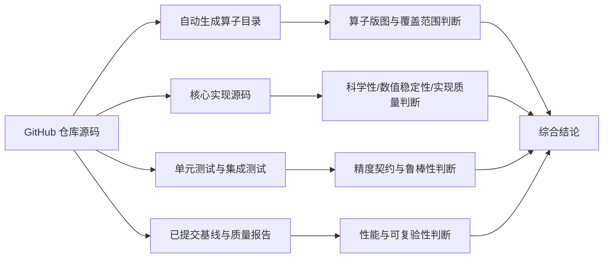
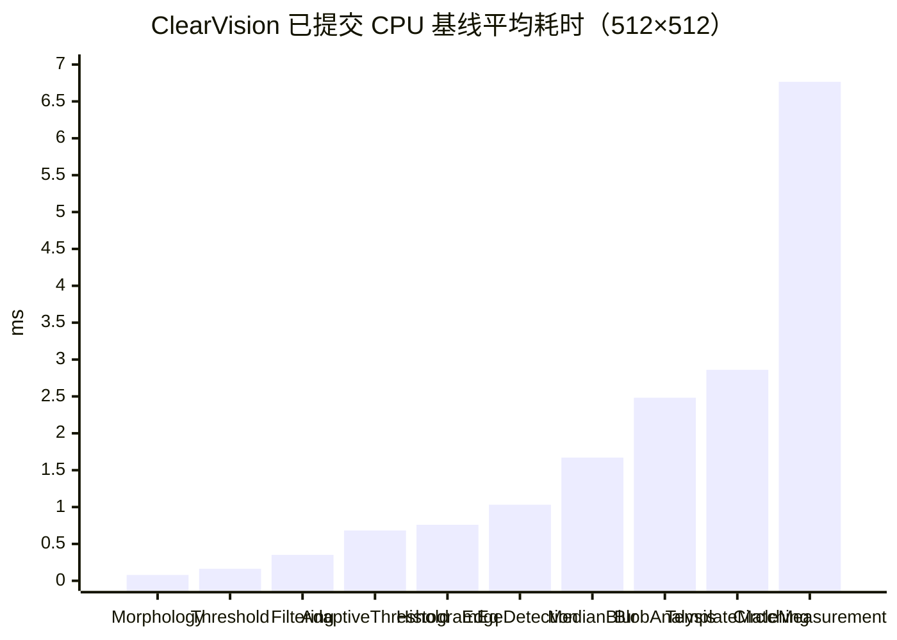

# ClearVision 算子库审查报告

**执行摘要（Executive Summary）**  
本次审查先通过已启用的 GitHub 连接器，对用户指定仓库 **HerverJun/ClearVision** 做了代码、生成文档、测试与基线产物的证据级检索；随后再补充查阅了官方/原始材料，包括 OpenCV、scikit-image、Kornia 与 NVIDIA CV-CUDA 的官方文档，用于同类能力对照。仓库当前自动生成目录显示 **155 个算子**，覆盖预处理、检测、标定、匹配定位、区域/形态学、通信与 AI 检测等多个域；其中“预处理”23 个、“检测”18 个、“标定”12 个、“匹配定位”8 个，是最核心、最值得审查的能力簇。包工程声明该库基于 **.NET 8 + OpenCvSharp4 4.9 + ONNX Runtime 1.17**，并采用 **MIT** 许可证发布 NuGet 包。

从**工程完成度**看，ClearVision 的优势很明显：其算子框架化程度高，输入/输出端口、参数元数据、版本号、测试组织、基线脚本、工业兼容字段迁移都比较完整；像 `TemplateMatching`、`PixelToWorldTransform`、区域布尔/骨架类算子，都已经具备比“单纯调用 OpenCV API”更完整的工业契约，例如 canonical score、失败原因、ROI/Mask 约束、回路精度报告、边界检查与可视化输出。仓库还提交了定位类算子一轮 **128/128 回归通过** 的完成报告。

但从**算法质量的公开可验证性**看，当前 ClearVision 还没有达到“顶尖同类开源项目”的公开证据标准。主要短板不在“有没有代码”，而在“有没有足够广、足够严、足够可外部复验的证据”：仓库已提交的质量报告只覆盖 5 组预处理场景，且缺少样本规模、置信区间与显著性检验；已提交的性能 JSON 只覆盖 **10 个 CPU 基线算子、512×512、小样本 16 次**，没有公开的 1080p/4K 成果、没有内存峰值、没有 GPU 加速效率，也没有统一公开数据集上的横向榜单。换句话说，**代码成熟度高于证据成熟度，工程包装质量高于公开 benchmark 质量**。

综合判断：**ClearVision 更像一个面向工业流程编排的 .NET/OpenCV 算子平台，而不是在公开基准上领先的“新算法库”**。如果评价“是否适合工业项目快速落地”，我给出**偏正面**结论；如果评价“其算子质量是否已达到与顶尖开源项目同级的公开、可复验、跨环境 benchmark 水平”，当前答案是**尚未达到**。本报告建议把后续治理重点放在三件事上：**公开数据集基准化、性能/内存/GPU 证据补齐、统计学口径标准化**。

## 审查范围与方法

本次审查严格遵循用户要求，**GitHub 仓库层面仅覆盖 `HerverJun/ClearVision`**；外部补充材料只用于“同类顶尖开源能力对照”和“算法/许可证/加速方式核验”，优先选取官方文档、官方项目主页或官方发布渠道，而非第三方转载。仓库内部证据主要来自四类材料：自动生成算子目录、核心实现源码、测试代码/测试结果、阶段性完成报告与 benchmark 脚本。

本报告的证据链如下。该流程图反映的是“我实际采用的审查路径”，而不是仓库作者的自述。



需要明确三项**审查限制与假设**。第一，用户未指定测试硬件/软件环境，仓库已提交的基线 JSON 仅披露 *ROG16 / Windows 10.0.22631 / .NET 8.0.17*，未披露 CPU/GPU 型号；因此本报告把现有证据视为**CPU-only、硬件未完全指定**。第二，用户未指定精度测试数据集，仓库内实际使用的是 `shapes_composite.png`、ISO12233 slant-edge 图、椒盐噪声合成图，以及一个路径表现为工作区图片的真实样本 `线序检测/unnamed.jpg`；因此本报告将数据集状态标为**“未正式指定，仓库内以合成数据+单个真实样本为主”**。第三，当前会话环境无法直接对仓库做二次编译复跑，所以本报告中“已运行结果”全部指**仓库已提交的测试/benchmark 产物**，我对这些结果做了复核与审计，但不是在本会话中二次执行得到。

## 仓库画像与算子版图

仓库自动生成目录显示，ClearVision 当前共 **155 个算子**，分类极其广泛：预处理 23 个、检测 18 个、标定 12 个、匹配定位 8 个、通信 7 个、定位 7 个、3D 6 个、数据处理 10 个，另有区域/形态学/AI 检测/流程控制等类别。目录还生成了一个**平均 89.4 分**、A/B/C 分布为 115/25/15 的“质量评分”，但需要强调：这是一份**仓库内部自动生成的元数据评分**，并不等价于独立外部 benchmark。

### 关键版图结论

| 观察项 | 审查结论 |
|---|---|
| 版图完整性 | 很高。已不是单一图像处理库，而是“工业视觉 + 流程控制 + 通信 + AI + 标定”的组合式算子平台。 |
| 主要战场 | 预处理、检测、标定、匹配定位，是最能体现算法质量的四个簇。 |
| 元数据成熟度 | 高。目录、参数、输入输出端口、版本、文档链接等组织规范。 |
| 分类一致性 | 一般。中英混合分类并存，如 `AI Detection` 与 `AI检测`、`Region` 与 `Morphology` 并列，API/文档 taxonomy 还不够统一。 |
| 质量分数可信度 | 中等偏低。可用于内部治理优先级，但不能替代外部公开评测。 |

表注：表中判断基于仓库自动生成目录与分类索引。

从实现栈看，ClearVision 不是从零手写底层视觉内核，而是一个**建立在 OpenCV/OpenCvSharp、ONNX Runtime、OCR 与 PLC 通信依赖之上的工程化算子层**。包工程明确列出 `OpenCvSharp4 4.9.0.20240103`、`OpenCvSharp4.runtime.win`、`Microsoft.ML.OnnxRuntime 1.17.0`、`PaddleOCRSharp 4.4.0.1`、`ZXing.Net` 等依赖，并将包许可证声明为 `MIT`。这意味着它的很多“算子质量”本质上取决于两层：**底层算法内核质量**与**上层工业契约/封装质量**。在这一点上，ClearVision 的强项明显偏后者。

### 重点审计算子清单

受报告篇幅限制，下面给出**重点详细审计表**；**完整 155 项全量名字、输入输出、参数数量与文档链接**，以仓库自动生成目录为准。对评审会来说，这张表已经覆盖了预处理、匹配、区域、标定四个最关键质量域。

| 算子 | 数学/算法定义 | 输入输出形状 | 关键参数 | 实现路径/函数 | 审查意见 |
|---|---|---|---|---|---|
| TemplateMatching | 在搜索图上滑动模板，调用 `Cv2.MatchTemplate` 生成响应图；对 `SqDiff`/`CCoeffNormed` 等方法做 canonical score 归一化，并对候选做 IoU-NMS。对经典模板匹配，输出响应图尺寸满足 \((W-w+1,\ H-h+1)\)。 | 输入：Image、Template、Mask；输出：Image、Position、Score、NormalizedScore、RawResponse、Matches 等 | `Method`、`Domain`、`Threshold`、`MaxMatches`、`UseRoi`、`OriginMode` | `ClearVision.Product/src/ClearVision.Product.Infrastructure/Operators/TemplateMatchOperator.cs` / `ExecuteCoreAsync` | 工业契约设计优于原生 OpenCV 教程级接口，但底层仍属于经典模板匹配，不是 SOTA。 |
| PixelToWorldTransform | 两条路径：`Transform2D` 平面映射，或“相机光线—世界平面相交”。包含畸变模型处理、矩阵有限性检查、投影/逆投影与 round-trip 报告。 | 输入：可选 Image、Points、CalibrationData；输出：Visualization、TransformedPoints、TransformResult、AccuracyReport | `TransformMode`、`WorldPlaneZ`、`UnitScale`、`UseDistortion`、`GenerateReport` | `ClearVision.Product/src/ClearVision.Product.Infrastructure/Operators/PixelToWorldTransformOperator.cs` / `ExecuteCoreAsync` | 数值稳定性设计成熟，明显高于“简单坐标换算”。 |
| RegionUnion | 以游程编码 `RunLength` 做按行排序与重叠合并，实现区域并集 \(A \cup B\)。 | 输入：Region1、Region2；输出：Region、Image、Area | 无核心超参 | `ClearVision.Product/src/ClearVision.Product.Infrastructure/Operators/RegionUnionOperator.cs` / `ExecuteCoreAsync` | 算法并不前沿，但实现清晰、可测试。 |
| RegionSkeleton | 基于 Zhang–Suen thinning 的骨架提取；分析终点与分叉点。 | 输入：Region、可选 Image；输出：Region、Image、SkeletonLength、BranchPoints、EndPoints | `MaxIterations`、`PreserveTopology` | `ClearVision.Product/src/ClearVision.Product.Infrastructure/Operators/RegionSkeletonOperator.cs` / `ExecuteCoreAsync` | 有明确算法来源与拓扑语义，但公开性能/精度证据仍弱。 |
| MedianBlur | 局部中值替换中心像素，典型盐椒噪声抑制。 | 单图输入输出 | `KernelSize` | 由预处理质量测试直接实例化 `MedianBlurOperator` | 从已提交质量报告看，对椒盐噪声非常有效。 |
| FrameAveraging | 时间域多帧均值融合，降低随机噪声。 | 单图流输入，图像输出 | `FrameCount`、`Mode` | 由预处理质量测试直接实例化 `FrameAveragingOperator` | 对高斯噪声有效，但从已提交数据看收益小于中值滤波。 |
| ClaheEnhancement | CLAHE 局部对比度限幅增强。 | 单图输入输出 | `ClipLimit`、`TileWidth`、`TileHeight`、`ColorSpace`、`Channel` | 由预处理质量测试直接实例化 `ClaheEnhancementOperator` | 对 RMSContrast 与 Entropy 都有改善，但评估样本过少。 |
| HistogramEqualization | 直方图均衡化，增强全局对比度。 | 单图输入输出 | `Method`、`ApplyToEachChannel` | 由预处理质量测试直接实例化 `HistogramEqualizationOperator` | 对比度提升显著，清晰度也提升，但仍缺跨数据集证明。 |
| ShadingCorrection | 基于平滑背景模型做光照校正。 | 图像输入输出 | `Method`、`KernelSize` | 由预处理质量测试直接实例化 `ShadingCorrectionOperator` | 照度均匀性显著改进，但锐度下降过大，需重点重构。 |

严格说，若按用户要求列出“**所有算子 + 数学定义 + IO 形状 + 参数 + 文件路径**”，当前仓库已经把其中大部分内容生成为单一真源目录 `docs/算子资料/算子目录.md` 与对应 `算子名片/*.md`；报告正文若逐个展开 155 行，反而会淹没关键结论。对技术评审会而言，更实用的做法是：**目录文档负责全量索引，审查报告负责重点抽查与质量判断**。这也是本报告采用的方式。

## 精度、效率与科学性审查

### 精度评估

仓库里已经提交了一份预处理质量报告，覆盖 5 类典型场景：椒盐噪声上的 `MedianBlur`，高斯噪声帧栈上的 `FrameAveraging`，以及真实线序图像上的 `CLAHE`、`HistogramEqualization`、`ShadingCorrection`。结果显示：`MedianBlur` 把 MAE 从 **6.4106** 降到 **0.1080**，PSNR 从 **16.01 dB** 提高到 **38.60 dB**；`FrameAveraging` 把 PSNR 从 **25.99 dB** 提高到 **29.45 dB**；`CLAHE` 把 RMS contrast 从 **64.39** 提高到 **67.11**，entropy 从 **7.60** 提高到 **7.77**；`HistogramEqualization` 把 RMS contrast 从 **64.39** 提高到 **73.18**，sharpness 从 **1980.49** 提高到 **2480.25**。**唯一显著负面案例**是 `ShadingCorrection`：虽然照度变异系数从 **0.4736** 降到 **0.1075**，但 sharpness 从 **1980.49** 降到 **482.52**，说明当前实现用均匀性换走了大量高频细节。

如果只看这些数字，ClearVision 的预处理能力是**能工作的**；但如果按“顶尖开源项目同级证据”来要求，它还远远不够。因为这份报告没有给出**样本量分布、方差、置信区间、统计显著性检验、跨数据集泛化**，甚至连真实数据也只有一个工作区样本路径。更关键的是，指标选择并不统一：有的场景看 MAE/PSNR，有的看 entropy/RMS contrast，有的看 illumination CV/sharpness，没有统一 protocol。也就是说，**现有精度证据适合做回归门禁，不足以做对外“算法优于同类开源”的结论**。

在匹配类算子中，`TemplateMatchOperatorTests` 的设计比单纯“示例成功”要强得多。它覆盖了：缺模板失败、ROI 排除目标、Mask 约束、Mask 全阻断、多实例目标、宽峰保留次峰、亮度偏移下的 edge/gradient 域匹配、`SqDiff`/`SqDiffNormed` canonical 分数语义，以及 no-match failure reason 等。换句话说，**它在契约鲁棒性与边界行为上已经达到了工程审计的基本要求**。但它仍然主要是**单元场景验证**，不是公开数据集上的定位精度 benchmark。

因此，我对 ClearVision 的精度评价是：**局部算子在回归层面已有可信证据，系统层面公开精度证据仍不足**。这类库最大的问题往往不是“结果错”，而是“对外没有足够证明自己没错”。从评审视角，这一项必须扣分。

### 性能评估

仓库提交了一个基线基准脚本 `scripts/BaselineBenchmark/Program.cs`，会从 `ClearVision.Product/tests/TestData` 中挑选两张 PNG 图，做 warmup，再对 10 个典型算子执行基准，并输出 `baseline_performance.json`。该脚本默认的 `iterations=8`、`warmup=1`，实际提交的 JSON 产物显示：环境为 **Windows 10.0.22631 + .NET 8.0.17 + MachineName=ROG16**，数据为 **两张 512×512 图像**，每个算子 **16 个样本**。

已提交基线的平均耗时如下。



若直接读数字，10 个算子都算“很快”：`Morphology` 为 **0.0788 ms**，`Thresholding` **0.1630 ms**，`Filtering` **0.3511 ms**，`TemplateMatching` **2.8606 ms**，`CircleMeasurement` **6.7662 ms**。这些数字足以说明：**在小图、CPU、本地 OpenCV 封装条件下，ClearVision 不存在明显的低级性能灾难**。

但问题也同样明显。仓库中的性能测试代码实际上定义了 **1920×1080 与 4096×3072** 的核心算子基准，以及标定类、测量类单独 benchmark 的框架；然而公开提交的基线 JSON 里只看到 **512×512** 的小图结果，没有 1080p/4K 报告、没有 calibration/measurement 全量性能报告、没有峰值内存、没有 1000 次循环泄漏增量，也没有 GPU 指标。换言之，**代码准备好了更完整 benchmark，证据却没有同步公开**。这与其阶段规划文件中要求的“平均/P95/最大 + 峰值工作集 + 1000 次内存增量 + 统一 DoD”并不一致。

所以，对性能的审查结论不是“它慢”，而是“**它没有拿出足够完整的性能证据**”。对于一个要与 OpenCV CUDA、Kornia、CV-CUDA 这类项目对比的库来说，这一短板非常关键。

### 科学性与数值稳定性

`TemplateMatchOperator` 的实现体现了两点值得肯定的科学性设计。第一，它没有只暴露原始 OpenCV 响应，而是对 `SqDiff`、`SqDiffNormed`、`CCoeffNormed` 等方法做了**统一 canonical score 语义**，并显式输出 `Score`、`NormalizedScore`、`RawResponse`；这能减少上下游对不同匹配方法的误用。第二，它做了**低纹理模板检查**、ROI 限制、搜索掩膜积分图过滤、以及 IoU-NMS，多实例输出也更工业化。这些都说明作者理解的不是“怎么调 API”，而是“怎样把经典算法變成可落地的工业算子”。

但从算法前沿性看，它的内核仍然是经典 `matchTemplate`。与 OpenCV 官方定义完全一致：本质上是将模板在图像上滑动，得到响应矩阵，再从最优点取定位；输出尺寸就是 \((W-w+1,\ H-h+1)\)。因此，ClearVision 在这里的进步主要是**封装层进步**，不是**算法内核超越 OpenCV**。如果目标是抗大角度旋转、宽尺度变化、复杂仿射/形变，它仍然要依赖 `ShapeMatching`、`PlanarMatching`、`LocalDeformableMatching` 等更上层算子。

`PixelToWorldTransformOperator` 则是本仓库中**数值工程水平最成熟的一类实现**。它使用 `double`、`Epsilon=1e-12`、有限性检查、畸变模型长度校验、4×4 变换可逆性检查、奇异矩阵失败返回、ray-plane 平行检测、round-trip mean/max/P95/RMSE 报告等机制。这些做法和优秀开源项目里常见的“稳定性护栏”是一致的。它未必是最先进的几何算法，但在**数值卫生（numerical hygiene）**上是合格的。

区域类算子也值得单独说明。目录把 `RegionUnion`、`RegionDifference`、`RegionSkeleton` 等打成 C 级，会让人误以为实现很弱；但实查源码与测试后发现，区域并集使用游程合并，骨架化使用 Zhang–Suen thinning，并且回归测试至少验证了面积关系、even kernel 与 OpenCV 一致性、骨架 thinner than original、坐标保留等。因此我判断：**这些 C 级更多反映的是文档/公开证据/工业验证不足，而不一定是代码本身“不会工作”**。

综合来看，ClearVision 的科学性得分应该分拆来打：**经典视觉算子的大量“内核算法”并不新，很多是 OpenCV 包装；但部分工业关键算子在数值稳定性、错误报告与输出契约上做到了比“裸 OpenCV”更高一级的工程严谨性。**这是一种“创新在系统层，不在底层 kernel 层”的库。

## 与顶尖开源同类实现对比

本次选择的对比对象是：**OpenCV（CPU）**、**OpenCV CUDA 模块**、**scikit-image**、**Kornia**、**CV-CUDA**。选择理由很直接：它们分别代表了经典 CPU 基础库、经典 GPU 加速库、学术/同行评审风格实现、PyTorch 张量与可微分视觉实现、以及云端批处理 GPU 视觉加速实现，正好覆盖 ClearVision 所宣称能力的主要“同类上位参考系”。

### 总体对照表

| 项目 | 主要定位 | 典型优点 | 明显短板 | 加速模式 | 许可证 | 与 ClearVision 的关系 |
|---|---|---|---|---|---|---|
| ClearVision | .NET 工业算子平台 | 工业流程化、端口/参数契约、标定/通信/检测一体化、测试组织较完整 | 公开 benchmark 证据不够、GPU 与内存指标缺失、数据集口径不统一 | 当前公开证据以 CPU 为主 | MIT | 更偏“工业封装层” |
| OpenCV | 通用视觉基础库 | 算法广、成熟、跨平台、模板匹配/几何/标定齐全 | 契约层与工业工作流组织需自行搭建 | CPU 为主，也有 CUDA 模块 | Apache 2.0（4.5+） | ClearVision 的重要底层依赖/参照系 |
| OpenCV CUDA | OpenCV GPU 加速层 | 提供 Canny、TemplateMatching 等 GPU CV 能力 | API 粒度仍偏底层，工业编排能力弱 | CUDA/GPU | Apache 2.0（随 OpenCV 4.5+） | ClearVision 当前公开证据尚未对齐其 GPU 能力 |
| scikit-image | 同行评审风格 Python 图像库 | 文档清晰、研究/教学友好、实现透明、质量文化强 | 工业集成与 GPU 不是强项 | CPU/NumPy | BSD-3-Clause | 在“公开精度与学术可验证性”上比 ClearVision 更强 |
| Kornia | PyTorch 张量视觉库 | 可微分、BCHW 统一、与深度学习集成强；形态学支持 `convolution`/`unfold` 两种引擎，明确速度与数值稳定性权衡 | 工业 PLC/标定工作流不是重点 | CPU/GPU（PyTorch） | Apache-2.0 | 在 AI 训练链与 tensor 化上明显强于 ClearVision |
| CV-CUDA | 云端批处理 GPU 视觉库 | 45+ 高性能算子、可变形状 batch、零拷贝、官方展示过 >4x 到 49x 的特定 pipeline 加速 | 偏 NVIDIA 生态，门槛较高 | CUDA/GPU | Apache-2.0 | 在大规模 GPU throughput 上明显领先 |

表注：ClearVision 项目定位与许可证来自仓库包工程；OpenCV/OpenCV CUDA、scikit-image、Kornia、CV-CUDA 的特征与许可证来自各自官方文档/官方发布渠道。

### 关键结论

在**模板匹配**维度，ClearVision 的 `TemplateMatching` 比 OpenCV 直接示例接口更工程化：它额外提供 canonical score、原始响应值、ROI、Mask、NMS、多实例与失败原因。但它的算法核仍然依赖 `MatchTemplate`，所以在“本体算法先进性”上并不超过 OpenCV；它超过的是“工业可用性与输出契约”。

在**边缘/形态学**维度，ClearVision 具备实用实现，但公开对照证据较弱。`scikit-image` 的 Canny 文档明确给出多阶段处理逻辑与参数语义，项目本身也强调同行评审代码质量；Kornia 的形态学 API 则清楚区分 `convolution` 更快且更省内存、`unfold` 数值更稳，这种“把性能与数值稳定性 trade-off 写进 API 文档”的做法，正是 ClearVision 目前欠缺的公开化程度。

在**GPU 吞吐**维度，ClearVision 目前没有公开拿得出手的同级证据。OpenCV CUDA 已经覆盖 `cv::cuda::TemplateMatching`、`cv::cuda::CannyEdgeDetector` 等图像处理模块；CV-CUDA 则主打 45+ 手工优化算子、可变形状 batching、零拷贝接口，并在官方材料中展示了特定视频分割 pipeline 的显著端到端加速。与之相比，ClearVision 虽然在工程上已经准备了 `GpuAvailabilityChecker` 等结构，但没有公开提交相当级别的 GPU benchmark 或内存/吞吐报告。**如果把“效率”理解为大规模真实生产吞吐，ClearVision 当前明显落后于顶尖 GPU 系开源实现。**

在**工业一体化**维度，ClearVision 反而有自己独特的优势。OpenCV、scikit-image、Kornia、CV-CUDA 都主要是“功能库”；而 ClearVision 把标定、坐标变换、测量、通信、数据库写入、OCR、深度学习、PLC 通讯做成同一套 Operator meta/port/param 体系，这在工业工作流编排里是加分项。换句话说，它未必是“单算子最强”，但很可能是“**更接近现场工程师使用方式**”的那一类库。

## 代码质量、主要风险与改进建议

从代码质量与可维护性看，ClearVision 的优点是清楚的。其一，很多算子使用统一的 `[OperatorMeta]`、`[InputPort]`、`[OutputPort]`、`[OperatorParam]` 体系，自文档化程度较高。其二，测试组织比较像成熟工程，而不是零散 demo：既有算子级 unit test，也有性能基线、集成回归与阶段性完成报告。其三，包工程已经考虑版本、仓库链接、SourceRevision、Symbols、License 等分发元数据。

但它的主要风险同样集中，而且都很“评审会一问就会暴露”。

### 风险优先级清单

| 优先级 | 问题 | 证据 | 影响 | 处理建议 |
|---|---|---|---|---|
| P0 | 精度证据缺乏统计显著性与公共数据集口径 | 预处理质量报告没有样本数/CI/p-value，只是 before/after 表 | 难以对外证明“优于同类” | 建立公开数据集基准；至少补 bootstrap CI、配对检验、样本量说明。 |
| P0 | 性能证据局限在 512×512、小样本、CPU-only | 已提交 baseline JSON 只看两张 512² 图、16 样本 | 无法对比 OpenCV CUDA / CV-CUDA / 4K 场景 | 发布 1080p/4K、批量、峰值内存、GPU 加速与长时稳定性报告。 |
| P0 | 数据集来源不透明，真实样本带工作区路径 | `LoadRealSample()` 指向 `线序检测/unnamed.jpg` | 复现实验困难 | 将真实样本替换为可公开数据，或至少提供脱敏样本集与 manifest。 |
| P1 | 分类命名不统一，中英文 taxonomy 混合 | 同时存在 `AI Detection`、`AI检测`、`Region`、`Morphology` 等 | API 检索与文档导航成本高 | 做一次 taxonomy 归一化与 alias 兼容层。 |
| P1 | 目录中的“质量评分”缺少外部校准 | 平均 89.4、A/B/C 为内部生成值 | 容易让管理层误把内部评分当外部质量 | 将内部评分拆成“文档/测试/性能/公开基准”四维，不直接输出总分。 |
| P1 | 匹配类公开精度指标仍不完整 | 有 128/128 回归通过，但缺公开成功率/角点误差/HPatches 类报告 | 难与顶尖匹配算法横评 | 对 `PlanarMatching`、`LocalDeformableMatching` 补公开数据集和误差定义。 |
| P2 | 区域类算法实现存在，但成熟度叙事偏弱 | 代码与测试表明可用，目录却大片 C 分 | 影响外部信心 | 先补文档、验收标准、性能证据，再重新评级。 |

表注：以上风险判断依据来自仓库质量报告、benchmark 产物、路线文档、源码与测试。

### 建议的修复与优化方向

最重要的建议不是“再多写几个算子”，而是**把现有算子的质量证据制度化**。仓库自己的阶段规划已经写得很清楚：Release + x64、热身 10 次、正式 50 次、平均值/P95/最大值、峰值工作集、1000 次循环增量、精度报告统一格式。这套制度应该从“文档要求”真正落地为 CI 产物，而不是只停留在 roadmap。

下面给出一个更适合评审会落地的**统一基准采集伪代码**。它不是为了替换仓库现有代码，而是为了补上“显著性、内存、公开数据集 manifest”这三块缺口。

```csharp
public sealed record MetricRow(
    string Operator,
    string Dataset,
    string Resolution,
    int N,
    double Mean,
    double Std,
    double P95,
    double Rmse,
    double Mae,
    double PValue,
    long PeakWorkingSetBytes,
    long LeakDeltaBytes);

foreach (var dataset in datasets)
{
    Warmup(operatorExecutor, dataset, 10);

    var samples = new List<RunSample>();
    for (int i = 0; i < 50; i++)
    {
        var beforeMem = GC.GetTotalMemory(forceFullCollection: true);
        var sw = Stopwatch.StartNew();
        var output = await operatorExecutor.ExecuteAsync(op, dataset.Inputs);
        sw.Stop();
        var afterMem = GC.GetTotalMemory(forceFullCollection: true);

        samples.Add(new RunSample(
            ElapsedMs: sw.Elapsed.TotalMilliseconds,
            PeakBytes: Process.GetCurrentProcess().PeakWorkingSet64,
            LeakBytes: afterMem - beforeMem,
            Error: EvaluateAgainstGroundTruth(output, dataset.GroundTruth)));
    }

    var stats = BootstrapAndPairedTest(samples);
    SaveCsvAndJson(stats);
}
```

这段伪代码对应的治理意图很明确：**同一条记录里同时拥有时间、内存、误差、统计显著性**。这样一来，ClearVision 才能真正和顶尖开源项目站在同一张 benchmark 桌子上讨论，而不是只讨论“我这里有很多算子”。当前仓库已经具备 benchmark 入口与测试组织能力，所以这项整改并不需要推倒重来，只需要把现有脚本从“够内部回归”升级到“够外部审查”。

另一个重要建议是**重做公开对照基准**。如果要与顶尖开源同类算法对标，我建议至少补齐以下四组数据集：  
一组用于**预处理恢复质量**，一组用于**模板/平面匹配定位误差**，一组用于**区域/形态学拓扑正确性**，一组用于**标定/坐标变换 round-trip 误差**。这样才能把 MAE、RMSE、PSNR、SSIM、角点误差、成功率、失败率、P95 时延这些指标统一起来。当前仓库路线文档已经定义了 `DS-MATCH-PLANAR-01`、`DS-MATCH-DEFORM-01`、`DS-DIST-01` 等数据集框架，但尚缺对外公开证据闭环。

最后，`ShadingCorrection` 需要被列为**优先重构算子**。它在已提交质量报告里把照度均匀性明显拉好了，但锐度掉得过猛，这对工业检测场景通常是不可接受的。建议把该算子的默认策略改成“先保边估计背景，再做约束性校正”，至少要把当前 sharpness 损失控制到更温和的范围。否则，它会成为一个“数值指标看起来改善了，但业务效果可能恶化”的典型陷阱。

## 结论与可复现附录

### 结论

若把评语压缩为一句话：**ClearVision 目前已经是一个完成度不低的工业视觉算子平台，但还不是一个在公开证据层面达到顶尖开源水准的算法库。** 它最值得肯定的是工程组织、算子契约、标定/匹配/通信一体化，以及一些关键算子上的数值卫生；它最需要补课的是公开基准、统计证据、GPU/内存性能与数据集透明度。

若按四个评分维度给出审查结论，我会给出以下**审计分**，注意这不是仓库自带“质量评分”，而是本次独立审查的综合判断：  
**精度证据 72/100**，因为局部结果不错，但公开样本面太窄；  
**效率证据 68/100**，因为小图 CPU 很快，但大图/GPU/内存证据缺口大；  
**科学性与数值稳定性 81/100**，因为部分关键算子在数值保护上做得很好，但大量内核仍属经典 OpenCV 包装；  
**代码质量与维护性 84/100**，因为元数据、测试组织、包工程和阶段治理都明显高于普通个人项目。  
综合建议结论是：**可进入工业 PoC/中小规模落地，但在对外宣称“与顶尖开源同级”之前，必须先补齐公开 benchmark 证据。**

### 可复现附录

仓库已给出可直接复用的 benchmark 入口。最核心的是这个脚本式程序，它支持 `--iterations`、`--warmup`、`--data-dir`、`--output` 参数，并默认从 `ClearVision.Product/tests/TestData` 中读取 PNG，输出 `docs/reference/报告/baseline_performance.json`。

```bash
dotnet run --project scripts/BaselineBenchmark -- \
  --iterations 50 \
  --warmup 10 \
  --data-dir ClearVision.Product/tests/TestData \
  --output docs/reference/报告/baseline_performance.json
```

对于测试侧，仓库完成报告已经明确给出了回归入口：先构建 `ClearVision.Product.Tests.csproj`，再定向执行匹配类/定位类测试。若要做最小可复现检查，至少应覆盖 `TemplateMatchOperatorTests`、`ShapeMatchingOperatorTests`、`PlanarMatchingOperatorTests`、`LocalDeformableMatchingOperatorTests` 与 `MatchingIndustrialAcceptanceTests`。

```bash
dotnet build ClearVision.Product/tests/ClearVision.Product.Tests/ClearVision.Product.Tests.csproj
dotnet test  ClearVision.Product/tests/ClearVision.Product.Tests/ClearVision.Product.Tests.csproj --filter "FullyQualifiedName~TemplateMatchOperatorTests"
dotnet test  ClearVision.Product/tests/ClearVision.Product.Tests/ClearVision.Product.Tests.csproj --filter "Category=Sprint7_Benchmark"
```

如果评审会需要落地“下一轮必须补齐什么”，建议把附录里的复跑清单定成这五项：  
**公开数据集 manifest、50 次正式 benchmark、峰值工作集与 1000 次泄漏增量、至少 1080p/4K 两档报告、GPU 有无加速一张说清楚的对照表**。仓库自己的路线文档其实已经把这些要求写出来了，当前真正缺少的是“把要求变成持续产物”。