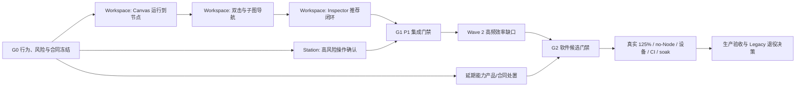

# Studio UI Next 功能对齐 TODO 计划

状态：`PROPOSED_FOR_OWNER_REVIEW`  
基线：`studio-ui-next @ 22a3d26a00a2d3b8098165aab5489ce54f5bc95b` 加审计时 dirty working tree  
输入：`01_Executive_Summary.md`、`02_Legacy_New_Feature_Matrix.md`、`03_Confirmed_Regression_List.md`、`07_Unverified_And_Open_Questions.md`  
目标：以最小必要改动消除高价值迁移缺口，补齐生产证据，同时保持后端权威、单一 owner、唯一保存链、Canonical Canvas 和 HostBridge 边界。

## 1. 计划原则

### 1.1 不是所有差异都应立即实现

每项只能先进入以下一种处置类型：

| 类型 | 含义 | 允许动作 |
| --- | --- | --- |
| `IMPLEMENT_NOW` | 旧版任务明确、Next 缺失、合同充分、改动边界可控 | 进入实现波次 |
| `DECIDE_FIRST` | 是否仍为产品能力、入口位置或安全替代方案未定 | 只做产品/安全决策，不写产品代码 |
| `CONTRACT_FIRST` | owner、权限、operation identity、reconcile 或资源身份不完整 | 先补 ADR/合同与 owner 签字 |
| `VERIFY_ONLY` | 代码/owner 已存在，但真实环境证据不足 | 只补运行证据；发现缺陷后再建实现项 |
| `DEFERRED` | 当前已有明确延期与 Legacy fallback | 保持边界，不为数字 parity 强行恢复 |
| `RETIRE_WITH_APPROVAL` | 产品 owner 明确批准永久移除 | 更新矩阵、导航与 fallback；不得自行判断 |

优先级不使用虚假精确分数。排序依次考虑：用户任务是否被阻断、操作频率、安全/数据风险、证据置信度、依赖数量和实现规模。高影响、高风险且证据充分的 P1 先做；边界不明的能力先决策；环境证据不足的能力只验证。

### 1.2 完成层级

1. `CAPABILITY_DONE`：单个能力行为、权限、错误、dispose 和回归测试完成。
2. `WAVE_DONE`：同一波所有工作包完成，跨能力集成门禁通过。
3. `SOFTWARE_PARITY_CANDIDATE`：P1 清零；P2 已实现或取得书面处置；软件与真实 WebView2 门禁通过。
4. `PRODUCTION_ACCEPTANCE`：125% DPI、no-Node、真实设备、Remote CI 和 soak 证据通过。
5. `LEGACY_RETIREMENT_APPROVED`：产品 owner 单独批准；不得由软件 gate 自动推导。

## 2. 关键路径与并行策略



### 实施泳道

| Lane | 范围 | WIP | 并行规则 |
| --- | --- | ---: | --- |
| A - Workspace | FlowCanvas、Preview、Inspector、Global Variables、Image、NPoint | 1 | Lane 内严格串行；这些能力共享 Workspace/Canvas/selection/persistence |
| B - Station/Settings | Station confirmation；之后 Storage/token 等 Settings 项 | 1 | 可与 Lane A 并行；Station 与 Settings 共享合同文件时改为串行 |
| C - Decision/Verification | 产品决策、ADR、真实环境证据 | 2 | 只读/无共享产品文件时可并行；不能绕过 owner 决策 |

主协调 owner 独占共享文件：`package.json`、lockfile、router、app shell、design tokens、API/HostBridge contracts、`.csproj`、CI、Feature Flags、共享 ADR/基线。任何 capability owner 不得自行修改这些文件。

## 3. Wave 0：Definition of Ready 与处置冻结

此波不实现 UI。未通过对应 DoR 的任务不得进入 Wave 1/2。

> 当前事实、拟议边界和待签字项见 [Wave 0 合同冻结包](../docs/进行中/StudioUINext/ADR-ParityAlignment-Wave0-ContractFreeze.md)。该文档状态为 `PROPOSED_FOR_OWNER_REVIEW`，不是 G0 完成或产品 owner 批准的替代物。

### [ ] G0-01 Canvas 行为合同

- 处置：`DECIDE_FIRST`，阻塞 `W1-WS-01/02`。
- Owner：FlowCanvas + Preview + Product owner。
- 冻结内容：支持“运行到节点”的节点类型、请求入口、active node、取消/stale/权限/错误；合法 subgraph host、双击语义、breadcrumb、键盘返回、leave guard。
- 约束：只允许 `FlowCanvasOwner -> existing Preview/Run owner -> authenticated HTTP/SSE`；不得恢复 WebMessage 执行通道。
- 退出：行为表、错误矩阵、owner/command 归属和 fixture 样例获得签字。

### [ ] G0-02 Inspector 推荐合同

- 处置：`CONTRACT_FIRST`，阻塞 `W1-WS-03`。
- Owner：Inspector owner + existing parameter recommendation backend owner。
- 冻结内容：支持算子 allowlist、request/response、候选参数、preview、accept/revert、stale node、权限、PersistenceRevision 关系。
- 约束：推荐只生成可撤销 draft；不得直接正式保存，也不得复制 Line Sequence recommendation owner。
- 退出：合同测试样例和不支持算子行为明确。

### [ ] G0-03 Station 命令风险矩阵

- 处置：`DECIDE_FIRST`，阻塞 `W1-ST-01`。
- Owner：Station command owner + Security + Product owner。
- 冻结内容：哪些命令需要普通确认、输入目标名称、二次授权或禁止；确认中显示 Station、包身份、命令、操作者、unknown-outcome/reconcile 策略。
- 退出：每种命令风险级别、审计字段和取消/超时行为获批。

### [ ] G0-04 产品处置板

- 处置：`DECIDE_FIRST`。
- 必须逐项选择：`MIGRATE`、`RETAIN_LEGACY_FALLBACK`、`RETIRE_WITH_APPROVAL`。
- 项目：Demo、独立本地图像加载、Runtime Preview Pilot、Station token 安全分发、Storage cleanup、持久 FPS/工程/版本上下文。
- 退出：每项有产品 owner、决定、理由、目标波次和验收人；无“以后再说”状态。

### [ ] G0-05 验收样本与证据目录冻结

- 固定至少一个含普通节点、可预览节点、subgraph host、全局变量绑定、ROI 和正式判定的工程 fixture。
- 所有证据写入 `.tmp/studio-ui-next/parity-alignment/<wave>/<sha>/<run-id>/`；publish 仅写 `.tmp/publish-check/`。
- 每份证据记录 `sourceSha`、working-tree diff identity、profile、DPI、配置、状态、错误与 cleanup；未运行写 `NOT RUN/NOT PERFORMED`。

## 4. Wave 1：P1 功能与安全语义

### Lane B 可与 Lane A 并行

### [ ] W1-ST-01 Station 高风险操作确认

- 优先级/规模：P1 / S-M。
- 处置：`IMPLEMENT_NOW`，依赖 `G0-03`。
- 唯一 owner：`capabilities/stations-read/stationAdminCommandOwner.ts`；UI 组合在 `StationAdminPanel.vue`。
- 最小范围：在现有 `issueCommand/deployPackage` 前加入风险分级确认；显示目标与影响；取消不创建请求；提交后继续复用既有 operation identity 和 reconcile。
- 禁止：第二 command owner、前端私有 command 状态机、在 modal 内直接调 API。
- `CAPABILITY_DONE`：所有高风险命令被正确拦截；重复点击、取消、超时、unknown outcome、终态失败与成功均有中文状态；Admin/无权限路径通过。

### Lane A 严格按以下顺序

### [ ] W1-WS-01 Canvas 运行到节点/调试预览

- 优先级/规模：P1 / M。
- 处置：`IMPLEMENT_NOW`，依赖 `G0-01`。
- 唯一 owner：`project-workspace/flow/flowCanvasOwner.ts`，复用现有 Preview/Run owner 和 `canonicalFlowCanvas.ts`。
- 最小范围：恢复 node context action；将 node identity 交给现有 active-node/preview command；提供 unavailable、stale、cancel、permission 和 result 状态。
- 禁止：第二 FlowCanvas、Vue 长期持有 Canvas 实例、direct WebMessage run、把调试 Preview 冒充 Formal Run。
- `CAPABILITY_DONE`：Legacy 同语义路径可完成；owner dispose 后无请求/订阅；未支持节点不显示或明确禁用原因。

### [ ] W1-WS-02 Canvas 双击与子图导航

- 优先级/规模：P1 / M-L。
- 处置：`IMPLEMENT_NOW`，依赖 `W1-WS-01` 与 `G0-01`。
- 唯一 owner：同一 FlowCanvas/Workspace owner。
- 最小范围：只对批准的 subgraph host 恢复双击；breadcrumb、退出、键盘返回、selection 和 leave guard 同步。
- 禁止：复制一份子图 Flow state、用 DOM 隐藏模拟 unmount、绕过正式 Flow draft。
- `CAPABILITY_DONE`：进入/退出、空子图、节点删除、工程切换、未保存草稿、快捷键和 dispose 均有测试。

### [ ] W1-WS-03 Inspector 推荐、接受与撤销

- 优先级/规模：P1 / M。
- 处置：`IMPLEMENT_NOW`，依赖 `W1-WS-02` 与 `G0-02`。
- 唯一 owner：`project-workspace/inspector/inspectorOwner.ts`。
- 最小范围：recommend -> candidate diff -> optional preview -> accept/revert；accept 只 patch canonical Flow draft，正式保存仍走 `ProjectSaveCoordinator`。
- 禁止：第二 recommendation owner、直接持久化 recommendation、把 local revision 当 PersistenceRevision。
- `CAPABILITY_DONE`：成功、不支持、401/403、validation error、stale selection、并发编辑、accept、revert、save/reload 均覆盖。

### [ ] G1 P1 集成门禁

- Lane A 与 Lane B 各自 capability tests 通过后再合并验证，不把多个未验工作包堆到最后。
- Workspace 验证 context menu、double-click、breadcrumb、Inspector、Preview、save、正式 run 的完整 journey。
- Station 验证确认、提交、unknown outcome、reconcile 与权限。
- `G1_DONE` 条件：P1=0；无第二 owner/transport/save/canvas；lint/typecheck/unit/build/fixture/WebView2 证据齐全。

## 5. Wave 2：高频效率与低风险缺口

Wave 2 只处理高频、合同清楚且不重建 authority 的缺口。

### [ ] W2-WS-01 Global Variables 搜索、筛选、定位算子

- 优先级/规模：P2 / S-M。
- 处置：`IMPLEMENT_NOW`，依赖 Wave 1 selection command 稳定。
- Owner：`workspaceGlobalVariablesOwner.ts` + 现有 Flow selection command。
- 范围：纯 computed 搜索/类型筛选；定位只发送 operator identity，不复制 Flow catalog；不修改保存合同。
- 完成：长列表、无结果、过期 binding、节点已删除、权限和工程切换均有覆盖。

### [ ] W2-IMG-01 Annotation 显示/清除

- 优先级/规模：P2 / S-M。
- 处置：`IMPLEMENT_NOW`。
- Owner：`image/imageCanvasOwner.ts` + existing canonical ImageCanvas。
- 范围：明确区分 artifact annotation、ROI draft、pixel lock；toggle/clear 不影响 ROI 参数或正式 artifact。
- 完成：有/无 annotation、ROI 编辑中、preview refresh、stale artifact、dispose 和 100%/125% 截图通过。

### [ ] W2-IMG-02 独立本地图像加载

- 优先级/规模：P2 / M。
- 处置：`DECIDE_FIRST`，依赖 `G0-04`。
- 若保留：复用 `FilePickerPort` 与唯一 ImageCanvas owner；文件只作可丢弃调试输入，不写 Project/localStorage，不把路径当 asset identity。
- 若退休：产品 owner 记录原因、替代工作流和 Legacy 入口处置，不再实现。

### [ ] W2-SET-01 Storage 路径浏览

- 优先级/规模：P2 / S。
- 处置：`IMPLEMENT_NOW`，前提是 G0-04 确认仍支持。
- Owner：Settings owner + shared Host picker。
- 范围：只补 browse；路径草稿和正式保存复用现有 settings contract。
- 禁止：新 HostBridge、新 storage API、前端直接操作文件系统。

### [ ] W2-SEC-01 Station token 安全分发替代

- 优先级/规模：P2 / M。
- 处置：`DECIDE_FIRST`。
- 可选方案：一次性 reveal、受时限 OS clipboard lease、可审计 bootstrap file、外部 provisioning；禁止恢复长期明文回显。
- 进入条件：Station/Security/Product owner 签字；权限、审计、过期、清除和 WebView2 navigation 行为冻结。

### [ ] W2-SHELL-01 持久工程/版本/FPS 状态

- 优先级/规模：P3 / S。
- 处置：`DECIDE_FIRST`，只在真实 125% 空间预算后进入。
- 首选：工程名与版本保留紧凑投影；FPS/内存若属于诊断则放 Diagnostics 或可折叠状态，不挤压 Canvas/Inspector/Preview。
- 完成：1920x1080 100%/125%、compact/comfortable、长工程名与服务离线截图通过。

## 6. Wave 3：延期能力与合同债

以下项不得为了提高 parity 数字直接实现。

| TODO | 处置 | 当前动作 | 重新进入条件 |
| --- | --- | --- | --- |
| D3-01 Demo/示例工程 | `DECIDE_FIRST` | 保持 Legacy/demo fallback | Project lifecycle + backend + product owner；权限、create identity、save/reconcile |
| D3-02 Database advanced | `CONTRACT_FIRST` | Next 保持 status/backup；高级操作不可用 | Admin policy、operation ID、database revision/backup ID、互斥、审计、timeout、unknown outcome |
| D3-03 Runtime Preview Pilot | `DECIDE_FIRST` | 判断 product surface 或 internal-only | Runtime/Settings/Product owner 明确 Next surface 或正式 retirement |
| D3-04 Storage cleanup | `CONTRACT_FIRST` | 不新增 destructive control | 权限、范围、backup、operation ID、审计、取消/超时/reconcile |
| D3-05 N-point advanced | `CONTRACT_FIRST` | 保留 basic capture/solve/save | observation/asset projection、权限、revision、import/export、error overlay |
| D3-06 Generic AutoTune | `DEFERRED` | 只保留已批准 Line Sequence | 每个算子的 input/target/allowlist/admission/identity/reconcile |
| D3-07 AI attachment/model/template | `DEFERRED` | 不用本地 path/Blob 冒充资源 | resource/artifact ID、version/hash、权限、publish/download/revoke/recover |
| D3-08 Calibration projection | `CONTRACT_FIRST` | 不复制第二 calibration owner | source asset、unit、node、asset version、PersistenceRevision 投影 |
| D3-09 Line Sequence AI follow-up | `DEFERRED` | 不新增 AI queue/session | 跨 capability composer、operation identity、唯一 AgentRun owner |
| D3-10 Operator preview / image upload endpoints | `DECIDE_FIRST` | 不按 endpoint 存在推断 UI 缺失 | Backend/Product owner 确认预期 caller，随后迁移、保留 service-only 或正式退休 |

每项决策必须更新 ADR、F10 和能力矩阵。未批准时状态保持 `DEFERRED_WITH_LEGACY_FALLBACK` 或 `NOT_AVAILABLE`，不能写 `PARITY`、`MIGRATED` 或 `INTENTIONALLY_RETIRED`。

## 7. Wave 4：分层验证与生产门禁

### [ ] V4-01 Global Variables runtime values 闭环

- 处置：`VERIFY_ONLY`；当前 owner 存在，不先写新实现。
- 验证：正式保存/重载、运行值 read/write、权限、版本冲突、unknown outcome/reconcile、工程切换与 dispose。
- 结果：通过则把 A27 从 `PARTIAL` 更新为等价状态；失败才回流 Workspace Global Variables owner 建缺陷。

### [ ] V4-02 连续检测保护/恢复状态投影

- 处置：`VERIFY_ONLY`；Runtime/Inspection 继续拥有保护和恢复策略。
- 验证：缺料超时、连续 NG、停止/恢复、SSE 断线重连、互斥、页面离开与服务重启；Next 只解释和投影状态。
- 禁止：用前端 timer/lock 重建 Runtime 状态机。

### [ ] V4-03 Startup profile 与 rollback

- 处置：`VERIFY_ONLY`。
- 验证：Next default、显式 Legacy rollback、owner unmount/dispose、启动失败、session 失效、重复 mount 防护；确认任一时刻只有一个写 owner。
- 结果：只形成生产候选证据，不自动批准 Legacy retirement。

### [ ] V4-04 真实 Windows DPI 矩阵

- 处置：`VERIFY_ONLY`。
- 验证：1920x1080 的真实 Windows 100%/125%，必要时 150%；compact/comfortable；Workspace、modal、长中文、错误、空状态。
- 证据：截图、client size、Windows scale、WebView2 diagnostics、cleanup JSON。

### [ ] V4-05 独立 no-Node 目标机

- 处置：`VERIFY_ONLY`。
- 验证：self-contained Release publish、无 Node/node_modules/FrontendV2 依赖、启动/登录/Workspace/保存/run/package/退出；先运行 scanner，再到独立目标机。

### [ ] V4-06 真实设备与外部服务

- 处置：`VERIFY_ONLY`。
- 范围：Camera、PLC、TCP Client/Server、Station package/command/result、真实 AI provider/model。
- 规则：按设备隔离端口、数据库、WebView2 user-data 和结果目录；任一失败回流对应 owner，不建立前端替代 authority。

### [ ] V4-07 Remote CI、clean checkout 与 soak

- 处置：`VERIFY_ONLY`。
- 验证：required jobs、clean checkout/reproducible bundle、长时 SSE reconnect、owner dispose、内存/handle、unknown outcome、设备断连恢复。
- 退出：证据与当前候选 SHA 绑定，产品 owner 签收；本地 PASS 或旧 checkpoint 不可替代。

### 7.1 每个 capability 的最小门禁

1. Capability-local unit：owner command、state projection、error、cancel、dispose、重复提交。
2. Vue/TypeScript：在 `StudioUI/` 运行 `npm run lint`、`npm run typecheck`、`npm run test:unit`。
3. Production build：`npm run build:production`、`npm run bundle:gate`；波次末运行 `npm run bundle:verify`。
4. Browser journey：在 `ClearVision.Product/tests/ClearVision.Product.UI.Tests/` 使用定向 `npm test -- <spec>`；deterministic fixture 必须记录 source SHA/model mode/data source。
5. Backend/endpoint：只在合同或 endpoint 改动时运行定向 .NET；同一 `.csproj` 通过 `scripts/run-dotnet-test-serial.ps1` 合并一次执行。

### 7.2 波次集成门禁

| Gate | 必须运行 | 不能替代 |
| --- | --- | --- |
| UI software | lint、typecheck、全量 unit、production build、bundle gate/reproducibility | 不能替代 Desktop/WebView2 |
| Browser | 目标 journey + 既有 Studio UI Next regression | Chromium/DPR 不能替代真实 WebView2/DPI |
| Desktop endpoints | `scripts/run-tests-desktop-endpoints.ps1`；相关 services/phase42 固定 gate | build 通过不能替代 endpoint 行为 |
| Real WebView2 | `Invoke-StudioUiWebView2Evidence.ps1` 与 `Invoke-StudioUiWebView2Matrix.ps1`，Debug/Release 100% | fixture 不能替代真实宿主 |
| DPI | `Test-StudioUiDpiEvidence.ps1`，真实 100%/125%，必要时 150% | `force-device-scale-factor` 不能替代 Windows DPI |
| no-Node | self-contained publish + `Test-StudioUiNoNodeEvidence.ps1`，再做独立目标机 | 本机有 Node 的 publish smoke 不能替代独立机器 |
| Device | virtual PLC 可作工程 gate；真实 Camera/PLC/TCP/Station/AI 单独验收 | virtual/harness 不能替代现场设备 |
| Release | Remote CI required jobs、clean checkout、soak、产品签收 | 本地 branch PASS 不能授予生产接受 |

可复用固定入口：

- `scripts/run-tests-services-regression.ps1`
- `scripts/run-tests-phase42-regression.ps1`
- `scripts/run-tests-plc-regression.ps1`
- `scripts/run-tests-desktop-endpoints.ps1`
- `scripts/studio-ui-next/Invoke-StudioUiWebView2Evidence.ps1`
- `scripts/studio-ui-next/Invoke-StudioUiWebView2Matrix.ps1`
- `scripts/studio-ui-next/Test-StudioUiDpiEvidence.ps1`
- `scripts/studio-ui-next/Test-StudioUiNoNodeEvidence.ps1`

同一 `.csproj` 不并行；当前会话已成功 build 后，后续定向测试优先 `-NoBuild -NoRestore`。所有 WebView2/PLC/CDP/数据库/user-data/result/publish 目录和端口必须隔离。

## 8. Definition of Ready / Done

### Definition of Ready

- [ ] Legacy 用户入口、完整行为和异常路径已定位。
- [ ] Next 唯一 owner、API authority、write path 和 dispose 边界已确认。
- [ ] 产品决定/合同/权限/operation identity/reconcile 已齐备；否则状态为 blocked。
- [ ] 文件白名单、共享文件 owner、并行冲突和测试项目已列出。
- [ ] 验收 fixture、中文文案、100%/125% 空间和证据路径已定义。

### Definition of Done

- [ ] 用户能够从真实入口完成任务，而不是只有 endpoint/owner 存在。
- [ ] 成功、无权限、不可用、stale、取消、失败、unknown outcome、reconciled 状态真实可辨。
- [ ] 没有第二 owner、第二订阅、第二 save/API/Canvas/HostBridge/EventBus/ServiceRegistry。
- [ ] unmount/dispose 后无 timer、SSE、request、controller 或写操作残留。
- [ ] capability tests、波次 gates、真实 WebView2 与适用的真实环境证据通过。
- [ ] 02 矩阵、03 回归清单、06 证据索引、07 open questions 与 F10/ADR 同步更新。
- [ ] 未执行项明确写 `NOT RUN` 或 `NOT PERFORMED`。

## 9. 明确不做

1. 不重写 Canvas、ImageCanvas、API transport、HostBridge、EventBus、ServiceRegistry 或 Project save chain。
2. 不把 Preview 当 Formal Run，不用 WebMessage 绕过 authenticated HTTP/SSE。
3. 不为 parity 恢复长期明文 Station token、未经合同批准的数据库/Storage destructive controls。
4. 不把 AI 本地文件路径、ModelPath、Blob 或 localStorage 当正式 resource/artifact authority。
5. 不用 CSS 隐藏代替 owner unmount/dispose，不并挂 Legacy 与 Next 写 owner。
6. 不先做 P3 视觉/状态精修而延后 P1 交互与安全缺口。
7. 不用 fixture、旧 checkpoint 或代码存在宣称真实 DPI、no-Node、现场设备或生产验收通过。

## 10. 审计发现到 TODO 追踪

| Audit item | Disposition | TODO |
| --- | --- | --- |
| CV-PARITY-001 Canvas run-to-node | IMPLEMENT_NOW | G0-01 -> W1-WS-01 |
| CV-PARITY-002 double-click/subgraph | IMPLEMENT_NOW | G0-01 -> W1-WS-02 |
| CV-PARITY-003 Inspector recommendation | CONTRACT_FIRST -> IMPLEMENT | G0-02 -> W1-WS-03 |
| CV-PARITY-004 Station confirmation | DECIDE_FIRST -> IMPLEMENT | G0-03 -> W1-ST-01 |
| CV-PARITY-005 Demo | DECIDE_FIRST | G0-04 -> D3-01 |
| CV-PARITY-006 Global search/locate | IMPLEMENT_NOW | W2-WS-01 |
| CV-PARITY-007 standalone image load | DECIDE_FIRST | G0-04 -> W2-IMG-02 |
| CV-PARITY-008 annotation toggle/clear | IMPLEMENT_NOW | W2-IMG-01 |
| CV-PARITY-009 Storage browse/cleanup | SPLIT | W2-SET-01 browse；D3-04 cleanup |
| CV-PARITY-010 Database advanced | CONTRACT_FIRST | D3-02 |
| CV-PARITY-011 Runtime Preview Pilot | DECIDE_FIRST | D3-03 |
| CV-PARITY-012 Station token handoff | DECIDE_FIRST | G0-04 -> W2-SEC-01 |
| CV-PARITY-013 persistent status context | DECIDE_FIRST / P3 | W2-SHELL-01 |
| A23 N-point advanced | CONTRACT_FIRST | D3-05 |
| A27 Global Variables runtime values | VERIFY_ONLY | V4-01 |
| A31 continuous protection/recovery | VERIFY_ONLY | V4-02 |
| A59 startup/rollback | VERIFY_ONLY | V4-03 |
| A60/A61 endpoint ownership | DECIDE_FIRST | D3-10 |
| A62 Windows 125% | VERIFY_ONLY | V4-04 |
| A63 no-Node | VERIFY_ONLY | V4-05 |
| A64 real hardware/services | VERIFY_ONLY | V4-06 |
| A65 CI/soak/signoff | VERIFY_ONLY | V4-07 |

覆盖结果：13 个确认缺口、4 个 `PARTIAL`、6 个 `NOT_VERIFIED` 均有唯一主 TODO；后台孤儿特征通过 Demo/Recommendation/Database/Pilot 四项保留交叉引用，但不重复创建实现 owner。

## 11. 推荐执行顺序

```text
NOW:
1. 完成 G0-01/02/03/04 行为与产品决策
2. 并行启动 W1-ST-01 与 Lane A
3. Lane A 串行完成 W1-WS-01 -> W1-WS-02 -> W1-WS-03
4. 通过 G1 后实施 W2-WS-01、W2-IMG-01、W2-SET-01
5. 仅在书面决定后进入 W2-IMG-02、W2-SEC-01、W2-SHELL-01
6. 并行推进 Wave 3 合同处置，但不提前实现
7. 完成 Wave 4 真实环境证据与最终产品签收
```

最终目标不是“把 13 改成 0”本身，而是让每个 Legacy 用户任务获得三种可审计结果之一：Next 等价可用、经批准的明确替代/退休、或有清晰入口和重新进入条件的受控 fallback。只有前两类覆盖全部正式产品能力，并完成真实环境验收后，才允许把 `FRONTEND_PARITY` 从 `PARTIAL` 改为 `PASS`。
