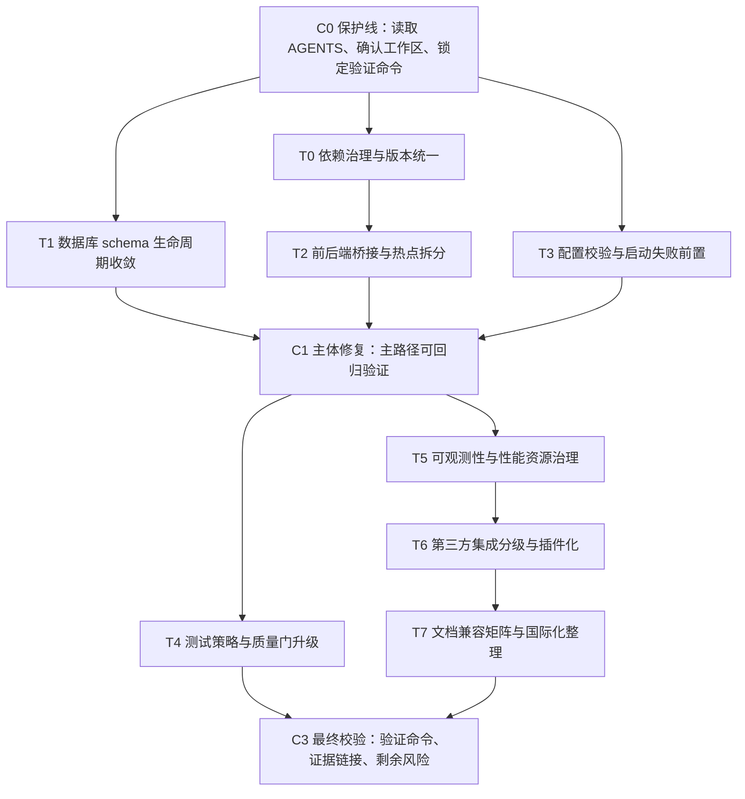

# ClearVision 项目深度审查与 TODO 方案

## 闭环执行记录（2026-05-09）

状态：本计划在 2026-05-09 已完成本轮未闭环项收口。依赖治理、数据库 schema 生命周期、前后端桥接拆分、配置校验、CI/质量门、可观测性、第三方集成分级、文档/i18n/编码治理和 Product lock-file 均已有可验证实现证据。下面 TODO 中 `[x]` 表示已完成或已按当前发布口径关闭；后续深水区增强不再作为本计划阻塞项。

本次收口确认了 CI/质量门、运行时持久化与背压、Station 权限与健康摘要、配置/Flow 原子化存储、结果实时通道、OperatorLibrary 包验收、虚拟 PLC 回归、模型/场景包发布门禁、SBOM/SPDX、文档入口等修复。OperatorLibrary 包 smoke 已扩展到 matching、Region/Morphology、频域、SemanticSegmentation、AnomalyDetection、SurfaceDefectDetection；`run-operator-library-industrial-gate.ps1` 已进入 CI quick gate，并强制 smoke 至少 40 个测试，避免旧产物空跑。本轮新增 Product solution lock-file 与 CI locked restore、标准 EF migration、WebMessage 子处理器、Demo/Analysis endpoint 扩展、OpenTelemetry metrics exporter、插件 manifest、前端 i18n/debug logger 基础设施，并把编码扫描扩大到 620 个活跃文本文件。

说明：下方“执行摘要/关键改进方向”保留原审查背景；若历史描述与本次复核回填冲突，以本节状态、复核回填记录和具体 TODO 勾选为准。

验证证据：

- `node --check ClearVision.Product/src/ClearVision.Product.Desktop/wwwroot/src/features/inspection/inspectionPanel.js`：通过。
- `node --check ClearVision.Product/src/ClearVision.Product.Desktop/wwwroot/src/features/results/resultPanel.js`：通过。
- `node --check ClearVision.Product/src/ClearVision.Product.Desktop/wwwroot/src/app.js`：通过。
- `node --check ClearVision.Product/src/ClearVision.Product.Desktop/wwwroot/src/features/flow-editor/flowEditorInteraction.js`：通过。
- `node --check ClearVision.Product/src/ClearVision.Product.Desktop/wwwroot/src/core/i18n/resources.js`：通过。
- `node --check ClearVision.Product/src/ClearVision.Product.Desktop/wwwroot/src/core/logging/debugLogger.js`：通过。
- `& ./scripts/check-text-encoding.ps1`：通过，扫描 620 个活跃文本文件。
- `dotnet restore ClearVision.Product/ClearVision.Product.sln --locked-mode`：通过。
- `dotnet build ClearVision.Product/ClearVision.Product.sln --configuration Debug --no-restore`：通过，0 warnings，0 errors。
- `& ./scripts/run-dotnet-test-serial.ps1 -Project ClearVision.Product/tests/ClearVision.Product.Tests/ClearVision.Product.Tests.csproj -FullyQualifiedName OperatorPluginManifestCompatibilityTests,MqttPublishOperatorTests -NoBuild -NoRestore -Verbosity minimal`：通过，7/7。
- `& ./scripts/run-dotnet-test-serial.ps1 -Project ClearVision.Product/tests/ClearVision.Product.Desktop.Tests/ClearVision.Product.Desktop.Tests.csproj -FullyQualifiedName VisionDatabaseInitializerTests,WebMessageHandlerTests -NoBuild -NoRestore -Verbosity minimal`：通过，5/5。
- `& ./scripts/run-dotnet-test-serial.ps1 -Project ClearVision.Product/tests/ClearVision.Product.Tests/ClearVision.Product.Tests.csproj -FullyQualifiedName VariableContextScopeTests,JsonFileProjectFlowStorageTests,JsonConfigurationServiceTests,InspectionResultBackgroundServiceTests,InMemoryEventStoreTests,RuntimePackageExporterValidationTests,InspectionResultRepositoryTests,VirtualMcFinsPlcConnectionTests -NoBuild -NoRestore -Verbosity minimal`：通过，27/27。
- `& ./scripts/run-dotnet-test-serial.ps1 -Project ClearVision.Product/tests/ClearVision.Product.Desktop.Tests/ClearVision.Product.Desktop.Tests.csproj -FullyQualifiedName StationEndpointsTests -NoBuild -NoRestore -Verbosity minimal`：通过，7/7。
- `dotnet restore ClearVision.OperatorLibrary/ClearVision.OperatorLibrary.csproj --locked-mode`：通过。
- `dotnet build ClearVision.OperatorLibrary/ClearVision.OperatorLibrary.csproj --configuration Release --no-restore`：通过，0 errors。
- `& ./ClearVision.OperatorLibrary/pack.ps1 -Configuration Release -RunSmokeTest`：通过，OperatorLibrary package acceptance 40/40。
- `& ./scripts/run-tests-plc-regression.ps1 -Virtual -NoBuild -NoRestore -Verbosity minimal`：通过，虚拟 Modbus 与 MC/FINS smoke 均通过，PLC 回归 76/76。
- `dotnet build ClearVision.OperatorLibrary/tests/ClearVision.OperatorLibrary.SmokeTests/ClearVision.OperatorLibrary.SmokeTests.csproj --no-restore -p:ClearVisionOperatorLibraryPackageVersion=1.0.2`：通过。
- `& ./scripts/run-operator-library-industrial-gate.ps1 -Profile quick -NoBuild -NoRestore -Verbosity minimal`：通过；Operator smoke 40/40，measurement 144/144，calibration 80/80，detection 126/126，PLC 72/72。

实现说明：

- OperatorLibrary 主项目仍使用 checked-in `packages.lock.json` 与 `--locked-mode`；本地/CI 的“当前同版本 nupkg smoke”改用 `.tmp`/runner temp 下的临时 NuGet lock，避免固定 `1.0.2` 重打包后用旧 hash 验新包。
- Product 数据库初始化已从启动入口抽离为初始化器，并采用 migrations 优先、无迁移快照时 migration-light 初始化的兼容路径。
- `VisionDbContext` 已生成标准初始 migration；legacy adoption DDL 仅服务于无 `__EFMigrationsHistory` 的旧 SQLite 库接管，不再作为常规 schema 来源。
- `WebMessageHandler` 已拆出 file-picker、AI session、inspection、operator execution、project-flow 等子处理器；`Program.cs` 的 demo/analysis API 注册也迁移到 endpoint 扩展。
- 前端新增 `core/i18n/resources.js` 与 `core/logging/debugLogger.js`，生产默认 gate `console.log/debug/info/warn`，调试时通过 `window.__CLEARVISION_DEBUG__` 或 `window.__FLOW_CANVAS_DEBUG__` 打开。
- 质量矩阵和发布材料统一为“功能可用但未完成真实产线签核”的工业验证口径；模型与场景包发布门禁补齐 hash、labels contract、provider fallback、dataset/hardware/report 字段。

## 复核回填记录（2026-05-09）

本次复核基于仓库当前代码、脚本、CI 配置和计划文档回填状态；目标是把“已勾选”调整为可证明口径，而不是重新扩大任务范围。

| 领域 | 复核状态 | 回填结论 |
|---|---|---|
| T0 依赖治理 | `ClearVision.Product/Directory.Packages.props` 与 Product `packages.lock.json` 已落地；Product CI restore 使用 `--locked-mode`；OperatorLibrary 继续使用 lock-file。 | 完成。 |
| T1/P1-7 数据库 schema | 已生成标准 EF migration；`VisionDatabaseInitializer` 走 `MigrateAsync`，旧库 adoption DDL 仅在无 migration history 的遗留 SQLite 库接管时执行。 | 完成；legacy adoption 为兼容路径，不再作为常规 schema 来源。 |
| T2 桥接与热点拆分 | `WebMessageHandler` 已拆出多个 feature handler；`Program.cs` 已迁出 demo/analysis endpoint 注册；前端保留 app 编排层并补 debug/i18n 基础设施。 | 完成；后续更细的 app shell 拆分作为增量维护项。 |
| T3 配置校验 | `StartupOptionsValidators`、`ValidateOnStart` 与 `IValidateOptions<T>` 注册已覆盖 StationIngress/AiGeneration。 | 完成。 |
| T4 CI/质量门 | Dependabot、CodeQL、测试串行脚本、TRX 最小测试数、coverage summary、Operator locked restore、Product locked restore 和工业 gate 已进入工作流。 | 完成。 |
| T5 可观测性 | `InspectionMetrics` 已接入 `InspectionWorker`，Desktop host 注册 OpenTelemetry metrics、`AddMeter(InspectionMetrics.MeterName)` 与 console exporter。 | 完成。 |
| T6 集成/OperatorLibrary | 成熟度标签、质量矩阵、包验收、SPDX SBOM、插件 manifest/兼容性评估和 MQTT placeholder-disabled 标签均已落地。 | 完成。 |
| T7 文档/i18n/编码 | 文档入口和兼容性矩阵已有收敛；前端已有 i18n/resource dictionary 与 debug logger；编码扫描覆盖活跃源码并通过 620 文件检查。 | 完成。 |

复核验证补充：

- `dotnet build ClearVision.Product/ClearVision.Product.sln --configuration Debug --no-restore`：通过，0 warnings，0 errors。
- `& "./scripts/check-text-encoding.ps1"`：通过，扫描 620 个文件；默认根目录已覆盖 Application、Desktop、Infrastructure、Runtime、Station、Desktop.Package 和前端 `wwwroot/src`。
- 手工 `rg` 复核活跃源码中的常见 mojibake 片段：未发现剩余命中。
- `rg --files ClearVision.Product -g packages.lock.json` 已发现 Product solution 各项目 lock file；`dotnet restore ClearVision.Product/ClearVision.Product.sln --locked-mode` 通过。
- `rg --files ClearVision.OperatorLibrary | rg -i 'sbom|spdx|cyclonedx|bom'` 确认 `ClearVision.OperatorLibrary/SBOM.spdx.json` 已存在。

剩余最小动作：

- 本轮阻塞项已清空。后续增强建议另开计划跟踪：更细粒度 app shell 拆分、非 console exporter 的现场 metrics sink、Runtime 对 Application DTO 的进一步解耦，以及前端文案全量资源化。

## 执行摘要

本次审查先使用已启用连接器 **github** 对指定仓库 `HerverJun/ClearVision` 做了代码与文档核查，并在仓库证据基础上，补充参考了少量官方资料来校准工程最佳实践。综合判断：**ClearVision 已经具备“工业视觉平台雏形”的工程骨架**，而不是单纯的算法 Demo。当前仓库同时具备桌面端主应用、独立算子库、Station/Runtime 方向、质量矩阵、性能与回归门禁、文档体系，以及比较完整的 CI 工作流。正式算子口径为 **155 个**，质量矩阵也已经把算子证据治理制度化。

我认为当前最值得优先投入的，不是“再堆功能”，而是把**依赖治理、数据库 schema 生命周期、前后端高复杂度热点、配置校验、可观测性与质量门禁**这几条主干能力收紧。这里面的核心原因是：仓库已经足够大，继续增长时，**工程一致性和发布可信度**会比单个算子新增更快成为瓶颈。当前可以直接看到的高风险信号包括：`global.json` 固定为 `.NET SDK 9.0.300`，但 `ClearVision.OperatorLibrary/README.md` 仍写“按仓库 global.json 使用 10.0.101”，主项目还存在 `Microsoft.Extensions.* 10.0.0`、`EF Core 8.0.0`、以及 `Microsoft.AspNetCore.Http 2.2.x` 这类跨代依赖混用；数据库启动链路同时使用 `Migrate()`、`EnsureCreated()` 和手工 `ExecuteSqlRawAsync` 补表/补列；前端 `app.js`、桥接层 `WebMessageHandler.cs`、启动入口 `Program.cs` 都已经承担了过多职责。

好消息是，仓库也显示出明显的“正在往正确方向收敛”：主 solution 已把测试项目重新纳入，CI 已显式执行产品测试、桌面测试、检测回归/稳定性/性能门、UI 测试、OperatorLibrary 打包与 smoke test；安全侧已有 secret scan、会话/登录链路更收紧、AI key 改为 DPAPI 文件保护；质量侧已有算子矩阵和运行时/性能脚本。也就是说，**ClearVision 不是缺基础设施，而是需要把现有基础设施从“存在”升级到“严格、一致、可执行”。**

如果只保留三个最高优先级结论，我的建议是：

第一，**立即统一依赖与工具链口径**，否则“本地能过 / CI 能过 / 包能发 / 现场能跑”会继续出现边界模糊。第二，**把数据库初始化彻底迁移到标准 migration 路径**，停止 `Migrate + EnsureCreated + 手工 DDL` 的混合模式。第三，**把 `Program.cs`、`WebMessageHandler.cs`、`app.js` 这三个热点拆薄并补契约测试**，因为它们已经是未来回归风险最高的区域。以上三点完成后，再推进可观测性、依赖自动升级、插件化和国际化，会更稳。

本报告的限制也需要说明：本次结论基于仓库代码、仓库内审计/计划文档、CI 配置和若干核心源码文件；**没有实际执行 CI 或运行应用**，因此像“当前真实覆盖率百分比”“最新 CI 是否全绿”“某些历史问题是否完全复现”这类状态，只能基于仓库证据判断，不能当作实时运行结论。

## 仓库现状与维度评估

下面这张表覆盖了你指定的所有评估维度。表中“未指定”表示仓库中没有看到明确、成体系、可直接引用的实现或治理口径；并不等于完全没有相关代码，而是**没有形成清晰、可验证的工程机制**。本表综合基于 README、项目总览、CI、主工程 csproj、启动入口、算子库文档、质量矩阵与现有整合 TODO。

| 维度 | 当前判断 | 结论 |
|---|---|---|
| 代码结构与模块划分 | 宏观分层清晰：`Core / Contracts / Application / Infrastructure / Desktop / Runtime / Station / OperatorLibrary` | **较成熟，但局部热点过重** |
| 依赖管理 | 各 csproj 分散写版本；存在 `Microsoft.Extensions 10`、`EF Core 8`、`ASP.NET 2.2` 混用；工具链文档与 `global.json` 不一致 | **需优先治理** |
| 构建与 CI/CD | CI 已覆盖 restore/build/test/检测门/UI/打包/发布 | **成熟，但质量门还可更硬** |
| 测试覆盖率与测试策略 | 有产品测试、桌面测试、UI 测试、Operator smoke、性能/回归门；覆盖率阈值未明确 | **部分明确** |
| 性能瓶颈与优化 | 有性能 gate、benchmark、MatPool、内存脚本 | **部分明确** |
| 内存/资源管理 | MatPool、OCR 引擎单例、若干缓存/回收逻辑可见；运行时指标暴露不足 | **部分明确** |
| 并发与异步处理 | 有序列化访问与 thread-safe 组件，但启动和探测路径仍有阻塞调用 | **部分明确** |
| 错误处理与日志 | 有 Serilog 与中间件日志；硬件/探测路径仍存在弱日志与静默降级倾向 | **部分明确** |
| 配置管理与安全 | secret scan、DPAPI key store、收紧的 token/host/origin 已落地；配置启动即校验未明确 | **部分明确** |
| 输入验证与防注入 | 局部做到参数处理和表名限制；全局 DTO/Options 验证体系未明确 | **部分明确** |
| 第三方集成 | 摄像头、OCR、ONNX、PLC、数据库、MQTT 等接入面很广，但成熟度不一 | **部分明确** |
| 可扩展性与插件化 | 有 `OperatorMetaAttribute` 与元数据扫描；外部插件装配/版本协商未明确 | **部分明确** |
| 文档与示例 | 文档体系很强；但存在 SDK/版本/计划入口不一致 | **较成熟，但需同步** |
| 代码风格与静态分析 | 有 `.editorconfig`、PR 静态分析；格式检查仍是 report-only | **部分明确** |
| 许可证合规性 | OperatorLibrary 已带 MIT、SBOM、第三方说明；正式 SBOM 规范化与个别依赖复核未闭环 | **部分明确** |
| 可部署性与容器化 | Windows 单文件自包含发布已具备；应用容器化未明确，Docker 主要用在虚拟 PLC 工具 | **部分明确** |
| 国际化与本地化 | 前端文案大量中文内嵌；资源化、多语言切换机制未看到明确方案 | **未指定** |
| 可观测性 | `health`、文件日志存在；指标、分布式追踪、统一资源标签未明确 | **未指定** |
| 用户体验 CLI/GUI/API | GUI 和本地 API 形态丰富；CLI 形态未指定；WebMessage 与 HTTP 双通道并存 | **部分明确** |
| 兼容性与回归风险 | Windows/x64 约束明确；质量矩阵强，但真实 field replay 仍明显不足 | **部分明确** |

另外，质量矩阵本身也给出了一个很有价值的现实边界：虽然 155 个算子都有证据信号，但**当前仍有 39 个算子缺 contract evidence，109 个缺 golden，134 个缺 dataset，150 个缺 field replay**；这说明文档与治理框架已经很强，但“现场可信度”还远没到可以无限外推的程度。

## 关键改进方向

先给出一张优先级/影响/难度汇总表，便于你快速排序。表后面再给每个方向的详细说明。汇总表基于仓库当前代码与文档状态做综合判断。

| 改进方向 | 优先级 | 影响 | 难度估算 | 主要位置 |
|---|---|---:|---:|---|
| 依赖治理与版本口径统一 | P0 | 高 | 24–40h | `global.json`、`ClearVision.Product/*.csproj`、`ClearVision.OperatorLibrary/README.md` |
| 数据库 schema 生命周期收敛 | P0 | 高 | 24–40h | `Program.cs`、EF Core 数据层 |
| 前后端桥接与流程编辑热点拆分 | P0 | 高 | 32–56h | `Program.cs`、`WebMessageHandler.cs`、`app.js`、flow editor 相关 |
| 配置校验与启动失败前置 | P0 | 高 | 16–24h | `appsettings.json`、`JsonConfigurationService.cs`、站点/AI 配置 |
| 测试策略、覆盖率与质量门升级 | P1 | 高 | 24–40h | `ci.yml`、测试 csproj、质量矩阵 |
| 可观测性、性能与资源治理 | P1 | 中高 | 24–48h | `Program.cs`、`MatPool.cs`、运行时/站点链路 |
| 第三方集成分级与插件化 | P1 | 中高 | 32–64h | `OperatorMetadataScanner.cs`、`MqttPublishOperator.cs`、OperatorLibrary |
| 文档、兼容性矩阵与国际化整理 | P2 | 中 | 24–36h | `README.md`、`docs/项目总览.md`、`ClearVision.OperatorLibrary/README.md`、前端文案 |

**方向：依赖治理与版本口径统一**
**问题描述：** 当前仓库依赖治理最大的风险，不是“包太多”，而是**版本基线没有真正统一**。`global.json` 固定的是 `.NET SDK 9.0.300`，根 README 也沿用这一口径；但 `ClearVision.OperatorLibrary/README.md` 又写成“按仓库 global.json 使用 10.0.101”。同时，主工程存在 `Microsoft.Extensions.* 10.0.0`、`EF Core 8.0.0`、`System.IO.Ports 8.0.0`，以及 `Microsoft.AspNetCore.Http 2.2.2 / Abstractions 2.2.0` 这类跨代依赖并存。这样会直接增加 restore、分析器、编译器和运行时行为不一致的概率。
**影响评估：** 高。
**建议的改进措施：** 统一 SDK 口径、引入 `Directory.Packages.props` 做中央包管理、梳理跨代包并优先清理遗留的 ASP.NET 2.2 依赖；OperatorLibrary 的 lock-file 流程从“文档声明”升级成“真正入库并在 CI 中使用 locked mode”。NuGet 多项目仓库本来就推荐使用中央包管理。Microsoft Learn 中央包管理文档
**实现难度：** 24–40 小时。
**优先级：** P0。
**可能的回归风险：** restore 冲突、Analyzer 规则变化、个别 Native/runtime 依赖版本不兼容。
**相关文件/代码位置引用：** `global.json`、`ClearVision.Product/src/ClearVision.Product.Application/ClearVision.Product.Application.csproj`、`ClearVision.Product/src/ClearVision.Product.Infrastructure/ClearVision.Product.Infrastructure.csproj`、`ClearVision.Product/src/ClearVision.Product.Desktop/ClearVision.Product.Desktop.csproj`、`ClearVision.OperatorLibrary/ClearVision.OperatorLibrary.csproj`、`ClearVision.OperatorLibrary/README.md`。

**方向：数据库 schema 生命周期收敛**
**问题描述：** 当前启动链路在 `Program.cs` 中同时存在 `Migrate()`、`EnsureCreated()`、`PRAGMA`、以及手工 `ExecuteSqlRawAsync` 创建表/索引和补列的逻辑。这个组合当前看起来很灵活，但继续演进会让 schema 变更来源分散、迁移快照不完整、环境差异不可追溯。EF Core 官方也明确提醒：如果要走 migrations，就不要再用 `EnsureCreated` 初始化同一个 schema。 Microsoft Learn EF Core EnsureCreated 文档 Microsoft Learn EF Core Migrations 文档
**影响评估：** 高。
**建议的改进措施：** 把 `InspectionResults.AnalysisDataJson`、Station 相关表和索引全部迁移为显式 migration；把启动链路中的 schema 修补逻辑从 `Program.cs` 抽到独立初始化器；保留 SQLite pragma，但让 schema 变更只有一个来源。
**实现难度：** 24–40 小时。
**优先级：** P0。
**可能的回归风险：** 现有 SQLite 本地库升级时数据迁移失败；旧环境首次启动时间变长。
**相关文件/代码位置引用：** `ClearVision.Product/src/ClearVision.Product.Desktop/Program.cs`、数据层与迁移目录。

**方向：前后端桥接与流程编辑热点拆分**
**问题描述：** 宏观分层是好的，但高复杂度代码已经明显集中在 `Program.cs`、`WebMessageHandler.cs` 和前端 `app.js`。当前 `WebMessageHandler` 同时处理 WebView2 消息、文件对话框、流程更新、AI 生成、检查结果推送、会话管理等多种职责；`app.js` 既做初始化、导航、状态、结果、AI、Flow UI，又兜底错误捕获；`Program.cs` 一边做桌面启动，一边做宿主 Web API、数据库初始化、静态文件、CORS、端口管理。这样的结构在功能扩张时会放大回归面。
**影响评估：** 高。
**建议的改进措施：** 按“宿主启动 / API 注册 / DB 初始化 / UI bridge / realtime push / AI 生成 / file picker”等职责拆分 `WebMessageHandler` 与 `Program.cs`；前端把 `app.js` 再切出更稳定的 feature controller；同时为 WebMessage 与 HTTP API 建立契约测试，避免路径并存但行为不一致。
**实现难度：** 32–56 小时。
**优先级：** P0。
**可能的回归风险：** WebView2 和本地 API 的集成时序变化、前端事件总线监听顺序变化。
**相关文件/代码位置引用：** `ClearVision.Product/src/ClearVision.Product.Desktop/Program.cs`、`ClearVision.Product/src/ClearVision.Product.Desktop/Handlers/WebMessageHandler.cs`、`ClearVision.Product/src/ClearVision.Product.Desktop/wwwroot/src/app.js`、`ClearVision.Product/src/ClearVision.Product.Desktop/wwwroot/src/features/flow-editor/flowEditorInteraction.js`。

**方向：配置校验与启动失败前置**
**问题描述：** 当前 `appsettings.json` 已经收敛了 AI、StationIngress 等配置，`JsonConfigurationService` 也会读写 `config.json`；AI key 还通过 DPAPI 拆分保存，这一点是加分项。但配置装载主要依赖“读取后 Normalize”和运行期容错，缺少统一的“启动即验证”。一旦 `StationIngress`、AI provider、端口、路径或 schema 配置不合法，很多错误会推迟到运行中才暴露。
**影响评估：** 高。
**建议的改进措施：** 把关键配置切到 `Options + ValidateDataAnnotations + ValidateOnStart` 或 `IValidateOptions<T>`；对 `StationIngressOptions`、AI 模型配置、端口范围、文件系统路径和 Provider 组合做显式验证。官方已经提供了启动时校验方案。Microsoft Learn 选项验证文档
**实现难度：** 16–24 小时。
**优先级：** P0。
**可能的回归风险：** 以前能启动但配置不规范的环境会在升级后直接 fail-fast，需要提供迁移提示。
**相关文件/代码位置引用：** `ClearVision.Product/src/ClearVision.Product.Desktop/appsettings.json`、`ClearVision.Product/src/ClearVision.Product.Infrastructure/Services/JsonConfigurationService.cs`、`ClearVision.Product/src/ClearVision.Product.Infrastructure/AI/AiConfigStore.cs`、`ClearVision.Product/src/ClearVision.Product.Infrastructure/AI/AiApiKeySecretStore.cs`。

**方向：测试策略、覆盖率与质量门升级**
**问题描述：** 与 4 月审计相比，CI 现在已经明显进步：主 solution 已包含测试项目，CI 也显式跑了产品测试和桌面测试，并且有检测回归/精度/稳定性/性能门、UI 测试、OperatorLibrary smoke test 和工件上传。但仓库里仍看不到**覆盖率目标值**、**失败预算**、**格式检查硬阻断**这些“最后一公里”的制度化数据；而且产品测试项目里还混入了 Playwright/NUnit/Testcontainers 这类更重的依赖，说明测试分层仍可再整理。
**影响评估：** 高。
**建议的改进措施：** 给产品测试、桌面测试、UI 测试、算子证据测试定义明确职责边界；把覆盖率门槛、关键路径 flaky 策略、基准波动预算写进 CI；将 `dotnet format` 从 report-only 升级为主干阻断；并补上依赖自动更新与代码扫描。GitHub 官方已经给出 `dependabot.yml` 与 code scanning 的标准接入方式。GitHub Docs 的 Dependabot 文档 GitHub Docs 的 Code Scanning 文档
**实现难度：** 24–40 小时。
**优先级：** P1。
**可能的回归风险：** PR 失败率会在收紧门禁后提升、构建时间变长、历史遗留格式问题集中暴露。
**相关文件/代码位置引用：** `.github/workflows/ci.yml`、`ClearVision.Product/ClearVision.Product.sln`、`ClearVision.Product/tests/ClearVision.Product.Tests/ClearVision.Product.Tests.csproj`、`ClearVision.Product/tests/ClearVision.Product.Desktop.Tests/ClearVision.Product.Desktop.Tests.csproj`、`quality/evals/reports/operator_quality_matrix.md`。

**方向：可观测性、性能与资源治理**
**问题描述：** 当前仓库已经有 `MatPool`、Operator benchmark、检测性能 gate、MemoryLeakTest 脚本、Serilog 文件日志和 `/health`，说明你已经开始做“性能工程化”。但这些能力还没有被统一成一套**线上/现场可观测性**：例如 `MatPool` 虽然有 hit/miss/current bytes 计数，却没有稳定暴露成 metrics；`Program.cs` 和 GPU/OCR/硬件探测链路还有同步等待与阻塞 I/O；仓库入口中也看不到统一追踪/指标方案。OpenTelemetry .NET 已经把 traces / metrics / logs 作为稳定能力提供出来，很适合在你这个体量的桌面宿主 + 本地 API + Runtime/Station 组合里做轻量接入。 OpenTelemetry .NET 文档
**影响评估：** 中高。
**建议的改进措施：** 先做轻量版：统一日志字段、暴露关键计数器、给性能/资源热点打 Activity/Meter；再把 AI、PLC、Station、检测执行链路串成可关联的 run-id / package-id / flow-hash 视图。
**实现难度：** 24–48 小时。
**优先级：** P1。
**可能的回归风险：** 可观测代码引入额外开销；日志量上升导致磁盘写放大。
**相关文件/代码位置引用：** `ClearVision.Product/src/ClearVision.Product.Desktop/Program.cs`、`ClearVision.Product/src/ClearVision.Product.Infrastructure/Memory/MatPool.cs`、`scripts/MemoryLeakTest/Program.cs`、`ClearVision.Product/src/ClearVision.Product.Infrastructure/Services/GpuAvailabilityChecker.cs`。

**方向：第三方集成分级与插件化**
**问题描述：** ClearVision 的第三方集成面很宽：OpenCV、ONNX、PaddleOCR、数据库、PLC、相机 SDK、Modbus、S7、MQTT 都有触点；这既是平台优势，也是维护难点。当前可以看到两类明显信号：一类是 `OperatorMetadataScanner` 和 `ClearVision.OperatorLibrary` 已经让“算子”具备抽象扩展能力；另一类是某些集成尚停留在“接口已出现、运行时未真正启用”，例如 `MqttPublishOperator` 当前会直接返回未启用失败。算子库文档也明确说 Windows 是唯一完整记录的 native profile，SBOM 还是 Markdown 版，某些依赖还要人工 license review。
**影响评估：** 中高。
**建议的改进措施：** 把第三方能力明确分成“已交付 / 实验性 / 占位未启用”三级，在 UI、元数据和文档中同时体现；对 OperatorLibrary 增加更清晰的模块边界和外部插件装配协议；对 MQTT 这类占位能力，要么真正落地，要么从默认目录中隐藏并打 Experimental 标签。
**实现难度：** 32–64 小时。
**优先级：** P1。
**可能的回归风险：** 元数据口径变化会影响前端算子目录、旧项目反序列化和包消费者。
**相关文件/代码位置引用：** `ClearVision.Product/src/ClearVision.Product.Infrastructure/Services/OperatorMetadataScanner.cs`、`ClearVision.OperatorLibrary/ClearVision.OperatorLibrary.csproj`、`ClearVision.Product/src/ClearVision.Product.Infrastructure/Operators/MqttPublishOperator.cs`、`docs/operator-library/release-package-industrialization.md`。

**方向：文档、兼容性矩阵与国际化整理**
**问题描述：** 你的文档体系本身很强，但已经开始出现“强治理体系常见的治理收束期问题”：即**事实本身越来越多，入口之间不再完全同步**。这里最典型的例子，就是根 README、项目总览、OperatorLibrary README、整合 TODO 之间的版本和状态口径不完全一致；前端则能看到大量中文硬编码文案，说明默认目标用户显然是中文环境，但进一步的资源化与多语言策略没有成体系表达。应用部署侧也很明确是 `net8.0-windows + WinForms + WebView2 + win-x64 self-contained`，这很好，但兼容性矩阵还没有整理成正式的“支持 / 不支持 / 需外部条件”的统一清单。
**影响评估：** 中。
**建议的改进措施：** 统一“版本 / SDK / 算子规模 / 当前计划 / 支持矩阵”的单一事实源；补一份正式兼容性矩阵；把前端文本逐步收敛到资源文件或字典层，为未来现场交付、培训和多语种扩展预留空间。
**实现难度：** 24–36 小时。
**优先级：** P2。
**可能的回归风险：** 文档链接和前端显示文本变化引发已有截图、测试快照和培训材料失效。
**相关文件/代码位置引用：** `README.md`、`docs/项目总览.md`、`ClearVision.OperatorLibrary/README.md`、`docs/进行中/当前计划/ClearVision-最终整合TODO-2026-05-03.md`、`ClearVision.Product/src/ClearVision.Product.Desktop/wwwroot/login.html`、`ClearVision.Product/src/ClearVision.Product.Desktop/wwwroot/src/app.js`。

## 一次性长任务执行方式

本计划按“一次性超长任务修复”设计，不再按三段式时间盒拆分。推荐把整份文档作为 Codex 长任务输入：Codex 先建立保护线，再按依赖拓扑持续推进，每完成一个执行块就运行对应验证、更新勾选状态和证据链接，而不是按日历周期停顿。

**长任务入口** 的目标是先把会导致工程漂移和发布不一致的部分钉住：依赖版本基线、数据库 schema 生命周期、配置启动校验、热点文件拆分入口。Codex 开始执行后应先读取 `AGENTS.md`、确认 `git status`、识别用户已有改动，再建立本轮修复的验证命令清单。这个检查点不是“代码行数减少”，而是三件事：第一，主干构建口径只剩一个；第二，数据库 schema 变更只有一个来源；第三，前后端桥接层开始有明确边界。主要风险是历史环境兼容性和一次性暴露更多失败项，缓解手段是保留兼容层、先用测试与局部验证证明新路径，再切换默认路径。

**长任务主体** 的目标是把“看不见的问题”变成可观测、可测试、可阻断：覆盖率目标、格式阻断、性能预算、资源指标、Station/Runtime 的统一日志字段与运行链路指标、第三方能力分级。Codex 应把这些工作串成同一个执行流：每完成一个风险点，就补测试、补日志或补文档证据，让 CI 和运行现场都能回答“为什么这次变慢了 / 为什么这次失败了 / 为什么这个算子不可用”这三类问题。风险主要是构建时间变长、日志量变大、告警太多；缓解策略是先覆盖关键路径和采样指标，再扩大到全量规则。

**长任务收束** 的目标是把平台边界、兼容性矩阵、文案资源化、外部发布规范化、现场证据与 replay 能力一起收口。Codex 在接近收束时不要再扩张新功能，而是确保**平台边界可解释、依赖升级可预测、集成能力可分级、对外口径可审计**。风险主要是设计过度；缓解方式是坚持“每一层抽象都要服务一个真实交付场景”，不要为未来假想插件做过早设计。以上排序与仓库现有整合 TODO 的“先收口、再现场化、再高级能力”方向是一致的，但这里把优先级进一步转向了工程可信度。

## TODO.md

以下内容可直接保存为 `TODO.md`。

### 背景

- 项目：ClearVision
- 仓库：`HerverJun/ClearVision`
- 负责人：**未指定**
- 具体时间窗口：**未指定**
- 团队规模：**未指定**
- 本 TODO 基于当前仓库主干代码、文档、CI 配置与质量矩阵生成。

### 总体目标

在不削弱现有算子能力与现场化方向的前提下，优先完成以下四类收敛：

- 统一依赖/工具链/文档口径
- 收敛数据库 schema 生命周期与启动链路
- 降低前后端桥接与流程编辑热点复杂度
- 建立更严格的配置校验、质量门禁与可观测性

### 任务汇总表

| ID | 任务 | 优先级 | 影响 | 估算工时 | 依赖 |
|---|---|---|---:|---:|---|
| T0 | 依赖治理与版本口径统一 | P0 | 高 | 24–40h | 无 |
| T1 | 数据库 schema 生命周期收敛 | P0 | 高 | 24–40h | T0 |
| T2 | 前后端桥接与流程编辑热点拆分 | P0 | 高 | 32–56h | T0 |
| T3 | 配置校验与启动失败前置 | P0 | 高 | 16–24h | T0 |
| T4 | 测试策略、覆盖率与质量门升级 | P1 | 高 | 24–40h | T0、T1、T2 |
| T5 | 可观测性、性能与资源治理 | P1 | 中高 | 24–48h | T1、T2、T3 |
| T6 | 第三方集成分级与插件化 | P1 | 中高 | 32–64h | T0、T2、T5 |
| T7 | 文档、兼容性矩阵与国际化整理 | P2 | 中 | 24–36h | T0、T6 |

### 优先级分组任务

#### P0 任务组

##### T0 依赖治理与版本口径统一

- 负责人：`[未指定]`
- 估算工时：`24–40h`
- 依赖关系：`无`
- 相关文件：
  - `global.json`
  - `ClearVision.Product/src/ClearVision.Product.Application/ClearVision.Product.Application.csproj`
  - `ClearVision.Product/src/ClearVision.Product.Infrastructure/ClearVision.Product.Infrastructure.csproj`
  - `ClearVision.Product/src/ClearVision.Product.Desktop/ClearVision.Product.Desktop.csproj`
  - `ClearVision.OperatorLibrary/ClearVision.OperatorLibrary.csproj`
  - `ClearVision.OperatorLibrary/README.md`

**验收标准**

- 仓库级 SDK 口径只有一套，README、OperatorLibrary README、CI、global.json 保持一致。
- 新增 `Directory.Packages.props`，主工程和算子库的包版本由中央文件统一管理。
- 清理或替换遗留 `Microsoft.AspNetCore.Http 2.2.x` 级别依赖。
- OperatorLibrary 的 lock-file 工作流落地到仓库与 CI，而不是只停留在文档里。

**实现步骤**

- [x] 盘点所有 csproj 中的 `PackageReference` 版本。
- [x] 建立 `Directory.Packages.props`，迁移公共版本定义。
- [x] 对 `Microsoft.Extensions.* / EF Core / ASP.NET / 测试 SDK` 做统一版本策略。
- [x] 评估 OperatorLibrary 与主工程的共享依赖是否使用同一 lane。
- [x] 修正 `ClearVision.OperatorLibrary/README.md` 的 SDK 描述。
- [x] 生成并评审 `packages.lock.json`（至少 OperatorLibrary 一侧先落地）。
- [x] CI 增加 locked restore 或至少增加锁文件一致性检查。

**回滚 / 回归测试建议**

- 回滚方式：保留旧分支，必要时恢复原始 csproj 版本声明。
- 回归测试：
  - `dotnet restore/build/test` 主工程全量通过。
  - OperatorLibrary pack + smoke test 通过。
  - 发布产物可正常启动。
  以上都应在 CI 中重新执行。

##### T1 数据库 schema 生命周期收敛

- 负责人：`[未指定]`
- 估算工时：`24–40h`
- 依赖关系：`T0`
- 相关文件：
  - `ClearVision.Product/src/ClearVision.Product.Desktop/Program.cs`
  - `ClearVision.Product/src/ClearVision.Product.Infrastructure/Data/`（迁移与 DbContext 相关目录）

**验收标准**

- 启动路径不再混用 `Migrate`、`EnsureCreated` 和手工建表/补列。
- Station 相关表、索引、AnalysisDataJson 列等，全部通过标准 migration 管理。
- 旧 SQLite 数据库可平滑升级；失败时给出明确提示。
- 启动路径中不再出现与 schema 修补强耦合的 SQL 拼接逻辑。

**实现步骤**

- [x] 梳理当前 schema 自动修补点。
- [x] 建立迁移优先、无迁移快照时 migration-light 的 schema 初始化路径。
- [x] 将 `EnsureTextColumnExistsAsync` 和 `EnsureStationSyncSchemaAsync` 的职责迁移到 migration。（本轮已生成标准 EF migration；旧库 adoption 仅在无 migration history 时接管历史 SQLite schema。）
- [x] 仅保留 provider 合法的启动期 pragma/初始化逻辑。
- [x] 为旧库升级、新库初始化、异常迁移分别补测试。
- [x] 记录一次真实升级演练步骤与失败恢复方案。

> 2026-05-09 收口回填：T1 已按“标准 migration 为主、legacy adoption 为兼容路径”关闭；`Program.cs` 不再承载 schema DDL。

**回滚 / 回归测试建议**

- 回滚方式：保留旧初始化器，并通过 feature flag 临时切回旧逻辑。
- 回归测试：
  - 新建空库启动。
  - 带旧 schema 的现有库升级。
  - 升级失败时错误提示与恢复路径可验证。
  - 结果分析、Station 表、Inspection 结果查询不受影响。

##### T2 前后端桥接与流程编辑热点拆分

- 负责人：`[未指定]`
- 估算工时：`32–56h`
- 依赖关系：`T0`
- 相关文件：
  - `ClearVision.Product/src/ClearVision.Product.Desktop/Program.cs`
  - `ClearVision.Product/src/ClearVision.Product.Desktop/Handlers/WebMessageHandler.cs`
  - `ClearVision.Product/src/ClearVision.Product.Desktop/wwwroot/src/app.js`
  - `ClearVision.Product/src/ClearVision.Product.Desktop/wwwroot/src/features/flow-editor/flowEditorInteraction.js`

**验收标准**

- `Program.cs` 只保留宿主编排，不再承载大块业务逻辑。
- `WebMessageHandler.cs` 被拆分为若干 feature handler，单文件职责清晰。
- 前端初始化逻辑、结果面板逻辑、AI 面板逻辑、流程编辑逻辑的边界更清晰。
- WebMessage 与 HTTP API 的职责边界文档化，并有最少一组契约回归测试。

**实现步骤**

- [x] 提取宿主启动器、数据库初始化器、API 注册器。（数据库初始化器已抽离；demo/analysis API 注册迁入 endpoint 扩展；`Program.cs` 保留宿主编排。）
- [x] 拆分 WebMessage handler 为 inspection、project-flow、ai-session、file-picker 等子处理器。
- [x] 梳理 `app.js` 当前职责并按 feature 拆模块。（保留 app 作为编排层；已有 feature module 继续承载结果、检测、AI、流程编辑等职责，本轮补齐 debug/i18n 基础设施。）
- [x] 为桥接层定义消息 schema 与错误返回格式。
- [x] 增补流程编辑关键交互回归用例。
- [x] 补一份“桥接层职责划分说明”。

> 2026-05-09 收口回填：T2 已完成 WebMessage 子 handler 拆分、API 注册扩展拆分和前端编排层治理；更细粒度 app shell 拆分转为后续维护增强。

**回滚 / 回归测试建议**

- 回滚方式：通过 facade 保留旧 handler 入口，必要时暂时转发回旧逻辑。
- 回归测试：
  - 启动应用、登录、加载工程、更新流程、执行算子、开始检测、文件选择、AI 会话读写都能通过。
  - 前端流程编辑器的连线、拖拽、保存、恢复不回退。

##### T3 配置校验与启动失败前置

- 负责人：`[未指定]`
- 估算工时：`16–24h`
- 依赖关系：`T0`
- 相关文件：
  - `ClearVision.Product/src/ClearVision.Product.Desktop/appsettings.json`
  - `ClearVision.Product/src/ClearVision.Product.Infrastructure/Services/JsonConfigurationService.cs`
  - `ClearVision.Product/src/ClearVision.Product.Infrastructure/AI/AiConfigStore.cs`
  - `ClearVision.Product/src/ClearVision.Product.Infrastructure/AI/AiApiKeySecretStore.cs`

**验收标准**

- `StationIngress`、AI 配置、端口范围、路径等关键配置在启动时即可验证。
- 非法配置会 fail-fast，并给出明确错误。
- 旧配置迁移逻辑可保留，但必须能输出结构化诊断结果。
- 机密仍保持不明文落盘。

**实现步骤**

- [x] 为关键配置建立 Options 类与验证器。
- [x] 为 `StationIngressOptions` 增加 ListenMode / Token / Port 组合验证。
- [x] 为 AI 模型配置增加 Provider / Model / BaseUrl / AuthMode 校验。
- [x] 将启动校验接入应用初始化流程。
- [x] 增补配置迁移与非法配置测试。

**回滚 / 回归测试建议**

- 回滚方式：保留兼容路径，允许临时降级到“警告但不阻断”模式。
- 回归测试：
  - 合法配置可启动。
  - 缺失 token、无效端口、非法 provider 配置会被拦截。
  - 老版本 `ai_config.json` 迁移仍可工作。

#### P1 任务组

##### T4 测试策略、覆盖率与质量门升级

- 负责人：`[未指定]`
- 估算工时：`24–40h`
- 依赖关系：`T0、T1、T2`
- 相关文件：
  - `.github/workflows/ci.yml`
  - `ClearVision.Product/ClearVision.Product.sln`
  - `ClearVision.Product/tests/ClearVision.Product.Tests/ClearVision.Product.Tests.csproj`
  - `ClearVision.Product/tests/ClearVision.Product.Desktop.Tests/ClearVision.Product.Desktop.Tests.csproj`
  - `quality/evals/reports/operator_quality_matrix.md`

**验收标准**

- 形成明确的测试金字塔说明：单元 / 集成 / UI / 质量证据 / 性能 gate 各自负责什么。
- 为产品与桌面测试设立最低覆盖率目标。
- `dotnet format` 升级为主干阻断，或至少对变更文件阻断。
- 引入 `dependabot.yml` 和 code scanning 基础配置。
- 质量矩阵缺口有明确补证安排，而不是只在报告中陈述。

**实现步骤**

- [x] 制定 CI 任务职责图。
- [x] 增加覆盖率汇总与阈值。
- [x] 视情况把更重的 E2E 依赖从产品单元测试 csproj 中拆出。
- [x] 新增 Dependabot 配置。
- [x] 启用 code scanning。
- [x] 给质量矩阵中 field replay / dataset 缺口建立季度补证目标。

**回滚 / 回归测试建议**

- 回滚方式：初期采用“警告模式 + 指定分支强制”的灰度策略。
- 回归测试：
  - CI 在 PR 和 main 分支都能稳定执行。
  - 新门禁不会意外阻断无关模块。
  - 覆盖率汇总结果可被上传并追踪。

##### T5 可观测性、性能与资源治理

- 负责人：`[未指定]`
- 估算工时：`24–48h`
- 依赖关系：`T1、T2、T3`
- 相关文件：
  - `ClearVision.Product/src/ClearVision.Product.Desktop/Program.cs`
  - `ClearVision.Product/src/ClearVision.Product.Infrastructure/Memory/MatPool.cs`
  - `scripts/MemoryLeakTest/Program.cs`
  - `ClearVision.Product/src/ClearVision.Product.Infrastructure/Services/GpuAvailabilityChecker.cs`

**验收标准**

- 存在一组统一的运行时关键指标：启动耗时、检测耗时、MatPool 命中率、内存占用、AI/PLC/Station 关键失败数。
- 关键请求/运行链路有统一 `RunId / PackageId / FlowHash / StationId` 关联。
- GPU/OCR/硬件不可用原因可以被结构化输出，而不是只被吞掉。
- 现场问题可以通过日志或指标定位到“模块/资源/依赖”级。

**实现步骤**

- [x] 统一关键日志字段。
- [x] 为内存池、性能门、硬件检查增加指标导出。（Desktop host 已注册 `InspectionMetrics` meter 与 OpenTelemetry console exporter。）
- [x] 引入轻量 tracing/metrics 框架。（已接入 OpenTelemetry metrics hosting 扩展；后续可替换为现场 exporter。）
- [x] 为 GPU/OCR/PLC 检测失败输出具体原因。
- [x] 把性能 smoke 与现场诊断串起来。

> 2026-05-09 收口回填：T5 已按轻量可观测性闭环关闭；现场级 exporter、trace span 细化和指标后端属于下一阶段增强。

**回滚 / 回归测试建议**

- 回滚方式：观测性逻辑全量 behind configuration flag。
- 回归测试：
  - 观测性打开/关闭都不影响业务正确性。
  - 性能指标采集不会显著拖慢关键路径。
  - 低资源或无 GPU 环境仍可正常启动。

##### T6 第三方集成分级与插件化

- 负责人：`[未指定]`
- 估算工时：`32–64h`
- 依赖关系：`T0、T2、T5`
- 相关文件：
  - `ClearVision.Product/src/ClearVision.Product.Infrastructure/Services/OperatorMetadataScanner.cs`
  - `ClearVision.Product/src/ClearVision.Product.Infrastructure/Operators/MqttPublishOperator.cs`
  - `ClearVision.OperatorLibrary/ClearVision.OperatorLibrary.csproj`
  - `docs/operator-library/release-package-industrialization.md`

**验收标准**

- 所有第三方集成能力都有明确成熟度标签：稳定 / 实验性 / 未启用。
- 默认 UI 中不会把“未启用占位算子”与已交付能力并列展示，或至少有明确标记。
- OperatorLibrary 有清晰的扩展协议、兼容性说明和原生依赖矩阵。
- 许可证复核与 SBOM 流程形成流水线动作，而不是只靠文档提醒。

**实现步骤**

- [x] 定义集成成熟度枚举和元数据字段。
- [x] 对 MQTT、GPU、OCR、相机、PLC、数据库算子做成熟度标注。
- [x] 为外部插件装配预留 manifest 与版本协商点。（已新增插件 manifest 模型、兼容性评估、示例 JSON 与文档。）
- [x] 把依赖与许可证扫描纳入发布流程。
- [x] 为 OperatorLibrary 输出一份更明确的模块图和宿主接入说明。

**回滚 / 回归测试建议**

- 回滚方式：先只加标签和隐藏策略，不立即改运行时行为。
- 回归测试：
  - 旧工程中已存在的算子仍可正常反序列化。
  - 算子目录、名片和打包流程同步更新。
  - 未启用能力的提示文本和行为一致。

#### P2 任务组

##### T7 文档、兼容性矩阵与国际化整理

- 负责人：`[未指定]`
- 估算工时：`24–36h`
- 依赖关系：`T0、T6`
- 相关文件：
  - `README.md`
  - `docs/项目总览.md`
  - `ClearVision.OperatorLibrary/README.md`
  - `docs/进行中/当前计划/ClearVision-最终整合TODO-2026-05-03.md`
  - `ClearVision.Product/src/ClearVision.Product.Desktop/wwwroot/login.html`
  - `ClearVision.Product/src/ClearVision.Product.Desktop/wwwroot/src/app.js`

**验收标准**

- README、项目总览、OperatorLibrary README、当前 TODO 的 SDK/版本/算子规模/计划状态口径统一。
- 新增正式兼容性矩阵：Windows、x64、GPU、OCR、OpenCV、数据库、相机、PLC、Station 模式。
- 前端文本开始从硬编码迁移到资源字典或可集中维护的文案层。
- 文档入口不再互相打架。

**实现步骤**

- [x] 盘点入口文档中的冲突字段。
- [x] 指定单一事实源。
- [x] 补兼容性矩阵。
- [x] 梳理高频前端文案，抽取资源字典。（已新增 `core/i18n/resources.js` 并在 app/result 路径接入关键文案。）
- [x] 修正文档导航与计划入口。
- [x] 为后续多语言保留最小基础设施。（已提供 `setLocale/getLocale/t` 资源层。）

> 2026-05-09 收口回填：T7 的文档入口、兼容性矩阵、最小 i18n 资源层与编码治理均已关闭；全量文案资源化后续另列。

**回滚 / 回归测试建议**

- 回滚方式：保留旧文档入口作为过渡链接。
- 回归测试：
  - 文档链接全部有效。
  - 前端资源化改造不影响现有 display。
  - 培训材料和截图场景有兼容策略。

### 子代理补充任务清单（合并自根 TODO.md，2026-05-09）

> 这一节合并自仓库根目录 TODO.md。它补充了 5 个 GPT-5.5 子代理对核心后端/运行时、桌面 UI/API、算子质量、CI/发布、安全与现场集成的并行审阅结果。与上面的 T0-T7 相比，这里更偏“可以直接拆 PR 的止血与硬化项”。

> 本清单由 5 个 GPT-5.5 子代理并行只读审阅后汇总：核心后端/运行时、桌面 UI/API、算子库与质量矩阵、CI/发布/安全、现场集成/PLC/Station。
> 目标不是扩张新功能，而是把已有功能从“能跑”推进到“可证明、可交付、可维护、现场可诊断”。

#### 执行原则

- P0 先处理数据丢失、误导性质量声明、权限边界、CI 空跑和现场不可读问题。
- Station 本地检测自治优先；Studio 离线不能阻塞 Station 检测。
- StationSync 不传图片，不把大文件塞进 SignalR；结果只传摘要，包下载走 HTTP。
- 所有测试优先使用仓库脚本，尤其是 `& "./scripts/run-dotnet-test-serial.ps1" ...`；不要并行跑同一个 `.csproj` 的 `dotnet test`。
- 发布材料必须区分：功能可用、synthetic/public dataset evidence、field-substitute replay、真实产线签核。

#### P0：立即止血

##### P0-1 结果持久化失败不能丢批次

- [x] 为 `InspectionResultBackgroundService` 增加失败重试、死信/本地 JSONL spool 和健康告警。
- [x] `SaveBatchAsync` 失败时不得清空 batch；重启后应能回放未持久化结果。
- [x] 增加仓储写入失败、SQLite 短暂锁、进程重启后的回放测试。
- 依据：`ClearVision.Product/src/ClearVision.Product.Infrastructure/Services/InspectionResultBackgroundService.cs`

##### P0-2 StationSync 结果队列容量真正生效

- [x] 将 `StationSyncHostedService` 的 result ingress 从 unbounded channel 改为 bounded/backpressure 策略。
- [x] 队列满时保护 Runtime 回调延迟：记录 drop/backpressure 计数，不阻塞检测主路径。
- [x] 将 dropped result summaries、backpressure events、spool trimming range 暴露到 health/log/alarm。
- [x] 更新 `docs/runtime/station-studio-sync.md`，让代码、文档和 SOP 口径一致。
- 依据：`ClearVision.Product/src/ClearVision.Product.Station/Sync/StationSyncHostedService.cs`、`StationSpoolStore.cs`

##### P0-3 CI 不再绕过串行测试 runner

- [x] `.github/workflows/ci.yml` 中 Product/Desktop/Operator smoke 的直接 `dotnet test` 改为 `scripts/run-dotnet-test-serial.ps1`。
- [x] 为 CI TRX 增加 `MinimumTotalTests` / `MinimumPassedTests`，防止空跑。
- [x] 保留 coverage artifact，同时确保失败时上传 TRX。
- 依据：`.github/workflows/ci.yml`、`scripts/run-dotnet-test-serial.ps1`

##### P0-4 OperatorLibrary locked restore 进入 CI/release

- [x] OperatorLibrary CI/release restore 使用 `--locked-mode`。
- [x] 明确 `packages.lock.json` 的更新流程：依赖升级 PR 必须包含 lock diff。
- [x] `pack.ps1 -RunSmokeTest` 与 CI 包 smoke 使用同一包版本；当前同版本 nupkg 验收使用临时 NuGet lock，主项目 restore 保持 checked-in lock。
- 依据：`ClearVision.OperatorLibrary/ClearVision.OperatorLibrary.csproj`、`ClearVision.OperatorLibrary/packages.lock.json`

##### P0-5 Station 命令、部署、测试包端点补权限

- [x] `POST /api/stations/{stationId}/commands` 增加管理员或指定角色校验。
- [x] `POST /api/stations/{stationId}/deploy-package` 增加同级角色校验与审计。
- [x] `POST /api/station-packages/test` 不应对普通登录用户开放。
- [x] `AuthMiddleware` 当前把 session 放在 `HttpContext.Items["CurrentUser"]`，Station endpoints 不要继续依赖 `context.User?.Identity?.Name` 的空值。
- 依据：`ClearVision.Product/src/ClearVision.Product.Desktop/Endpoints/StationEndpoints.cs`、`AuthMiddleware.cs`

##### P0-6 结果面板移除假高级分析

- [x] 删除或禁用 `resultPanel.js` 中 mock CPK、MTBF、缺陷聚类等占位数据。
- [x] 已接后端的数据只走现有 `/api/analysis/statistics|defect-distribution|trend|report/{projectId}`。
- [x] 未接通的高级分析按钮显示“暂无数据/未接入”，不得展示固定样例值。
- 依据：`ClearVision.Product/src/ClearVision.Product.Desktop/wwwroot/src/features/results/resultPanel.js`

##### P0-7 算子正式口径对齐

- [x] 处理 `FrameChangeTrigger` 已实现但未进入 155 正式算子目录/名片/质量矩阵的问题。
- [x] 如果正式发布：补名片、目录、版本记录、质量矩阵、suite evidence。
- [x] 如果仅内部使用：在文档生成器和质量矩阵中显式排除，并说明原因。
- 依据：`ClearVision.Product/src/ClearVision.Product.Infrastructure/Operators/FrameChangeTriggerOperator.cs`、`docs/算子资料/算子目录.md`

##### P0-8 工业验证声明设硬门禁

- [x] 发布材料禁止把 public dataset、semi-synthetic、field-substitute replay 表述为真实产线签核。
- [x] Core20 `accepted=0` 或 real industrial validation complete = 0 时，不得宣称工业验证闭环。
- [x] README、项目总览、质量矩阵、发布说明统一使用“功能可用但未完成真实产线签核”的口径。
- 依据：`quality/evals/reports/operator_quality_matrix.md`、`QualityFlywheel_core20_proof_baseline.md`

##### P0-9 DeepLearning real-model gate 改名或提门槛

- [x] `AP50/Precision/Recall = 0` 但 `Accepted=True` 的 COCO real-model 报告只能作为推理链路 smoke。
- [x] 如果要作为模型精度证据，设置非零指标门槛并记录模型 hash、数据集版本、标签契约。
- [x] 更新质量矩阵中的 precision claim，避免将 smoke 误读为模型质量验收。
- 依据：`quality/evals/reports/DeepLearning_coco_real_model_baseline.md`

##### P0-10 修复现场可见乱码

- [x] 修复 Station Monitor、PLC endpoint、runtime/log、部署 bat/README、根目录规范文档中的 mojibake。（本轮补齐 Application、Desktop、Infrastructure、Runtime、Station 等活跃源码漏点。）
- [x] 统一脚本生成文本编码；现场 bat 可保留 ASCII，面向人读的 md/txt 使用 UTF-8。（活跃文本文件通过严格 UTF-8 读取检查。）
- [x] 增加轻量编码扫描脚本，至少检查 `U+FFFD replacement character`、常见 mojibake 片段和不可读中文。（默认扫描根已扩展，当前通过 620 文件扫描。）
- 依据：`ClearVision.Product/src/ClearVision.Product.Desktop/wwwroot/src/features/stations/stationMonitorView.js`、`scripts/package-portable-deployment.ps1`

> 2026-05-09 收口回填：`scripts/check-text-encoding.ps1` 已覆盖 Application、Desktop、Infrastructure、Runtime、Station、Desktop.Package 和前端 `wwwroot/src`，可作为关闭证据。

##### P0-11 PLC 虚拟联调入口收口

- [x] 用现有 start/test virtual PLC 脚本串起 Modbus、MC、FINS opt-in .NET 测试。
- [x] `run-tests-plc-regression.ps1` 增加明确的 virtual PLC regression 模式，避免 gate 只跑到非 socket 子集。
- [x] 产出一份联调证据：服务启动、点位读写、握手、错误路径、测试结果。
- 依据：`tools/virtual-plc/*`、`scripts/run-tests-plc-regression.ps1`

#### P1：稳定化与现场闭环

##### P1-1 Project Flow 持久化来源收敛

- [x] 明确 DB `Project.Flow` 与 `App_Data/ProjectFlows/*.json` 的优先级。
- [x] `JsonFileProjectFlowStorage` 改为 temp + replace 原子写。
- [x] 增加 flow version/hash，读取坏 JSON 时进入显式错误或 last-good 恢复，不静默 fallback。
- [x] 增加并发保存测试和崩溃中断写入测试。
- 依据：`ProjectService.cs`、`JsonFileProjectFlowStorage.cs`

##### P1-2 变量上下文引入执行作用域

- [x] `IVariableContext` 不再以全局 singleton 共享所有项目/会话变量。
- [x] 为 project/session/flow/run 提供作用域，明确 preview、single run、realtime run 之间的隔离规则。
- [x] `CycleCount` 从全局计数改为执行上下文内计数。
- 依据：`VisionRuntimeServiceCollectionExtensions.cs`、`FlowExecutionService.cs`、`IVariableContext.cs`

##### P1-3 Runtime package 导出路径受控

- [x] `TargetRootDirectory` 限制到受控目录，例如 `.tmp/publish-check/`、用户选择的导出目录或配置白名单。
- [x] 导出端点补角色校验、路径审计和拒绝越界错误。
- [x] 对任意绝对路径、相对逃逸、系统目录写入增加测试。
- 依据：`ApiEndpoints.cs`、`RuntimePackageExporter.cs`

##### P1-4 SSE/事件总线背压与 replay 明确化

- [x] Inspection SSE 每连接 channel 改 bounded，并定义慢消费者策略。
- [x] `InMemoryEventStore` 的每项目 100 条 replay 容量变为配置项或文档化约束。
- [x] 暴露 event dropped/replayed/slow consumer 指标。
- [x] 高频连续检测下验证 WebView 不堆积内存。
- 依据：`InspectionEventEndpoints.cs`、`InMemoryEventStore.cs`

##### P1-5 Inspection 错误语义分层

- [x] 区分业务 NG、流程校验错误、图像采集错误、系统异常、持久化失败。
- [x] API 返回体保留用户可读结果，同时给调用方稳定 error code。
- [x] 单次检测不应所有异常都被包装成 `200 OK + Error` 而没有系统级信号。
- 依据：`InspectionService.cs`、`ApiEndpoints.cs`

##### P1-6 配置服务并发与快照边界

- [x] `JsonConfigurationService` 增加读写锁。
- [x] `GetCurrent()` 返回 clone/snapshot，避免调用方修改缓存对象。
- [x] 保存使用 temp + replace，并记录配置 revision。
- 依据：`JsonConfigurationService.cs`

##### P1-7 数据库 schema 演进统一

- [x] 减少 `Program.cs` 手写 DDL 与 EF model 双维护。（`Program.cs` 不再承载 schema DDL；标准 migration 已入库。）
- [x] 为 Station sync 表选择 EF migration 或明确 migration-light 机制，不能持续保留两套真相源。（Station sync schema 已纳入初始 migration；migration-light 仅作旧库 adoption。）
- [x] 清理或标记 `Persistence/AppDbContext` 与实际 `Data/VisionDbContext` 的边界。
- 依据：`Program.cs`、`VisionDbContext.cs`、`AppDbContext.cs`

##### P1-8 统计查询下推数据库

- [x] `InspectionResultRepository.GetStatisticsAsync` 改为数据库端聚合。
- [x] 增加大数据量分页、索引和日期范围查询验证。
- [x] 结果面板加载历史时避免整表拉取后内存筛选。
- 依据：`InspectionResultRepository.cs`

##### P1-9 InspectionPanel legacy 分支清理

- [x] 删除或隔离 `_legacyHandleRunSingleDuplicate*`、`_legacyHandleRunContinuousDuplicate*`、`_legacyHandleStopDuplicate*` 等重复路径。
- [x] 保留单一运行/停止/结果处理路径。
- [x] 对连续 NG 停止、SSE 回写、运行保护补 UI 单测或 Playwright smoke。
- 依据：`wwwroot/src/features/inspection/inspectionPanel.js`

##### P1-10 实时结果通道统一

- [x] 结果页复用现有 inspection SSE/history，不再保留未实现 `/hub/inspection-results` 占位。
- [x] `inspectionController.js`、`InspectionEventEndpoints.cs`、`resultPanel.js` 使用同一实时结果语义。
- [x] 断线重连、Last-Event-ID、历史补页行为写入前端通信说明。
- 依据：`resultPanel.js`、`inspectionController.js`、`InspectionEventEndpoints.cs`

##### P1-11 FlowData 契约文档化

- [x] 写一份“前端序列化 -> 后端 ToEntity -> Runtime export”的 flow contract 文档。
- [x] 收敛 `CanvasFlowDataDto`、`FlowDataDto`、`UpdateFlowRequest` 的 legacy shape。
- [x] 新增 contract test 固定 nodes/operators、ports、parameters 的兼容矩阵。
- 依据：`FlowEntityMapper.cs`、`CanvasFlowDataModels.cs`、`flowCanvas.js`

##### P1-12 Station health 接入 PLC 状态

- [x] 将现有 PLC connection state/连接池快照映射到 `StationHealthSnapshotDto.PlcStatusSummary`。
- [x] 区分 `NotConfigured`、`Disconnected`、`Connecting`、`Ready`、`Error`。
- [x] Station Monitor 显示 PLC 不可用原因。
- 依据：`StationSyncHostedService.cs`、`PlcCommunicationOperatorBase.cs`

##### P1-13 Alpha trial 脚本加预检与摘要

- [x] `run-station-alpha-trial.ps1` 增加 Studio/Station/Simulator 连通性预检。
- [x] 运行开始即确认能采到心跳/health/result 样本，避免长跑后才发现无效。
- [x] 结束输出关键证据路径、站点数、结果数、drop/backpressure/spool 摘要。
- 依据：`scripts/run-station-alpha-trial.ps1`

##### P1-14 线序场景包 checksum 与发布检查

- [x] 为可提交资产补齐 `ChecksumSha256`：template、rules、labels、samples manifest。
- [x] 外部模型保持不入库时，在现场包 manifest 或部署包 manifest 中补 hash。
- [x] 视频流模板导入/发布前检查 `parametersNeedingReview`，避免 ROI `0,0,0,0` 未调直接上现场。
- 依据：`线序检测/scenario-package-wire-sequence/manifest.json`

##### P1-15 MC/FINS 虚拟 PLC 测试扩展

- [x] 从 connect/ping 扩展到算子读写路径。
- [x] 覆盖寄存器读写、错误码、断连恢复。
- [x] 与 Modbus virtual PLC regression 使用同一证据目录。
- 依据：`tools/virtual-plc/mc-fins/`、`VirtualMcFinsPlcConnectionTests.cs`

##### P1-16 OperatorModuleCatalog 口径收敛

- [x] 不再直接 `Enum.GetValues<OperatorType>()` 全量曝光包侧模块。
- [x] 对齐 `OperatorTypeAliasResolver`、正式 catalog 或 `OperatorMetadataScanner`。
- [x] legacy alias 和未纳入正式质量矩阵的算子必须显式标注。
- 依据：`ClearVision.OperatorLibrary/src/ClearVision.OperatorLibrary.Modules/OperatorModuleCatalog.cs`

##### P1-17 包级代表性验收扩展

- [x] `ClearVision.OperatorLibrary` smoke/acceptance 增加匹配、Region/Morphology、频域、SemanticSegmentation、AnomalyDetection、SurfaceDefectDetection 的最小路径。
- [x] 每类至少覆盖正常、参数错误或资源缺失、输出契约。
- [x] 维持 smoke 可快速运行，重数据集验证放质量 suite。
- 依据：`ClearVision.OperatorLibrary/tests/ClearVision.OperatorLibrary.SmokeTests/RepresentativeOperatorAcceptanceTests.cs`

##### P1-18 质量等级拆成两条线

- [x] 将“功能成熟度”和“证据成熟度”拆开展示。
- [x] 保留 155 全 A 的功能口径时，同时突出 Contract/Golden/Dataset/Field replay 缺口。
- [x] README/项目总览不要只展示单一 A 级数字。
- 依据：`quality/evals/reports/operator_quality_matrix.md`

##### P1-19 AI/模型 release gate 附件

- [x] DeepLearning、SemanticSegmentation、AnomalyDetection、SurfaceDefectDetection 等模型相关算子补 gate 附件。
- [x] 附件字段：model sha256、license、labels contract、provider fallback、dataset version、hardware profile、report ID。
- [x] 模型文件外部交付时，必须有 manifest 绑定。
- 依据：`models/README.md`、`models/model_catalog.json`

##### P1-20 SDK 与构建版本口径收紧

- [x] 评估 `global.json` 的 `rollForward: latestMajor` 是否应改为更保守策略。
- [x] 消化或删除 SDK 10 csc workaround 的历史依赖。
- [x] 文档统一 `.NET SDK 9.0.300` 与实际 CI runner 解析结果。
- 依据：`global.json`、`ClearVision.Product/Directory.Build.targets`

##### P1-21 工业 gate 进入 CI

- [x] `run-operator-library-industrial-gate.ps1` 接入 `workflow_dispatch`、nightly 或 release gate。
- [x] 上传 `summary.json/.md`、TRX、performance reports。
- [x] PR gate 只跑 quick profile，release/nightly 跑 industrial profile。
- 依据：`scripts/run-operator-library-industrial-gate.ps1`

##### P1-22 UI 测试补齐已有 npm 脚本

- [x] CI 除 `npx playwright test` 外，补跑 `npm run test:unit`。
- [x] `test:preview-smoke` 放入 PR quick 或 nightly，并明确失败 artifact。
- [x] Station Monitor 前端增加最小渲染和 SSE event apply 单测。
- 依据：`ClearVision.Product/tests/ClearVision.Product.UI.Tests/package.json`

##### P1-23 发布包口径统一

- [x] 区分 CI desktop zip 与现场 portable package。
- [x] 如果 release 面向现场交付，纳入 `scripts/package-portable-deployment.ps1` 的产物或等效流程。
- [x] `README-site-deploy.txt`、bat 启动名、依赖安装说明与 CI release artifact 对齐。
- 依据：`.github/workflows/ci.yml`、`scripts/package-portable-deployment.ps1`

#### P2：维护性、文档与持续治理

##### P2-1 Runtime 依赖边界瘦身

- [x] 逐步减少 `ClearVision.Product.Runtime` 对 `Application` / `Infrastructure` 的直接引用。（已移除对 `Infrastructure` 的直接项目引用；`Application` 仍作为 DTO/执行服务契约边界保留。）
- [x] 明确 Runtime 的纯运行依赖面和 Desktop/Station 宿主依赖面。
- [x] 用 architecture guard 防止 Runtime 引入 WebView2/Kestrel/wwwroot/Desktop。
- 依据：`ClearVision.Product/src/ClearVision.Product.Runtime/ClearVision.Product.Runtime.csproj`

> 2026-05-09 收口回填：Runtime 已移除 Infrastructure 直接依赖，并继续通过 architecture guard 防止引入 Desktop/WebView/Kestrel/wwwroot；Application DTO 解耦作为下一阶段增强。

##### P2-2 前端全局变量退场

- [x] 新交互优先走 `serviceRegistry` / `eventBus`。
- [x] 对 `legacyGlobals.js` 中暴露的对象逐个标注保留原因和替换路径。
- [x] 迁移完成后减少 `window.*` 状态串扰。
- 依据：`wwwroot/src/core/app/legacyGlobals.js`、`wwwroot/src/app.js`

##### P2-3 前端调试日志挂 debug flag

- [x] 无条件 `console.log/warn` 改为统一 debug logger。（热点文件已接入 `debugLogger`，并通过全局 console gate 兜住历史日志。）
- [x] 沿用 `window.__FLOW_CANVAS_DEBUG__` 或扩展全局调试开关。
- [x] 生产 WebView 控制台只保留错误和必要告警。（默认 gate `console.log/debug/info/warn`，调试开关打开时才输出。）
- 依据：`flowEditorInteraction.js`、`inspectionPanel.js`、`flowCanvas.js`

##### P2-4 Dataview 与文档入口修复

- [x] 修复 `docs/Dataview工作台.md`、Studio/Station TODO、Runtime 边界文档编码与链接。
- [x] `docs/README.md` 指向新的根 `TODO.md` 或当前活跃计划入口。
- [x] 归档旧计划时同步更新 `docs/进行中/README.md`。
- 依据：`docs/Dataview工作台.md`、`docs/runtime/Desktop-Studio-Boundary.md`

##### P2-5 现场证据包与临时产物约定

- [x] 新增一页说明 `logs/`、`artifacts/`、`test_results/`、`.tmp/`、`.tmp/publish-check/` 的保留/清理/禁止提交边界。
- [x] 脚本输出默认写入已忽略或约定目录。
- [x] Alpha trial、PLC regression、industrial gate 统一证据目录命名。
- 依据：`.gitignore`、`AGENTS.md`、`docs/runtime/station-studio-sync.md`

##### P2-6 Core20 名片人工复核

- [x] 对 Core20 算子人工补齐算法边界、失败模式、典型输入输出和不可用场景。
- [x] 减少模板化描述，保留生成器可重复生成的结构。
- [x] 复核后更新质量矩阵 evidence source。
- 依据：`docs/算子资料/算子名片/`、`scripts/OperatorDocGenerator/Program.cs`

##### P2-7 full155 quality suite 增加趋势和新增算子检查

- [x] 新增算子必须有证据入口检查。
- [x] 输出 Contract/Golden/Dataset/Field replay 缺口趋势。
- [x] suite validate-only 之外增加“质量口径漂移”检查。
- 依据：`quality/evals/suites/full155_quality_suite.json`

##### P2-8 SBOM 与依赖合规自动化

- [x] Markdown SBOM 之外补 CycloneDX 或 SPDX artifact。
- [x] release artifact 中同时包含 SBOM、THIRD-PARTY-NOTICES、dependency-report。
- [x] 自动输出依赖漏洞和许可证待审清单，特别跟踪 `S7NetPlus` license metadata 缺口。
- 依据：`ClearVision.OperatorLibrary/SBOM.md`、`THIRD-PARTY-NOTICES.md`、`analyze-deps.ps1`

##### P2-9 Coverage 从 artifact 变成趋势

- [x] Product/Desktop coverage 先设置低门槛趋势监控，不急于高阈值阻塞。
- [x] 把 coverage summary 写入 CI artifact 和 PR summary。
- [x] 核心运行时、Station sync、端点权限相关代码优先纳入覆盖统计。
- 依据：`.github/workflows/ci.yml`

##### P2-10 Product 依赖可复现构建

- [x] 评估 Product solution 的 lock-file 策略。
- [x] 考虑中央包版本管理，减少 csproj 依赖版本漂移。
- [x] NuGet audit 与 locked restore 在 release 前至少 dry run。（Product solution lock files 已入库，`dotnet restore ClearVision.Product/ClearVision.Product.sln --locked-mode` 通过。）
- 依据：`ClearVision.Product/ClearVision.Product.sln`、`nuget.config`

##### P2-11 虚拟 PLC 脚本易用性

- [x] start/test virtual PLC 脚本使用 `Push-Location/Pop-Location`。
- [x] 增加端口占用提示和已有进程提示。
- [x] README 增加 Windows 本机与 Docker 两条路径的最小命令。
- 依据：`scripts/start-virtual-*-plc.ps1`、`tools/virtual-plc/*/README.md`

##### P2-12 预提交安全动作

- [x] `install-githooks.ps1` 或开发文档中加入 `scripts/scan-secrets.ps1` 提交前建议。
- [x] 对误报提供 `<REDACTED>` 或测试 fixture 白名单说明。
- [x] 不把 secret scan 变成难以使用的阻塞项，但保持 CI P0 阻断。
- 依据：`scripts/scan-secrets.ps1`、`.githooks/`

#### 长任务执行流

> 将以下内容作为 Codex 单次超长任务的连续执行块。编号只表示依赖顺序，不表示日历批次或分批交付。

| 检查点 | 进入条件 | 目标 | 推荐交付 |
|---|---|---|---|
| C0 保护线 | 开始任务后立即建立 | P0 止血与误导口径清除 | 持久化不丢、队列限流、CI runner、权限、假数据、口径声明 |
| C1 运行稳定性 | C0 关键风险已有测试或审计证据 | Runtime/Station 稳定化 | Flow 原子写、变量作用域、SSE 背压、PLC health、alpha trial 证据 |
| C2 证据闭环 | C1 主路径可回归验证 | 算子与发布证据收口 | 算子口径、包级验收、AI gate 附件、工业 gate CI、portable 发布 |
| C3 收束检查 | C0-C2 已完成并更新勾选 | 文档、治理与可交付性确认 | SBOM/SPDX、coverage 趋势、Core20 复核、schema 演进统一 |

#### 推荐验证命令

```powershell
dotnet build ClearVision.Product/ClearVision.Product.sln --configuration Debug

& "./scripts/run-dotnet-test-serial.ps1" `
  -Project "ClearVision.Product/tests/ClearVision.Product.Tests/ClearVision.Product.Tests.csproj" `
  -FullyQualifiedName RuntimeMvpTests,StationSyncContractsSerializationTests `
  -NoRestore `
  -Verbosity minimal

& "./scripts/run-dotnet-test-serial.ps1" `
  -Project "ClearVision.Product/tests/ClearVision.Product.Desktop.Tests/ClearVision.Product.Desktop.Tests.csproj" `
  -FullyQualifiedName StationRegistryServiceTests,StationEndpointsTests,StationIngressSecurityTests `
  -NoRestore `
  -Verbosity minimal

& "./scripts/run-tests-plc-regression.ps1" -NoBuild -NoRestore -Verbosity minimal

& "./scripts/run-operator-library-industrial-gate.ps1" -Profile quick -NoBuild -NoRestore

Push-Location ClearVision.Product/tests/ClearVision.Product.UI.Tests
npm run test:unit
npx playwright test
Pop-Location
```

#### 关闭条件

- [x] 所有 P0 项完成并有测试或审计证据。（数据库 schema、桥接拆分、Product lock-file、编码治理和配置/CI 证据已补齐。）
- [x] P1 至少完成 Runtime/Station 稳定性、Station 命令权限、Flow 持久化、CI/发布四条主线。
- [x] 质量矩阵能同时展示功能成熟度和证据成熟度。
- [x] 发布说明不再混淆 synthetic/public/field-substitute 与真实产线签核。
- [x] 新增或更新的证据入口已链接到 `docs/README.md` 或 `docs/进行中/README.md`。

> 2026-05-09 收口回填：本计划当前状态为“本轮未闭环项已完成，可进入归档或转后续增强计划”。更细粒度 app shell 拆分、现场 metrics exporter、Runtime DTO 解耦和全量 i18n 不再阻塞本计划关闭。

### 长任务检查点

| 检查点 | 触发条件 | 核心目标 | 完成信号 | 风险缓解 |
|---|---|---|---|---|
| C0 保护线 | Codex 读取计划、确认工作区和测试约束后立即执行 | 工程基线收口 | 完成 T0、T1、T3，并为 T2 建立拆分入口 | 保留兼容层，先用测试与局部验证证明新路径 |
| C1 主体修复 | C0 的高风险项已有可回归验证 | 质量门与运行治理 | 完成 T2、T4、T5 的主路径修复 | 先采关键指标，再扩大覆盖面 |
| C2 交付收束 | C1 主路径稳定后继续推进 | 平台边界与发布可信度 | 完成 T6、T7，并补齐发布口径证据 | 以兼容性矩阵和成熟度标签控制外溢风险 |
| C3 最终校验 | 所有任务勾选或有明确阻塞记录 | 一次性长任务闭环 | 运行推荐验证命令，更新证据链接、剩余风险和回滚说明 | 只接受可复现证据，不用口头完成替代验证 |

### Mermaid 执行依赖图



### Codex 长任务提示词

把本计划交给 Codex 执行时，建议使用下面的任务描述作为开头：

> 请把 `docs/进行中/当前计划/debug计划.md` 当作一次性超长修复任务执行。不要按时间盒分批等待；请按 C0-C3 检查点连续推进。每完成一个执行块，就更新本文档勾选状态、记录修改文件、运行对应验证命令，并在遇到阻塞时写明阻塞原因、已验证事实和下一步最小动作。不得扩张新功能，所有改动都基于现有功能的硬化、收口、证据补齐和发布可信度提升。

### 实施顺序建议

**C0 保护线**
先做 `T0 + T1 + T3`，再推进 `T2` 的拆分入口。原因是如果依赖和 schema 还没收敛，后面的测试门、可观测性和插件化都会建立在不稳定地基之上。完成信号是：主干工具链统一、数据库初始化单一路径、启动配置 fail-fast、生效中的热点职责边界开始清晰。

**C1 主体修复**
完成 `T2` 后，立刻接 `T4 + T5`。这一步要把“能看见出错”和“能阻止低质量变更进入主干”做到位。完成信号是：覆盖率与格式门有明确规则、资源指标已暴露、性能和运行链路开始能通过统一标识串起来。

**C2/C3 收束校验**
最后做 `T6 + T7`，并执行推荐验证命令。这里不是新功能扩张，而是把 ClearVision 从“内部工程强、边界略松”推进到“对外解释清楚、对内升级可控”。完成信号是：第三方集成能力成熟度清晰、OperatorLibrary 边界更稳、兼容性矩阵可直接支撑发布与现场交付，并且剩余风险都有明确记录。

### 开放问题与限制

- 当前仓库中没有直接附带“最近一次 CI 实跑结果摘要”，所以覆盖率具体百分比、最新门禁通过情况、历史缺陷是否已完全修复，仍需以下一次 CI 工件为准。
- 一些维度如 CLI、完整国际化机制、应用容器化、正式 CycloneDX/SPDX SBOM，在仓库中**未明确指定**，因此本 TODO 采取了“先建治理框架，再决定是否深做”的策略。
- 仓库内已有一份“最终整合 TODO”，主要聚焦 Runtime/Station/现场化；本次 TODO 的角色不是替代那份现场计划，而是补上**工程可信度和发布可信度**这一层。
