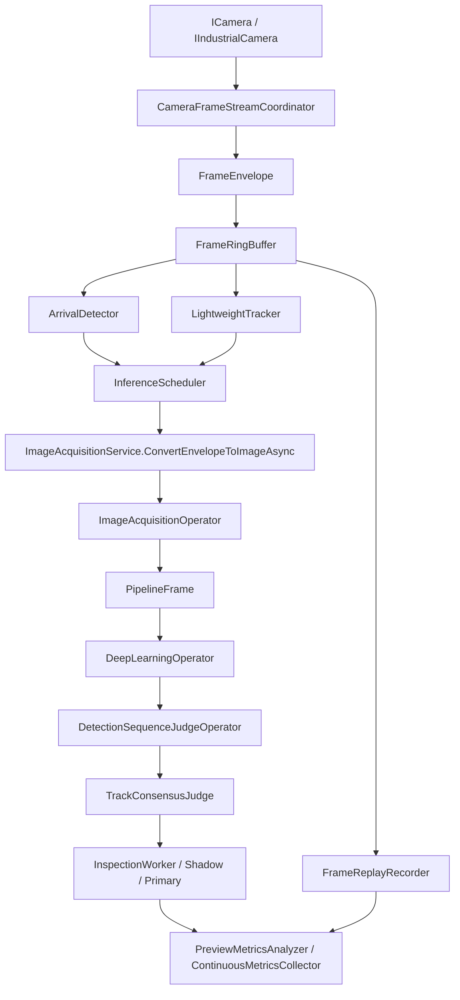

# ClearVision 方案 A 连续检测可选模式实施 TODO 计划

## 执行摘要

本次计划以 **ClearVision 作为主落地点**，把“无光电 / 无 PLC 触发时的连续检测”做成**可选模式**，而不是替换现有单帧检测路径。  
基于已优先检索的 **HerverJun/ClearVision** 与 **HerverJun/ClearFrost** 两个仓库，当前最适合的接入点是 ClearVision 现有的 `ICamera` / `IIndustrialCamera`、`CameraFrameStreamCoordinator`、`ImageAcquisitionService`、`ImageAcquisitionOperator`、`InspectionWorker` 与 `DetectionSequenceJudgeOperator`；其中连续采集骨架已存在，但缺少真正可用于“到达检测 + 去重 + 多帧一致性”的运行时模块。  
建议采用“**保留原单帧路径 + 新增 ContinuousInspection 可选运行支路**”的方式推进：先补 `FrameEnvelope`、`RingBuffer`、`ArrivalDetector`、`LightweightTracker`、`InferenceScheduler`、`TrackConsensusJudge` 与回放 / 埋点，再用 feature flag 与 binding 配置做灰度发布。  
整体建议排期 **6–8 周**；前 2 周打通 free-run 流与基础埋点，第 3–5 周补齐到达检测、调度、多帧投票，第 6 周开始现场 shadow 模式并行比对；如果现场硬件较弱，可在中途降级为“低帧率连续流 + 稀疏推理”的轻量配置。  
已访问并纳入设计参考的主要外部资料来源包括：HIKROBOT 官方相机触发 / 采集资料、OpenCV 视频采集与光流文档、GStreamer `queue` / `appsink` 文档、ONNX Runtime 性能调优文档。

## 仓库现状与接入点分析

### 优先检索的仓库与结论

本次首先通过已启用的 GitHub 连接器优先检索了以下两个仓库：

- HerverJun/ClearVision
- HerverJun/ClearFrost

总体结论是：

- **ClearVision** 已经拥有更适合连续检测的基础抽象与运行时骨架，适合承载方案 A。
- **ClearFrost** 仍然更偏“单帧触发式检测”，适合作为相机接线 / 触发模式 / 单帧链路经验库参考，不适合作为本次连续检测主改造平台。

### ClearVision 中与方案 A 强相关的现有文件

下表按“可复用价值”排序，给出 ClearVision 里最重要的接入点。

| 文件 / 类 / 函数 | 当前作用 | 对方案 A 的意义 | 本次建议 |
|---|---|---|---|
| `Acme.Product.Core/Cameras/ICamera.cs` | 已有单帧采集与连续采集抽象 | 是连续流的上层统一入口 | 保留，必要时增加 metadata / frame event 扩展 |
| `Acme.Product.Core/Cameras/IIndustrialCamera.cs` | 支持工业相机控制、触发模式与帧事件 | 是 free-run / internal trigger 与 camera ts 的关键接口 | 增加“帧元数据 / 时间戳”暴露能力 |
| `Acme.Product.Core/Cameras/CameraTriggerMode.cs` | 触发模式抽象 | 是单帧 / 连续模式映射边界 | 不建议直接破坏现义，建议新增独立 Continuous 配置层 |
| `Acme.Product.Infrastructure/Cameras/CameraFrameStreamCoordinator.cs` | 已有共享 Producer、预览 session、帧序号、latest frame 发布 | 是连续流共享的最佳现有骨架 | 扩展为 latest + history，而不是只保留 latest |
| `Acme.Product.Infrastructure/Services/ImageAcquisitionService.cs` | 已有 `AcquireFromCameraAsync` 和 frame-driven 获取共享帧逻辑 | 是“把连续帧注入现有 flow”最自然的服务层接入点 | 增加 `AcquireFromEnvelopeAsync` / `ConvertEnvelopeToImageAsync` |
| `Acme.Product.Infrastructure/Models/PipelineFrame.cs` | 当前是流程内部图像载体 | 是把连续帧桥接到现有 operator 链的关键承接对象 | 扩展 ts / seq / source metadata，但避免成为原始帧缓冲本体 |
| `Acme.Product.Infrastructure/Operators/ImageAcquisitionOperator.cs` | 当前从相机取图给后续算子 | 是兼容旧 flow 模板的核心位置 | 支持“若上下文已有外部注入帧，则直接消费” |
| `Acme.Product.Infrastructure/Services/InspectionWorker.cs` | 当前按 cycle 驱动流程执行 | 是 runtime switch 与 shadow / primary 模式切换的理想入口 | 保留旧逻辑，新增连续模式分支或旁路 worker |
| `Acme.Product.Infrastructure/Operators/DeepLearningOperator.cs` | 单帧模型推理 | 连续模式中仍复用，不必重写 | 复用，必要时增加异步调度统计 |
| `Acme.Product.Infrastructure/Operators/DetectionSequenceJudgeOperator.cs` | 单帧线序判断 | 仍然是最终业务规则核心 | 保留原逻辑；外层新增 track 级多帧共识层 |
| `Acme.Product.Infrastructure/Services/PreviewMetricsAnalyzer.cs` | 已有预览指标分析能力 | 可扩展为连续模式现场调试面板底层数据 | 增加 queue / latency / fps / drop 的埋点聚合 |
| `线序检测/scenario-package-wire-sequence/template/terminal-wire-sequence.flow.template.json` | 当前线序模板流 | 证明现有业务 flow 仍然以 `ImageAcquisition -> DL -> Judge` 为核心 | 不建议复制一套 flow，建议通过 `ImageAcquisitionOperator` 做注入兼容 |

### ClearFrost 中需要吸收但不宜直接照搬的点

ClearFrost 的以下文件更适合拿来做“反例与经验对照”：

| 文件 / 类 / 函数 | 现状判断 | 对本次的作用 |
|---|---|---|
| `ClearFrost/Hardware/Camera/CameraManager.cs` | 更偏固定触发模式配置，适合工位式单帧 | 用于提醒不要把单帧软触发思路直接搬进 ClearVision 连续模式 |
| `ClearFrost/Services/CameraService.cs` | `ClearFrameBuffer -> TriggerSoftware -> GetFrame` 风格明显 | 证明旧路径强依赖单次拍照语义 |
| `ClearFrost/Services/DetectionService.cs` | 推理服务偏单帧调用 | 用于对照“连续模式不应把模型服务继续当作同步单帧入口” |
| `ClearFrost/Views/主窗口.Camera.cs` | UI 假设“启动采集=立即取首帧验证” | 可作为回归提醒，避免新模式破坏旧 UI 预期 |
| `ClearFrost/Config/CameraConfig.cs` | 曝光 / 增益等静态参数清晰 | 可复用参数组织方式，但需额外补连续模式配置 |

### 对当前代码库的核心判断

如果目标是“**连续检测作为可选模式**”，最稳妥的做法不是把现有 `InspectionWorker + ImageAcquisitionOperator` 全部推倒重写，而是：

- **保留原单帧路径不动**
- 在 `InspectionWorker` 上新增 runtime switch
- 在 `CameraFrameStreamCoordinator` 后新增连续模式私有运行时
- 在 `ImageAcquisitionOperator` 上增加“外部帧注入兼容”
- 让 `DeepLearningOperator` 与 `DetectionSequenceJudgeOperator` 继续复用

换句话说，**重构重点不在 flow 本身，而在 flow 之前新增“帧时序与事件层”**。这也是本次方案与仓库现状最契合的地方。

## 模块改造清单与受影响文件

### 模块改造总表

| 新增 / 改造模块 | 类型 | 主要职责 | 优先级 | 估算开发周数 | 主要风险 | 主要回归影响点 |
|---|---|---|---|---:|---|---|
| `FrameEnvelope` | 新增核心模型 | 承载 camera ts、host ts、seq、payload、source | P0 | 0.5–1 周 | 不同厂商时间戳不一致 | `PipelineFrame`、`ImageAcquisitionService` |
| `FrameRingBuffer` | 新增基础设施 | 每相机固定长度环形缓存，支持回放与窗口裁剪 | P0 | 0.5–1 周 | 内存压力、释放不干净 | `CameraFrameStreamCoordinator` |
| `ArrivalDetector` | 新增运行时模块 | 用 ROI 占用 / 线穿越 / 面积变化检测“目标到达” | P0 | 1 周 | 反光、抖动、误触发 | `ContinuousInspectionWorker` |
| `LightweightTracker` | 新增运行时模块 | 把多帧检测归到同一 track，避免重复触发 | P0 | 1–1.5 周 | ID switch、近距离目标串扰 | `InferenceScheduler`、`TrackConsensusJudge` |
| `InferenceScheduler` | 新增运行时模块 | 异步调度 detector / judge，控制丢帧与延迟 | P0 | 1 周 | 队列堆积、线程争用 | `InspectionWorker`、`DeepLearningOperator` |
| `TrackConsensusJudge` | 新增业务后处理 | 对同一 track 多帧结果做投票 / 取最优帧 / 冻结结果 | P0 | 0.5–1 周 | 多帧规则不透明导致误判 | `DetectionSequenceJudgeOperator` 结果消费层 |
| `ContinuousInspectionConfig` | 新增配置对象 | binding 级开关、阈值、缓存长度、fps 策略 | P0 | 0.5 周 | 配置膨胀、默认值不合理 | `AppConfig`、binding schema |
| `ContinuousInspectionWorker` / `Orchestrator` | 新增运行时入口 | 承载连续模式主循环，保持单帧路径独立 | P0 | 1–1.5 周 | 生命周期管理复杂 | `InspectionWorker`、host composition |
| `ReplayRecorder` | 新增诊断模块 | 保存 frame clip、track event、最终决策与指标 | P1 | 0.5–1 周 | I/O 过大影响实时性 | 文件存储、日志系统 |
| `ContinuousMetricsCollector` | 新增诊断模块 | 输出 fps、drop、latency、queue 深度 | P1 | 0.5 周 | 埋点过重 | `PreviewMetricsAnalyzer` |
| `ImageAcquisitionOperator` 外部帧兼容 | 改造 | 支持从上下文读取注入帧而不是必定拉相机 | P0 | 0.5 周 | 旧 flow 行为被误伤 | 全部现有 scenario flow |
| `CameraFrameStreamCoordinator` latest+history | 改造 | 保留 latest 发布的同时维护 ring buffer | P0 | 1 周 | 预览与连续检测复用时争用 | 预览链路 |
| `IIndustrialCamera` / 适配器 metadata 扩展 | 改造 | 暴露 camera timestamp、frame counter | P0 | 1 周 | SDK 差异、兼容性 | `HikvisionCamera.cs`、`MindVisionCamera.cs` |
| `InspectionWorker` runtime switch | 改造 | 通过 feature flag / binding 配置选择 single / shadow / primary | P0 | 0.5–1 周 | 模式切换复杂，影响现网运行 | 调度入口 |

### 受影响 ClearVision 文件与函数清单

| 文件 | 建议改动 | 风险等级 | 回归重点 |
|---|---|---|---|
| `Acme.Product.Core/Cameras/ICamera.cs` | 评估是否增加 metadata 相关异步回调签名；尽量后向兼容 | 中 | 所有相机实现是否受影响 |
| `Acme.Product.Core/Cameras/IIndustrialCamera.cs` | 增加 frame metadata / device timestamp 能力 | 高 | 所有工业相机适配器实现 |
| `Acme.Product.Core/Cameras/CameraTriggerMode.cs` | 不直接嵌入业务连续模式；最多补充更清晰的 free-run 映射注释 | 低 | 避免破坏现有枚举含义 |
| `Acme.Product.Infrastructure/Cameras/CameraFrameStreamCoordinator.cs` | 增加 `FrameEnvelope` 发布、ring buffer、drop 统计 | 高 | 预览 session 与 frame-driven 现有行为 |
| `Acme.Product.Infrastructure/Services/ImageAcquisitionService.cs` | 新增从 `FrameEnvelope` 到 `ImageDto/PipelineFrame` 的转换 | 中 | 旧 acquire path 是否仍完全可用 |
| `Acme.Product.Infrastructure/Models/PipelineFrame.cs` | 增加 `Sequence/TimestampSource/TrackId/CorrelationId` 等 metadata | 中 | 引用计数、dispose 与 UI 预览兼容 |
| `Acme.Product.Infrastructure/Operators/ImageAcquisitionOperator.cs` | 支持 `ExecutionContext.ProvidedFrame` 优先 | 高 | 所有既有 flow 必须零配置继续运行 |
| `Acme.Product.Infrastructure/Services/InspectionWorker.cs` | 增加 `SingleFrame / Shadow / Primary` 分支与旁路 worker | 高 | worker 生命周期、退出与 cancel 语义 |
| `Acme.Product.Infrastructure/Operators/DeepLearningOperator.cs` | 增加异步推理埋点和队列 trace id 透传 | 中 | 推理耗时与异常传播 |
| `Acme.Product.Infrastructure/Operators/DetectionSequenceJudgeOperator.cs` | 原逻辑不大改，仅补 metadata 输出 | 低 | 单帧判定行为不能变化 |
| `Acme.Product.Infrastructure/Services/PreviewMetricsAnalyzer.cs` | 扩展连续模式指标项 | 低 | UI / preview 性能 |
| `线序检测/scenario-package-wire-sequence/template/terminal-wire-sequence.flow.template.json` | 原则上不改；如需显示标记仅补 scenario metadata | 低 | 模板兼容性 |

### 建议新增的文件与命名空间

为避免把连续模式逻辑散落到现有类中，建议新增以下文件组：

- `Acme.Product.Core/Streaming/FrameEnvelope.cs`
- `Acme.Product.Core/Streaming/FrameTimestampSource.cs`
- `Acme.Product.Core/Continuous/ContinuousInspectionMode.cs`
- `Acme.Product.Core/Continuous/ContinuousInspectionConfig.cs`
- `Acme.Product.Infrastructure/Streaming/FrameRingBuffer.cs`
- `Acme.Product.Infrastructure/Continuous/ArrivalDetector.cs`
- `Acme.Product.Infrastructure/Continuous/LightweightTracker.cs`
- `Acme.Product.Infrastructure/Continuous/InferenceScheduler.cs`
- `Acme.Product.Infrastructure/Continuous/TrackConsensusJudge.cs`
- `Acme.Product.Infrastructure/Continuous/ContinuousInspectionWorker.cs`
- `Acme.Product.Infrastructure/Replay/FrameReplayRecorder.cs`
- `Acme.Product.Infrastructure/Diagnostics/ContinuousMetricsCollector.cs`

这个拆法的核心目的，是让连续模式成为**能够独立关闭、独立测试、独立回滚**的一条旁路能力，而不是把现有单帧路径侵入式改坏。

## API、消息格式与配置草案

### 设计原则

接口设计要明确遵守三条原则：

- **原则一：单帧路径零感知**  
  旧 flow、旧 worker、旧 binding 在不开启连续模式时不需要修改。
- **原则二：连续模式尽量复用现有 operator**  
  特别是 `DeepLearningOperator` 与 `DetectionSequenceJudgeOperator` 不要重写业务逻辑。
- **原则三：相机原始时序与业务判定时序解耦**  
  `FrameEnvelope` 负责“帧事实”，`TrackConsensusJudge` 负责“业务结论”。

### `FrameEnvelope` 草案

| 字段 | 类型 | 说明 | 默认 / 备注 |
|---|---|---|---|
| `CameraId` | `string` | 相机标识 | 必填 |
| `Sequence` | `long` | 连续帧序号 | 来自 coordinator 或 device counter |
| `DeviceFrameCounter` | `long?` | 相机硬件计数器 | 可空 |
| `CameraTimestampNs` | `long?` | 相机时间戳 | 可空，优先设备时间 |
| `HostReceiveTimestampUtc` | `DateTimeOffset` | 主机接收时间 | 必填 |
| `TimestampSource` | `FrameTimestampSource` | `CameraPreferred/HostFallback/Unknown` | 必填 |
| `Width` | `int` | 宽度 | 必填 |
| `Height` | `int` | 高度 | 必填 |
| `PixelFormat` | `string` | 像素格式 | 如 `Mono8/BGR8/RGB8` |
| `PayloadKind` | `FramePayloadKind` | 原始/编码图 | `RawPreferred` |
| `Payload` | `ReadOnlyMemory<byte>` | 帧数据 | 必填 |
| `Stride` | `int?` | 每行步长 | 可空 |
| `CorrelationId` | `string` | 全链路追踪 id | 自动生成 |
| `Tags` | `Dictionary<string,string>` | 扩展字段 | 可空 |

建议的 C# 草案如下：

```csharp
public enum FrameTimestampSource
{
    Unknown = 0,
    CameraPreferred = 1,
    HostFallback = 2
}

public enum FramePayloadKind
{
    Raw = 0,
    EncodedImage = 1
}

public sealed record FrameEnvelope(
    string CameraId,
    long Sequence,
    DateTimeOffset HostReceiveTimestampUtc,
    int Width,
    int Height,
    string PixelFormat,
    FramePayloadKind PayloadKind,
    ReadOnlyMemory<byte> Payload,
    long? CameraTimestampNs = null,
    long? DeviceFrameCounter = null,
    int? Stride = null,
    FrameTimestampSource TimestampSource = FrameTimestampSource.Unknown,
    string? CorrelationId = null,
    IReadOnlyDictionary<string, string>? Tags = null
);
```

### `FrameRingBuffer` 草案

| 方法 | 说明 |
|---|---|
| `void Push(FrameEnvelope frame)` | 推入新帧，满时按策略丢弃旧帧 |
| `bool TryGetLatest(out FrameEnvelope frame)` | 获取最新帧 |
| `IReadOnlyList<FrameEnvelope> SliceBySequence(long from, long to)` | 获取序号窗口 |
| `IReadOnlyList<FrameEnvelope> SliceAround(long centerSeq, int before, int after)` | 获取前后窗口 |
| `RingBufferStats SnapshotStats()` | 获取长度、丢帧、覆盖次数等 |

建议默认策略设为 **drop-oldest**，因为方案 A 的目标是实时性，不是完整录像。

### `ArrivalDetector` 草案

`ArrivalDetector` 不应直接依赖业务模型输出，优先使用轻量视觉信号。建议输出统一的 `ArrivalSignal`。

```csharp
public sealed record ArrivalSignal(
    string CameraId,
    long Sequence,
    DateTimeOffset EventTimeUtc,
    string TriggerType,          // roi_occupancy / line_cross / area_stable
    double Score,
    Rect DecisionRoi,
    string CorrelationId
);

public interface IArrivalDetector
{
    ArrivalSignal? Update(FrameEnvelope frame);
    void Reset(string cameraId);
}
```

建议内部实现支持三种子策略：

- `RoiOccupancyArrivalDetector`
- `LineCrossArrivalDetector`
- `MotionEnergyArrivalDetector`

在初版里只做一个默认实现即可，不要一开始就把 detector 做成复杂策略编排器。

### `LightweightTracker` 草案

```csharp
public sealed record TrackState(
    string TrackId,
    string CameraId,
    long StartSequence,
    long LastSequence,
    Rect BoundingBox,
    int AgeFrames,
    int MissedFrames,
    bool IsConfirmed,
    bool HasCrossedDecisionLine,
    string CorrelationId
);

public interface ILightweightTracker
{
    IReadOnlyList<TrackState> Update(
        FrameEnvelope frame,
        IReadOnlyList<DetectionBox> detections);

    bool TryGet(string trackId, out TrackState track);
    void MarkClosed(string trackId, string reason);
}
```

初版不建议做复杂多目标跟踪框架。对线序端子场景，更适合先做：

- 低频 detector 提供 box
- 高频使用 IOU + 最近邻 + 简单速度外推
- 目标数很少时，必要时加一层 KLT 光流补偿

### `InferenceScheduler` 草案

```csharp
public sealed record InferenceRequest(
    string CameraId,
    string TrackId,
    FrameEnvelope Frame,
    bool IsKeyFrame,
    string Reason,                   // arrival / resample / confirmation
    DateTimeOffset EnqueueTimeUtc
);

public sealed record InferenceResultEnvelope(
    string CameraId,
    string TrackId,
    long Sequence,
    DateTimeOffset FinishedAtUtc,
    IReadOnlyList<DetectionBox> Detections,
    IReadOnlyDictionary<string, object>? Metadata = null
);

public interface IInferenceScheduler
{
    ValueTask<bool> TryEnqueueAsync(InferenceRequest request, CancellationToken ct);
    event Func<InferenceResultEnvelope, Task>? ResultReady;
    SchedulerStats Snapshot();
}
```

建议初版采用单 producer、多 consumer 队列，但 **consumer 数不要超过 2**，否则现场调试难度和 out-of-order 复杂度会明显上升。

### `TrackConsensusJudge` 草案

`DetectionSequenceJudgeOperator` 仍只做“单帧线序判断”；`TrackConsensusJudge` 负责把一个 track 的多个帧结果聚成一个最终结果。

```csharp
public sealed record FrameDecision(
    string TrackId,
    long Sequence,
    bool IsOk,
    string? ActualOrder,
    double Confidence,
    string? Reason
);

public sealed record TrackDecision(
    string TrackId,
    string CameraId,
    bool IsOk,
    string? FinalOrder,
    double ConsensusScore,
    long BestSequence,
    int Votes,
    bool IsFrozen,
    string Reason
);

public interface ITrackConsensusJudge
{
    void Add(FrameDecision decision);
    bool TryFinalize(string trackId, out TrackDecision result);
    void ExpireOlderThan(DateTimeOffset deadlineUtc);
}
```

建议默认决策规则：

- 至少 3 帧有效决策才允许 finalize
- 置信度最高的前 3 帧进入 voting
- 同一 `ActualOrder` 占比达到 `0.6` 即通过
- 若抖动严重，则输出 `low_consistency`
- 一个 `TrackId` 只允许发布一次 frozen result

### `ImageAcquisitionOperator` 接入伪代码

这是兼容旧 flow 的最关键改动点。

```csharp
// 接入点：Acme.Product.Infrastructure.Operators.ImageAcquisitionOperator
public async Task ExecuteAsync(OperatorContext context, CancellationToken ct)
{
    if (context.TryGetValue("ProvidedFrameEnvelope", out FrameEnvelope envelope))
    {
        var image = await _imageAcquisitionService.ConvertEnvelopeToImageAsync(envelope, ct);
        context.SetImage(image);
        context.Set("FrameSequence", envelope.Sequence);
        context.Set("FrameTimestampUtc", envelope.HostReceiveTimestampUtc);
        context.Set("FrameTimestampSource", envelope.TimestampSource.ToString());
        return;
    }

    // 旧逻辑保持不变
    var image2 = await _imageAcquisitionService.AcquireFromCameraAsync(context, ct);
    context.SetImage(image2);
}
```

这个改法的价值在于：**flow 模板不必复制两份**。  
连续模式只是在进入 flow 之前先把 `ProvidedFrameEnvelope` 塞进上下文，后面的 `DeepLearningOperator -> DetectionSequenceJudgeOperator` 全部照旧运行。

### `InspectionWorker` 的 runtime switch 草案

```csharp
public enum ContinuousInspectionMode
{
    Disabled = 0,
    Shadow = 1,
    Primary = 2
}
```

```csharp
// 接入点：Acme.Product.Infrastructure.Services.InspectionWorker
public async Task RunAsync(InspectionBinding binding, CancellationToken ct)
{
    if (binding.ContinuousInspection?.Mode == ContinuousInspectionMode.Disabled)
    {
        await RunSingleFrameAsync(binding, ct);
        return;
    }

    if (binding.ContinuousInspection.Mode == ContinuousInspectionMode.Shadow)
    {
        await RunSingleFrameWithShadowContinuousAsync(binding, ct);
        return;
    }

    await RunContinuousPrimaryAsync(binding, ct);
}
```

### 配置项草案

建议配置拆成“全局功能开关”和“binding 级具体参数”。

| 配置项 | 默认值 | 说明 |
|---|---:|---|
| `Features:ContinuousInspection:Enabled` | `false` | 全局总开关 |
| `Bindings:{id}:ContinuousInspection:Mode` | `Disabled` | `Disabled/Shadow/Primary` |
| `Bindings:{id}:ContinuousInspection:TargetFps` | `25` | 相机目标帧率 |
| `Bindings:{id}:ContinuousInspection:BufferCapacity` | `24` | 环形缓冲长度 |
| `Bindings:{id}:ContinuousInspection:DetectEveryNFrames` | `2` | 稀疏检测频率 |
| `Bindings:{id}:ContinuousInspection:ArrivalRoi` | null | 到达检测 ROI |
| `Bindings:{id}:ContinuousInspection:DecisionLineY` | null | 判定线 |
| `Bindings:{id}:ContinuousInspection:PreEventFrames` | `4` | 事件前回看帧数 |
| `Bindings:{id}:ContinuousInspection:PostEventFrames` | `4` | 事件后补帧数 |
| `Bindings:{id}:ContinuousInspection:MinConsensusFrames` | `3` | 最少参与投票帧数 |
| `Bindings:{id}:ContinuousInspection:ConsensusThreshold` | `0.6` | 投票阈值 |
| `Bindings:{id}:ContinuousInspection:SchedulerQueueLength` | `8` | 推理队列长度 |
| `Bindings:{id}:ContinuousInspection:MaxLatencyMs` | `250` | 超时丢弃阈值 |
| `Bindings:{id}:ContinuousInspection:TimestampPreference` | `CameraPreferred` | 时间戳优先来源 |
| `Bindings:{id}:ContinuousInspection:SaveReplayOnNgOnly` | `true` | 仅 NG 保存回放 |
| `Bindings:{id}:ContinuousInspection:ShadowOutputDisabled` | `true` | shadow 模式禁止写 PLC / MES |

## 实施周计划

### 周计划表

下表按 6 周给出最小可执行版本；如果现场资源充分，建议拉长到 7–8 周，把第 6 周拆成“场内验收前”和“场内验收后”两个阶段。

| 周次 | 主要任务 | 具体输出 | 验收标准 | 负责人角色建议 | 工时估算 |
|---|---|---|---|---|---:|
| 第 1 周 | 明确接入点与配置骨架 | 新增 `ContinuousInspectionConfig`、`ContinuousInspectionMode`、全局 feature flag；整理受影响文件清单；补运行图 | 默认关闭时所有现有单帧场景零回归；配置加载成功 | 后端开发 1、架构 / Tech Lead 1 | 40–56h |
| 第 2 周 | 打通 free-run 连续采集与 `FrameEnvelope` | 在 `IIndustrialCamera` 适配器上补 frame metadata；实现 `FrameEnvelope`、`FrameRingBuffer`；`CameraFrameStreamCoordinator` 支持 latest + history | 持续运行 30 分钟无崩溃；可导出 seq / ts / payload 基本日志；预览不受影响 | 后端开发 2、测试 1 | 64–80h |
| 第 3 周 | 完成 `ImageAcquisitionOperator` 注入兼容与回放基础 | `ImageAcquisitionService` 支持 `ConvertEnvelopeToImageAsync`；`ImageAcquisitionOperator` 优先消费 `ProvidedFrameEnvelope`；`ReplayRecorder` 落地 clip 保存 | 旧 flow 模板不改即可跑；手工注入帧能完成全链路单次推理；回放文件可打开 | 后端开发 2、测试 1 | 56–72h |
| 第 4 周 | 实现 `ArrivalDetector` 与 `LightweightTracker` | ROI 占用 / 线穿越检测；基础 tracker；去重逻辑；事件与日志 schema | 固定视频样本上到达召回率 ≥ 95%，重复触发率 ≤ 2% | 后端开发 2、算法 / 视觉开发 1、测试 1 | 72–88h |
| 第 5 周 | 实现 `InferenceScheduler` 与 `TrackConsensusJudge` | 异步队列、稀疏检测、late result 处理、多帧投票、frozen result 发布 | 基准机上端到端 P95 延迟满足目标；同一 track 只发布一次结果 | 后端开发 2、算法 / 视觉开发 1、测试 1 | 72–96h |
| 第 6 周 | 灰度发布、shadow 对比与现场联调 | `Shadow/Primary` 模式切换；比较报表；故障回滚；现场参数模板 | 与单帧并行运行至少 1 个班次；输出对比报告；可一键回退 | 后端开发 1、测试 1、现场工程师 1 | 56–72h |

### 建议扩展周

| 周次 | 主要任务 | 具体输出 | 验收标准 | 负责人角色建议 | 工时估算 |
|---|---|---|---|---|---:|
| 第 7 周 | 压测与低中高硬件档适配 | 三档配置模板、资源占用曲线、降级策略 | CPU / GPU / 内存曲线稳定，低档设备可运行 | 后端开发 1、测试 1、现场工程师 1 | 40–56h |
| 第 8 周 | 收尾与文档固化 | 运维文档、现场联调手册、回放分析 SOP | 新成员可按文档复现实验与切换模式 | Tech Lead 1、测试 1、文档支持 1 | 32–40h |

## 灰度发布、回滚与兼容策略

### 灰度发布原则

连续检测必须作为**可选模式**集成，建议使用双层开关：

- **全局功能开关**  
  `Features:ContinuousInspection:Enabled`
- **binding 级运行模式**  
  `Disabled / Shadow / Primary`

推荐上线节奏：

- `Disabled`：现网默认，完全保持原单帧路径
- `Shadow`：连续模式后台运行，但不写 PLC / MES / 最终业务状态
- `Primary`：连续模式成为主结果源，原单帧可保留 shadow 对照

### 运行时组合建议

| 模式 | 相机采集 | 业务输出 | 推荐用途 |
|---|---|---|---|
| `Disabled` | 原单帧 | 原单帧 | 默认生产 |
| `Shadow` | 单帧 + 连续并跑 | 仅单帧输出，连续只打日志 / 报表 | 现场比对与调参 |
| `Primary` | 连续为主，单帧可选 shadow | 连续模式输出最终结果 | 稳定后切主 |
| `EmergencyRollback` | 强制回到单帧 | 原单帧 | 紧急兜底 |

### 回滚策略

回滚必须做到“**配置级回滚优先，代码级回滚备用**”。

建议顺序如下：

1. 把 binding 的 `ContinuousInspection:Mode` 改为 `Disabled`
2. 若支持热更新，重载 binding；否则只重启对应 worker
3. 保留连续模式日志文件，停止 replay 保存
4. 若相机当前已切到 free-run，但单帧路径依旧支持，则先保持；若不兼容，再切回原触发模式
5. 核对单帧与 PLC 输出恢复正常后，结束 incident

**不要把回滚依赖在重新发版上**。只要是现场功能，第一优先级一定是“配置一键退出”。

### 兼容性测试用例

| 用例 | 目标 | 验收标准 |
|---|---|---|
| 旧 binding 无 Continuous 配置 | 验证默认零影响 | 系统行为与改造前一致 |
| 旧 flow 模板不修改 | 验证 `ImageAcquisitionOperator` 兼容 | 单帧场景全部通过 |
| `Shadow` 模式运行 8 小时 | 验证后台旁路不会拖垮主链路 | 单帧延迟不显著上升，连续链路可独立停启 |
| `Primary -> Disabled` 热切换 | 验证回滚能力 | 1 次切换内恢复单帧稳定输出 |
| 相机 metadata 缺失 | 验证 host fallback | 系统仍工作，且显式标记 `HostFallback` |
| replay 目录写满 / 权限不足 | 验证诊断模块失效隔离 | 主检测链路不被拖死 |

## 测试与验证计划

### 必测场景总表

| 类别 | 用例 | 验收阈值 |
|---|---|---|
| 功能 | 连续流下触发到达、产生 track、完成最终发布 | 同一端子只出 1 条最终结果 |
| 功能 | 单帧路径不开启连续模式时行为不变 | 全量回归用例通过率 100% |
| 功能 | `Shadow` 模式不写 PLC / MES | 业务侧零副作用 |
| 功能 | metadata 缺失时可 host fallback | 不中断，日志有明确标记 |
| 性能 | 低档硬件 15–20 FPS 流 + 每 3 帧检测 | P95 延迟 ≤ 450 ms |
| 性能 | 中档硬件 25–35 FPS 流 + 每 2 帧检测 | P95 延迟 ≤ 300 ms |
| 性能 | 高档硬件 40–60 FPS 流 + 高频检测 | P95 延迟 ≤ 250 ms |
| 准确性 | 到达检测召回率 | ≥ 99.5% 目标，实验阶段先 ≥ 98% |
| 准确性 | 重复触发率 | ≤ 0.2% 目标，实验阶段先 ≤ 1% |
| 准确性 | 线序判定召回率 | ≥ 99.0% |
| 准确性 | 误报率 | ≤ 0.5% |
| 长时稳定性 | 连续运行 8 小时 | 无崩溃、无明显内存上涨、无永久积压 |
| 回放复现 | NG 样本 clip 可离线复跑得到相同结论 | 一致率 ≥ 95% |
| 并行对比 | 单帧与连续 shadow 对照 | 结果差异有可解释日志与 best-frame 证据 |

### 回放与复现策略

回放不是附属功能，而是连续模式能否落地的前提。建议至少保存以下内容：

- 事件前 `PreEventFrames` 帧
- 事件后 `PostEventFrames` 帧
- 每帧 `Sequence / CameraTimestampNs / HostReceiveTimestampUtc`
- 每次 detector / judge 的输出
- 最终 `TrackDecision`
- 当前配置快照

推荐保存格式：

- 图像：PNG 或 JPEG，初版可接受
- 元数据：JSON
- 索引：按 `cameraId/date/trackId` 分层目录

只要能保证“**同一 track 一包回放**”，现场问题就能快速定位。

## 部署与现场联调步骤

### 部署前准备

部署前建议按以下顺序完成：

1. 合并 feature flag 与配置 schema，但默认 `Disabled`
2. 在测试机上为 `HikvisionCamera.cs` / `MindVisionCamera.cs` 补 metadata 能力
3. 准备三套配置模板：低档 / 中档 / 高档硬件
4. 在 `PreviewMetricsAnalyzer` 或独立指标面板中接出 fps / drop / latency / queue depth

### 切换到 free-run / internal trigger 的实施要点

由于现场相机型号未指定，本计划按“无特定约束”处理。实施时统一遵循以下原则：

- 优先使用现有 `IIndustrialCamera` 的触发模式抽象做切换
- 不把“连续检测模式”硬编码为“某个相机厂商特有枚举”
- 若厂商 SDK 支持设备时间戳，优先启用
- 若设备时间戳不可取，则明确记录为 `HostFallback`

建议操作顺序：

1. 在相机厂商配置工具或 SDK 中把触发改为 **internal / free-run**
2. 固定曝光、增益、帧率上限
3. 采集 5–10 分钟空跑视频，确认无明显丢帧
4. 检查 `Sequence` 单调递增、`CameraTimestampNs` 是否可用
5. 再开启 `Shadow` 模式业务运行

### 现场样本采集要求

为了让后续调参有效，现场至少要采以下四类样本：

- 正常 OK 连续通过样本
- 明显 NG 样本
- 速度扰动样本
- 光照 / 反光 / 振动扰动样本

每类样本建议至少包含：

- 原始连续流 clip
- 对应回放包
- 设备与主机时间戳
- 现场速度说明
- 曝光 / 增益 / 分辨率配置快照

### 单帧与连续模式的短期并行运行方案

最稳妥的对比方案是：

- 单帧路径继续作为生产结果源
- 连续模式运行在 `Shadow`
- 两者使用相同模型版本
- 以 `trackId / 时间窗 / best frame` 做结果对照
- 每班次导出一份差异报表

对比内容至少包含：

- 单帧判定结果
- 连续模式最终 `TrackDecision`
- 连续模式 best sequence
- 若结果不一致，对应 replay clip

这样能在不影响生产的前提下快速判断连续模式是否已经具备切主条件。

### 硬件档位适配建议

| 档位 | 建议采集 FPS | `DetectEveryNFrames` | RingBuffer 容量 | 推理策略 | 适用场景 |
|---|---:|---:|---:|---|---|
| 低档 | 15–20 | 3–4 | 16 | 稀疏检测 + 简单 tracker | CPU-only、老工控机 |
| 中档 | 25–35 | 2 | 24 | 中频检测 + tracker + 多帧投票 | 常规工控机 / 中档 GPU |
| 高档 | 40–60 | 1–2 | 32–64 | 高频检测或 ROI 高频检测 | 独显 / 边缘 GPU 设备 |

## 总体流程图与模块关系图

### 总体流程图

```mermaid
flowchart LR
    Cam[相机 Free-Run 连续采集] --> Coordinator[CameraFrameStreamCoordinator]
    Coordinator --> Envelope[FrameEnvelope 封装]
    Envelope --> Ring[FrameRingBuffer]
    Ring --> Arrival[ArrivalDetector]
    Arrival --> Tracker[LightweightTracker]
    Tracker --> Scheduler[InferenceScheduler]
    Scheduler --> Inject[ImageAcquisitionOperator 外部帧注入]
    Inject --> DL[DeepLearningOperator]
    DL --> NMS[BoxNms / BoxFilter]
    NMS --> Judge[DetectionSequenceJudgeOperator]
    Judge --> Consensus[TrackConsensusJudge]
    Consensus --> Output[Result Output / EventBus]
    Ring --> Replay[ReplayRecorder]
    Scheduler --> Metrics[ContinuousMetricsCollector]
    Replay --> Metrics
```



### 模块关系图



## 已访问的主要外部资料来源

本次在覆盖 ClearVision 与 ClearFrost 两个仓库之后，补充参考的高质量外部资料来源主要包括：

| 来源类别 | 主要用途 |
|---|---|
| HIKROBOT 官方相机文档 / 触发模式资料 | 用于确认 internal trigger / free-run、外部触发、设备时间戳等概念边界 |
| OpenCV 官方视频采集与光流文档 | 用于设计 `ArrivalDetector`、轻量 tracker 与速度扰动场景的基础算法候选 |
| GStreamer 官方 `queue` / `appsink` 文档 | 用于约束实时队列长度、丢帧策略与 backpressure 设计 |
| ONNX Runtime 官方性能调优资料 | 用于指导 `InferenceScheduler` 的线程、队列、延迟与资源占用策略 |
| 相机厂商中文 SDK / 用户手册 | 用于实施现场 free-run 配置与设备时间戳采集 |

这些外部来源在本计划中的作用是**约束实现边界与现场部署方法**；真正的代码接入点与优先级判断，仍然以 ClearVision 仓库现有结构为主。

## 首要行动项与风险清单

### 首要行动项

最先要做的事情不是 tracker，也不是多帧投票，而是下面四项：

1. **在 ClearVision 中落地 `ContinuousInspectionConfig + Mode`**
2. **在 `CameraFrameStreamCoordinator` 后补 `FrameEnvelope + FrameRingBuffer`**
3. **在 `ImageAcquisitionOperator` 上实现外部帧注入兼容**
4. **在 `InspectionWorker` 上加 `Disabled / Shadow / Primary` 的 runtime switch**

如果这四步没做完，后面的到达检测、多帧投票和现场回放都会失去可控性。

### 主要风险清单

| 风险 | 说明 | 应对策略 |
|---|---|---|
| 相机设备时间戳不可用或格式不一致 | 不同厂商 SDK 差异大 | 统一 `TimestampSource`，允许 `HostFallback` |
| raw frame 缓冲导致内存上涨 | 连续流最容易出问题的地方 | 固定长度 ring buffer、drop-oldest、严格 dispose |
| `ImageAcquisitionOperator` 改造误伤旧 flow | 这是本次最大的回归点之一 | 先做“上下文有注入帧才走新逻辑”的最小改动 |
| Shadow 模式埋点过多拖慢主链路 | 现场很常见 | replay 默认只保 NG，metrics 降采样 |
| tracker 引发重复触发或串轨 | 连续模式比单帧更复杂 | 初版场景限制为“单 ROI、少目标、一次一结果” |
| 现场参数无法快速收敛 | 没有回放时最难定位 | 必须在第 3 周前把 replay 做出来 |
| 回滚不够快 | 现场不允许长时间排障 | 所有功能都要能通过配置退回 `Disabled` |

当前最明确的推荐是：**先在 ClearVision 上以最小侵入方式完成“连续模式基础设施四件套”，并在第 2 周末就开始 Shadow 采样，不要等 tracker 与投票全部完成后才进现场。**  
这样做的收益最大，因为你能最早拿到真正决定成败的信号：**连续流是否稳定、时间戳是否可信、队列是否受控、回放是否够用。**