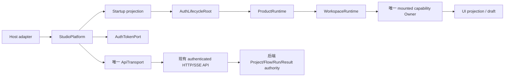

# ClearVision Studio UI Next 整体迁移审计

审计日期：2026-08-06（Asia/Shanghai）
审计范围：`studio-ui-next` 当前工作树，代码、配置、构建资产、Host 生命周期、能力迁移、权限与实时通道、测试和 CI 证据。
本轮边界：审计为主，不做大规模生产代码修复；保留审计开始前工作树中的用户未提交内容，不以旧文档、旧 SHA 或历史 PASS 代替当前 HEAD 证据。

## 结论

```text
MIGRATION_RELEASE_BLOCKED
```

当前 Next 前端已经形成独立的 Vue composition root、共享 `ApiTransport`、路由权限投影、`ProductRuntime`、`WorkspaceRuntime` 和 capability-local Owner 结构；默认 `appsettings.json` 选择 `NEXT_DEFAULT`，Next 资产也能够在 `/studio/index.html` 被构建和解析。

但迁移尚未形成单一生产权威，且当前 HEAD 没有足够的发布验收证据：

1. `vite.config.ts` 仍把关键 canonical 模块别名指向 Legacy `wwwroot/src`，而 `.csproj` 的 `StudioUiBuildInput` 只覆盖 `StudioUI/src`；该增量构建缺口已在 detached 审计 worktree 中复现，源文件变更后标准 Debug/Release build 可以保持旧 bundle。
2. Legacy `wwwroot` 仍被复制、托管并作为 `/index.html` 入口，`LEGACY_DEFAULT`、`LEGACY_FALLBACK` 和多套 Next profile 仍是可配置启动路径。Legacy UI 测试和 WebMessage compatibility chain 也仍在生产宿主代码中。
3. 本地单元和构建门禁通过，但 StudioUI Browser suite 在本轮达到测试末尾后未退出且存在集中失败；self-contained publish 被 `GenerateBundle` 阶段的磁盘空间耗尽阻断；当前 `studio-ui-next` 不在 GitHub Actions push/PR branch trigger 中，因此没有绑定当前 HEAD 的 Remote CI、真实 WebView2、DPI 和完整 publish 证据。

因此本轮建议进入“迁移收口修复阶段”，暂不进入迁移验收或发布阶段。

## 1. Git 与证据基线

### 1.1 当前 Git 身份

| 项目 | 当前事实 |
| --- | --- |
| 工作树 | `C:\Users\HerverJun\Desktop\ClearVision-UI-Next` |
| 分支 | `studio-ui-next` |
| HEAD | `9800d6045a9f5fdfc62a166242e83529b833dc7d` |
| HEAD 短 SHA | `9800d6045a9f` |
| upstream | `origin/studio-ui-next` |
| upstream SHA（读取时） | `7d43af9e19ad5a98240651fd5519a8e0f5a1e9f5` |
| `main...HEAD` | ahead 1 / behind 675 |
| merge-base | `bf568d15745be258383e9d6f144ae3f89288077e` |
| 审计开始时工作树 | 非干净，存在用户修改和一个本轮生成的 Playwright 报告目录 |

Initial SHA 与 Final SHA 均为 `9800d6045a9f5fdfc62a166242e83529b833dc7d`。报告写入后的最终工作树保留上述 17 个用户已修改的 tracked 文件、未跟踪的 `RunStatusBar.vue`，并新增本报告；本轮生成的 Playwright 报告目录和 detached 审计 worktree 已不存在。

审计开始时已存在、未由本轮创建的修改分为三组：9 个 StudioUI 源码/单元测试文件、8 个 `ClearVision.Product/test_results` 性能报告文件，以及未跟踪的 `RunStatusBar.vue`。本轮生成的 `ClearVision.Product/tests/ClearVision.Product.UI.Tests/playwright-report/` 已删除；本轮 detached 审计 worktree `C:\tmp\clearvision-ui-next-audit-9800d6045a9f` 及其同名 Git 元数据也已删除。用户既有文件未被回滚、stash、reset 或覆盖。

### 1.2 证据等级

| 标记 | 含义 |
| --- | --- |
| `CONFIRMED` | 当前代码或当前配置直接证明的事实 |
| `REPRODUCED` | 本轮通过可重复步骤实际复现 |
| `STRONG_EVIDENCE` | 多个当前代码路径一致指向，但缺少完整真实宿主运行闭环 |
| `SUSPECTED` | 线索足够，但尚不能作为发布结论 |
| `NOT_VERIFIED` | 未运行、运行被阻断，或证据不是当前 HEAD |

### 1.3 运行环境

| 项目 | 值 | 备注 |
| --- | --- | --- |
| Node | `v24.14.0` | `StudioUI/package.json` 允许 `>=10.8.2 <12` 的 npm 约束；CI 配置使用 Node 20 |
| npm | `11.9.0` | `npm ci` 通过，并报告 3 个 dependency vulnerabilities |
| .NET SDK 实际 | `9.0.304` | `global.json` 请求 `9.0.300`，`rollForward: latestFeature` |
| 目标框架 | `net8.0-windows` | 实际输出还包含 `win-x64` 资产目录 |

## 2. 迁移范围与真实架构

### 2.1 宿主、静态资源和入口

```mermaid
flowchart TD
    A[MainForm] --> B[WebView2Host]
    B --> C[ASP.NET Core local API]
    C --> D{StartupProfile / StudioUiEnabled}
    D -->|Next| E[/studio/index.html]
    D -->|Legacy| F[/index.html]
    E --> G[StudioUI createStudioApp]
    F --> H[wwwroot legacy JS/CSS]
    B --> I[WebMessageHandler compatibility chain]
    I --> J[EventBus / legacy and AI handlers]
```

当前代码事实：

- `ClearVision.Product/src/ClearVision.Product.Desktop/ClearVision.Product.Desktop.csproj:80-86` 以 `wwwroot\**\*` 复制整个 Legacy 静态树。
- 同一 `.csproj:89-107` 定义 `StudioUI` 中间产物和 `StudioUiBuildInput`；Next build 产物通过 `.csproj:155-180` 复制到 `wwwroot\studio`，但 `wwwroot` 的 Legacy 内容仍独立存在。
- `Program.UseDesktopStaticAssets()` 在 `Program.cs:394-435` 同时注册 `/studio` 的 `PhysicalFileProvider` 和非 `/studio` 请求的 Legacy provider。
- `StudioStartupPageResolver.cs:26-48` 暴露 `/index.html` 与 `/studio/index.html` 两个合法入口；当 `studioUiEnabled` 为 false 时明确走 Legacy。
- `StudioOptions.cs:31-42` 仍定义 `LEGACY_DEFAULT`、`LEGACY_FALLBACK`、`NEXT_*`、`ISOLATED_TRUTH_TABLE` 等 profile。
- `appsettings.json:29-38` 当前默认是 `NEXT_DEFAULT`，这证明默认值改变，不证明 Legacy 已从生产边界移除。

### 2.2 Next 的 authority 与生命周期边界



当前 Next 代码对红线的符合点：

- `StudioUI/src/app/createStudioApp.ts:36-105` 是单一 mount/unmount composition root；mount 失败和 unmount 都会移除 route/leave guard，dispose auth root 和 platform。
- `StudioUI/src/app/studioPlatform.ts:29-35,83-115` 将 host、`ApiTransport`、token port 和 startup projection 聚合为一个 platform；Browser test platform 是显式分支，不等同于 WebView2。
- `StudioUI/src/app/productRuntime.ts:44-132` 集中创建 query client、session、project lifecycle、workspace、leave guard、system status，并在注销、重认证、dispose 路径上处理 owner 生命周期。
- `StudioUI/src/capabilities/project-workspace/workspaceRuntime.ts:71-274` 维护 active read、active owner、handoff receiver 和 new-draft owner 集合，统一做 quarantine、reconcile 和 dispose。
- `StudioUI/src/platform/api/apiTransport.ts:52-64,150-208` 限制 API 为同源 `/api/`，拒绝绝对 URL、路径穿越和非 `/health` root-relative 请求。
- `StudioUI/tests/unit/architecture/f02Architecture.spec.ts`、`f03G1Architecture.spec.ts`、`f04G1Architecture.spec.ts` 对唯一 direct fetch、无第二 `EventSource`/EventBus/ServiceRegistry、Product shell 和 Workspace owner 做了源码级 guard。

这些是当前 Next 内部架构证据，不等同于“整个产品已迁移”。Legacy host、Legacy assets 和构建输入仍在 Next 外部边界形成第二条生产路径。

### 2.3 Host 生命周期

```text
MainForm
  -> resolve WebMessageHandler
  -> construct WebView2Host
  -> WebView2Host.InitializeAsync
  -> MainForm_Load calls WebMessageHandler.Initialize
  -> WebView2 navigates /studio/index.html or /index.html
  -> StudioUI mountStudioApp (Next only)
  -> AuthLifecycleRoot
  -> ProductRuntime
  -> WorkspaceRuntime / capability Owner
  -> route/project/host close
  -> owner dispose / ProductRuntime.dispose / app.unmount
  -> MainForm PrepareCloseAsync
  -> WebMessageHandler.Dispose / WebView2Host.DisposeAsync
```

`MainForm.cs:42-70` 直接从 service provider 取 `WebMessageHandler`、创建 `WebView2Host`，并在 WebView2 初始化后调用 `_messageHandler?.Initialize(_webView)`。`MainForm.cs:156-170` 进入受控关闭流程，`MainForm.cs:652-658` 在 WebView2 dispose 前释放 WebMessage handler。这个关闭顺序具备清理意图，但也证明 WebMessage compatibility chain 在 Next 生产启动时仍被挂载。

## 3. 新旧前端权威与依赖图

| 能力域 | Next 当前 Owner / adapter | 正式 authority | Legacy 残留 | 当前判断 |
| --- | --- | --- | --- | --- |
| 会话与权限 | `AuthLifecycleRoot`、`SessionProjectionOwner`、router guard | authenticated API、后端 `AuthMiddleware` | Legacy 页面仍可从 `/` 启动 | Next 内部结构成立；产品入口未单一化 |
| 工程生命周期 | `projectLifecycleCommandOwner` | Project Application Service、`ProjectSaveCoordinator`、`PersistenceRevision` | Legacy project modules 与 `/index.html` 仍打包 | `PARTIAL` |
| 工作区 | `WorkspaceRuntime`、`WorkspaceOwner` | Project/Flow/GlobalVariables 后端服务 | Vite canonical alias 指向 `wwwroot/src` | `PARTIAL`，并受增量构建缺陷影响 |
| Flow Canvas | `flowCanvasOwner`、`canonicalFlowCanvas` | 既有 `FlowCanvas` adapter / backend flow contract | `wwwroot/src/core/canvas/flowCanvasAdapter.js` | `PARTIAL` |
| Image / ROI | `imageCanvasOwner`、ROI owner | 既有 ImageCanvas/ROI contract、preview API | `wwwroot/src/core/canvas/imageCanvas.js`、flow-editor 支持模块 | `PARTIAL` |
| Preview | `previewOwner`、`previewTransport` | preview artifact API；结果为可丢弃调试投影 | Legacy preview coordinator 被 Vite alias 复用 | `PARTIAL` |
| Formal Run | `runCommandOwner`、run SSE adapter | AgentRun/Runtime/Run authority、终态 reservation | WebMessage handler 保留旧 execution message 识别和阻断 | `PARTIAL` |
| Continuous Inspection | `inspectionRunOwner`、`inspectionRunPageOwner` | authenticated inspection API/SSE | WebMessage chain 仍处理旧消息类型但阻断 legacy execution | `PARTIAL` |
| Station | `stationLifecycleOwner`、`stationSseAdapter`、admin command owner | Station API/Hub、Station runtime | Legacy Station settings/assets | `PARTIAL` |
| Results / evidence | `resultEvidenceOwner`、Results page | formal result/evidence persistence | Legacy results page仍可从 `/` 访问 | `PARTIAL` |
| Settings | `settingsOwner`、write coordinator、device adapters | settings/users/database/PLC/TCP/camera API | Legacy settings modules与Legacy root | `PARTIAL` |
| AI | `aiSessionOwner`、AgentRun stream、handoff receiver | AgentRun、replay/recovery、AI handoff API | `WebMessageHandler` 仍处理 `GenerateFlow`、AI session、planar2d messages | `PARTIAL` |

## 4. 能力迁移矩阵

说明：按照附件要求，页面或 route 存在不自动记为 `MIGRATED`。在当前 HEAD 没有完成稳定 Browser/WebView2 运行闭环的情况下，业务能力最多记为 `PARTIAL` 或 `UNVERIFIED`。

| 能力 | Legacy 基线 | Next 当前证据 | 状态 | 仍需验证或缺口 |
| --- | --- | --- | --- | --- |
| 登录、首次初始化、改密、401/403 | `wwwroot` auth 页面与宿主 middleware | `AuthLifecycleRoot`、`LoginPage`、`SetupPage`、router guard 单测 | `PARTIAL` | 当前 HEAD 真实 WebView2 和会话过期矩阵未完成 |
| 工程创建、打开、删除、保存、冲突恢复 | Legacy 工程模块 | `projectLifecycleCommandOwner` 调用 `projects`、open/delete/write 路径并携带正式 revision | `PARTIAL` | Playwright 工程生命周期/cleanup 失败；需真实 endpoint 复现 409/unknown outcome |
| Flow 编辑、连线、撤销/重做、快捷键 | Legacy flow editor 与 canonical JS | `WorkspacePage`、`flowCanvasOwner`、canonical canvas adapter、workspace unit tests | `PARTIAL` | selection/Inspector/Preview Browser 流程有失败；alias 增量构建未闭环 |
| Inspector 与特殊参数 | Legacy operator/property modules | `PropertyPanel`、operator adapters、workspace inspector owner | `PARTIAL` | 当前 Browser 运行中 Inspector/selection 失败，不能宣称完整继承 |
| Image Canvas、缩放、像素探针、ROI | Legacy ImageCanvas/ROI modules | `imageCanvasOwner`、ROI owner、canonical image/ROI alias | `PARTIAL` | WebView2/DPI/真实图像交互未验证 |
| 节点 Preview 与结果语义 | Legacy preview coordinator | `previewOwner`、preview transport、PreviewPanel | `PARTIAL` | preview/selection 浏览器失败；需区分 Preview 与 Formal Run 结果 |
| 相机绑定、触发、单帧预览 | Legacy settings/camera modules | `cameraBindingEditorOwner`、settings/device adapters | `PARTIAL` | 当前 HEAD 真实相机/端点未验证 |
| Global Variables | Legacy project/global modules | `workspaceGlobalVariablesOwner`、项目 global-variable API | `PARTIAL` | 保存并发与 workspace 切换需端到端验证 |
| Final Decision | Legacy inspection decision | `finalDecisionOwner` 调用 decision validation contract | `PARTIAL` | 后端 identity/admission 与 UI 运行链未形成当前 HEAD WebView2 证据 |
| Formal Run、Stop、重连、恢复 | Legacy run controls | `runCommandOwner`、formal run SSE、reconcile/identity contracts | `PARTIAL` | 只确认代码和 unit contract；真实 AgentRun 终态、重连和旧事件过滤未验证 |
| 连续检测 | Legacy inspection/monitoring | `inspectionRunOwner`、inspection SSE adapter、run console | `PARTIAL` | Browser 期望状态与实际状态文本不一致并超时 |
| Results、NG、追溯、证据 | Legacy results/evidence | `results-read`、`resultEvidenceOwner`、manifest/blob/export adapter | `PARTIAL` | 当前 HEAD 真实结果持久化与证据下载未验证 |
| Station 管理、详情、心跳、SSE | Legacy Station settings/monitoring | `stations-read`、Station SSE/admin owners | `PARTIAL` | 真实 Station/Hub/重启和 token identity 未验证 |
| PLC、TCP、数据库、用户、安全设置 | Legacy Settings tabs | `settingsOwner`、`settings/apiAdapter`、device adapters、users/database paths | `PARTIAL` | 角色和后端 permission matrix 尚无当前 HEAD 全量运行证据 |
| Runtime Package | Legacy/runtime integration | `runtimePackageExportOwner` 与 existing runtime package API | `PARTIAL` | publish/no-Node/Station loading 尚未以当前 HEAD 证明 |
| AI Workbench、AgentRun、Workspace handoff | Legacy AI messages与页面 | `aiSessionOwner`、AgentRun replay/SSE、handoff receive port | `PARTIAL` | WebMessage compatibility chain仍在；AI handoff 浏览器 cleanup 失败 |
| `/index.html` Legacy 生产入口 | Legacy 真实入口 | `StudioStartupPageResolver.Resolve(false)`、Program Legacy provider、profile catalog | `LEGACY_ONLY` | 必须从生产 profile/静态托管/CI 中退役后才可关闭 |
| `/studio/index.html` Next 入口 | 新入口 | Vite build、`StudioUI/dist`、`NEXT_DEFAULT` | `PARTIAL` | 资产存在，但 publish、WebView2、DPI 和稳定 Browser 证据未闭合 |

当前没有能力项可无条件标记 `MIGRATED`。这是证据结论，不是对 Next 代码结构的否定：代码级 Owner 和 contract 已存在，但业务完整继承与真实运行证明仍缺。

## 5. Build / Debug / Release / Publish 资产矩阵

### 5.1 代码和资产路径

| 场景 | Legacy root | StudioUI root | API root | Startup config | 实际入口 | 当前证据 |
| --- | --- | --- | --- | --- | --- | --- |
| Debug build | `.../wwwroot`；`DesktopWebRootResolver` 在 DEBUG 默认偏好 project source | `obj/Debug/net8.0-windows/StudioUI/dist` | local API `/api/` | `NEXT_DEFAULT` | `/studio/index.html` | `dist` 54 files；manifest SHA `CA3B77EC1DD2B7C61A69A7FFE47DCC65C334049DC8B8CE30DF7E990EE4FBD73B` |
| Release build | 输出目录下 `wwwroot` Legacy tree | `obj/Release/net8.0-windows/StudioUI/dist`，复制到 `bin/Release/net8.0-windows/win-x64/wwwroot/studio` | local API `/api/` | `NEXT_DEFAULT` | `/studio/index.html` | Release build 通过；obj manifest SHA `CC87BCD5889ED420FA314631931013DDA2AD2E0AC9C3E9F38C57F9E634F74AC3` |
| Debug/Release bin asset | `bin/.../wwwroot` 中仍存在 `css`、`src`、Legacy `index.html` | `bin/.../win-x64/wwwroot/studio` | local API `/api/` | 可被配置改为 Legacy profile | `/studio/index.html` 或 `/index.html` | 当前两个 `studio` 输出各 54 files；bin manifest SHA 都为 `CC87BCD...F74AC3`，不能把 Debug/Release 目录共用 hash 解释为 publish 证明 |
| Self-contained publish | 预期 `publish/wwwroot` | 预期 `publish/wwwroot/studio` | local API embedded | release profile | `NOT_VERIFIED` | 本轮 publish 在 `GenerateBundle` 阶段因磁盘空间失败，部分输出已删除 |
| Browser fixture | Legacy fixture/server 可按测试场景提供 | `http://127.0.0.1:5178/studio/index.html` | fake API routing | browser-test startup | `/studio/index.html` | HTTP 200；fake API 和 Browser host，不是 WebView2/真实端点/DPI 证据 |

### 5.2 增量构建依赖

`StudioUI/vite.config.ts:9-64,80-90` 将 canonical dependencies 指向：

```text
wwwroot/src/core/canvas/flowCanvasAdapter.js
wwwroot/src/features/flow-editor/flowEditorInteraction.js
wwwroot/src/features/flow-editor/previewCoordinator.js
wwwroot/src/core/canvas/imageCanvas.js
wwwroot/src/features/flow-editor/roiEditorSupport.mjs
wwwroot/src/features/flow-editor/roiGeometry.mjs
wwwroot/src/features/flow-editor/imagePixelProbe.mjs
```

但 `ClearVision.Product.Desktop.csproj:100-107` 的 `StudioUiBuildInput` 只包含 `StudioUI/index.html`、package/config 和 `StudioUI/src\**\*`，不包含上述 `wwwroot/src` 文件。`BuildStudioUi` 的 Inputs/Outputs 在 `.csproj:122-135` 由 MSBuild 判断是否需要重跑；当 alias 目标文件变化而 `StudioUiBuildInput` 未变化时，Vite 不一定重新执行。这是当前已复现的迁移缺陷。

## 6. Owner 与生命周期矩阵

| Owner | 资源 / 状态 | 创建边界 | 关闭边界 | 代码证据 | 运行证据 |
| --- | --- | --- | --- | --- | --- |
| `AuthLifecycleRoot` | token、session projection、auth request | `mountStudioApp` | mount failure/unmount dispose | `createStudioApp.ts:51-70,83-100` | unit 通过；真实重认证未验证 |
| `ProductRuntime` | query、session、project lifecycle、leave guard、workspace、status | authenticated session | `dispose()`、quarantine/reconcile | `productRuntime.ts:44-132` | unit 通过；Browser suite cleanup 不稳定 |
| `WorkspaceRuntime` | active reads、owners、new drafts、handoff receivers | protected route/workspace | `workspaceRuntime.ts:260-272` | active set 和统一 dispose 明确 | 当前真实 mount/unmount 循环未验证 |
| Project lifecycle owner | create/open/delete/save、revision、AbortController | ProductRuntime for Admin/Engineer | command dispose/reconcile | `projectLifecycleCommandOwner.ts` | unit/contract；真实 409/unknown outcome未验证 |
| Flow Canvas owner | canonical FlowCanvas adapter、interaction listener、RAF、selection | Workspace owner | `disposeInteraction` / `disposeAdapter` | `canonicalFlowCanvas.ts:1156-1173` | Browser selection失败；不能宣称无泄漏 |
| Image / ROI owner | canvas listeners、pointer/wheel、image request | Workspace page | listener unregister + owner dispose | `imageCanvasOwner.ts` | WebView2/DPI未验证 |
| Preview owner | preview request、artifact/blob、delete controller | Workspace selection | Abort/delete/owner dispose | `previewOwner.ts`、`previewTransport.ts` | Preview suite失败集中 |
| Run / Inspection owner | HTTP command、SSE stream、reconnect timer、last sequence | formal/continuous route | Abort stream、clear timer、reconcile | `runCommandOwner.ts`、`inspectionRunOwner.ts` | 真实终态/重连未验证 |
| Station SSE owner | text stream、reconnect/recovery timer、visibility listener | Station page | abort, timer clear, listener remove | `stationLifecycleOwner.ts`、`stationSseAdapter.ts` | 真实 Station未验证 |
| AI owner | AgentRun replay/SSE、operation polling、handoff | AI route | ledger/Abort/timer dispose | `aiSessionOwner.ts`、`agentRunStreamAdapter.ts` | Browser handoff cleanup失败 |
| WebMessageHandler | WebView message listener、event bus subscriptions、active GenerateFlow requests | `MainForm_Load` after WebView init | MainForm close / `Dispose` | `MainForm.cs:66-70,652-658`; `WebMessageHandler.cs:162-176,1150-1239` | 当前 Next 启动是否必然需要它未形成隔离证据 |

Next 内部的 Owner 设计符合“一个 capability 一个 mounted owner”的目标，但产品层仍同时拥有 Next composition root 与 Legacy WebMessage/Legacy static asset chain。当前不能把内部 Owner 的 dispose 证据扩展为“双前端完全卸载”的证据。

## 7. API、权限与实时通道矩阵

### 7.1 页面、adapter、endpoint 与角色

| 页面 / 能力 | Next adapter / Owner | 代码中可见的 API 形态 | Router gate | 后端 authority / 备注 |
| --- | --- | --- | --- | --- |
| 登录 / 初始化 / 改密 | `AuthLifecycleRoot`、auth pages | shared `ApiTransport`，401 由 unauthorized handler 投影 | session/public/setup-only | 后端 auth middleware；前端不能替代 |
| 工程与工作区 | `projectLifecycleCommandOwner`、workspace project/persistence ports | `projects`、`projects/{id}`、open/delete、PUT/保存 contract | workspace `Admin/Engineer`；需 session | Application Service + `ProjectSaveCoordinator`；`PersistenceRevision` 是正式并发身份 |
| Flow / Global Variables / Final Decision | workspace sub-owners | project-scoped GET/PUT/POST；`projects/{id}/global-variable-values`；`inspection/decision-configuration/validate` | workspace/editor；feature projection | 后端 Flow/GlobalVariables/Decision authority；UI 仅保存草稿/投影 |
| Preview | `previewTransport` / `previewOwner` | POST artifact、GET blob、DELETE artifact | workspace/editor | Preview 是可丢弃调试投影，不等同正式结果 |
| Formal Run | `runCommandOwner` | authenticated POST commands + run state/reconcile | workspace/editor；后端 admission | AgentRun/Runtime/终态 reservation 不在前端重造 |
| Continuous Inspection | `inspectionRunOwner`、`realtimeApiAdapter` | `inspection/realtime/{projectId}/state`、POST、text stream | `inspection` routes 为 editor + `inspectionRun` flag | 后端 inspection execution authority |
| Station | `stationLifecycleOwner`、`stationAdminCommandOwner` | `stations/events`、`stations/{id}/commands`、`stations/{id}/identity` | product profile `stations-read`，profile role 再约束 | Station/Hub/现场状态是后端与 Station authority |
| Results | `resultEvidenceOwner` | result detail、`manifest`、blob evidence、export | session，后端 permission | 正式结果和 evidence 持久化不在 Pinia/DOM |
| Settings | `settings/apiAdapter`、device adapter | `settings`、`station-communication/settings`、`ai/models`、`users`、database paths | `Admin/Engineer` + `settings` flag | 后端权限仍是最终 authority |
| AI / handoff | `ai/apiAdapter`、AI owner、handoff receiver | `ai/sessions`、`ai/operations`、`ai/agent-runs`、text stream、`ai/handoffs` | `Admin/Engineer` + AI flag | AgentRun event/replay/recovery 仍由既有服务提供 |

### 7.2 Router 与实时边界

- `routerMeta.ts:4-15` 支持 `requiresSession`、`allowedRoles`、`productProfile`、`requiredFeatureFlag`、`internal` 和 `workspaceMode`。
- `router.ts:334-364` 先检查 session 和 profile role，再检查 route roles、Station profile、feature flags 和 browser-test-only internal routes；前端 route guard 不是后端授权替代。
- `router.ts:102-107` 的 AI route 使用 `editorRoles` 和 AI feature flag；`router.ts:117-125` 的 workspace 使用 `editorRoles`；`router.ts:150-168` 的 Station 使用 `stations-read` profile；`router.ts:173-204` 覆盖 inspection/settings flag。
- `apiTransport.ts:52-64` 提供唯一 HTTP 方法集合和 `getTextStream`；`apiTransport.ts:150-208` 限制 same-origin `/api/`。
- Inspection SSE 通过 `inspection-run/sseAdapter.ts` 使用 shared `getTextStream` 和 `lastEventId`；Station SSE 通过 `stations-read/stationSseAdapter.ts` 使用 `stations/events` 和 cursor；Run owner 以 `lastEventSequence` 过滤旧事件并管理 Abort/reconnect。
- `401/403/404/conflict/server/abort/decode` 在 ApiTransport error hierarchy 中有明确类型；本轮仅完成代码和 unit 层核对，没有完成真实 endpoint 对每个错误码、超时、取消和重认证的 WebView2 运行矩阵。

### 7.3 Host bridge 例外

Next 的 `webView2HostAdapter.ts` 是窄化的 host message adapter，具备 listener add/remove；但桌面宿主仍在 `MainForm -> WebMessageHandler -> event bus/handler` 路径上挂载另一个业务消息处理链。`WebMessageHandler` 目前会：

- 识别并阻断 `ExecuteOperatorCommand`、`UpdateFlowCommand`、`StartInspectionCommand`、`StopInspectionCommand` 等 legacy execution message；
- 仍处理 `GenerateFlow`、`CancelGenerateFlow`、AI session、planar2d 和 file/command compatibility message；
- 订阅 `InspectionStateChangedEvent`、`InspectionResultEvent`、`InspectionProgressEvent`；
- 在 dispose 时取消活动 GenerateFlow、释放 subscriptions 并移除 WebView2 listener。

“阻断部分旧执行消息”是安全收敛措施，但不是“chain 已退役”。正式执行仍应只由 authenticated HTTP/SSE 入口承载。

## 8. 测试、构建与 Remote CI 证据

### 8.1 本轮命令结果

| 命令 / 验证 | 结果 | 证据边界 |
| --- | --- | --- |
| `npm ci` | `PASS` | 依赖安装通过；报告 3 vulnerabilities |
| `npm run lint` | `PASS` | StudioUI lint |
| `npm run typecheck` | `PASS` | app/vitest/node typecheck |
| `npm run test:unit` | `PASS` | 128 files / 793 tests |
| `npm run build` | `PASS` | Vite bundle |
| `npm run build:production` | `PASS` | production bundle script |
| `npm run bundle:gate` | `PASS` | bundle budget gate |
| `npm run bundle:verify` | `PASS` | reproducibility gate |
| Debug `dotnet build` | `PASS` | desktop build |
| Release `dotnet build --no-restore` | `PASS` | desktop Release build |
| self-contained Release `dotnet publish` | `BLOCKED` | 在 `GenerateBundle` 阶段因磁盘空间失败；不能记为 publish PASS |
| StudioUI Playwright full fixture | `FAIL / HANG` | 167 tests 到达末尾后 900s 超时；终端至少打印 33 个 failure/timeout，集中在 Workspace Inspector/Preview/selection、handoff、reconcile/cleanup |
| StudioUI Playwright targeted fixture | `FAIL / HANG` | 43 tests 到达末尾后 420s 未退出 |
| Browser static server | `PARTIAL` | `http://127.0.0.1:5178/studio/index.html` HTTP 200；使用 fake API/Browser host |
| In-app Browser setup / getDefault | `NOT_VERIFIED` | 两次超时 |
| Real WebView2 current HEAD | `NOT_VERIFIED` | 本轮没有可接受的当前 HEAD 完整真实宿主证据 |
| 1920x1080 / Windows 125% matrix | `NOT_VERIFIED` | 不能以静态 Chromium fake 或旧 SHA 截图代替 |

Playwright 失败要区分两层：一部分是测试 fixture/cleanup 不退出的 `TEST_DEFECT`，一部分是 Inspector/Preview/selection/handoff 状态不符合断言的业务运行风险；在修复前不能把失败简单标为环境问题，也不能宣称生产能力已通过。

### 8.2 CI 当前覆盖范围

`.github/workflows/ci.yml:4-9` 的 push/PR 触发只包含 `main`、`develop` 和 tags。`ui-browser` job（`ci.yml:813-875`）会分别运行 Legacy UI 和 `CV_UI_SCENARIO=studio-ui-next` 的 Browser tests，但它不会因为 push/PR 到 `studio-ui-next` 自动执行。`release-build`（`ci.yml:1036-1049`）只在 `main` push 或版本 tag 执行。

因此当前 HEAD `9800d6045a9f` 没有本轮可接受的 Remote CI 绑定证据。仓库内旧 `.tmp`/docs 证据若对应其他 SHA，只能作为历史线索，不能作为本报告的 current HEAD PASS。

## 9. Findings

### F-001：增量 StudioUI build 未追踪 Vite canonical alias 依赖

```text
ID: F-001
Severity: P1
Status: REPRODUCED
Classification: MIGRATION_DEFECT
```

- Affected paths: `ClearVision.Product/src/ClearVision.Product.Desktop/StudioUI/vite.config.ts:9-64,80-90`; `ClearVision.Product/src/ClearVision.Product.Desktop/ClearVision.Product.Desktop.csproj:100-135`；别名指向的 `wwwroot/src/core/canvas/*`、`wwwroot/src/features/flow-editor/*`。
- Observed behavior: 在 detached 审计 worktree 中 clean build 后记录 StudioUI manifest/chunk；只修改 alias 指向的 Legacy canonical module，不主动清理 `StudioUI` 输出，重新执行标准 Debug/Release `dotnet build`，MSBuild 可以认为 `BuildStudioUi` 输出仍是最新，manifest 和 chunks 保持不变。
- Expected contract: 任何影响 Vite bundle 的源文件变更都必须使 Debug、Release 和 publish 重新生成对应 bundle，或由构建系统拒绝使用过期产物。
- Root cause: `vite.config.ts` 的依赖跨出 `StudioUI/src`，但 `StudioUiBuildInput` 仅包含 `$(StudioUiRoot)src\**\*`；`VITE_OUT_DIR`/`emptyOutDir` 只有在 Vite 被 MSBuild 触发时才会执行。
- Impact: canonical canvas、preview、ROI 或 interaction 修复可能只存在于源代码，未进入桌面产物；在发布前造成旧 chunk、旧语义和无法解释的 Debug/Release 差异。属于 Release blocker。
- Reproduction: clean `dotnet build`；记录 `obj/.../StudioUI/dist/.vite/manifest.json` SHA；修改一个 `wwwroot/src` alias 目标；不删除输出再次运行标准 `dotnet build`；比较 manifest SHA 和 chunk 清单。该序列已在 detached audit worktree 实际复现。
- Evidence: 当前 Debug obj manifest SHA `CA3B77EC1DD2B7C61A69A7FFE47DCC65C334049DC8B8CE30DF7E990EE4FBD73B`；Release obj manifest SHA `CC87BCD5889ED420FA314631931013DDA2AD2E0AC9C3E9F38C57F9E634F74AC3`；静态代码显示 Inputs 未覆盖 alias targets。
- Recommended repair: 短期在 `StudioUiBuildInput` 显式纳入所有 canonical alias 目标和其传递依赖，或生成可靠的 Vite dependency manifest 并纳入 MSBuild Inputs；中期把真正 canonical 模块迁入 `StudioUI/src`，消除跨 Legacy alias；不要用每次无条件清理作为唯一修复。
- Required regression tests: 变更 alias target 后 Debug/Release 增量 build 必须产生新 manifest/chunk；变更未被依赖的文件不应无谓重建；publish 前执行同一 fingerprint 检查；增加 no-stale-asset test。

### F-002：Legacy 仍是可打包、可托管、可配置的生产入口

```text
ID: F-002
Severity: P1
Status: CONFIRMED
Classification: MIGRATION_DEFECT
```

- Affected paths: `ClearVision.Product/src/ClearVision.Product.Desktop/ClearVision.Product.Desktop.csproj:80-86`; `Program.cs:394-435`; `DesktopWebRootResolver.cs:5-36`; `StudioStartupPageResolver.cs:24-90`; `Configuration/StudioOptions.cs:29-66,103-109,181-204`; `appsettings.json:29-38`; `.github/workflows/ci.yml:844-849`。
- Observed behavior: `.csproj` 复制整个 `wwwroot`；ASP.NET Core 同时注册 `/studio` 和非 `/studio` Legacy static provider；resolver 支持 `/index.html` 和 `/studio/index.html`；profile catalog 允许 `LEGACY_DEFAULT` 和 `LEGACY_FALLBACK`；CI 仍把 Legacy UI tests 作为 job 的一部分。
- Expected contract: Next 完成 cutover 后应是唯一生产前端；Legacy 只能存在于显式隔离的历史 fixture/迁移工具，不得由默认静态托管、配置 profile、生产 Host 或发布包提供入口。
- Root cause: 兼容 truth table 与旧入口被保留在 Desktop composition/asset pipeline 中；`NEXT_DEFAULT` 只是默认 profile，不是静态路径和 profile 的删除。
- Impact: 用户或部署配置仍可启动另一套前端；同一 Project/Flow/Run 能力存在两个 UI/消息入口，无法证明单一产品权威与单一 Owner。Legacy 退役条件未满足。
- Reproduction: 读取 `StudioStartupPageResolver.Resolve(false, ...)` 得到 Legacy decision `/index.html`；切换 `StartupProfile` 到 `LEGACY_DEFAULT`/`LEGACY_FALLBACK` 可进入 Legacy 定义；读取 `UseDesktopStaticAssets` 可见非 `/studio` 请求进入 Legacy provider。
- Evidence: 当前源树存在 `wwwroot/index.html`、`wwwroot/src`、`wwwroot/css`；当前 bin `wwwroot` 同时有 Legacy `index.html`/`src` 和 Next `studio` 目录；`appsettings` 默认 Next 不能消除其他可达配置。
- Recommended repair: 先将 Legacy 入口从 production profile、`UseDesktopStaticAssets` 和 publish asset list 移除，保留一个明确的 diagnostic/fixture 启动开关；删除 `LEGACY_*` 生产 profile 和普通 CI Legacy gate；待能力矩阵与 current HEAD evidence 完成后再删除 Legacy source/assets。
- Required regression tests: 配置枚举只允许 Next production profiles；请求 `/index.html` 在生产 profile 不再返回 Legacy app；publish 包不含 Legacy source/HTML；`/studio/index.html`、hashed assets、missing asset diagnostic 各有 clean/release/no-Node 测试。

### F-003：Legacy WebMessage Host chain 仍在 Next 宿主生命周期中挂载

```text
ID: F-003
Severity: P1
Status: STRONG_EVIDENCE
Classification: MIGRATION_DEFECT
```

- Affected paths: `MainForm.cs:42-70,156-170,652-658`; `WebView2Host.cs:54,395-410,555-620,885-889`; `Handlers/WebMessageHandler.cs:108-176,224-334,1150-1239`。
- Observed behavior: `MainForm` 从 service provider 解析 `WebMessageHandler`，将其传给 `WebView2Host`，在 WebView2 初始化后调用 `Initialize`；handler 订阅 `WebMessageReceived` 和 event bus，仍处理 AI/GenerateFlow/planar2d/file compatibility message，并在 close 时执行一套专门的 pending request/subscription/COM detach 清理。
- Expected contract: Next 正式执行、保存和检测控制只走 authenticated HTTP/SSE；WebMessage bridge 只提供宿主能力适配，不应保留第二套业务命令、执行、AI 或事件订阅 Owner。
- Root cause: 为兼容 Legacy 和现有 AI/宿主消息，`WebMessageHandler` 仍被 MainForm 无条件注入和初始化；虽然 legacy execution commands 被显式阻断，但业务消息分发链并未卸载。
- Impact: 形成第二个生产级 WebView message ingress 和订阅集合；增加重复写入口、重复资源清理、身份/会话错配和 shutdown race 风险。当前证据尚不足以断言已经绕过后端 authority，但足以判定架构退役未完成。
- Reproduction: 按 `MainForm_Load -> _messageHandler.Initialize(_webView)` 读取代码路径；再观察 `WebMessageHandler.HandleWebMessageAsync` 对 `GenerateFlow`、AI session、planar2d 等 case 的分派及 `InitializeEventSubscriptions` 的 event bus 订阅。
- Evidence: `WebMessageHandler` 同时有 `HandleAsync` 和直接 `WebMessageReceived` 路径；`WebView2Host` 仍保留消息反序列化/响应代码；`MainForm_FormClosing` 的专门 dispose 说明该链在运行期已被挂载。
- Recommended repair: 在 Next production profile 中不创建或初始化 `WebMessageHandler`；把允许的宿主能力收敛到 `webView2HostAdapter` 的窄接口；正式执行/AI/保存全部通过 existing `ApiTransport`/SSE；Legacy fixture 单独启动自己的 compatibility host。
- Required regression tests: NEXT profile 下 `WebMessageHandler` 不被解析/订阅；生产 bundle 不发出业务 WebMessage command；HTTP/SSE 是 run/save/AI 的唯一入口；close、profile switch、auth expiration 后无残留 WebMessage subscription/request。

### F-004：StudioUI Browser fixture 在本轮未形成稳定通过且无法正常退出

```text
ID: F-004
Severity: P1
Status: REPRODUCED
Classification: TEST_DEFECT
```

- Affected paths: `ClearVision.Product/tests/ClearVision.Product.UI.Tests/`；StudioUI Workspace Inspector/Preview/selection、handoff、reconcile/cleanup flows。
- Observed behavior: full StudioUI fixture 共 167 tests，终端达到 `[167/167]` 后仍在 900 秒超时退出，至少打印 33 个 failure/timeout；单 worker targeted suite 共 43 tests，达到 `[43/43]` 后在 420 秒内仍未退出。失败集中于 Workspace Inspector/Preview/selection、handoff 和 cleanup/reconcile；continuous inspection 状态文本断言也出现实际“实时恢复中”与期望“连续检测中”不一致。
- Expected contract: 每个测试在成功、失败、取消和未知结果下均应退出，关闭 page/server/SSE/timer；关键用户路径应以稳定状态 contract 而不是偶发文本时序通过。
- Root cause: 当前证据指向 fixture cleanup/hanging resource 与部分 UI 状态断言/交互时序问题的组合；本轮没有做大规模修复，不能把其中每个失败归因到同一个生产根因。
- Impact: 本地 Browser gate 不能作为迁移完成证据；在未修复前，Inspector、Preview、handoff、reconcile 和连续检测的真实交互完整性未知。
- Reproduction: 在当前工作树执行 StudioUI fixture full run 和 targeted single-worker run，分别使用 900s、420s 观察窗口；两次均到达测试末尾但进程未正常结束。
- Evidence: 本轮命令输出；静态 fixture `http://127.0.0.1:5178/studio/index.html` 可返回 200，说明不是单纯入口不存在；但 Browser host 使用 fake API，不能升级为 WebView2 证据。本 finding 的发布结论仍是 `NOT_VERIFIED`。
- Recommended repair: 先为每个 fixture 建立 server/page/SSE/timer/Abort ledger，`afterEach/afterAll` 强制验证资源归零；拆分 Workspace/Inspection/Handoff suites；修正状态机断言为后端投影语义；加入全局 no-hang watchdog 和 test-results 失败保留。
- Required regression tests: full 167-test suite在固定上限内 exit 0；targeted suites exit 0；失败测试仍能完成 cleanup；连续检测状态区分恢复中、运行中、结果未知；selection/Inspector/Preview/handoff/reconcile 各至少有单独稳定用例。

### F-005：self-contained Release publish 被环境磁盘空间阻断，当前没有 publish 资产证据

```text
ID: F-005
Severity: P1
Status: REPRODUCED
Classification: ENVIRONMENT_BLOCKED
```

- Affected paths: `ClearVision.Product/src/ClearVision.Product.Desktop/ClearVision.Product.Desktop.csproj:168-180`；`.tmp/publish-check/` 约束下的本轮 publish 输出。
- Observed behavior: self-contained `dotnet publish` 在 `GenerateBundle` 阶段因磁盘空间失败；部分输出随后已删除，未产生可供审计的最终 publish 目录、文件清单或 SHA manifest。
- Expected contract: Release publish 必须完成，并证明 publish 中的 `wwwroot/studio` 是当前 HEAD bundle、没有多余 Legacy/test/source-map/旧 chunk，且 no-Node 目标机可加载正确入口。
- Root cause: 本轮是环境磁盘空间耗尽，尚不能据此断定 `.csproj` publish target 本身错误。
- Impact: 发布可复现性、资产裁剪、Legacy 残留和 WebView2 no-Node 启动均未验证；属于 release gate blocker。
- Reproduction: 本轮执行 self-contained publish，失败点为 `GenerateBundle`，错误为磁盘空间不足；按约束清理了部分临时输出。
- Evidence: 命令失败输出与当前仅存在 obj/bin 资产、无本轮最终 publish 资产的状态。
- Recommended repair: 在满足磁盘空间的隔离环境中重跑，输出只写 `.tmp/publish-check/` 或仓库外；执行 publish manifest/asset inventory、Legacy grep、连续两次 hash、no-Node 启动和 upgrade stale chunk 检查。
- Required regression tests: `dotnet publish -c Release -r win-x64 --self-contained true` 成功；publish `wwwroot/studio` 与 source bundle fingerprint 对齐；publish 不含 `wwwroot/index.html`/Legacy source（退役后）；目标机无 Node 时 `/studio/index.html` 和 hashed assets 正常加载。

### F-006：当前分支没有自动绑定到 Remote CI / Release gate

```text
ID: F-006
Severity: P1
Status: CONFIRMED
Classification: MIGRATION_DEFECT
```

- Affected paths: `.github/workflows/ci.yml:4-9,813-875,1036-1049`。
- Observed behavior: push/PR trigger 只覆盖 `main`、`develop`；`ui-browser` 虽然包含 Legacy 和 StudioUI 两套测试，但不会由 `studio-ui-next` 的普通 push/PR 自动触发；`release-build` 只在 `main` push 或 version tag 执行。
- Expected contract: StudioUI Next 分支的每个 candidate HEAD 应有绑定 SHA 的 Remote CI、Browser、Desktop 和 publish evidence；普通分支 push 不能被解释为完整 CI。
- Root cause: workflow branch policy沿用稳定线触发范围，Next 分支没有进入 required check/dispatch contract。
- Impact: 当前 HEAD 的本地 PASS 无法获得干净 CI 环境复核；发布门禁可能长期只覆盖 `main`/旧 merge commit，迁移缺陷不会在 Next 开发线自动暴露。
- Reproduction: 读取 workflow `on.push.branches` 与 `on.pull_request.branches`；当前 `studio-ui-next` 不在列表；本轮未找到绑定 `9800d6045a9f` 的 Remote CI run。
- Evidence: 当前 workflow lines；当前 branch/upstream SHA；本轮 Remote CI 状态为 `NOT RUN`。
- Recommended repair: 将 `studio-ui-next` 加入 required PR/push workflow，或建立明确的 Next workflow 并上传 current HEAD evidence；release job 保持只从受保护 cutover branch/tag发布，但必须先由 Next gate 证明。
- Required regression tests: workflow lint；push/PR to `studio-ui-next` 实际触发 `studio-ui`、`ui-browser`、desktop、publish dry-run；artifact manifest 中记录 checkout SHA；未触发时 final gate 失败而不是静默跳过。

### F-007：当前 HEAD 没有可接受的真实 WebView2 / DPI / no-Node 证据

```text
ID: F-007
Severity: P1
Status: NOT_VERIFIED
Classification: NOT_VERIFIED
```

- Affected paths: `ClearVision.Product/tests/ClearVision.Product.UI.Tests/tests/e2e/studio-ui-next/`；`WebView2Host.cs`；`.csproj` publish targets；current HEAD `9800d6045a9f` 的 release/publish evidence set。
- Observed behavior: in-app Browser setup/getDefault 两次超时；本轮 Browser fixture 是 fake host/API；real WebView2、真实端点、Windows 125% 与 no-Node publish 启动没有完成可接受的 current HEAD 闭环。仓库中的旧 WebView2 evidence 对应其他 SHA 或历史阶段，未作为本轮 PASS。
- Expected contract: 至少完成 current HEAD 的 WebView2 startup、`/studio` asset load、auth、workspace、run/stop/reconcile、close cleanup，并覆盖 1920x1080/Windows 125% 或等价真实 WebView2 DPI 证据；publish target machine 不依赖 Node。
- Root cause: current branch 的 evidence lane 尚未完成；不是由静态 Browser 入口 200 自动推出。
- Impact: Host bridge、WebView2 cache/old chunk、DPI 首屏布局、真实 API/SSE 和退出清理仍有发布风险。
- Reproduction: 本轮尝试 in-app Browser setup/getDefault 两次超时；没有将旧 evidence manifest 绑定到当前 HEAD。
- Evidence: static Browser HTTP 200 仅证明服务器入口存在；`WebView2Host` 和 `.csproj` 代码证明加载路径存在，但不是运行 PASS。
- Recommended repair: 在隔离的 WebView2 user-data/CDP/port/output 目录运行 current HEAD matrix；固定 1920x1080 与 Windows 125% 实际尺度；保留 console/network/asset hash/close diagnostics；同时执行无 Node publish target test。
- Required regression tests: current HEAD WebView2 smoke；auth expiration/re-auth；route/project switch；forced close/unknown reconcile；SSE reconnect/Last-Event-ID；DPI matrix；no-Node publish startup；old cache/chunk upgrade path。

未发现可由当前证据确认的 P0。按 `CONFIRMED/REPRODUCED/STRONG_EVIDENCE` 计数：P0=0、P1=6、P2=0、P3=0；另有 P1 `NOT_VERIFIED` 1 项（F-007）。按 release gate 风险计，P1 总数为 7，其中 F-004、F-005、F-007 是测试/环境/证据阻断，不应直接改写为产品缺陷；不表示每项都已证明生产数据损坏。

## 10. Legacy 退役条件

以下条件全部满足前，不得把结论改为 `MIGRATION_COMPLETE` 或 `CONDITIONALLY_COMPLETE`：

1. **构建权威**：canonical canvas/preview/ROI/interaction 依赖全部位于 `StudioUI/src`，或由 MSBuild/Vite dependency manifest 完整追踪；F-001 的增量复现测试通过 Debug、Release、publish。
2. **入口单一化**：production profile 只保留 Next；`/index.html`、`LEGACY_DEFAULT`、`LEGACY_FALLBACK`、Legacy truth table 和普通生产 fallback 均移除或改为显式隔离诊断，不再可由部署配置选择。
3. **资产单一化**：publish 只包含 Next 所需 `wwwroot/studio` 与必要宿主文件；Legacy `src`、旧 HTML、测试 fixture、source map、陈旧 chunks 不进入生产包。
4. **Host 单一化**：Next production startup 不创建 `WebMessageHandler`；WebMessage 只保留窄宿主能力适配；保存、Formal Run、Continuous Inspection、AI/AgentRun 全部通过 existing authenticated HTTP/SSE。
5. **能力闭合**：能力矩阵中每一项都有当前 HEAD 的真实调用路径、endpoint、role/feature flag、错误语义和稳定测试；Project/Flow/GlobalVariables/正式 assets 保存最终进入 `ProjectSaveCoordinator`。
6. **Owner 闭合**：route remount、feature flag 切换、auth expiration、project switch、window close 后 active owner、SSE、timer、AbortController、DOM listener 和 WebView message subscription 全部归零。
7. **真实运行证据**：current HEAD 完成 Debug/Release/publish、WebView2、1920x1080/125%、no-Node、真实 authenticated HTTP/SSE、Station/Runtime 边界证据；历史 SHA 只保留为历史记录。
8. **CI 闭合**：`studio-ui-next` 的 required Remote CI 能自动触发并记录 checkout SHA；未执行的 release job 不得在 final gate 中静默当作通过。

## 11. 分阶段修复建议

### 阶段 A：先解除 release blocker

- 修复 F-001，先加最小 dependency fingerprint / incremental regression test，再决定 canonical module 归并，避免继续产生 stale bundle。
- 修复 F-006，把 current branch 接入 required CI；artifact 必须带 checkout SHA、bundle hash、test summary。
- 处理 F-005 的磁盘环境并完成一次真实 publish；保留失败产物中的错误上下文，不覆盖旧证据。
- 修复 F-004 的 fixture cleanup/no-hang，再分别定位 Inspector/Preview/selection/handoff/reconcile 失败；不得用延长 timeout 掩盖资源未释放。

### 阶段 B：收敛生产入口和 Host

- 建立 Next-only production profile；Legacy 只保留明确隔离的 migration fixture/diagnostic path。
- 将 `WebMessageHandler` 从 Next production composition 中移除；为 host-only messages保留窄 adapter，并增加源码/运行时 guard 防止业务 command 回流。
- 重新做 static asset inventory、旧 chunk/cache upgrade test、Debug/Release/publish 三态 hash 对齐。

### 阶段 C：逐项闭合能力

- 以 Project/Flow/GlobalVariables/FinalDecision/Preview/FormalRun/ContinuousInspection 为第一组黄金路径，使用后端 authority 和 `PersistenceRevision` 验证保存、冲突、unknown outcome、reconcile。
- 以 Station/Results/Settings/AI/Handoff 为第二组，验证 role、feature flag、401/403/404/409、SSE replay/Last-Event-ID、身份切换与关闭清理。
- 每个 capability 保持一个 mounted owner、一个订阅集合、一个写入口；把 Browser fake 与 WebView2/真实 API evidence 分开存档。

### 阶段 D：迁移验收

- 在 current HEAD 运行 unit、Browser、WebView2、Desktop endpoint、Release publish、no-Node、DPI 和 CI 全矩阵。
- 生成新的 current HEAD evidence manifest，包含 Git SHA、资产 SHA、测试结果、WebView2 version/scale/viewport、API/SSE identity 和 cleanup counters。
- 只有当本报告第 10 节全部满足，才可把结论从 `MIGRATION_RELEASE_BLOCKED` 改为条件性结论或完成结论。

## 12. 最终判定

```text
MIGRATION_RELEASE_BLOCKED
```

最关键的当前 HEAD 证据是：

- F-001 的 alias 依赖未进入 MSBuild `StudioUiBuildInput`，且增量构建已实际复现旧 bundle 未更新。
- F-002 的 Legacy root、`/index.html`、Legacy profiles、wwwroot copy 和 Legacy CI 仍在产品边界内。
- F-003 的 WebMessageHandler 仍由 MainForm 初始化并订阅 WebView2/event bus；旧 execution message 虽被阻断，compatibility chain 仍未退役。
- 本地 lint/typecheck/unit/build/bundle gate 通过，但 F-004 Browser suite 不稳定并挂起，F-005 publish 因磁盘空间阻断，F-006 current branch 没有 Remote CI，F-007 没有当前 HEAD 的真实 WebView2/DPI/no-Node 证据。

当前前三项 Release Blocker：

1. F-001：canonical alias 变更可绕过 StudioUI 增量构建，发布产物可能保持旧 bundle。
2. F-002：Legacy 仍是可打包、可托管、可配置的生产入口，迁移尚未单一化。
3. F-006：`studio-ui-next` 没有自动绑定的 Remote CI，当前 HEAD 缺少受保护环境的复核门禁。

F-004、F-005、F-007 进一步阻断 Browser、publish、WebView2/DPI/no-Node 证据闭合。

本轮不建议进入“迁移验收完成”或发布决策；建议先进入迁移收口修复阶段，并在下一轮以新的 current HEAD evidence manifest 重新审计。
