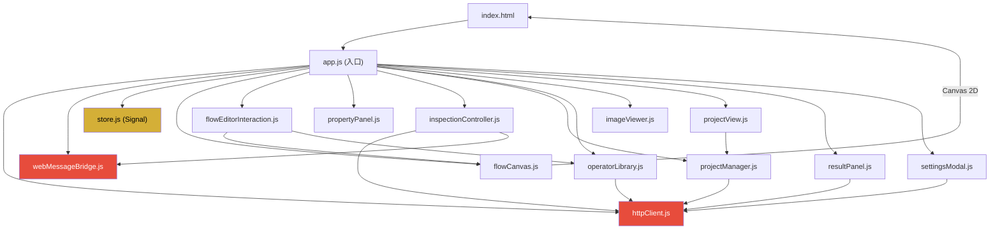

# ClearVision 前端修改指导文档 (增强版)

> **目标读者**: AI 助手或开发者
> **核心原则**: **动 CSS 变量不动 JS 逻辑，动 HTML 结构不删关键 ID**

---

## 1. 项目架构总览

ClearVision 是基于 **WebView2** 宿主的混合桌面应用。

| 层 | 技术栈 | 说明 |
|---|---|---|
| 宿主 | WPF + WebView2 (.NET 8) | 提供窗口管理、文件系统访问、WebMessage 桥接 |
| 后端 API | ASP.NET Core Minimal API | 嵌入式 HTTP 服务，端口 5000-5010 |
| 前端 | 原生 HTML/CSS/JS (ES6 Modules) | 无框架，纯手写，所有模块通过 `import/export` 组织 |

**前端根目录**: `Acme.Product/src/Acme.Product.Desktop/wwwroot/`

---

## 2. 前后端通讯机制 (🔴 绝对禁止修改)

### 2.1 通道一: HTTP REST API

**文件**: `src/core/messaging/httpClient.js`

**工作原理**:
1. 后端注入 `window.__API_BASE_URL__`，前端优先使用
2. 如注入失败，自动探测 `localhost:5000~5010` 的 `/health` 端点
3. 探测成功后缓存端口到 `localStorage('cv_api_port')`

**核心方法** (禁止修改签名):
```javascript
httpClient.get(url)          // GET 请求
httpClient.post(url, data)   // POST 请求 (JSON body)
httpClient.put(url, data)    // PUT 请求
httpClient.delete(url)       // DELETE 请求
```

**完整后端 API 路由表** (前端使用的所有 URL):

| HTTP 方法 | 路由 | 前端调用方 | 用途 |
|---|---|---|---|
| GET | `/api/health` | `httpClient.js` | 健康检查/端口探测 |
| GET | `/api/projects` | `projectManager.js` | 获取工程列表 |
| GET | `/api/projects/recent?count=N` | `projectManager.js` | 最近打开的工程 |
| GET | `/api/projects/search?keyword=X` | `projectView.js` | 搜索工程 |
| GET | `/api/projects/{id}` | `projectManager.js` | 获取工程详情 |
| POST | `/api/projects` | `projectManager.js` | 创建工程 |
| PUT | `/api/projects/{id}` | `projectManager.js` | 更新工程元数据 |
| DELETE | `/api/projects/{id}` | `projectManager.js` | 删除工程 |
| PUT | `/api/projects/{id}/flow` | `app.js (saveProject)` | **保存流程图** |
| POST | `/api/inspection/execute` | `inspectionController.js` | 执行检测 |
| GET | `/api/inspection/history/{projectId}` | `resultPanel.js` | 检测历史 |
| GET | `/api/inspection/statistics/{projectId}` | `resultPanel.js` | 统计信息 |
| GET | `/api/operators/library` | `operatorLibrary.js` | 获取算子库 |
| GET | `/api/operators/types` | (预留) | 支持的算子类型 |
| GET | `/api/operators/{type}/metadata` | (预留) | 单个算子元数据 |
| POST | `/api/images/upload` | (预留) | 上传图像 |
| GET | `/api/images/{id}` | `imageViewer.js` | 获取图像 |

### 2.2 通道二: WebView2 WebMessage

**文件**: `src/core/messaging/webMessageBridge.js`

**工作原理**:
- **前端 → 后端**: `window.chrome.webview.postMessage(JSON)`
- **后端 → 前端**: `window.chrome.webview.addEventListener('message', handler)`
- 消息使用 `messageType` 字段标识类型（**不是 `type`**），避免与数据属性冲突
- 请求-响应模式通过 `requestId` 匹配

**关键消息类型** (禁止移除对应 handler):
```
前端发送:
  RunInspection       → 触发单次检测
  StartRealtime       → 启动实时检测
  StopRealtime        → 停止实时检测
  SelectCamera        → 选择相机
  PickFile            → 打开文件选择器

后端推送:
  InspectionComplete  → 检测结果 (包含图像 + 缺陷标注)
  InspectionProgress  → 执行进度
  RealtimeFrame       → 实时帧
  FilePickedEvent     → 文件选择结果
```

### 2.3 序列化约定 (🔴 关键踩坑点)

后端 `Program.cs` 配置了 `JsonNamingPolicy.CamelCase`，因此：
- **前端发送数据必须使用 camelCase**（如 `operatorType`, `sourcePort`）
- **后端返回的数据也是 camelCase**
- 但某些旧代码仍可能返回 **PascalCase**，前端需兼容处理

**已知兼容写法**（在修改时必须保留）:
```javascript
// flowCanvas.js deserialize() 中的端口归一化
const name = p.name || p.Name;
const id = p.id || p.Id;
const type = p.type || p.Type;

// inspectionController.js 中的结果解析
const label = defect.description || defect.Description || defect.type || defect.Type;
const score = defect.confidenceScore || defect.ConfidenceScore;
```

---

## 3. 完整 DOM 绑定清单 (🔴 修改 HTML 时必须保留)

以下列出了所有被 JavaScript 通过 `getElementById` 或 `querySelector` 引用的 DOM 元素。**删除任何一个都会导致功能失效。**

### 3.1 顶层容器 ID

| ID | 所在文件 | JS 引用方 | 说明 |
|---|---|---|---|
| `app` | `index.html` | `app.js` | 应用根容器 |
| `flow-editor` | `index.html` | `app.js` | 流程编辑器区域（视图切换） |
| `flow-canvas` | `index.html` | `flowCanvas.js` | **Canvas 画布元素** |
| `image-viewer` | `index.html` | `app.js`, `imageViewer.js` | 图像查看器区域 |
| `operator-library` | `index.html` | `app.js`, `operatorLibrary.js`, `flowEditorInteraction.js` | 算子库容器 |
| `property-panel` | `index.html` | `app.js`, `propertyPanel.js` | 属性面板容器 |
| `project-view` | `index.html` | `app.js`, `projectView.js` | 项目列表视图 |
| `results-view` | `index.html` | `app.js` | 结果历史视图 |
| `results-view-content` | `index.html` | `resultPanel.js` | 结果详情容器 |
| `results-panel` | `index.html` | `app.js` | 右侧实时结果 |
| `debug-errors` | `index.html` | `app.js` | 错误调试输出区 |

### 3.2 工具栏按钮 ID

| ID | JS 引用方 | 功能 |
|---|---|---|
| `btn-save` | `app.js` | 保存工程 |
| `btn-run` | `app.js` | 运行检测 |
| `btn-import` | `app.js` | 导入工程 |
| `btn-export` | `app.js` | 导出工程 |
| `btn-theme-toggle` | `app.js` | 切换明暗主题 |
| `btn-settings` | `app.js` | 打开设置对话框 |

### 3.3 图像查看器内部 ID

| ID | JS 引用方 | 功能 |
|---|---|---|
| `viewer-canvas` | `imageViewer.js` | 图像绘制 Canvas |
| `btn-open-image` | `imageViewer.js` | 打开图片按钮 |
| `file-input` | `imageViewer.js` | 文件选择 input |
| `btn-zoom-in` | `imageViewer.js` | 放大 |
| `btn-zoom-out` | `imageViewer.js` | 缩小 |
| `btn-fit-window` | `imageViewer.js` | 适配窗口 |
| `btn-actual-size` | `imageViewer.js` | 原始大小 |
| `btn-clear-annotations` | `imageViewer.js` | 清除标注 |
| `btn-toggle-annotations` | `imageViewer.js` | 切换标注显示 |
| `defect-list` | `imageViewer.js` | 缺陷列表 |
| `viewer-placeholder` | `imageViewer.js` | 空状态占位 |
| `image-info` | `imageViewer.js` | 图片信息 |
| `zoom-info` | `imageViewer.js` | 缩放信息 |

### 3.4 属性面板内部 ID

| ID | JS 引用方 | 功能 |
|---|---|---|
| `property-form` | `propertyPanel.js` | 表单容器 |
| `btn-apply` | `propertyPanel.js` | 应用按钮 |
| `btn-reset` | `propertyPanel.js` | 重置按钮 |
| `param-{name}` | `propertyPanel.js` | 动态生成的参数输入（模式匹配） |

### 3.5 算子库内部 ID

| ID | JS 引用方 | 功能 |
|---|---|---|
| `operator-search` | `operatorLibrary.js` | 搜索输入框 |
| `btn-clear-search` | `operatorLibrary.js` | 清除搜索 |
| `library-tree` | `operatorLibrary.js` | 树形结构容器 |
| `btn-expand-all` | `operatorLibrary.js` | 展开所有 |
| `btn-collapse-all` | `operatorLibrary.js` | 折叠所有 |
| `btn-refresh` | `operatorLibrary.js` | 刷新算子库 |
| `operator-preview` | `operatorLibrary.js` | 算子预览区 |

### 3.6 项目视图内部 ID

| ID | JS 引用方 | 功能 |
|---|---|---|
| `project-list` | `projectView.js` | 项目卡片列表容器 |
| `project-search-input` | `projectView.js` | 搜索输入框 |
| `btn-search-project` | `projectView.js` | 搜索按钮 |
| `btn-new-project-inline` | `projectView.js` | 新建工程按钮 |
| `btn-clear-results` | `index.html` | 清除结果 |
| `btn-export-results` | `index.html` | 导出结果 |

### 3.7 状态栏 ID

| ID | JS 引用方 | 功能 |
|---|---|---|
| `project-name` | `projectManager.js` | 当前工程名 |
| `version` | `projectManager.js` | 版本号 |

### 3.8 关键 CSS Class (JS 中通过 querySelector 引用)

| Class | JS 引用方 | 用途 |
|---|---|---|
| `.nav-btn` | `app.js` | 导航按钮（切换视图） |
| `.tab-btn` | `projectView.js` | 项目视图标签页切换 |
| `.project-card` | `projectView.js` | 工程卡片 |
| `.project-card-title` | `projectView.js` | 卡片标题（用于读取文本） |
| `.btn-open` | `projectView.js` | 卡片内"打开"按钮 |
| `.btn-delete` | `projectView.js`, `dialog.js` | 卡片内"删除"按钮 |
| `.btn-pick-file` | `propertyPanel.js` | 文件选择触发按钮 |
| `.defect-item` | `imageViewer.js` | 缺陷列表项 |
| `.viewer-canvas-container` | `imageViewer.js` | Canvas 的父容器 |
| `.results-list` | `resultPanel.js` | 结果列表 |
| `.results-statistics` | `resultPanel.js` | 统计区域 |
| `.results-trend-chart` | `resultPanel.js` | 趋势图 |
| `.results-filters` | `resultPanel.js` | 筛选区 |
| `.results-pagination` | `resultPanel.js` | 分页控件 |
| `.result-item` | `resultPanel.js` | 单条结果 |
| `.settings-tab` | `settingsModal.js` | 设置选项卡 |
| `.settings-section` | `settingsModal.js` | 设置分区 |
| `.cv-modal` | `settingsModal.js`, `uiComponents.js` | 模态框 |
| `.cv-modal-close` | `uiComponents.js`, `dialog.js` | 模态框关闭按钮 |
| `.cv-toast-close` | `uiComponents.js` | Toast 关闭按钮 |
| `.cv-toast-container` (ID) | `uiComponents.js` | Toast 容器 |
| `.hidden` | 多个文件 | **视图显示/隐藏切换核心** |

### 3.9 关键 data- 属性

| 属性 | 使用方 | 值 |
|---|---|---|
| `data-view` | `.nav-btn` 按钮 | `project` / `flow` / `inspection` / `results` |
| `data-type` | 算子库项（拖拽） | 算子类型名 |
| `data-id` | 项目卡片 | 工程 GUID |
| `data-section` | 设置面板 | 设置分区标识 |
| `data-theme` | `<html>` 根元素 | `light` / `dark` |

---

## 4. 模块依赖关系



> 🔴 红色 = 通讯层（禁止修改） | 🟡 金色 = 状态管理

---

## 5. CSS 文件清单与修改安全级别

| 文件 | 用途 | 安全级别 |
|---|---|---|
| `variables.css` | CSS 变量定义（颜色/字号/圆角/阴影/动画） | ✅ **最安全** - 推荐从这里开始改 |
| `main.css` | 整体布局、工具栏、侧栏、工作区、Canvas 容器 | ⚠️ 中等 - 注意保持 Canvas 容器尺寸 |
| `ui-components.css` | 按钮、输入框、Toast、Modal 等通用组件 | ⚠️ 中等 - 不要删除 `.hidden` 定义 |
| `property-panel.css` | 属性面板专用样式 | ✅ 安全 |
| `settings.css` | 设置对话框样式 | ✅ 安全 |
| `settings-overrides.css` | 设置覆盖样式 | ✅ 安全 |
| `brutalism.css` / `claymorphism.css` / `handdrawn.css` | 备用主题 | ✅ 安全 - 可作为新主题参考 |

### 主题系统工作方式

```
<html data-theme="light">   →  触发 [data-theme="light"] 选择器
<html data-theme="dark">    →  使用 :root 默认值（暗色）
```

JS 中通过 `document.documentElement.setAttribute('data-theme', 'light')` 切换。

**重要**: 修改主题颜色时，必须同时修改 `:root` (暗色) 和 `[data-theme="light"]` (亮色) 两套变量。

---

## 6. 动态生成 DOM 注意事项

以下组件会在 JS 中**动态创建 DOM 元素**，因此你在 `index.html` 中找不到它们，但它们的 CSS 类名和结构被 JS 硬编码：

| 模块 | 动态生成的内容 | 关键 Class/ID |
|---|---|---|
| `operatorLibrary.js` | 算子树形列表 | `.cv-tree-node`, `.cv-tree-item` |
| `propertyPanel.js` | 参数输入表单 | `#param-{name}`, `.btn-pick-file`, `.property-group` |
| `resultPanel.js` | 结果列表/统计/图表 | `.result-item`, `.results-statistics`, `.results-trend-chart` |
| `projectView.js` | 项目卡片 | `.project-card`, `.project-card-title`, `.btn-open`, `.btn-delete` |
| `imageViewer.js` | 缺陷标注列表 | `.defect-item` |
| `uiComponents.js` | Toast 通知 | `.cv-toast-container`, `.cv-toast`, `.cv-toast-close` |
| `uiComponents.js` | Modal 对话框 | `.cv-modal-overlay`, `.cv-modal`, `.cv-modal-close` |
| `dialog.js` | 确认/输入对话框 | `.project-list-item`, `.btn-delete` |

> ⚠️ 如果你修改了这些 **CSS 类名**，必须同步修改对应的 JS 文件中的字符串，否则样式会丢失。

---

## 7. AI 修改操作规程

### ✅ 允许的操作

1. **修改 `variables.css` 中的变量值** — 改颜色/字号/圆角/阴影，全局生效
2. **修改 `main.css` 中的布局属性** — 调整 flex/grid 排列，但保留容器 ID
3. **修改组件 CSS 的视觉样式** — 背景/边框/圆角/渐变/动画，不改类名
4. **新增 CSS 类** — 追加新类不影响现有逻辑
5. **调整 HTML 中元素的顺序** — 如移动侧栏位置，但保留所有 ID 和属性

### 🔴 禁止的操作

1. **不要删除/重命名任何第 3 节列出的 ID 和 Class**
2. **不要修改 `httpClient.js` 和 `webMessageBridge.js` 中的任何逻辑**
3. **不要改变 `<script type="module">` 的加载顺序**
4. **不要移除 `.hidden` 类的 CSS 定义**（JS 用它控制视图切换）
5. **不要修改 Canvas 元素的 `id` 或将其替换为其他元素**
6. **不要移除 `data-view` / `data-type` / `data-id` / `data-theme` 属性**
7. **不要引入 SPA 框架**（React/Vue/Angular），除非全面重构

### ⚠️ 需注意的操作

1. **修改 `z-index`** — 可能影响 Canvas 鼠标事件捕获或 Modal 层级
2. **修改 `overflow`** — 可能影响内容滚动和 Canvas 绘制区域
3. **修改 `position`** — 可能影响拖拽坐标计算
4. **修改 `pointer-events`** — 可能导致按钮/Canvas 无法点击

---

## 8. 已知踩坑记录 (历史 Bug)

| 问题 | 原因 | 教训 |
|---|---|---|
| 保存后连接线丢失 | `flowCanvas.serialize()` 未正确序列化端口 ID | 不要修改 `serialize/deserialize` |
| 属性面板显示 "Unknown" | `findOperatorDefinition()` 匹配不到算子 | 修改算子库数据结构时需同步 |
| 结果面板标签显示 "Other" | 未兼容 PascalCase 属性名 | 始终做双格式兼容 |
| 检测结果图像不显示 | SharedBuffer 数据未正确处理 | 不要修改 `handleSharedBuffer` |
| 文件选择器导致应用崩溃 | WebView2 线程阻塞 | 不要在主线程同步调用 `PickFile` |

---

## 9. 修改示例

### 示例 1: 安全地更换主题颜色

只需修改 `variables.css`：
```css
:root {
    --ink-primary: #2e1a47;       /* 改: 黛蓝 → 深紫 */
    --ink-secondary: #1a0f2e;     /* 改: 配套暗紫 */
    --ink-tertiary: #4a2d6e;      /* 改: 中紫 */
    --cinnabar: #9b59b6;          /* 改: 朱砂红 → 紫罗兰 */
    --cinnabar-dark: #8e44ad;
    /* ... 同步修改 [data-theme="light"] 中的对应变量 ... */
}
```

### 示例 2: 移动侧栏位置

修改 `index.html` 中 `<aside>` 的 DOM 顺序 + `main.css` 的 flex 方向，**不改任何 ID**。

### 示例 3: 添加新按钮

```html
<!-- index.html 工具栏中添加 -->
<button id="btn-my-feature" class="btn btn-secondary">新功能</button>
```
```javascript
// app.js 中绑定事件
document.getElementById('btn-my-feature')?.addEventListener('click', () => {
    // 新功能逻辑
});
```

---

**修改前自检 Checklist**:
- [ ] 第 3 节列出的 ID 和 Class 是否全部保留？
- [ ] `data-view` / `data-type` / `data-id` / `data-theme` 属性是否完整？
- [ ] CSS 修改是否同时覆盖暗色 (`:root`) 和亮色 (`[data-theme="light"]`) ？
- [ ] Canvas 父容器是否仍有确定的宽高？
- [ ] 修改后 Modal/Toast 层级是否正常？
